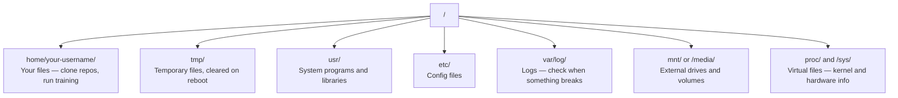

# Linux for AI

> Most AI runs on Linux. You need to know enough to not be stuck.

**Type:** Learn
**Languages:** --
**Prerequisites:** Phase 0, Lesson 01
**Time:** ~30 minutes

## Learning Objectives

- Navigate the Linux file system and perform essential file operations from the command line
- Manage file permissions with `chmod` and `chown` to resolve "Permission denied" errors
- Install system packages with `apt` and set up a fresh GPU box for AI work
- Identify macOS-to-Linux differences that commonly trip up developers working on remote machines

## The Problem

You develop on macOS or Windows. But the moment you SSH into a cloud GPU box, rent a Lambda instance, or spin up an EC2 machine, you land in Ubuntu. The terminal is your only interface. There is no Finder, no Explorer, no GUI. If you can't navigate the file system, install packages, and manage processes from the command line, you're stuck paying for idle GPU hours while googling "how to unzip a file in Linux."

This is a survival guide. It covers exactly what you need to operate on a remote Linux machine for AI work. Nothing more.

## File System Layout

Linux organizes everything under a single root `/`. There is no `C:\` or `/Volumes`. The directories you'll actually touch:



Your home directory is `~` or `/home/your-username`. Almost everything you do happens here.

## Essential Commands

These are the 15 commands that cover 95% of what you'll do on a remote GPU box.

### Moving Around

```bash
pwd                         # Where am I?
ls                          # What's here?
ls -la                      # What's here, including hidden files with details?
cd /path/to/dir             # Go there
cd ~                        # Go home
cd ..                       # Go up one level
```

### Files and Directories

```bash
mkdir my-project            # Create a directory
mkdir -p a/b/c              # Create nested directories in one shot

cp file.txt backup.txt      # Copy a file
cp -r src/ src-backup/      # Copy a directory (recursive)

mv old.txt new.txt          # Rename a file
mv file.txt /tmp/           # Move a file

rm file.txt                 # Delete a file (no trash, it's gone)
rm -rf my-dir/              # Delete a directory and everything inside
```

`rm -rf` is permanent. There is no undo. Double-check the path before hitting enter.

### Reading Files

```bash
cat file.txt                # Print entire file
head -20 file.txt           # First 20 lines
tail -20 file.txt           # Last 20 lines
tail -f log.txt             # Follow a log file in real time (Ctrl+C to stop)
less file.txt               # Scroll through a file (q to quit)
```

### Searching

```bash
grep "error" training.log           # Find lines containing "error"
grep -r "learning_rate" .           # Search all files in current directory
grep -i "cuda" config.yaml          # Case-insensitive search

find . -name "*.py"                 # Find all Python files under current dir
find . -name "*.ckpt" -size +1G     # Find checkpoint files larger than 1GB
```

## Permissions

Every file in Linux has an owner and permission bits. You'll run into this when scripts won't execute or you can't write to a directory.

```bash
ls -l train.py
# -rwxr-xr-- 1 user group 2048 Mar 19 10:00 train.py
#  ^^^             owner permissions: read, write, execute
#     ^^^          group permissions: read, execute
#        ^^        everyone else: read only
```

Common fixes:

```bash
chmod +x train.sh           # Make a script executable
chmod 755 deploy.sh         # Owner: full, others: read+execute
chmod 644 config.yaml       # Owner: read+write, others: read only

chown user:group file.txt   # Change who owns a file (needs sudo)
```

When something says "Permission denied," it's almost always a permissions issue. `chmod +x` or `sudo` will fix most cases.

## Package Management (apt)

Ubuntu uses `apt`. This is how you install system-level software.

```bash
sudo apt update             # Refresh the package list (always do this first)
sudo apt install -y htop    # Install a package (-y skips confirmation)
sudo apt install -y build-essential  # C compiler, make, etc. Needed by many Python packages
sudo apt install -y tmux    # Terminal multiplexer (keep sessions alive after disconnect)

apt list --installed        # What's installed?
sudo apt remove htop        # Uninstall
```

Common packages you'll install on a fresh GPU box:

```bash
sudo apt update && sudo apt install -y \
    build-essential \
    git \
    curl \
    wget \
    tmux \
    htop \
    unzip \
    python3-venv
```

## Users and sudo

You're usually logged in as a regular user. Some operations need root (admin) access.

```bash
whoami                      # What user am I?
sudo command                # Run a single command as root
sudo su                     # Become root (exit to go back, use sparingly)
```

On cloud GPU instances, you're typically the only user and already have sudo access. Don't run everything as root. Use sudo only when needed.

## Processes and systemd

When your training hangs, or you need to check what's running:

```bash
htop                        # Interactive process viewer (q to quit)
ps aux | grep python        # Find running Python processes
kill 12345                  # Gracefully stop process with PID 12345
kill -9 12345               # Force kill (use when graceful doesn't work)
nvidia-smi                  # GPU processes and memory usage
```

systemd manages services (background daemons). You'll use it if you run inference servers:

```bash
sudo systemctl start nginx          # Start a service
sudo systemctl stop nginx           # Stop it
sudo systemctl restart nginx        # Restart it
sudo systemctl status nginx         # Check if it's running
sudo systemctl enable nginx         # Start automatically on boot
```

## Disk Space

GPU boxes often have limited disk space. Models and datasets fill it fast.

```bash
df -h                       # Disk usage for all mounted drives
df -h /home                 # Disk usage for /home specifically

du -sh *                    # Size of each item in current directory
du -sh ~/.cache             # Size of your cache (pip, huggingface models land here)
du -sh /data/checkpoints/   # Check how big your checkpoints are

# Find the biggest space hogs
du -h --max-depth=1 / 2>/dev/null | sort -hr | head -20
```

Common space savers:

```bash
# Clear pip cache
pip cache purge

# Clear apt cache
sudo apt clean

# Remove old checkpoints you don't need
rm -rf checkpoints/epoch_01/ checkpoints/epoch_02/
```

## Networking

You'll download models, transfer files, and hit APIs from the command line.

```bash
# Download files
wget https://example.com/model.bin                   # Download a file
curl -O https://example.com/data.tar.gz              # Same thing with curl
curl -s https://api.example.com/health | python3 -m json.tool  # Hit an API, pretty-print JSON

# Transfer files between machines
scp model.bin user@remote:/data/                     # Copy file to remote machine
scp user@remote:/data/results.csv .                  # Copy file from remote to local
scp -r user@remote:/data/checkpoints/ ./local-dir/   # Copy directory

# Sync directories (faster than scp for large transfers, resumes on failure)
rsync -avz --progress ./data/ user@remote:/data/
rsync -avz --progress user@remote:/results/ ./results/
```

Use `rsync` over `scp` for anything large. It only transfers changed bytes and handles interrupted connections.

## tmux: Keep Sessions Alive

When you SSH into a remote box, closing your laptop kills your training run. tmux prevents this.

```bash
tmux new -s train           # Start a new session named "train"
# ... start your training, then:
# Ctrl+B, then D            # Detach (training keeps running)

tmux ls                     # List sessions
tmux attach -t train        # Reattach to session

# Inside tmux:
# Ctrl+B, then %            # Split pane vertically
# Ctrl+B, then "            # Split pane horizontally
# Ctrl+B, then arrow keys   # Switch between panes
```

Always run long training jobs inside tmux. Always.

## WSL2 for Windows Users

If you're on Windows, WSL2 gives you a real Linux environment without dual-booting.

```bash
# In PowerShell (admin)
wsl --install -d Ubuntu-24.04

# After restart, open Ubuntu from Start menu
sudo apt update && sudo apt upgrade -y
```

WSL2 runs a real Linux kernel. Everything in this lesson works inside it. Your Windows files are at `/mnt/c/Users/YourName/` from inside WSL.

GPU passthrough works with NVIDIA drivers installed on the Windows side. Install the Windows NVIDIA driver (not the Linux one), and CUDA will be available inside WSL2.

## Gotchas: macOS to Linux

Things that will trip you up if you're coming from macOS:

| macOS | Linux | Notes |
|-------|-------|-------|
| `brew install` | `sudo apt install` | Different package names sometimes. `brew install htop` vs `sudo apt install htop` works the same, but `brew install readline` vs `sudo apt install libreadline-dev` does not. |
| `open file.txt` | `xdg-open file.txt` | But you won't have a GUI on a remote box. Use `cat` or `less`. |
| `pbcopy` / `pbpaste` | Not available | Pipe to/from clipboard doesn't exist over SSH. |
| `~/.zshrc` | `~/.bashrc` | macOS defaults to zsh. Most Linux servers use bash. |
| `/opt/homebrew/` | `/usr/bin/`, `/usr/local/bin/` | Binaries live in different places. |
| `sed -i '' 's/a/b/' file` | `sed -i 's/a/b/' file` | macOS sed needs an empty string after `-i`. Linux does not. |
| Case-insensitive filesystem | Case-sensitive filesystem | `Model.py` and `model.py` are two different files on Linux. |
| Line endings `\n` | Line endings `\n` | Same. But Windows uses `\r\n`, which breaks bash scripts. Run `dos2unix` to fix. |

## Quick Reference Card

```
Navigation:     pwd, ls, cd, find
Files:          cp, mv, rm, mkdir, cat, head, tail, less
Search:         grep, find
Permissions:    chmod, chown, sudo
Packages:       apt update, apt install
Processes:      htop, ps, kill, nvidia-smi
Services:       systemctl start/stop/restart/status
Disk:           df -h, du -sh
Network:        curl, wget, scp, rsync
Sessions:       tmux new/attach/detach
```

## Exercises

1. SSH into any Linux machine (or open WSL2) and navigate to your home directory. Create a project folder, create three empty files inside it with `touch`, then list them with `ls -la`.
2. Install `htop` with apt, run it, and identify which process is using the most memory.
3. Start a tmux session, run `sleep 300` inside it, detach, list sessions, and reattach.
4. Use `df -h` to check available disk space, then use `du -sh ~/.cache/*` to find what's taking up space in your cache.
5. Transfer a file from your local machine to a remote one using `scp`, then do the same transfer with `rsync` and compare the experience.
