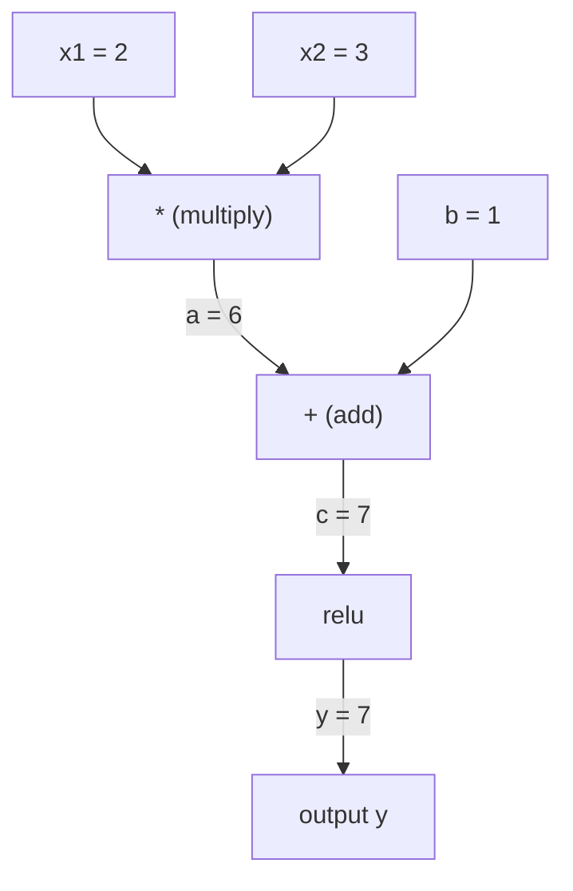
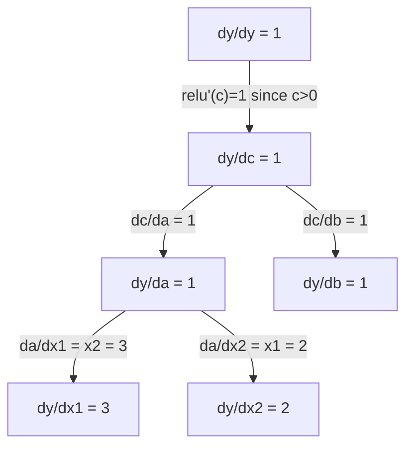

# Chain Rule & Automatic Differentiation

> The chain rule is the engine behind every neural network that learns.

**Type:** Build
**Language:** Python
**Prerequisites:** Phase 1, Lesson 04 (Derivatives & Gradients)
**Time:** ~90 minutes

## Learning Objectives

- Build a minimal autograd engine (Value class) that records operations and computes gradients via reverse-mode autodiff
- Implement forward and backward passes through a computation graph using topological sort
- Construct and train a multi-layer perceptron on XOR using only the from-scratch autograd engine
- Verify autodiff correctness using gradient checking against numerical finite differences

## The Problem

You can compute derivatives of simple functions. But a neural network is not a simple function. It is hundreds of functions composed together: matrix multiply, add bias, apply activation, matrix multiply again, softmax, cross-entropy loss. The output is a function of a function of a function.

To train the network, you need the gradient of the loss with respect to every single weight. Doing this by hand is impossible for millions of parameters. Doing it numerically (finite differences) is too slow.

The chain rule gives you the math. Automatic differentiation gives you the algorithm. Together they let you compute exact gradients through arbitrary compositions of functions in time proportional to a single forward pass.

This is how PyTorch, TensorFlow, and JAX work. You will build a miniature version from scratch.

## The Concept

### The Chain Rule

If `y = f(g(x))`, the derivative of `y` with respect to `x` is:

```
dy/dx = dy/dg * dg/dx = f'(g(x)) * g'(x)
```

Multiply the derivatives along the chain. Each link contributes its local derivative.

Example: `y = sin(x^2)`

```
g(x) = x^2       g'(x) = 2x
f(g) = sin(g)     f'(g) = cos(g)

dy/dx = cos(x^2) * 2x
```

For deeper compositions, the chain extends:

```
y = f(g(h(x)))

dy/dx = f'(g(h(x))) * g'(h(x)) * h'(x)
```

Every layer in a neural network is one link in this chain.

### Computational Graphs

A computational graph makes the chain rule visual. Every operation becomes a node. Data flows forward through the graph. Gradients flow backward.

**Forward pass (compute values):**



**Backward pass (compute gradients):**



The backward pass applies the chain rule at every node, propagating gradients from output to inputs.

### Forward Mode vs Reverse Mode

There are two ways to apply the chain rule through a graph.

**Forward mode** starts at the inputs and pushes derivatives forward. It computes `dx/dx = 1` and propagates through each operation. Good when you have few inputs and many outputs.

```
Forward mode: seed dx/dx = 1, propagate forward

  x = 2       (dx/dx = 1)
  a = x^2     (da/dx = 2x = 4)
  y = sin(a)  (dy/dx = cos(a) * da/dx = cos(4) * 4 = -2.615)
```

**Reverse mode** starts at the output and pulls gradients backward. It computes `dy/dy = 1` and propagates through each operation in reverse. Good when you have many inputs and few outputs.

```
Reverse mode: seed dy/dy = 1, propagate backward

  y = sin(a)  (dy/dy = 1)
  a = x^2     (dy/da = cos(a) = cos(4) = -0.654)
  x = 2       (dy/dx = dy/da * da/dx = -0.654 * 4 = -2.615)
```

Neural networks have millions of inputs (weights) and one output (loss). Reverse mode computes all gradients in one backward pass. This is why backpropagation uses reverse mode.

| Mode | Seed | Direction | Best when |
|------|------|-----------|-----------|
| Forward | `dx_i/dx_i = 1` | Input to output | Few inputs, many outputs |
| Reverse | `dy/dy = 1` | Output to input | Many inputs, few outputs (neural nets) |

### Dual Numbers for Forward Mode

Forward mode can be implemented elegantly with dual numbers. A dual number has the form `a + b*epsilon` where `epsilon^2 = 0`.

```
Dual number: (value, derivative)

(2, 1) means: value is 2, derivative w.r.t. x is 1

Arithmetic rules:
  (a, a') + (b, b') = (a+b, a'+b')
  (a, a') * (b, b') = (a*b, a'*b + a*b')
  sin(a, a')         = (sin(a), cos(a)*a')
```

Seed the input variable with derivative 1. The derivative propagates automatically through every operation.

### Building an Autograd Engine

An autograd engine needs three things:

1. **Value wrapping.** Wrap every number in an object that stores its value and gradient.
2. **Graph recording.** Every operation records its inputs and the local gradient function.
3. **Backward pass.** Topological sort the graph, then walk it in reverse, applying the chain rule at each node.

This is exactly what PyTorch's `autograd` does. The `torch.Tensor` class wraps values, records operations when `requires_grad=True`, and computes gradients when you call `.backward()`.

### How PyTorch Autograd Works Under the Hood

When you write PyTorch code:

```python
x = torch.tensor(2.0, requires_grad=True)
y = x ** 2 + 3 * x + 1
y.backward()
print(x.grad)  # 7.0 = 2*x + 3 = 2*2 + 3
```

PyTorch internally:

1. Creates a `Tensor` node for `x` with `requires_grad=True`
2. Every operation (`**`, `*`, `+`) creates a new node and records the backward function
3. `y.backward()` triggers reverse-mode autodiff through the recorded graph
4. Each node's `grad_fn` computes local gradients and passes them to parent nodes
5. Gradients accumulate in `.grad` attributes via addition (not replacement)

The graph is dynamic (define-by-run). A new graph is built on every forward pass. This is why PyTorch supports control flow (if/else, loops) inside models.

## Build It

### Step 1: The Value class

```python
class Value:
    def __init__(self, data, children=(), op=''):
        self.data = data
        self.grad = 0.0
        self._backward = lambda: None
        self._prev = set(children)
        self._op = op

    def __repr__(self):
        return f"Value(data={self.data:.4f}, grad={self.grad:.4f})"
```

Every `Value` stores its numeric data, its gradient (initially zero), a backward function, and pointers to child nodes that produced it.

### Step 2: Arithmetic operations with gradient tracking

```python
    def __add__(self, other):
        other = other if isinstance(other, Value) else Value(other)
        out = Value(self.data + other.data, (self, other), '+')
        def _backward():
            self.grad += out.grad
            other.grad += out.grad
        out._backward = _backward
        return out

    def __mul__(self, other):
        other = other if isinstance(other, Value) else Value(other)
        out = Value(self.data * other.data, (self, other), '*')
        def _backward():
            self.grad += other.data * out.grad
            other.grad += self.data * out.grad
        out._backward = _backward
        return out

    def relu(self):
        out = Value(max(0, self.data), (self,), 'relu')
        def _backward():
            self.grad += (1.0 if out.data > 0 else 0.0) * out.grad
        out._backward = _backward
        return out
```

Each operation creates a closure that knows how to compute local gradients and multiply by the upstream gradient (`out.grad`). The `+=` handles the case where a value is used in multiple operations.

### Step 3: The backward pass

```python
    def backward(self):
        topo = []
        visited = set()
        def build_topo(v):
            if v not in visited:
                visited.add(v)
                for child in v._prev:
                    build_topo(child)
                topo.append(v)
        build_topo(self)

        self.grad = 1.0
        for v in reversed(topo):
            v._backward()
```

Topological sort ensures every node's gradient is fully computed before it propagates to its children. The seed gradient is 1.0 (dy/dy = 1).

### Step 4: More operations for a complete engine

The basic Value class handles addition, multiplication, and relu. A real autograd engine needs more. Here are the operations you need to build neural networks:

```python
    def __neg__(self):
        return self * -1

    def __sub__(self, other):
        return self + (-other)

    def __radd__(self, other):
        return self + other

    def __rmul__(self, other):
        return self * other

    def __rsub__(self, other):
        return other + (-self)

    def __pow__(self, n):
        out = Value(self.data ** n, (self,), f'**{n}')
        def _backward():
            self.grad += n * (self.data ** (n - 1)) * out.grad
        out._backward = _backward
        return out

    def __truediv__(self, other):
        return self * (other ** -1) if isinstance(other, Value) else self * (Value(other) ** -1)

    def exp(self):
        import math
        e = math.exp(self.data)
        out = Value(e, (self,), 'exp')
        def _backward():
            self.grad += e * out.grad
        out._backward = _backward
        return out

    def log(self):
        import math
        out = Value(math.log(self.data), (self,), 'log')
        def _backward():
            self.grad += (1.0 / self.data) * out.grad
        out._backward = _backward
        return out

    def tanh(self):
        import math
        t = math.tanh(self.data)
        out = Value(t, (self,), 'tanh')
        def _backward():
            self.grad += (1 - t ** 2) * out.grad
        out._backward = _backward
        return out
```

**Why each operation matters:**

| Operation | Backward rule | Used in |
|-----------|--------------|---------|
| `__sub__` | Reuses add + neg | Loss computation (pred - target) |
| `__pow__` | n * x^(n-1) | Polynomial activations, MSE (error^2) |
| `__truediv__` | Reuses mul + pow(-1) | Normalization, learning rate scaling |
| `exp` | exp(x) * upstream | Softmax, log-likelihood |
| `log` | (1/x) * upstream | Cross-entropy loss, log probabilities |
| `tanh` | (1 - tanh^2) * upstream | Classic activation function |

The clever part: `__sub__` and `__truediv__` are defined in terms of existing operations. They get correct gradients for free because the chain rule composes through the underlying add/mul/pow operations.

### Step 5: Mini MLP from scratch

With a complete Value class, you can build a neural network. No PyTorch. No NumPy. Just Values and the chain rule.

```python
import random

class Neuron:
    def __init__(self, n_inputs):
        self.w = [Value(random.uniform(-1, 1)) for _ in range(n_inputs)]
        self.b = Value(0.0)

    def __call__(self, x):
        act = sum((wi * xi for wi, xi in zip(self.w, x)), self.b)
        return act.tanh()

    def parameters(self):
        return self.w + [self.b]

class Layer:
    def __init__(self, n_inputs, n_outputs):
        self.neurons = [Neuron(n_inputs) for _ in range(n_outputs)]

    def __call__(self, x):
        return [n(x) for n in self.neurons]

    def parameters(self):
        return [p for n in self.neurons for p in n.parameters()]

class MLP:
    def __init__(self, sizes):
        self.layers = [Layer(sizes[i], sizes[i+1]) for i in range(len(sizes)-1)]

    def __call__(self, x):
        for layer in self.layers:
            x = layer(x)
        return x[0] if len(x) == 1 else x

    def parameters(self):
        return [p for layer in self.layers for p in layer.parameters()]
```

A `Neuron` computes `tanh(w1*x1 + w2*x2 + ... + b)`. A `Layer` is a list of neurons. An `MLP` stacks layers. Every weight is a `Value`, so calling `loss.backward()` propagates gradients to every parameter.

**Training on XOR:**

```python
random.seed(42)
model = MLP([2, 4, 1])  # 2 inputs, 4 hidden neurons, 1 output

xs = [[0, 0], [0, 1], [1, 0], [1, 1]]
ys = [-1, 1, 1, -1]  # XOR pattern (using -1/1 for tanh)

for step in range(100):
    preds = [model(x) for x in xs]
    loss = sum((p - y) ** 2 for p, y in zip(preds, ys))

    for p in model.parameters():
        p.grad = 0.0
    loss.backward()

    lr = 0.05
    for p in model.parameters():
        p.data -= lr * p.grad

    if step % 20 == 0:
        print(f"step {step:3d}  loss = {loss.data:.4f}")

print("\nPredictions after training:")
for x, y in zip(xs, ys):
    print(f"  input={x}  target={y:2d}  pred={model(x).data:6.3f}")
```

This is micrograd. A complete neural network training loop in pure Python with automatic differentiation. Every commercial deep learning framework does the same thing at massive scale.

### Step 6: Gradient checking

How do you know your autodiff is correct? Compare it against numerical derivatives. This is gradient checking.

```python
def gradient_check(build_expr, x_val, h=1e-7):
    x = Value(x_val)
    y = build_expr(x)
    y.backward()
    autodiff_grad = x.grad

    y_plus = build_expr(Value(x_val + h)).data
    y_minus = build_expr(Value(x_val - h)).data
    numerical_grad = (y_plus - y_minus) / (2 * h)

    diff = abs(autodiff_grad - numerical_grad)
    return autodiff_grad, numerical_grad, diff
```

Test it on a complex expression:

```python
def expr(x):
    return (x ** 3 + x * 2 + 1).tanh()

ad, num, diff = gradient_check(expr, 0.5)
print(f"Autodiff:  {ad:.8f}")
print(f"Numerical: {num:.8f}")
print(f"Difference: {diff:.2e}")
# Difference should be < 1e-5
```

Gradient checking is essential when implementing new operations. If your backward pass has a bug, the numerical check catches it. Every serious deep learning implementation runs gradient checks during development.

**When to use gradient checking:**

| Situation | Do gradient check? |
|-----------|-------------------|
| Adding a new operation to your autograd | Yes, always |
| Debugging a training loop that won't converge | Yes, check gradients first |
| Production training | No, too slow (2x forward passes per parameter) |
| Unit tests for autograd code | Yes, automate it |

### Step 7: Verify against manual calculation

```python
x1 = Value(2.0)
x2 = Value(3.0)
a = x1 * x2          # a = 6.0
b = a + Value(1.0)    # b = 7.0
y = b.relu()          # y = 7.0

y.backward()

print(f"y = {y.data}")          # 7.0
print(f"dy/dx1 = {x1.grad}")   # 3.0 (= x2)
print(f"dy/dx2 = {x2.grad}")   # 2.0 (= x1)
```

Manual check: `y = relu(x1*x2 + 1)`. Since `x1*x2 + 1 = 7 > 0`, relu is identity.
`dy/dx1 = x2 = 3`. `dy/dx2 = x1 = 2`. The engine matches.

## Use It

### Verify against PyTorch

```python
import torch

x1 = torch.tensor(2.0, requires_grad=True)
x2 = torch.tensor(3.0, requires_grad=True)
a = x1 * x2
b = a + 1.0
y = torch.relu(b)
y.backward()

print(f"PyTorch dy/dx1 = {x1.grad.item()}")  # 3.0
print(f"PyTorch dy/dx2 = {x2.grad.item()}")  # 2.0
```

Same gradients. Your engine computes the same result as PyTorch because the math is the same: reverse-mode autodiff via the chain rule.

### A more complex expression

```python
a = Value(2.0)
b = Value(-3.0)
c = Value(10.0)
f = (a * b + c).relu()  # relu(2*(-3) + 10) = relu(4) = 4

f.backward()
print(f"df/da = {a.grad}")  # -3.0 (= b)
print(f"df/db = {b.grad}")  #  2.0 (= a)
print(f"df/dc = {c.grad}")  #  1.0
```

## Ship It

This lesson produces:
- `outputs/skill-autodiff.md` -- a skill for building and debugging autograd systems
- `code/autodiff.py` -- a minimal autograd engine you can extend

The Value class built here is the foundation for the neural network training loop in Phase 3.

## Exercises

1. Add `__pow__` to the Value class so you can compute `x ** n`. Verify that `d/dx(x^3)` at `x=2` equals `12.0`.

2. Add `tanh` as an activation function. Verify that `tanh'(0) = 1` and `tanh'(2) = 0.0707` (approx).

3. Build a computation graph for a single neuron: `y = relu(w1*x1 + w2*x2 + b)`. Compute all five gradients and verify against PyTorch.

4. Implement forward-mode autodiff using dual numbers. Create a `Dual` class and verify it gives the same derivatives as your reverse-mode engine.

## Key Terms

| Term | What people say | What it actually means |
|------|----------------|----------------------|
| Chain rule | "Multiply the derivatives" | The derivative of composed functions equals the product of each function's local derivative, evaluated at the right point |
| Computational graph | "The network diagram" | A directed acyclic graph where nodes are operations and edges carry values (forward) or gradients (backward) |
| Forward mode | "Push derivatives forward" | Autodiff that propagates derivatives from inputs to outputs. One pass per input variable. |
| Reverse mode | "Backpropagation" | Autodiff that propagates gradients from outputs to inputs. One pass per output variable. |
| Autograd | "Automatic gradients" | A system that records operations on values, builds a graph, and computes exact gradients via the chain rule |
| Dual numbers | "Value plus derivative" | Numbers of the form a + b*epsilon (epsilon^2 = 0) that carry derivative information through arithmetic |
| Topological sort | "Dependency order" | Ordering graph nodes so every node comes after all its dependencies. Required for correct gradient propagation. |
| Gradient accumulation | "Add, don't replace" | When a value feeds into multiple operations, its gradient is the sum of all incoming gradient contributions |
| Dynamic graph | "Define by run" | A computation graph rebuilt on every forward pass, allowing Python control flow inside models (PyTorch style) |
| Gradient checking | "Numerical verification" | Comparing autodiff gradients against numerical finite-difference gradients to verify correctness. Essential for debugging. |
| MLP | "Multi-layer perceptron" | A neural network with one or more hidden layers of neurons. Each neuron computes a weighted sum plus bias, then applies an activation function. |
| Neuron | "Weighted sum + activation" | The basic unit: output = activation(w1*x1 + w2*x2 + ... + b). The weights and bias are learnable parameters. |

## Further Reading

- [3Blue1Brown: Backpropagation calculus](https://www.youtube.com/watch?v=tIeHLnjs5U8) -- visual explanation of the chain rule in neural networks
- [PyTorch Autograd mechanics](https://pytorch.org/docs/stable/notes/autograd.html) -- how the real system works
- [Baydin et al., Automatic Differentiation in Machine Learning: a Survey](https://arxiv.org/abs/1502.05767) -- comprehensive reference
