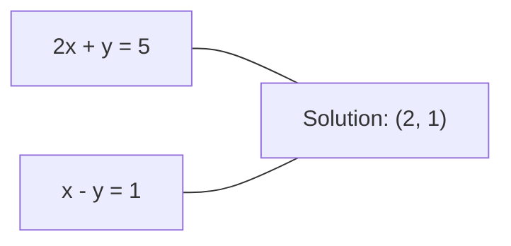
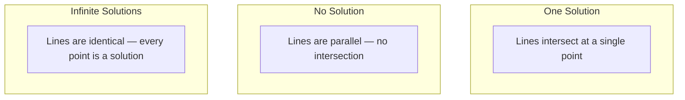

# Linear Systems

> Solving Ax = b is the oldest problem in mathematics that still runs your neural network.

**Type:** Build
**Language:** Python
**Prerequisites:** Phase 1, Lessons 01 (Linear Algebra Intuition), 02 (Vectors & Matrices), 03 (Matrix Transformations)
**Time:** ~120 minutes

## Learning Objectives

- Solve Ax = b using Gaussian elimination with partial pivoting and back substitution
- Factor matrices with LU, QR, and Cholesky decompositions and explain when each is appropriate
- Derive the normal equations for least squares and connect them to linear and ridge regression
- Diagnose ill-conditioned systems using the condition number and apply regularization to stabilize them

## The Problem

Every time you train a linear regression, you solve a linear system. Every time you compute a least-squares fit, you solve a linear system. Every time a neural network layer computes `y = Wx + b`, it is evaluating one side of a linear system. When you add regularization, you modify the system. When you use Gaussian processes, you factor a matrix. When you invert a covariance matrix for Mahalanobis distance, you solve a linear system.

The equation Ax = b appears everywhere. A is a matrix of known coefficients. b is a vector of known outputs. x is the vector of unknowns you want to find. In linear regression, A is your data matrix, b is your target vector, and x is the weight vector. The entire model reduces to: find x such that Ax is as close to b as possible.

This lesson builds every major method for solving that equation from scratch. You will understand why some methods are fast and others are stable, why some work only for square systems and others handle overdetermined ones, and why the condition number of your matrix determines whether your answer means anything at all.

## The Concept

### What Ax = b means geometrically

A system of linear equations has a geometric interpretation. Each equation defines a hyperplane. The solution is the point (or set of points) where all hyperplanes intersect.

```
2x + y = 5          Two lines in 2D.
x - y  = 1          They intersect at x=2, y=1.
```



Three things can happen:



In matrix form, "one solution" means A is invertible. "No solution" means the system is inconsistent. "Infinite solutions" means A has a null space. Most ML problems fall in the "no exact solution" category because you have more equations (data points) than unknowns (parameters). That is where least squares comes in.

### Column picture vs row picture

There are two ways to read Ax = b.

**Row picture.** Each row of A defines one equation. Each equation is a hyperplane. The solution is where they all intersect.

**Column picture.** Each column of A is a vector. The question becomes: what linear combination of the columns of A produces b?

```
A = | 2  1 |    b = | 5 |
    | 1 -1 |        | 1 |

Row picture: solve 2x + y = 5 and x - y = 1 simultaneously.

Column picture: find x1, x2 such that:
  x1 * [2, 1] + x2 * [1, -1] = [5, 1]
  2 * [2, 1] + 1 * [1, -1] = [4+1, 2-1] = [5, 1]   check.
```

The column picture is more fundamental. If b lies in the column space of A, the system has a solution. If b does not, you find the closest point in the column space. That closest point is the least-squares solution.

### Gaussian elimination

Gaussian elimination transforms Ax = b into an upper triangular system Ux = c that you solve by back substitution. It is the most direct method.

The algorithm:

```
1. For each column k (the pivot column):
   a. Find the largest entry in column k at or below row k (partial pivoting).
   b. Swap that row with row k.
   c. For each row i below k:
      - Compute multiplier m = A[i][k] / A[k][k]
      - Subtract m times row k from row i.
2. Back substitute: solve from the last equation upward.
```

Example:

```
Original:
| 2  1  1 | 8 |       R2 = R2 - (2)R1     | 2  1   1 |  8 |
| 4  3  3 |20 |  -->  R3 = R3 - (1)R1 --> | 0  1   1 |  4 |
| 2  3  1 |12 |                            | 0  2   0 |  4 |

                       R3 = R3 - (2)R2     | 2  1   1 |  8 |
                                       --> | 0  1   1 |  4 |
                                           | 0  0  -2 | -4 |

Back substitute:
  -2 * x3 = -4    -->  x3 = 2
  x2 + 2  = 4     -->  x2 = 2
  2*x1 + 2 + 2 = 8 --> x1 = 2
```

Gaussian elimination costs O(n^3) operations. For a 1000x1000 system, that is about a billion floating-point operations. Fast, but you can do better if you need to solve multiple systems with the same A.

### Partial pivoting: why it matters

Without pivoting, Gaussian elimination can fail or produce garbage. If a pivot element is zero, you divide by zero. If it is small, you amplify rounding errors.

```
Bad pivot:                       With partial pivoting:
| 0.001  1 | 1.001 |            Swap rows first:
| 1      1 | 2     |            | 1      1 | 2     |
                                 | 0.001  1 | 1.001 |
m = 1/0.001 = 1000              m = 0.001/1 = 0.001
R2 = R2 - 1000*R1               R2 = R2 - 0.001*R1
| 0.001  1     | 1.001   |      | 1      1     | 2     |
| 0     -999   | -999.0  |      | 0      0.999 | 0.999 |

x2 = 1.000 (correct)            x2 = 1.000 (correct)
x1 = (1.001 - 1)/0.001          x1 = (2 - 1)/1 = 1.000 (correct)
   = 0.001/0.001 = 1.000        Stable because the multiplier is small.
```

In floating-point arithmetic with limited precision, the unpivoted version can lose significant digits. Partial pivoting always selects the largest available pivot to minimize error amplification.

### LU decomposition

LU decomposition factors A into a lower triangular matrix L and an upper triangular matrix U: A = LU. The L matrix stores the multipliers from Gaussian elimination. The U matrix is the result of elimination.

```
A = L @ U

| 2  1  1 |   | 1  0  0 |   | 2  1   1 |
| 4  3  3 | = | 2  1  0 | @ | 0  1   1 |
| 2  3  1 |   | 1  2  1 |   | 0  0  -2 |
```

Why factor instead of just eliminating? Because once you have L and U, solving Ax = b for any new b costs only O(n^2):

```
Ax = b
LUx = b
Let y = Ux:
  Ly = b    (forward substitution, O(n^2))
  Ux = y    (back substitution, O(n^2))
```

The O(n^3) cost is paid once during factorization. Every subsequent solve is O(n^2). If you need to solve 1000 systems with the same A but different b vectors, LU saves a factor of 1000/3 in total work.

With partial pivoting, you get PA = LU where P is a permutation matrix recording the row swaps.

### QR decomposition

QR decomposition factors A into an orthogonal matrix Q and an upper triangular matrix R: A = QR.

An orthogonal matrix has the property Q^T Q = I. Its columns are orthonormal vectors. Multiplying by Q preserves lengths and angles.

```
A = Q @ R

Q has orthonormal columns: Q^T Q = I
R is upper triangular

To solve Ax = b:
  QRx = b
  Rx = Q^T b    (just multiply by Q^T, no inversion needed)
  Back substitute to get x.
```

QR is numerically more stable than LU for solving least-squares problems. The Gram-Schmidt process builds Q column by column:

```
Given columns a1, a2, ... of A:

q1 = a1 / ||a1||

q2 = a2 - (a2 . q1) * q1        (subtract projection onto q1)
q2 = q2 / ||q2||                (normalize)

q3 = a3 - (a3 . q1) * q1 - (a3 . q2) * q2
q3 = q3 / ||q3||

R[i][j] = qi . aj    for i <= j
```

Each step removes the component along all previous q vectors, leaving only the new orthogonal direction.

### Cholesky decomposition

When A is symmetric (A = A^T) and positive definite (all eigenvalues positive), you can factor it as A = L L^T where L is lower triangular. This is the Cholesky decomposition.

```
A = L @ L^T

| 4  2 |   | 2  0 |   | 2  1 |
| 2  5 | = | 1  2 | @ | 0  2 |

L[i][i] = sqrt(A[i][i] - sum(L[i][k]^2 for k < i))
L[i][j] = (A[i][j] - sum(L[i][k]*L[j][k] for k < j)) / L[j][j]    for i > j
```

Cholesky is twice as fast as LU and requires half the storage. It only works for symmetric positive definite matrices, but those show up constantly:

- Covariance matrices are symmetric positive semi-definite (positive definite with regularization).
- The kernel matrix in Gaussian processes is symmetric positive definite.
- The Hessian of a convex function at a minimum is symmetric positive definite.
- A^T A is always symmetric positive semi-definite.

In Gaussian processes, you factor the kernel matrix K with Cholesky, then solve K alpha = y to get the predictive mean. The Cholesky factor also gives you the log-determinant for the marginal likelihood: log det(K) = 2 * sum(log(diag(L))).

### Least squares: when Ax = b has no exact solution

If A is m x n with m > n (more equations than unknowns), the system is overdetermined. There is no exact solution. Instead, you minimize the squared error:

```
minimize ||Ax - b||^2

This is the sum of squared residuals:
  sum((A[i,:] @ x - b[i])^2 for i in range(m))
```

The minimizer satisfies the normal equations:

```
A^T A x = A^T b
```

Derivation: expand ||Ax - b||^2 = (Ax - b)^T (Ax - b) = x^T A^T A x - 2 x^T A^T b + b^T b. Take the gradient with respect to x, set it to zero: 2 A^T A x - 2 A^T b = 0.

```
Original system (overdetermined, 4 equations, 2 unknowns):
| 1  1 |         | 3 |
| 1  2 | x     = | 5 |       No exact x satisfies all 4 equations.
| 1  3 |         | 6 |
| 1  4 |         | 8 |

Normal equations:
A^T A = | 4  10 |    A^T b = | 22 |
        | 10 30 |            | 63 |

Solve: x = [1.5, 1.7]

This is linear regression. x[0] is the intercept, x[1] is the slope.
```

### Normal equations = linear regression

The connection is exact. In linear regression, your data matrix X has one row per sample and one column per feature. Your target vector y has one entry per sample. The weight vector w satisfies:

```
X^T X w = X^T y
w = (X^T X)^(-1) X^T y
```

This is the closed-form solution to linear regression. Every call to `sklearn.linear_model.LinearRegression.fit()` computes this (or an equivalent via QR or SVD).

Add a regularization term lambda * I to the matrix and you get ridge regression:

```
(X^T X + lambda * I) w = X^T y
w = (X^T X + lambda * I)^(-1) X^T y
```

The regularization makes the matrix better conditioned (easier to invert accurately) and prevents overfitting by shrinking the weights toward zero. The matrix X^T X + lambda * I is always symmetric positive definite when lambda > 0, so you can use Cholesky to solve it.

### Pseudoinverse (Moore-Penrose)

The pseudoinverse A+ generalizes matrix inversion to non-square and singular matrices. For any matrix A:

```
x = A+ b

where A+ = V Sigma+ U^T    (computed via SVD)
```

Sigma+ is formed by taking the reciprocal of each nonzero singular value and transposing the result. If A = U Sigma V^T, then A+ = V Sigma+ U^T.

```
A = U Sigma V^T        (SVD)

Sigma = | 5  0 |       Sigma+ = | 1/5  0  0 |
        | 0  2 |                | 0  1/2  0 |
        | 0  0 |

A+ = V Sigma+ U^T
```

The pseudoinverse gives the minimum-norm least-squares solution. If the system has:
- One solution: A+ b gives it.
- No solution: A+ b gives the least-squares solution.
- Infinite solutions: A+ b gives the one with the smallest ||x||.

NumPy's `np.linalg.lstsq` and `np.linalg.pinv` both use the SVD internally.

### Condition number

The condition number measures how sensitive the solution is to small changes in the input. For a matrix A, the condition number is:

```
kappa(A) = ||A|| * ||A^(-1)|| = sigma_max / sigma_min
```

where sigma_max and sigma_min are the largest and smallest singular values.

```
Well-conditioned (kappa ~ 1):        Ill-conditioned (kappa ~ 10^15):
Small change in b -->                Small change in b -->
small change in x                    huge change in x

| 2  0 |   kappa = 2/1 = 2          | 1   1          |   kappa ~ 10^15
| 0  1 |   safe to solve            | 1   1+10^(-15) |   solution is garbage
```

Rules of thumb:
- kappa < 100: safe, solution is accurate.
- kappa ~ 10^k: you lose about k digits of precision from your floating-point arithmetic.
- kappa ~ 10^16 (for float64): the solution is meaningless. The matrix is effectively singular.

In ML, ill-conditioning happens when features are nearly collinear. Regularization (adding lambda * I) improves the condition number from sigma_max / sigma_min to (sigma_max + lambda) / (sigma_min + lambda).

### Iterative methods: conjugate gradient

For very large sparse systems (millions of unknowns), direct methods like LU or Cholesky are too expensive. Iterative methods approximate the solution by improving a guess over many iterations.

Conjugate gradient (CG) solves Ax = b when A is symmetric positive definite. It finds the exact solution in at most n iterations (in exact arithmetic), but typically converges much faster if the eigenvalues of A are clustered.

```
Algorithm sketch:
  x0 = initial guess (often zero)
  r0 = b - A x0           (residual)
  p0 = r0                 (search direction)

  For k = 0, 1, 2, ...:
    alpha = (rk . rk) / (pk . A pk)
    x_{k+1} = xk + alpha * pk
    r_{k+1} = rk - alpha * A pk
    beta = (r_{k+1} . r_{k+1}) / (rk . rk)
    p_{k+1} = r_{k+1} + beta * pk
    if ||r_{k+1}|| < tolerance: stop
```

CG is used in:
- Large-scale optimization (Newton-CG method)
- Solving PDE discretizations
- Kernel methods where the kernel matrix is too large to factor
- Preconditioning for other iterative solvers

The convergence rate depends on the condition number. Better conditioned systems converge faster, which is another reason regularization helps.

### The full picture: which method when

| Method | Requirements | Cost | Use case |
|--------|-------------|------|----------|
| Gaussian elimination | Square, nonsingular A | O(n^3) | One-off solve of a square system |
| LU decomposition | Square, nonsingular A | O(n^3) factor + O(n^2) solve | Multiple solves with the same A |
| QR decomposition | Any A (m >= n) | O(mn^2) | Least squares, numerically stable |
| Cholesky | Symmetric positive definite A | O(n^3/3) | Covariance matrices, Gaussian processes, ridge regression |
| Normal equations | Overdetermined (m > n) | O(mn^2 + n^3) | Linear regression (small n) |
| SVD / pseudoinverse | Any A | O(mn^2) | Rank-deficient systems, minimum-norm solutions |
| Conjugate gradient | Symmetric positive definite, sparse A | O(n * k * nnz) | Large sparse systems, k = iterations |

### Connection to ML

Every method in this lesson appears in production ML:

**Linear regression.** The closed-form solution solves the normal equations X^T X w = X^T y. This is done via Cholesky (if n is small) or QR (if numerical stability matters) or SVD (if the matrix might be rank-deficient).

**Ridge regression.** Adds lambda * I to X^T X. The regularized system (X^T X + lambda * I) w = X^T y is always solvable via Cholesky because X^T X + lambda * I is symmetric positive definite for lambda > 0.

**Gaussian processes.** The predictive mean requires solving K alpha = y where K is the kernel matrix. Cholesky factorization of K is the standard approach. The log marginal likelihood uses log det(K) = 2 sum(log(diag(L))).

**Neural network initialization.** Orthogonal initialization uses QR decomposition to create weight matrices whose columns are orthonormal. This prevents signal collapse in deep networks.

**Preconditioning.** Large-scale optimizers use incomplete Cholesky or incomplete LU as preconditioners for conjugate gradient solvers.

**Feature engineering.** The condition number of X^T X tells you if your features are collinear. If kappa is large, drop features or add regularization.

## Build It

### Step 1: Gaussian elimination with partial pivoting

```python
import numpy as np

def gaussian_elimination(A, b):
    n = len(b)
    Ab = np.hstack([A.astype(float), b.reshape(-1, 1).astype(float)])

    for k in range(n):
        max_row = k + np.argmax(np.abs(Ab[k:, k]))
        Ab[[k, max_row]] = Ab[[max_row, k]]

        if abs(Ab[k, k]) < 1e-12:
            raise ValueError(f"Matrix is singular or nearly singular at pivot {k}")

        for i in range(k + 1, n):
            m = Ab[i, k] / Ab[k, k]
            Ab[i, k:] -= m * Ab[k, k:]

    x = np.zeros(n)
    for i in range(n - 1, -1, -1):
        x[i] = (Ab[i, -1] - Ab[i, i+1:n] @ x[i+1:n]) / Ab[i, i]

    return x
```

### Step 2: LU decomposition

```python
def lu_decompose(A):
    n = A.shape[0]
    L = np.eye(n)
    U = A.astype(float).copy()
    P = np.eye(n)

    for k in range(n):
        max_row = k + np.argmax(np.abs(U[k:, k]))
        if max_row != k:
            U[[k, max_row]] = U[[max_row, k]]
            P[[k, max_row]] = P[[max_row, k]]
            if k > 0:
                L[[k, max_row], :k] = L[[max_row, k], :k]

        for i in range(k + 1, n):
            L[i, k] = U[i, k] / U[k, k]
            U[i, k:] -= L[i, k] * U[k, k:]

    return P, L, U

def lu_solve(P, L, U, b):
    n = len(b)
    Pb = P @ b.astype(float)

    y = np.zeros(n)
    for i in range(n):
        y[i] = Pb[i] - L[i, :i] @ y[:i]

    x = np.zeros(n)
    for i in range(n - 1, -1, -1):
        x[i] = (y[i] - U[i, i+1:] @ x[i+1:]) / U[i, i]

    return x
```

### Step 3: Cholesky decomposition

```python
def cholesky(A):
    n = A.shape[0]
    L = np.zeros_like(A, dtype=float)

    for i in range(n):
        for j in range(i + 1):
            s = A[i, j] - L[i, :j] @ L[j, :j]
            if i == j:
                if s <= 0:
                    raise ValueError("Matrix is not positive definite")
                L[i, j] = np.sqrt(s)
            else:
                L[i, j] = s / L[j, j]

    return L
```

### Step 4: Least squares via normal equations

```python
def least_squares_normal(A, b):
    AtA = A.T @ A
    Atb = A.T @ b
    return gaussian_elimination(AtA, Atb)

def ridge_regression(A, b, lam):
    n = A.shape[1]
    AtA = A.T @ A + lam * np.eye(n)
    Atb = A.T @ b
    L = cholesky(AtA)
    y = np.zeros(n)
    for i in range(n):
        y[i] = (Atb[i] - L[i, :i] @ y[:i]) / L[i, i]
    x = np.zeros(n)
    for i in range(n - 1, -1, -1):
        x[i] = (y[i] - L.T[i, i+1:] @ x[i+1:]) / L.T[i, i]
    return x
```

### Step 5: Condition number

```python
def condition_number(A):
    U, S, Vt = np.linalg.svd(A)
    return S[0] / S[-1]
```

## Use It

Putting the pieces together for linear regression and ridge regression on real data:

```python
np.random.seed(42)
X_raw = np.random.randn(100, 3)
w_true = np.array([2.0, -1.0, 0.5])
y = X_raw @ w_true + np.random.randn(100) * 0.1

X = np.column_stack([np.ones(100), X_raw])

w_ols = least_squares_normal(X, y)
print(f"OLS weights (ours):    {w_ols}")

w_np = np.linalg.lstsq(X, y, rcond=None)[0]
print(f"OLS weights (numpy):   {w_np}")
print(f"Max difference: {np.max(np.abs(w_ols - w_np)):.2e}")

w_ridge = ridge_regression(X, y, lam=1.0)
print(f"Ridge weights (ours):  {w_ridge}")

from sklearn.linear_model import Ridge
ridge_sk = Ridge(alpha=1.0, fit_intercept=False)
ridge_sk.fit(X, y)
print(f"Ridge weights (sklearn): {ridge_sk.coef_}")
```

## Ship It

This lesson produces:
- `code/linear_systems.py` containing from-scratch implementations of Gaussian elimination, LU decomposition, Cholesky decomposition, least squares, and ridge regression
- A working demonstration that normal equations and sklearn's LinearRegression produce the same weights

## Exercises

1. Solve the system `[[1,2,3],[4,5,6],[7,8,10]] x = [6, 15, 27]` using your Gaussian elimination, your LU solver, and `np.linalg.solve`. Verify all three give the same answer within floating-point tolerance.

2. Generate a 50x5 random matrix X and target y = X @ w_true + noise. Solve for w using normal equations, QR (via `np.linalg.qr`), SVD (via `np.linalg.svd`), and `np.linalg.lstsq`. Compare all four solutions. Measure the condition number of X^T X and explain how it affects which method you trust.

3. Create a nearly singular matrix by making two columns almost identical (e.g., column 2 = column 1 + 1e-10 * noise). Compute its condition number. Solve Ax = b with and without regularization (add 0.01 * I). Compare the solutions and residuals. Explain why regularization helps.

4. Implement the conjugate gradient algorithm for a 100x100 random symmetric positive definite matrix. Count how many iterations it takes to converge to tolerance 1e-8. Compare with the theoretical maximum of n iterations.

5. Time your Cholesky solver vs your LU solver vs `np.linalg.solve` on symmetric positive definite matrices of size 10, 50, 200, 500. Plot the results. Verify Cholesky is roughly 2x faster than LU.

## Key Terms

| Term | What people say | What it actually means |
|------|----------------|----------------------|
| Linear system | "Solve for x" | A set of linear equations Ax = b. Finding x means finding the input that produces output b under transformation A. |
| Gaussian elimination | "Row reduce" | Systematically zero out entries below the diagonal using row operations, producing an upper triangular system solvable by back substitution. O(n^3). |
| Partial pivoting | "Swap rows for stability" | Before eliminating in column k, swap the row with the largest absolute value in that column to the pivot position. Prevents division by small numbers. |
| LU decomposition | "Factor into triangles" | Write A = LU where L is lower triangular (stores multipliers) and U is upper triangular (the eliminated matrix). Amortizes the O(n^3) cost over multiple solves. |
| QR decomposition | "Orthogonal factorization" | Write A = QR where Q has orthonormal columns and R is upper triangular. More stable than LU for least squares. |
| Cholesky decomposition | "Square root of a matrix" | For symmetric positive definite A, write A = LL^T. Half the cost of LU. Used for covariance matrices, kernel matrices, and ridge regression. |
| Least squares | "Best fit when exact is impossible" | Minimize the sum of squared residuals ||Ax - b||^2 when the system is overdetermined (more equations than unknowns). |
| Normal equations | "The calculus shortcut" | A^T A x = A^T b. Setting the gradient of ||Ax - b||^2 to zero. This IS the closed-form solution to linear regression. |
| Pseudoinverse | "Inversion for non-square matrices" | A+ = V Sigma+ U^T via SVD. Gives the minimum-norm least-squares solution for any matrix, square or rectangular, singular or not. |
| Condition number | "How trustworthy is this answer" | kappa = sigma_max / sigma_min. Measures sensitivity to input perturbations. Lose about log10(kappa) digits of precision. |
| Ridge regression | "Regularized least squares" | Solve (X^T X + lambda I) w = X^T y. Adding lambda I improves conditioning and shrinks weights toward zero. Prevents overfitting. |
| Conjugate gradient | "Iterative Ax=b for big matrices" | An iterative solver for symmetric positive definite systems. Converges in at most n steps. Practical for large sparse systems where factorization is too expensive. |
| Overdetermined system | "More data than parameters" | m > n in an m-by-n system. No exact solution exists. Least squares finds the best approximation. This is every regression problem. |
| Back substitution | "Solve from the bottom up" | Given an upper triangular system, solve the last equation first, then substitute backward. O(n^2). |
| Forward substitution | "Solve from the top down" | Given a lower triangular system, solve the first equation first, then substitute forward. O(n^2). Used in the L step of LU solves. |

## Further Reading

- [MIT 18.06: Linear Algebra](https://ocw.mit.edu/courses/18-06-linear-algebra-spring-2010/) (Gilbert Strang) -- the definitive course on linear systems and matrix factorizations
- [Numerical Linear Algebra](https://people.maths.ox.ac.uk/trefethen/text.html) (Trefethen & Bau) -- the standard reference for understanding numerical stability, conditioning, and why algorithms fail
- [Matrix Computations](https://www.cs.cornell.edu/cv/GolubVanLoan4/golubandvanloan.htm) (Golub & Van Loan) -- the encyclopedic reference for every matrix algorithm
- [3Blue1Brown: Inverse Matrices](https://www.3blue1brown.com/lessons/inverse-matrices) -- visual intuition for what solving Ax = b means geometrically
