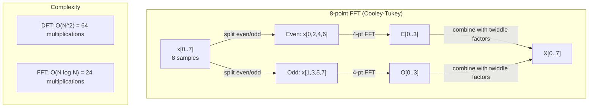
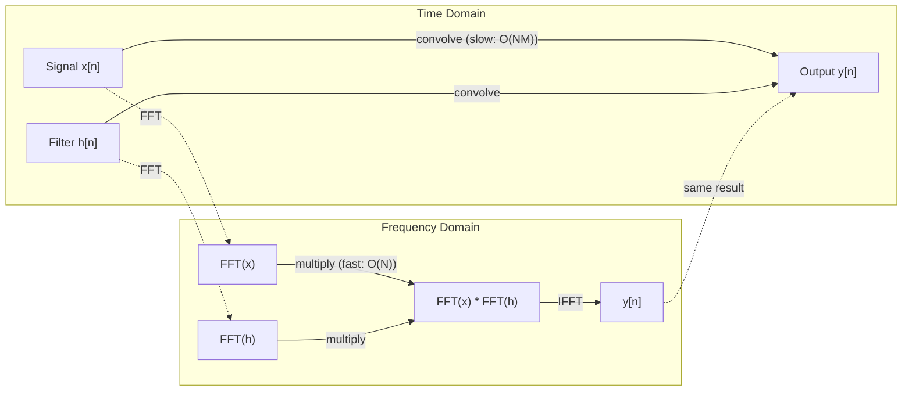

# The Fourier Transform

> Every signal is a sum of sine waves. The Fourier transform tells you which ones.

**Type:** Build
**Language:** Python
**Prerequisites:** Phase 1, Lessons 01-04, 19 (complex numbers)
**Time:** ~90 minutes

## Learning Objectives

- Implement the DFT from scratch and verify it against the O(N log N) Cooley-Tukey FFT
- Interpret frequency coefficients: extract amplitude, phase, and power spectrum from a signal
- Apply the convolution theorem to perform convolution via FFT multiplication
- Connect Fourier frequency decomposition to transformer positional encodings and CNN convolution layers

## The Problem

An audio recording is a sequence of pressure measurements over time. A stock price is a sequence of values over days. An image is a grid of pixel intensities over space. All of these are data in the time domain (or space domain). You see values changing over some index.

But many patterns are invisible in the time domain. Is this audio signal a pure tone or a chord? Does this stock price have a weekly cycle? Does this image have a repeating texture? These questions are about frequency content, and the time domain hides it.

The Fourier transform converts data from the time domain to the frequency domain. It takes a signal and decomposes it into sine waves of different frequencies. Each sine wave has an amplitude (how strong it is) and a phase (where it starts). The Fourier transform tells you both.

This matters for ML because frequency-domain thinking appears everywhere. Convolutional neural networks perform convolution, which is multiplication in the frequency domain. Transformer positional encodings use frequency decomposition to represent position. Audio models (speech recognition, music generation) operate on spectrograms -- frequency representations of sound. Time series models look for periodic patterns. Understanding the Fourier transform gives you the vocabulary to work with all of these.

## The Concept

### The DFT definition

Given N samples x[0], x[1], ..., x[N-1], the Discrete Fourier Transform produces N frequency coefficients X[0], X[1], ..., X[N-1]:

```
X[k] = sum_{n=0}^{N-1} x[n] * e^(-2*pi*i*k*n/N)

for k = 0, 1, ..., N-1
```

Each X[k] is a complex number. Its magnitude |X[k]| tells you the amplitude of frequency k. Its phase angle(X[k]) tells you the phase offset of that frequency.

The key insight: `e^(-2*pi*i*k*n/N)` is a rotating phasor at frequency k. The DFT computes the correlation between the signal and each of N equally-spaced frequencies. If the signal contains energy at frequency k, the correlation is large. If not, it is near zero.

### What each coefficient means

**X[0]: the DC component.** This is the sum of all samples -- proportional to the mean. It represents the constant (zero-frequency) offset of the signal.

```
X[0] = sum_{n=0}^{N-1} x[n] * e^0 = sum of all samples
```

**X[k] for 1 <= k <= N/2: positive frequencies.** X[k] represents frequency k cycles per N samples. Higher k means higher frequency (faster oscillation).

**X[N/2]: the Nyquist frequency.** The highest frequency you can represent with N samples. Above this, you get aliasing -- high frequencies masquerading as low ones.

**X[k] for N/2 < k < N: negative frequencies.** For real-valued signals, X[N-k] = conj(X[k]). The negative frequencies are mirror images of the positive ones. This is why the useful information is in the first N/2 + 1 coefficients.

### Inverse DFT

The inverse DFT reconstructs the original signal from its frequency coefficients:

```
x[n] = (1/N) * sum_{k=0}^{N-1} X[k] * e^(2*pi*i*k*n/N)

for n = 0, 1, ..., N-1
```

The only differences from the forward DFT: the sign in the exponent is positive (not negative), and there is a 1/N normalization factor.

The inverse DFT is perfect reconstruction. No information is lost. You can go from time domain to frequency domain and back without any error. The DFT is a change of basis -- it re-expresses the same information in a different coordinate system.

### The FFT: making it fast

The DFT as defined above is O(N^2): for each of N output coefficients, you sum over N input samples. For N = 1 million, that is 10^12 operations.

The Fast Fourier Transform (FFT) computes the same result in O(N log N). For N = 1 million, that is about 20 million operations instead of a trillion. This is what makes frequency analysis practical.

The Cooley-Tukey algorithm (the most common FFT) works by divide and conquer:

1. Split the signal into even-indexed and odd-indexed samples.
2. Compute the DFT of each half recursively.
3. Combine the two half-size DFTs using "twiddle factors" e^(-2*pi*i*k/N).

```
X[k] = E[k] + e^(-2*pi*i*k/N) * O[k]          for k = 0, ..., N/2 - 1
X[k + N/2] = E[k] - e^(-2*pi*i*k/N) * O[k]    for k = 0, ..., N/2 - 1

where E = DFT of even-indexed samples
      O = DFT of odd-indexed samples
```

The symmetry means each level of recursion does O(N) work, and there are log2(N) levels. Total: O(N log N).



The FFT requires the signal length to be a power of 2. In practice, signals are zero-padded to the next power of 2.

### Spectral analysis

The **power spectrum** is |X[k]|^2 -- the squared magnitude of each frequency coefficient. It shows how much energy is at each frequency.

The **phase spectrum** is angle(X[k]) -- the phase offset of each frequency. For most analysis tasks, you care about the power spectrum and ignore the phase.

```
Power at frequency k:  P[k] = |X[k]|^2 = X[k].real^2 + X[k].imag^2
Phase at frequency k:  phi[k] = atan2(X[k].imag, X[k].real)
```

### Frequency resolution

The frequency resolution of the DFT depends on the number of samples N and the sampling rate fs.

```
Frequency of bin k:      f_k = k * fs / N
Frequency resolution:    delta_f = fs / N
Maximum frequency:       f_max = fs / 2  (Nyquist)
```

To resolve two frequencies that are close together, you need more samples. To capture high frequencies, you need a higher sampling rate.

### The convolution theorem

This is one of the most important results in signal processing and directly relevant to CNNs.

**Convolution in the time domain equals pointwise multiplication in the frequency domain.**

```
x * h = IFFT(FFT(x) . FFT(h))

where * is convolution and . is element-wise multiplication
```

Why this matters:

- Direct convolution of two signals of length N and M takes O(N*M) operations.
- FFT-based convolution takes O(N log N): transform both, multiply, transform back.
- For large kernels, FFT convolution is dramatically faster.
- This is exactly what happens in convolutional layers with large receptive fields.

Note: the DFT computes circular convolution (the signal wraps around). For linear convolution (no wraparound), zero-pad both signals to length N + M - 1 before computing.



### Windowing

The DFT assumes the signal is periodic -- it treats the N samples as one period of an infinitely repeating signal. If the signal does not start and end at the same value, this creates a discontinuity at the boundary, which shows up as spurious high-frequency content. This is called spectral leakage.

Windowing reduces leakage by tapering the signal to zero at both ends before computing the DFT.

Common windows:

| Window | Shape | Main lobe width | Side lobe level | Use case |
|--------|-------|----------------|-----------------|----------|
| Rectangular | Flat (no window) | Narrowest | Highest (-13 dB) | When signal is exactly periodic in N samples |
| Hann | Raised cosine | Moderate | Low (-31 dB) | General purpose spectral analysis |
| Hamming | Modified cosine | Moderate | Lower (-42 dB) | Audio processing, speech analysis |
| Blackman | Triple cosine | Wide | Very low (-58 dB) | When side lobe suppression is critical |

```
Hann window:    w[n] = 0.5 * (1 - cos(2*pi*n / (N-1)))
Hamming window: w[n] = 0.54 - 0.46 * cos(2*pi*n / (N-1))
```

Apply the window by multiplying it element-wise with the signal before the DFT: `X = DFT(x * w)`.

### DFT properties

| Property | Time Domain | Frequency Domain |
|----------|-------------|-----------------|
| Linearity | a*x + b*y | a*X + b*Y |
| Time shift | x[n - k] | X[f] * e^(-2*pi*i*f*k/N) |
| Frequency shift | x[n] * e^(2*pi*i*f0*n/N) | X[f - f0] |
| Convolution | x * h | X * H (pointwise) |
| Multiplication | x * h (pointwise) | X * H (circular convolution, scaled by 1/N) |
| Parseval's theorem | sum \|x[n]\|^2 | (1/N) * sum \|X[k]\|^2 |
| Conjugate symmetry (real input) | x[n] real | X[k] = conj(X[N-k]) |

Parseval's theorem says the total energy is the same in both domains. Energy is conserved through the transform.

### Connection to positional encodings

The original Transformer uses sinusoidal positional encodings:

```
PE(pos, 2i)   = sin(pos / 10000^(2i/d_model))
PE(pos, 2i+1) = cos(pos / 10000^(2i/d_model))
```

Each dimension pair (2i, 2i+1) oscillates at a different frequency. The frequencies are geometrically spaced from high (dimension 0,1) to low (last dimensions). This gives each position a unique pattern across all frequency bands -- similar to how Fourier coefficients uniquely identify a signal.

The key properties this provides:

- **Uniqueness:** No two positions have the same encoding.
- **Bounded values:** sin and cos are always in [-1, 1].
- **Relative position:** The encoding of position p+k can be expressed as a linear function of the encoding at position p. The model can learn to attend to relative positions.

### Connection to CNNs

A convolution layer applies a learned filter (kernel) to the input by sliding it across the signal or image. Mathematically, this is the convolution operation.

By the convolution theorem, this is equivalent to:
1. FFT the input
2. FFT the kernel
3. Multiply in frequency domain
4. IFFT the result

Standard CNN implementations use direct convolution (faster for small 3x3 kernels). But for large kernels or global convolution, FFT-based approaches are significantly faster. Some architectures (like FNet) replace attention entirely with FFT, achieving competitive accuracy with O(N log N) instead of O(N^2) complexity.

### Spectrograms and the Short-Time Fourier Transform

A single FFT gives you the frequency content of the entire signal, but tells you nothing about when those frequencies occur. A chirp (a signal whose frequency increases over time) and a chord (all frequencies present simultaneously) can have the same magnitude spectrum.

The Short-Time Fourier Transform (STFT) solves this by computing FFTs on overlapping windows of the signal. The result is a spectrogram: a 2D representation with time on one axis and frequency on the other. The intensity at each point shows the energy at that frequency at that time.

```
STFT procedure:
1. Choose a window size (e.g., 1024 samples)
2. Choose a hop size (e.g., 256 samples -- 75% overlap)
3. For each window position:
   a. Extract the windowed segment
   b. Apply a Hann/Hamming window
   c. Compute FFT
   d. Store the magnitude spectrum as one column of the spectrogram
```

Spectrograms are the standard input representation for audio ML models. Speech recognition models (Whisper, DeepSpeech) operate on mel-spectrograms -- spectrograms with frequencies mapped to the mel scale, which better matches human pitch perception.

### Aliasing

If a signal contains frequencies above fs/2 (the Nyquist frequency), sampling at rate fs will create aliased copies. A 90 Hz signal sampled at 100 Hz looks identical to a 10 Hz signal. There is no way to distinguish them from the samples alone.

```
Example:
  True signal: 90 Hz sine wave
  Sampling rate: 100 Hz
  Apparent frequency: 100 - 90 = 10 Hz

  The samples from the 90 Hz signal at 100 Hz sampling rate
  are identical to the samples from a 10 Hz signal.
  No amount of math can recover the original 90 Hz.
```

This is why analog-to-digital converters include anti-aliasing filters that remove frequencies above Nyquist before sampling. In ML, aliasing appears when downsampling feature maps without proper low-pass filtering -- some architectures address this with anti-aliased pooling layers.

### Zero-padding does not increase resolution

A common misconception: zero-padding a signal before FFT improves frequency resolution. It does not. Zero-padding interpolates between existing frequency bins, giving you a smoother-looking spectrum. But it cannot reveal frequency detail that was not present in the original samples.

True frequency resolution depends only on the observation time T = N / fs. To resolve two frequencies separated by delta_f, you need at least T = 1 / delta_f seconds of data. No amount of zero-padding changes this fundamental limit.

## Build It

### Step 1: DFT from scratch

The O(N^2) DFT follows directly from the definition.

```python
import math

class Complex:
    ...

def dft(x):
    N = len(x)
    result = []
    for k in range(N):
        total = Complex(0, 0)
        for n in range(N):
            angle = -2 * math.pi * k * n / N
            w = Complex(math.cos(angle), math.sin(angle))
            xn = x[n] if isinstance(x[n], Complex) else Complex(x[n])
            total = total + xn * w
        result.append(total)
    return result
```

### Step 2: Inverse DFT

Same structure, positive exponent, divide by N.

```python
def idft(X):
    N = len(X)
    result = []
    for n in range(N):
        total = Complex(0, 0)
        for k in range(N):
            angle = 2 * math.pi * k * n / N
            w = Complex(math.cos(angle), math.sin(angle))
            total = total + X[k] * w
        result.append(Complex(total.real / N, total.imag / N))
    return result
```

### Step 3: FFT (Cooley-Tukey)

The recursive FFT requires power-of-2 length. Split into even and odd, recurse, combine with twiddle factors.

```python
def fft(x):
    N = len(x)
    if N <= 1:
        return [x[0] if isinstance(x[0], Complex) else Complex(x[0])]
    if N % 2 != 0:
        return dft(x)

    even = fft([x[i] for i in range(0, N, 2)])
    odd = fft([x[i] for i in range(1, N, 2)])

    result = [Complex(0)] * N
    for k in range(N // 2):
        angle = -2 * math.pi * k / N
        twiddle = Complex(math.cos(angle), math.sin(angle))
        t = twiddle * odd[k]
        result[k] = even[k] + t
        result[k + N // 2] = even[k] - t
    return result
```

### Step 4: Spectral analysis helpers

```python
def power_spectrum(X):
    return [xk.real ** 2 + xk.imag ** 2 for xk in X]

def convolve_fft(x, h):
    N = len(x) + len(h) - 1
    padded_N = 1
    while padded_N < N:
        padded_N *= 2

    x_padded = x + [0.0] * (padded_N - len(x))
    h_padded = h + [0.0] * (padded_N - len(h))

    X = fft(x_padded)
    H = fft(h_padded)

    Y = [xk * hk for xk, hk in zip(X, H)]

    y = idft(Y)
    return [y[n].real for n in range(N)]
```

## Use It

For real work, use numpy's FFT which is backed by highly optimized C libraries.

```python
import numpy as np

signal = np.sin(2 * np.pi * 5 * np.arange(256) / 256)
spectrum = np.fft.fft(signal)
freqs = np.fft.fftfreq(256, d=1/256)

power = np.abs(spectrum) ** 2

positive_freqs = freqs[:len(freqs)//2]
positive_power = power[:len(power)//2]
```

For windowing and more advanced spectral analysis:

```python
from scipy.signal import windows, stft

window = windows.hann(256)
windowed = signal * window
spectrum = np.fft.fft(windowed)
```

For convolution:

```python
from scipy.signal import fftconvolve

result = fftconvolve(signal, kernel, mode='full')
```

For spectrograms:

```python
from scipy.signal import stft

frequencies, times, Zxx = stft(signal, fs=sample_rate, nperseg=256)
spectrogram = np.abs(Zxx) ** 2
```

The spectrogram matrix has shape (n_frequencies, n_time_frames). Each column is the power spectrum at one time window. This is what audio ML models consume as input.

## Ship It

Run `code/fourier.py` to generate `outputs/prompt-spectral-analyzer.md`.

## Exercises

1. **Pure tone identification.** Create a signal with a single sine wave at an unknown frequency (between 1 and 50 Hz), sampled at 128 Hz for 1 second. Use your DFT to identify the frequency. Verify the answer matches. Now add Gaussian noise with standard deviation 0.5 and repeat. How does noise affect the spectrum?

2. **FFT vs DFT verification.** Generate a random signal of length 64. Compute both DFT (O(N^2)) and FFT. Verify that all coefficients match to within 1e-10. Time both functions on signals of length 256, 512, 1024, and 2048. Plot the ratio of DFT time to FFT time.

3. **Convolution theorem proof by example.** Create signal x = [1, 2, 3, 4, 0, 0, 0, 0] and filter h = [1, 1, 1, 0, 0, 0, 0, 0]. Compute their circular convolution directly (nested loop). Then compute it via FFT (transform, multiply, inverse transform). Verify the results match. Now do linear convolution by zero-padding appropriately.

4. **Windowing effects.** Create a signal that is the sum of two sine waves at 10 Hz and 12 Hz (very close). Sample at 128 Hz for 1 second. Compute the power spectrum with no window, Hann window, and Hamming window. Which window makes it easiest to distinguish the two peaks? Why?

5. **Positional encoding analysis.** Generate the sinusoidal positional encodings for d_model = 128 and max_pos = 512. For each pair of positions (p1, p2), compute the dot product of their encodings. Show that the dot product depends only on |p1 - p2|, not on the absolute positions. What happens to the dot product as the distance increases?

## Key Terms

| Term | What it means |
|------|---------------|
| DFT (Discrete Fourier Transform) | Converts N time-domain samples into N frequency-domain coefficients. Each coefficient is the correlation with a complex sinusoid at that frequency |
| FFT (Fast Fourier Transform) | An O(N log N) algorithm to compute the DFT. The Cooley-Tukey algorithm splits even/odd indices recursively |
| Inverse DFT | Reconstructs the time-domain signal from frequency coefficients. Same formula as DFT with flipped exponent sign and 1/N scaling |
| Frequency bin | Each index k in the DFT output represents frequency k*fs/N Hz. The "bin" is the discrete frequency slot |
| DC component | X[0], the zero-frequency coefficient. Proportional to the signal mean |
| Nyquist frequency | fs/2, the maximum frequency representable at sampling rate fs. Frequencies above this alias |
| Power spectrum | \|X[k]\|^2, the squared magnitude of each frequency coefficient. Shows energy distribution across frequencies |
| Phase spectrum | angle(X[k]), the phase offset of each frequency component. Often ignored in analysis |
| Spectral leakage | Spurious frequency content caused by treating a non-periodic signal as periodic. Reduced by windowing |
| Window function | A tapering function (Hann, Hamming, Blackman) applied before DFT to reduce spectral leakage |
| Twiddle factor | The complex exponential e^(-2*pi*i*k/N) used to combine sub-DFTs in the FFT butterfly computation |
| Convolution theorem | Convolution in time domain equals pointwise multiplication in frequency domain. Fundamental to signal processing and CNNs |
| Circular convolution | Convolution where the signal wraps around. This is what the DFT naturally computes |
| Linear convolution | Standard convolution without wraparound. Achieved by zero-padding before DFT |
| Parseval's theorem | Total energy is preserved through the Fourier transform. sum \|x[n]\|^2 = (1/N) sum \|X[k]\|^2 |
| Aliasing | When frequencies above Nyquist appear as lower frequencies due to insufficient sampling rate |

## Further Reading

- [Cooley & Tukey: An Algorithm for the Machine Calculation of Complex Fourier Series (1965)](https://www.ams.org/journals/mcom/1965-19-090/S0025-5718-1965-0178586-1/) - the original FFT paper that changed computing
- [3Blue1Brown: But what is the Fourier Transform?](https://www.youtube.com/watch?v=spUNpyF58BY) - the best visual introduction to Fourier transforms
- [Lee-Thorp et al.: FNet: Mixing Tokens with Fourier Transforms (2021)](https://arxiv.org/abs/2105.03824) - replaces self-attention with FFT in transformers
- [Smith: The Scientist and Engineer's Guide to Digital Signal Processing](http://www.dspguide.com/) - free online textbook covering FFT, windowing, and spectral analysis in depth
- [Vaswani et al.: Attention Is All You Need (2017)](https://arxiv.org/abs/1706.03762) - sinusoidal positional encodings derived from Fourier frequency decomposition
- [Radford et al.: Whisper (2022)](https://arxiv.org/abs/2212.04356) - speech recognition using mel-spectrograms as input representation
