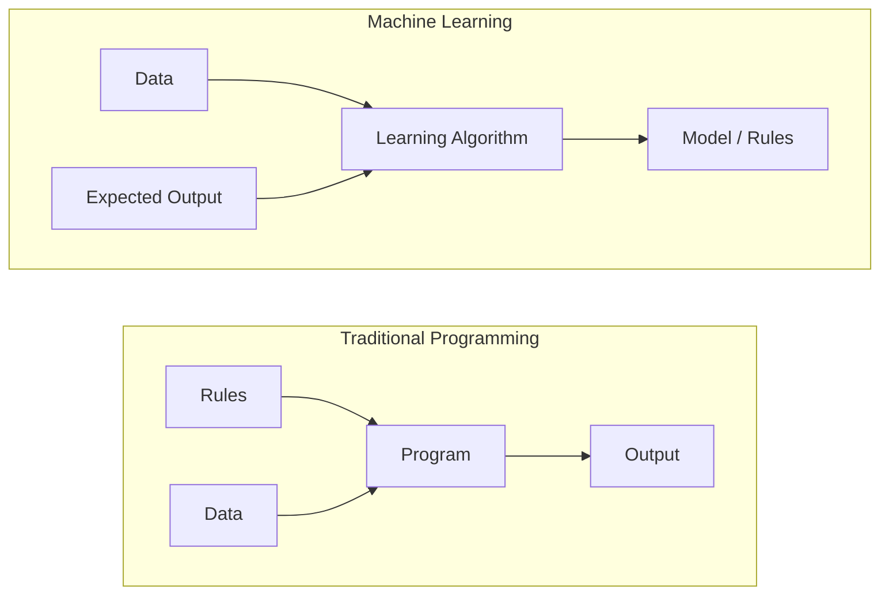
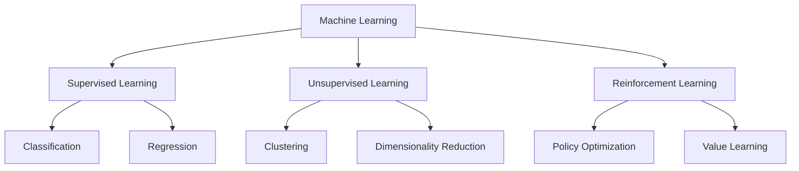
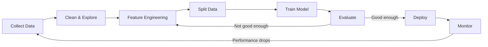
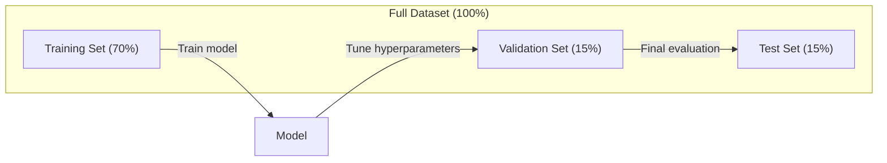
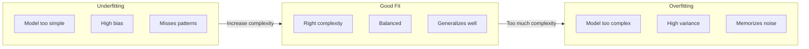
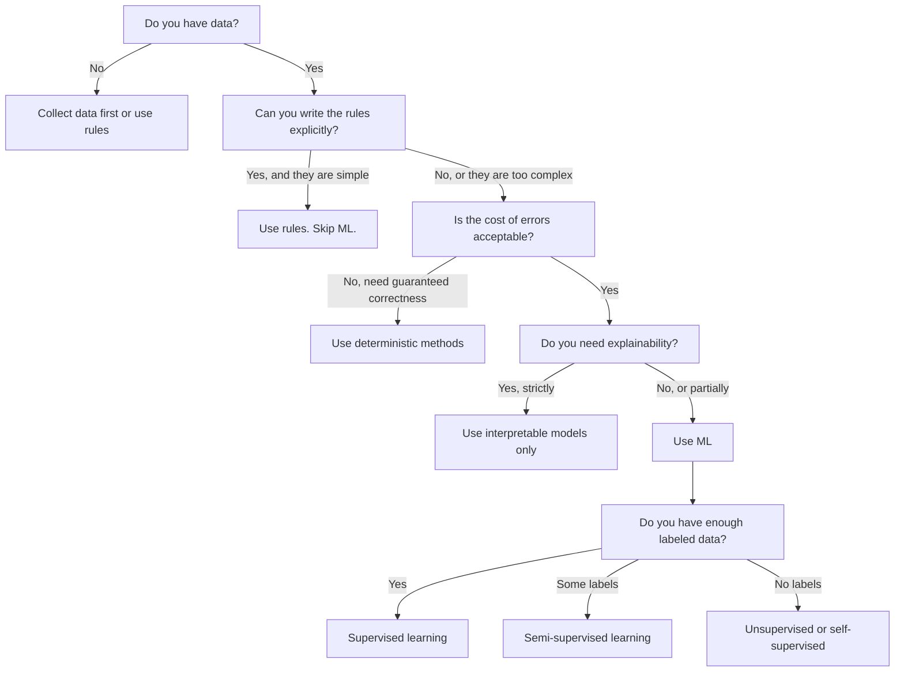

# What Is Machine Learning

> Machine learning is teaching computers to find patterns in data instead of writing rules by hand.

**Type:** Learn
**Languages:** Python
**Prerequisites:** Phase 1 (Math Foundations)
**Time:** ~45 minutes

## Learning Objectives

- Explain the difference between supervised, unsupervised, and reinforcement learning and identify which type applies to a given problem
- Implement a nearest centroid classifier from scratch and evaluate it against a random baseline
- Distinguish between classification and regression tasks and select the appropriate loss function for each
- Evaluate whether a given business problem is suitable for ML or better solved with deterministic rules

## The Problem

You want to build a spam filter. The traditional approach: sit down and write hundreds of rules. "If the email contains 'FREE MONEY', mark it spam. If it has more than 3 exclamation marks, mark it spam." You spend weeks writing rules. Then spammers change their wording. Your rules break. You write more rules. The cycle never ends.

Machine learning flips this. Instead of writing rules, you give the computer thousands of labeled emails ("spam" or "not spam") and let it figure out the rules on its own. The computer finds patterns you never would have thought of. When spammers change tactics, you retrain on new data instead of rewriting code.

This shift from "programming rules" to "learning from data" is the core of machine learning. Every recommendation engine, voice assistant, self-driving car, and language model works this way.

## The Concept

### Learning From Data, Not Rules

Traditional programming and machine learning solve problems in opposite directions.



Traditional programming: you write the rules. The program applies them to data to produce output.

Machine learning: you provide data and expected outputs. The algorithm discovers the rules.

The "model" that comes out of training IS the rules, encoded as numbers (weights, parameters). It generalizes from examples it has seen to make predictions on data it has never seen.

### The Three Types of Machine Learning



**Supervised Learning**: You have input-output pairs. The model learns to map inputs to outputs.
- "Here are 10,000 photos labeled cat or dog. Learn to tell them apart."
- "Here are house features and prices. Learn to predict the price."

**Unsupervised Learning**: You have inputs only. No labels. The model finds structure on its own.
- "Here are 10,000 customer purchase histories. Find natural groupings."
- "Here are 1,000 dimensional data points. Reduce to 2 dimensions while keeping structure."

**Reinforcement Learning**: An agent takes actions in an environment and receives rewards or penalties. It learns a strategy (policy) to maximize total reward.
- "Play this game. +1 for winning, -1 for losing. Figure out a strategy."
- "Control this robot arm. +1 for picking up the object, -0.01 for each second wasted."

Most of what you will build in practice uses supervised learning. Unsupervised learning is common for preprocessing and exploration. Reinforcement learning powers game AI, robotics, and RLHF for language models.

### Beyond the Big Three

The three categories above are clean, but real-world ML often blurs the lines.

**Semi-supervised learning** uses a small set of labeled data and a large set of unlabeled data. You might have 100 labeled medical images and 100,000 unlabeled ones. Techniques include:

- **Label propagation:** Build a graph connecting similar data points. Labels spread from labeled nodes to unlabeled neighbors through the graph.
- **Pseudo-labeling:** Train a model on the labeled data, use it to predict labels for unlabeled data, then retrain on everything. The model bootstraps its own training set.
- **Consistency regularization:** The model should give the same prediction for an input and a slightly perturbed version of that input. This works even without labels.

**Self-supervised learning** creates supervision from the data itself. No human labels needed at all. The model creates its own prediction task from the structure of the data.

- **Masked language modeling (BERT):** Hide 15% of words in a sentence, train the model to predict the missing words. The "labels" come from the original text.
- **Contrastive learning (SimCLR):** Take an image, create two augmented versions. Train the model to recognize they came from the same image while distinguishing them from augmented versions of other images.
- **Next-token prediction (GPT):** Predict the next word given all previous words. Every text document becomes a training example.

These are not separate categories from the big three. They are strategies that combine supervised and unsupervised ideas. Self-supervised learning is technically supervised (the model predicts something), but the labels are generated automatically, not by humans.

### Classification vs Regression

These are the two main supervised learning tasks.

| Aspect | Classification | Regression |
|--------|---------------|------------|
| Output | Discrete categories | Continuous numbers |
| Example | "Is this email spam?" | "What will the house price be?" |
| Output space | {cat, dog, bird} | Any real number |
| Loss function | Cross-entropy, accuracy | Mean squared error, MAE |
| Decision | Boundaries between classes | A curve that fits the data |

Classification answers "which category?" Regression answers "how much?"

Some problems can be framed either way. Predicting if a stock goes up or down is classification. Predicting the exact price is regression.

### The ML Workflow

Every machine learning project follows the same pipeline, regardless of the algorithm.



**Collect Data**: Gather raw data. More data is almost always better, but quality matters more than quantity.

**Clean & Explore**: Handle missing values, remove duplicates, visualize distributions, spot anomalies. This step often takes 60-80% of total project time.

**Feature Engineering**: Transform raw data into features the model can use. Turn dates into day-of-week. Normalize numerical columns. Encode categorical variables. Good features matter more than fancy algorithms.

**Split Data**: Divide into training, validation, and test sets. The model trains on training data, you tune hyperparameters on validation data, and you report final performance on test data.

**Train Model**: Feed training data into an algorithm. The algorithm adjusts internal parameters to minimize a loss function.

**Evaluate**: Measure performance on validation/test data. If performance is not acceptable, go back and try different features, algorithms, or hyperparameters.

**Deploy**: Put the model into production where it makes predictions on new data.

**Monitor**: Track performance over time. Data distributions change (data drift), and models degrade. When performance drops, retrain.

### Training, Validation, and Test Splits

This is the most important concept beginners get wrong. You must evaluate your model on data it has never seen during training. Otherwise you are measuring memorization, not learning.



| Split | Purpose | When used | Typical size |
|-------|---------|-----------|-------------|
| Training | Model learns from this data | During training | 60-80% |
| Validation | Tune hyperparameters, compare models | After each training run | 10-20% |
| Test | Final unbiased performance estimate | Once, at the very end | 10-20% |

The test set is sacred. You look at it exactly once. If you keep adjusting your model based on test performance, you are effectively training on the test set and your reported numbers are meaningless.

For small datasets, use k-fold cross-validation: split data into k parts, train on k-1 parts, validate on the remaining part, rotate, and average results.

### Overfitting vs Underfitting



**Underfitting**: The model is too simple to capture the patterns in the data. A straight line trying to fit a curved relationship. Training error is high. Test error is high.

**Overfitting**: The model is too complex and memorizes the training data, including its noise. A wiggly curve that passes through every training point but fails on new data. Training error is low. Test error is high.

**Good fit**: The model captures real patterns without memorizing noise. Training error and test error are both reasonably low.

Signs of overfitting:
- Training accuracy is much higher than validation accuracy
- The model performs well on training data but poorly on new data
- Adding more training data improves performance (the model was memorizing, not learning)

Fixes for overfitting:
- Get more training data
- Reduce model complexity (fewer parameters, simpler architecture)
- Regularization (add a penalty for large weights)
- Dropout (randomly zero out neurons during training)
- Early stopping (stop training when validation error starts increasing)

Fixes for underfitting:
- Use a more complex model
- Add more features
- Reduce regularization
- Train longer

### The Bias-Variance Tradeoff

This is the mathematical framework behind overfitting and underfitting.

**Bias**: Error from wrong assumptions in the model. A linear model has high bias when the true relationship is nonlinear. High bias leads to underfitting.

**Variance**: Error from sensitivity to small fluctuations in the training data. A model with high variance gives very different predictions when trained on different subsets of data. High variance leads to overfitting.

| Model complexity | Bias | Variance | Result |
|-----------------|------|----------|--------|
| Too low (linear model for curved data) | High | Low | Underfitting |
| Just right | Medium | Medium | Good generalization |
| Too high (degree-20 polynomial for 10 points) | Low | High | Overfitting |

Total error = Bias^2 + Variance + Irreducible noise

You cannot reduce irreducible noise (it is randomness in the data itself). You want to find the sweet spot where bias^2 + variance is minimized.

### No Free Lunch Theorem

There is no single algorithm that works best for every problem. An algorithm that performs well on one class of problems will perform poorly on another. This is why data scientists try multiple algorithms and compare results.

In practice, the choice depends on:
- How much data you have
- How many features there are
- Whether the relationship is linear or nonlinear
- Whether you need interpretability
- How much compute you can afford

### When NOT to Use Machine Learning

ML is powerful but not always the right tool. Before reaching for a model, ask whether you actually need one.

**Do not use ML when:**

- **Rules are simple and well-defined.** Tax calculation, sorting algorithms, unit conversions. If you can write the logic in a few if-statements, a model adds complexity for no benefit.
- **You have no data or very little data.** ML needs examples to learn from. With 10 data points, you cannot train anything meaningful. Collect data first.
- **The cost of being wrong is catastrophic and you need guaranteed correctness.** Medical dosage calculation, nuclear reactor control, cryptographic verification. ML models are probabilistic. They will sometimes be wrong. If "sometimes wrong" is unacceptable, use deterministic methods.
- **A lookup table or heuristic solves the problem.** If a simple threshold or table covers 99% of cases, adding ML increases maintenance cost without meaningful improvement.
- **You cannot explain the decision and explainability is required.** Regulated industries (lending, insurance, criminal justice) sometimes require that every decision be fully explainable. Some ML models are interpretable (linear regression, small decision trees). Most are not.
- **The problem changes faster than you can retrain.** If the rules change daily and retraining takes a week, the model is always stale.

Use this decision flowchart:



## Build It

The code in `code/ml_intro.py` implements a nearest centroid classifier from scratch, the simplest possible ML algorithm. It demonstrates the core idea: learn from data, then predict on new data.

### Step 1: Nearest Centroid Classifier from Scratch

The nearest centroid classifier computes the center (mean) of each class in the training data. To predict, it assigns each new point to the class whose center is closest.

```python
class NearestCentroid:
    def fit(self, X, y):
        self.classes = np.unique(y)
        self.centroids = np.array([
            X[y == c].mean(axis=0) for c in self.classes
        ])

    def predict(self, X):
        distances = np.array([
            np.sqrt(((X - c) ** 2).sum(axis=1))
            for c in self.centroids
        ])
        return self.classes[distances.argmin(axis=0)]
```

That is the entire algorithm. Fit computes two means. Predict computes distances. No gradient descent, no iteration, no hyperparameters.

### Step 2: Train on Synthetic Data

We generate a 2D classification dataset with two classes that overlap slightly. The centroid classifier draws a linear decision boundary between the class centers.

```python
rng = np.random.RandomState(42)
X_class0 = rng.randn(100, 2) + np.array([1.0, 1.0])
X_class1 = rng.randn(100, 2) + np.array([-1.0, -1.0])
X = np.vstack([X_class0, X_class1])
y = np.array([0] * 100 + [1] * 100)
```

### Step 3: Compare Against a Baseline

Every ML model should be compared against a trivial baseline. Here, the baseline predicts a random class. If your ML model does not beat random guessing, something is wrong.

```python
baseline_preds = rng.choice([0, 1], size=len(y_test))
baseline_acc = np.mean(baseline_preds == y_test)
```

The centroid classifier should get around 90%+ accuracy on this clean dataset. Random baseline gets around 50%.

### Why This Matters

The nearest centroid classifier is trivially simple. It has no hyperparameters, no iteration, no gradient descent. Yet it captures the fundamental ML pattern:

1. **Learn** a representation from training data (the centroids)
2. **Predict** on new data using that representation (nearest distance)
3. **Evaluate** against a baseline (random guessing)

Every ML algorithm, from logistic regression to transformers, follows this same three-step pattern. The representation gets more complex, but the workflow stays the same.

### Step 4: What the Centroid Classifier Cannot Do

The nearest centroid classifier assumes each class forms a single blob. It draws linear decision boundaries. It fails when:

- Classes have multiple clusters (e.g., the digit "1" can be written in several different ways)
- The decision boundary is nonlinear (e.g., one class wraps around another)
- Features have very different scales (distance is dominated by the largest-scale feature)

These limitations motivate every other algorithm you will learn. K-nearest neighbors handles multiple clusters. Decision trees handle nonlinear boundaries. Feature scaling fixes the scale problem. Each lesson builds on the limitations of the previous one.

## Use It

sklearn provides `NearestCentroid` and synthetic data generators:

```python
from sklearn.neighbors import NearestCentroid
from sklearn.datasets import make_classification
from sklearn.model_selection import train_test_split

X, y = make_classification(
    n_samples=500, n_features=2, n_redundant=0,
    n_clusters_per_class=1, random_state=42
)
X_train, X_test, y_train, y_test = train_test_split(X, y, test_size=0.3)

clf = NearestCentroid()
clf.fit(X_train, y_train)
print(f"Accuracy: {clf.score(X_test, y_test):.3f}")
```

## Ship It

This lesson produces `outputs/prompt-ml-problem-framer.md` -- a prompt that turns vague business problems into concrete ML tasks. Give it a problem description ("we want to reduce churn" or "predict demand for next quarter") and it identifies the learning type, defines the prediction target, lists candidate features, picks a success metric, establishes a baseline, and flags pitfalls like data leakage or class imbalance. Use it at the start of any ML project to avoid building the wrong thing.

## Key Terms

| Term | What people say | What it actually means |
|------|----------------|----------------------|
| Model | "The AI" | A mathematical function with learnable parameters that maps inputs to outputs |
| Training | "Teaching the AI" | Running an optimization algorithm to adjust model parameters so predictions match known outputs |
| Feature | "An input column" | A measurable property of the data that the model uses to make predictions |
| Label | "The answer" | The known output for a training example, used to compute the error signal |
| Hyperparameter | "A setting you tweak" | A parameter set before training that controls the learning process (learning rate, number of layers) |
| Loss function | "How wrong the model is" | A function that measures the gap between predicted and actual outputs, which training tries to minimize |
| Overfitting | "It memorized the test" | The model learned training-specific noise instead of general patterns, so it fails on new data |
| Underfitting | "It didn't learn anything" | The model is too simple to capture the real patterns in the data |
| Generalization | "It works on new data" | The model's ability to make accurate predictions on data it was not trained on |
| Cross-validation | "Testing on different chunks" | Repeatedly splitting data into train/test folds and averaging results, giving a more robust performance estimate |
| Regularization | "Keeping weights small" | Adding a penalty term to the loss function that discourages overly complex models |
| Data drift | "The world changed" | The statistical distribution of incoming data shifts over time, degrading model performance |

## Exercises

1. Take any dataset (e.g., Iris, Titanic). Split it 70/15/15 into train/validation/test. Explain why you should not tune hyperparameters on the test set.
2. List three real-world problems. For each one, identify whether it is classification, regression, or clustering, and whether it is supervised or unsupervised.
3. A model gets 99% accuracy on training data but 60% on test data. Diagnose the problem and list three things you would try to fix it.

## Further Reading

- [An Introduction to Statistical Learning](https://www.statlearning.com/) - free textbook covering all classical ML methods with practical examples
- [Google's Machine Learning Crash Course](https://developers.google.com/machine-learning/crash-course) - concise visual introduction to ML concepts
- [Scikit-learn User Guide](https://scikit-learn.org/stable/user_guide.html) - the practical reference for implementing ML in Python
