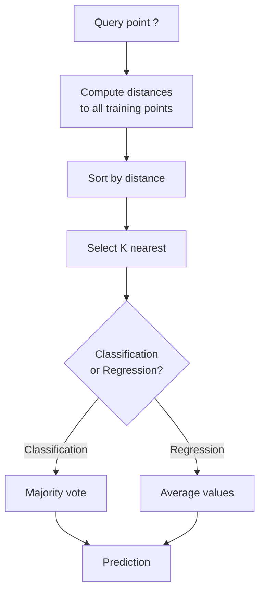
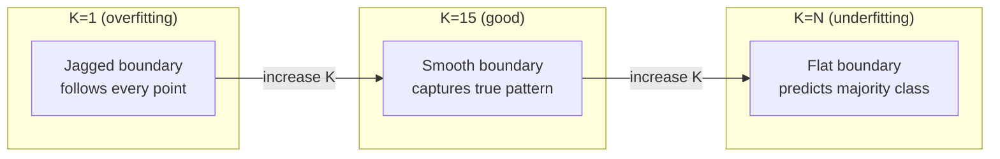
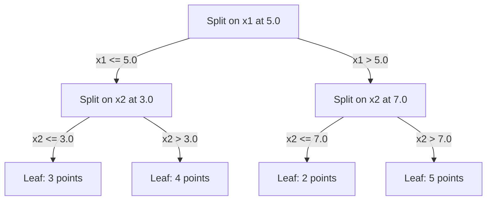

# K-Nearest Neighbors and Distances

> Store everything. Predict by looking at your neighbors. The simplest algorithm that actually works.

**Type:** Build
**Language:** Python
**Prerequisites:** Phase 1 (Lesson 14 Norms and Distances)
**Time:** ~90 minutes

## Learning Objectives

- Implement KNN classification and regression from scratch with configurable K and distance-weighted voting
- Compare L1, L2, cosine, and Minkowski distance metrics and select the appropriate one for a given data type
- Explain the curse of dimensionality and demonstrate why KNN degrades in high-dimensional spaces
- Build a KD-tree for efficient nearest neighbor search and analyze when it outperforms brute-force

## The Problem

You have a dataset. A new data point arrives. You need to classify it or predict its value. Instead of learning parameters from the data (like linear regression or SVMs), you just find the K training points closest to the new point and let them vote.

This is K-nearest neighbors. There is no training phase. No parameters to learn. No loss function to minimize. You store the entire training set and compute distances at prediction time.

It sounds too simple to work. But KNN is surprisingly competitive for many problems, especially with small to medium datasets, and understanding it deeply reveals fundamental concepts: the choice of distance metric (connecting to Phase 1 Lesson 14), the curse of dimensionality, and the difference between lazy and eager learning.

KNN also shows up everywhere in modern AI, just under different names. Vector databases do KNN search over embeddings. Retrieval-augmented generation (RAG) finds the K nearest document chunks. Recommendation systems find similar users or items. The algorithm is the same. The scale and the data structures are different.

## The Concept

### How KNN works

Given a dataset of labeled points and a new query point:

1. Compute the distance from the query to every point in the dataset
2. Sort by distance
3. Take the K closest points
4. For classification: majority vote among the K neighbors
5. For regression: average (or weighted average) of the K neighbors' values



That is the entire algorithm. No fitting. No gradient descent. No epochs.

### Choosing K

K is the single hyperparameter. It controls the bias-variance trade-off:

| K | Behavior |
|---|----------|
| K = 1 | Decision boundary follows every point. Zero training error. High variance. Overfits |
| Small K (3-5) | Sensitive to local structure. Can capture complex boundaries |
| Large K | Smoother boundaries. More robust to noise. May underfit |
| K = N | Predicts the majority class for every point. Maximum bias |

A common starting point is K = sqrt(N) for a dataset of N points. Use odd K for binary classification to avoid ties.



### Distance metrics

The distance function defines what "near" means. Different metrics produce different neighbors, different predictions.

**L2 (Euclidean)** is the default. Straight-line distance.

```
d(a, b) = sqrt(sum((a_i - b_i)^2))
```

Sensitive to feature scale. Always standardize features before using L2 with KNN.

**L1 (Manhattan)** sums absolute differences. More robust to outliers than L2 because it does not square the differences.

```
d(a, b) = sum(|a_i - b_i|)
```

**Cosine distance** measures the angle between vectors, ignoring magnitude. Essential for text and embedding data.

```
d(a, b) = 1 - (a . b) / (||a|| * ||b||)
```

**Minkowski** generalizes L1 and L2 with parameter p.

```
d(a, b) = (sum(|a_i - b_i|^p))^(1/p)

p=1: Manhattan
p=2: Euclidean
p->inf: Chebyshev (max absolute difference)
```

Which metric to use depends on the data:

| Data type | Best metric | Why |
|-----------|------------|-----|
| Numeric features, similar scale | L2 (Euclidean) | Default, works for spatial data |
| Numeric features, outliers | L1 (Manhattan) | Robust, does not amplify large differences |
| Text embeddings | Cosine | Magnitude is noise, direction is meaning |
| High-dimensional sparse | Cosine or L1 | L2 suffers from curse of dimensionality |
| Mixed types | Custom distance | Combine metrics per feature type |

### Weighted KNN

Standard KNN gives equal weight to all K neighbors. But a neighbor at distance 0.1 should matter more than one at distance 5.0.

**Distance-weighted KNN** weights each neighbor inversely by distance:

```
weight_i = 1 / (distance_i + epsilon)

For classification: weighted vote
For regression:     weighted average = sum(w_i * y_i) / sum(w_i)
```

The epsilon prevents division by zero when a query point exactly matches a training point.

Weighted KNN is less sensitive to the choice of K because distant neighbors contribute very little regardless.

### The curse of dimensionality

KNN performance degrades in high dimensions. This is not a vague concern. It is a mathematical fact.

**Problem 1: distances converge.** As dimensionality increases, the ratio of the maximum distance to the minimum distance approaches 1. All points become equally "far" from the query.

```
In d dimensions, for random uniform points:

d=2:    max_dist / min_dist = varies widely
d=100:  max_dist / min_dist ~ 1.01
d=1000: max_dist / min_dist ~ 1.001

When all distances are nearly equal, "nearest" is meaningless.
```

**Problem 2: volume explodes.** To capture K neighbors within a fixed fraction of the data, you need to extend your search radius to cover a much larger fraction of the feature space. The "neighborhood" in high dimensions encompasses most of the space.

**Problem 3: corners dominate.** In a unit hypercube in d dimensions, most of the volume is concentrated near the corners, not the center. A sphere inscribed in the cube contains a vanishing fraction of the volume as d grows.

Practical consequence: KNN works well up to about 20-50 features. Beyond that, you need dimensionality reduction (PCA, UMAP, t-SNE) before applying KNN, or you need to use tree-based search structures that exploit the data's intrinsic lower dimensionality.

### KD-trees: fast nearest neighbor search

Brute-force KNN computes the distance from the query to every training point. That is O(n * d) per query. For large datasets, this is too slow.

A KD-tree recursively partitions the space along feature axes. At each level, it splits along one dimension at the median value.



To find the nearest neighbor, traverse the tree to the leaf containing the query, then backtrack and check neighboring partitions only if they could contain closer points.

Average query time: O(log n) for low dimensions. But KD-trees degrade to O(n) in high dimensions (d > 20) because the backtracking eliminates fewer and fewer branches.

### Ball trees: better for moderate dimensions

Ball trees partition data into nested hyperspheres instead of axis-aligned boxes. Each node defines a ball (center + radius) that contains all points in that subtree.

Advantages over KD-trees:
- Work better in moderate dimensions (up to ~50)
- Handle non-axis-aligned structure
- Tighter bounding volumes mean more branches are pruned during search

Both KD-trees and ball trees are exact algorithms. For truly large-scale search (millions of points, hundreds of dimensions), approximate nearest neighbor methods (HNSW, IVF, product quantization) are used instead. These are covered in Phase 1 Lesson 14.

### Lazy learning vs eager learning

KNN is a lazy learner: it does no work at training time and all work at prediction time. Most other algorithms (linear regression, SVMs, neural networks) are eager learners: they do heavy computation at training time to build a compact model, then predictions are fast.

| Aspect | Lazy (KNN) | Eager (SVM, neural net) |
|--------|------------|------------------------|
| Training time | O(1) just store data | O(n * epochs) |
| Prediction time | O(n * d) per query | O(d) or O(parameters) |
| Memory at prediction | Store entire training set | Store model parameters only |
| Adapts to new data | Add points instantly | Retrain the model |
| Decision boundary | Implicit, computed on the fly | Explicit, fixed after training |

Lazy learning is ideal when:
- The dataset changes frequently (add/remove points without retraining)
- You need predictions for very few queries
- You want zero training time
- The dataset is small enough that brute-force search is fast

### KNN for regression

Instead of majority voting, KNN for regression averages the target values of the K neighbors.

```
prediction = (1/K) * sum(y_i for i in K nearest neighbors)

Or with distance weighting:
prediction = sum(w_i * y_i) / sum(w_i)
where w_i = 1 / distance_i
```

KNN regression produces piecewise-constant (or piecewise-smooth with weighting) predictions. It cannot extrapolate beyond the range of the training data. If the training targets are all between 0 and 100, KNN will never predict 200.

## Build It

### Step 1: Distance functions

Implement L1, L2, cosine, and Minkowski distances. These connect directly to Phase 1 Lesson 14.

```python
import math

def l2_distance(a, b):
    return math.sqrt(sum((ai - bi) ** 2 for ai, bi in zip(a, b)))

def l1_distance(a, b):
    return sum(abs(ai - bi) for ai, bi in zip(a, b))

def cosine_distance(a, b):
    dot_val = sum(ai * bi for ai, bi in zip(a, b))
    norm_a = math.sqrt(sum(ai ** 2 for ai in a))
    norm_b = math.sqrt(sum(bi ** 2 for bi in b))
    if norm_a == 0 or norm_b == 0:
        return 1.0
    return 1.0 - dot_val / (norm_a * norm_b)

def minkowski_distance(a, b, p=2):
    if p == float('inf'):
        return max(abs(ai - bi) for ai, bi in zip(a, b))
    return sum(abs(ai - bi) ** p for ai, bi in zip(a, b)) ** (1 / p)
```

### Step 2: KNN classifier and regressor

Build the full KNN with configurable K, distance metric, and optional distance weighting.

```python
class KNN:
    def __init__(self, k=5, distance_fn=l2_distance, weighted=False,
                 task="classification"):
        self.k = k
        self.distance_fn = distance_fn
        self.weighted = weighted
        self.task = task
        self.X_train = None
        self.y_train = None

    def fit(self, X, y):
        self.X_train = X
        self.y_train = y

    def predict(self, X):
        return [self._predict_one(x) for x in X]
```

### Step 3: KD-tree for efficient search

Build a KD-tree from scratch that recursively splits on the median of each dimension.

```python
class KDTree:
    def __init__(self, X, indices=None, depth=0):
        # Recursively partition the data
        self.axis = depth % len(X[0])
        # Split on median of the current axis
        ...

    def query(self, point, k=1):
        # Traverse to leaf, then backtrack
        ...
```

See `code/knn.py` for the complete implementation with all helper methods and demos.

### Step 4: Feature scaling

KNN requires feature scaling because distances are sensitive to feature magnitudes. A feature ranging from 0 to 1000 will dominate a feature ranging from 0 to 1.

```python
def standardize(X):
    n = len(X)
    d = len(X[0])
    means = [sum(X[i][j] for i in range(n)) / n for j in range(d)]
    stds = [
        max(1e-10, (sum((X[i][j] - means[j]) ** 2 for i in range(n)) / n) ** 0.5)
        for j in range(d)
    ]
    return [[((X[i][j] - means[j]) / stds[j]) for j in range(d)] for i in range(n)], means, stds
```

## Use It

With scikit-learn:

```python
from sklearn.neighbors import KNeighborsClassifier
from sklearn.preprocessing import StandardScaler
from sklearn.pipeline import Pipeline

clf = Pipeline([
    ("scaler", StandardScaler()),
    ("knn", KNeighborsClassifier(n_neighbors=5, metric="euclidean")),
])
clf.fit(X_train, y_train)
print(f"Accuracy: {clf.score(X_test, y_test):.4f}")
```

Scikit-learn automatically uses KD-trees or ball trees when the dataset is large enough and the dimensionality is low enough. For high-dimensional data, it falls back to brute force. You can control this with the `algorithm` parameter.

For large-scale nearest neighbor search (millions of vectors), use FAISS, Annoy, or a vector database:

```python
import faiss

index = faiss.IndexFlatL2(dimension)
index.add(embeddings)
distances, indices = index.search(query_vectors, k=5)
```

## Exercises

1. Implement KNN classification on a 2D dataset with 3 classes. Plot the decision boundary for K=1, K=5, K=15, and K=N. Observe the transition from overfitting to underfitting.

2. Generate 1000 random points in 2, 5, 10, 50, 100, and 500 dimensions. For each dimensionality, compute the ratio of the maximum pairwise distance to the minimum pairwise distance. Plot the ratio vs dimensionality to visualize the curse of dimensionality.

3. Compare L1, L2, and cosine distance for KNN on a text classification problem (use TF-IDF vectors). Which metric gives the best accuracy? Why does cosine tend to win for text?

4. Implement a KD-tree and measure query time vs brute force for datasets of 1k, 10k, and 100k points in 2D, 10D, and 50D. At what dimensionality does the KD-tree stop being faster than brute force?

5. Build a weighted KNN regressor for y = sin(x) + noise. Compare it with unweighted KNN for K=3, 10, 30. Show that weighting produces smoother predictions, especially for large K.

## Key Terms

| Term | What it actually means |
|------|----------------------|
| K-nearest neighbors | Non-parametric algorithm that predicts by finding the K closest training points to a query |
| Lazy learning | No computation at training time. All work happens at prediction time. KNN is the canonical example |
| Eager learning | Heavy computation at training time to build a compact model. Most ML algorithms are eager |
| Curse of dimensionality | In high dimensions, distances converge and neighborhoods expand to cover most of the space, making KNN ineffective |
| KD-tree | Binary tree that recursively partitions space along feature axes. O(log n) queries in low dimensions |
| Ball tree | Tree of nested hyperspheres. Works better than KD-trees in moderate dimensions (up to ~50) |
| Weighted KNN | Neighbors weighted inversely by distance. Closer neighbors have more influence on the prediction |
| Feature scaling | Normalizing features to comparable ranges. Required for distance-based methods like KNN |
| Majority vote | Classification by counting which class is most common among K neighbors |
| Brute force search | Computing distance to every training point. O(n*d) per query. Exact but slow for large n |
| Approximate nearest neighbor | Algorithms (HNSW, LSH, IVF) that find approximately nearest points much faster than exact search |
| Voronoi diagram | The partition of space where each region contains all points closer to one training point than any other. K=1 KNN produces Voronoi boundaries |

## Further Reading

- [Cover & Hart: Nearest Neighbor Pattern Classification (1967)](https://ieeexplore.ieee.org/document/1053964) - the foundational KNN paper proving it has error rate at most twice the Bayes optimal
- [Friedman, Bentley, Finkel: An Algorithm for Finding Best Matches in Logarithmic Expected Time (1977)](https://dl.acm.org/doi/10.1145/355744.355745) - the original KD-tree paper
- [Beyer et al.: When Is "Nearest Neighbor" Meaningful? (1999)](https://link.springer.com/chapter/10.1007/3-540-49257-7_15) - formal analysis of the curse of dimensionality for nearest neighbor
- [scikit-learn Nearest Neighbors documentation](https://scikit-learn.org/stable/modules/neighbors.html) - practical guide with algorithm selection
- [FAISS: A Library for Efficient Similarity Search](https://github.com/facebookresearch/faiss) - Meta's library for billion-scale approximate nearest neighbor search
