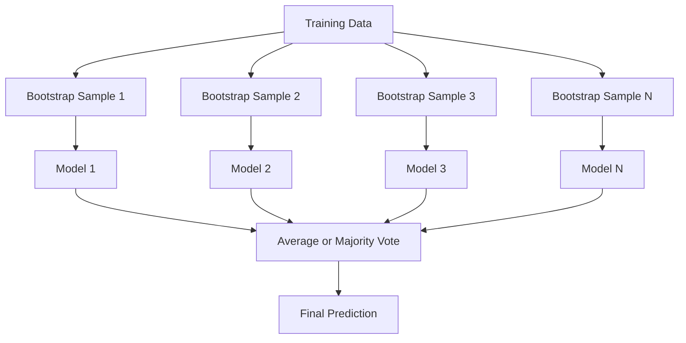
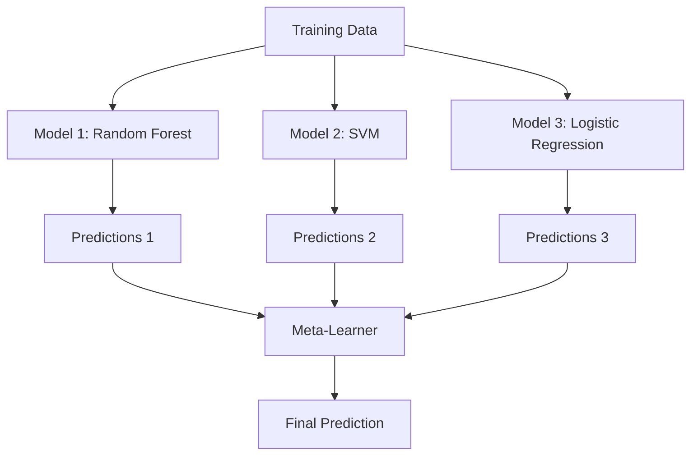

# Ensemble Methods

> A group of weak learners, combined correctly, becomes a strong learner. This is not a metaphor. It is a theorem.

**Type:** Build
**Language:** Python
**Prerequisites:** Phase 2, Lesson 10 (Bias-Variance Tradeoff)
**Time:** ~120 minutes

## Learning Objectives

- Implement AdaBoost and gradient boosting from scratch and explain how boosting sequentially reduces bias
- Build a bagging ensemble and demonstrate how averaging decorrelated models reduces variance without increasing bias
- Compare bagging, boosting, and stacking in terms of what error component each method targets
- Evaluate ensemble diversity and explain why majority voting accuracy improves with more independent weak learners

## The Problem

A single decision tree is fast to train and easy to interpret, but it overfits. A single linear model underfits on complex boundaries. You could spend days engineering the perfect model architecture. Or you could combine a bunch of imperfect models and get something better than any of them individually.

Ensemble methods do exactly this. They are the most reliable technique for winning Kaggle competitions on tabular data, they power most production ML systems, and they illustrate the bias-variance tradeoff in action. Bagging reduces variance. Boosting reduces bias. Stacking learns which models to trust on which inputs.

## The Concept

### Why Ensembles Work

Suppose you have N independent classifiers, each with accuracy p > 0.5. The majority vote has accuracy:

```
P(majority correct) = sum over k > N/2 of C(N,k) * p^k * (1-p)^(N-k)
```

For 21 classifiers each with 60% accuracy, majority vote accuracy is about 74%. With 101 classifiers, it rises to 84%. The errors cancel out when the models make different mistakes.

The key requirement is **diversity**. If all models make the same errors, combining them helps nothing. Ensembles work because they produce diverse models through:

- Different training subsets (bagging)
- Different feature subsets (random forests)
- Sequential error correction (boosting)
- Different model families (stacking)

### Bagging (Bootstrap Aggregating)

Bagging creates diversity by training each model on a different bootstrap sample of the training data.



A bootstrap sample is drawn with replacement from the original data, same size as the original. About 63.2% of unique samples appear in each bootstrap. The remaining 36.8% (out-of-bag samples) provide a free validation set.

Bagging reduces variance without increasing bias much. Each individual tree overfits to its bootstrap sample, but the overfitting is different for each tree, so averaging cancels out the noise.

**Random Forests** are bagging with an extra twist: at each split, only a random subset of features is considered. This forces even more diversity among trees. The typical number of candidate features is `sqrt(n_features)` for classification and `n_features / 3` for regression.

### Boosting (Sequential Error Correction)

Boosting trains models sequentially. Each new model focuses on the examples that previous models got wrong.


Boosting reduces bias. Each new model corrects the systematic errors of the ensemble so far. The final prediction is a weighted sum of all models, where better models get higher weights.

The tradeoff: boosting can overfit if you run too many rounds, because it keeps fitting harder examples, some of which may be noise.

### AdaBoost

AdaBoost (Adaptive Boosting) was the first practical boosting algorithm. It works with any base learner, typically decision stumps (depth-1 trees).

The algorithm:

```
1. Initialize sample weights: w_i = 1/N for all i

2. For t = 1 to T:
   a. Train weak learner h_t on weighted data
   b. Compute weighted error:
      err_t = sum(w_i * I(h_t(x_i) != y_i)) / sum(w_i)
   c. Compute model weight:
      alpha_t = 0.5 * ln((1 - err_t) / err_t)
   d. Update sample weights:
      w_i = w_i * exp(-alpha_t * y_i * h_t(x_i))
   e. Normalize weights to sum to 1

3. Final prediction: H(x) = sign(sum(alpha_t * h_t(x)))
```

Models with lower error get higher alpha. Misclassified samples get higher weights so the next model focuses on them.

### Gradient Boosting

Gradient boosting generalizes boosting to arbitrary loss functions. Instead of reweighting samples, it fits each new model to the residuals (negative gradient of the loss) of the current ensemble.

```
1. Initialize: F_0(x) = argmin_c sum(L(y_i, c))

2. For t = 1 to T:
   a. Compute pseudo-residuals:
      r_i = -dL(y_i, F_{t-1}(x_i)) / dF_{t-1}(x_i)
   b. Fit a tree h_t to the residuals r_i
   c. Find optimal step size:
      gamma_t = argmin_gamma sum(L(y_i, F_{t-1}(x_i) + gamma * h_t(x_i)))
   d. Update:
      F_t(x) = F_{t-1}(x) + learning_rate * gamma_t * h_t(x)

3. Final prediction: F_T(x)
```

For squared error loss, the pseudo-residuals are just the actual residuals: `r_i = y_i - F_{t-1}(x_i)`. Each tree literally fits the errors of the previous ensemble.

The learning rate (shrinkage) controls how much each tree contributes. Smaller learning rates require more trees but generalize better. Typical values: 0.01 to 0.3.

### XGBoost: Why It Dominates Tabular Data

XGBoost (eXtreme Gradient Boosting) is gradient boosting with engineering optimizations that make it fast, accurate, and resistant to overfitting:

- **Regularized objective:** L1 and L2 penalties on leaf weights prevent individual trees from being too confident
- **Second-order approximation:** Uses both first and second derivatives of the loss, giving better split decisions
- **Sparsity-aware splits:** Handles missing values natively by learning the best direction for missing data at each split
- **Column subsampling:** Like random forests, samples features at each split for diversity
- **Weighted quantile sketch:** Efficiently finds split points for continuous features on distributed data
- **Cache-aware block structure:** Memory layout optimized for CPU cache lines

For tabular data, XGBoost (and its successor LightGBM) consistently outperforms neural networks. This is not changing anytime soon. If your data fits in a table with rows and columns, start with gradient boosting.

### Stacking (Meta-Learning)

Stacking uses the predictions of multiple base models as features for a meta-learner.



The meta-learner learns which base model to trust for which inputs. If the random forest is better at certain regions and the SVM at others, the meta-learner will learn to route accordingly.

To avoid data leakage, base model predictions must be generated via cross-validation on the training set. You never train base models and generate meta-features on the same data.

### Voting

The simplest ensemble. Just combine predictions directly.

- **Hard voting:** Majority vote on class labels.
- **Soft voting:** Average predicted probabilities, pick the class with highest average probability. Usually better because it uses confidence information.

## Build It

### Step 1: Decision Stump (Base Learner)

The code in `code/ensembles.py` implements everything from scratch. We start with a decision stump: a tree with a single split.

```python
class DecisionStump:
    def __init__(self):
        self.feature_idx = None
        self.threshold = None
        self.polarity = 1
        self.alpha = None

    def fit(self, X, y, weights):
        n_samples, n_features = X.shape
        best_error = float("inf")

        for f in range(n_features):
            thresholds = np.unique(X[:, f])
            for thresh in thresholds:
                for polarity in [1, -1]:
                    pred = np.ones(n_samples)
                    pred[polarity * X[:, f] < polarity * thresh] = -1
                    error = np.sum(weights[pred != y])
                    if error < best_error:
                        best_error = error
                        self.feature_idx = f
                        self.threshold = thresh
                        self.polarity = polarity

    def predict(self, X):
        n = X.shape[0]
        pred = np.ones(n)
        idx = self.polarity * X[:, self.feature_idx] < self.polarity * self.threshold
        pred[idx] = -1
        return pred
```

### Step 2: AdaBoost from Scratch

```python
class AdaBoostScratch:
    def __init__(self, n_estimators=50):
        self.n_estimators = n_estimators
        self.stumps = []
        self.alphas = []

    def fit(self, X, y):
        n = X.shape[0]
        weights = np.full(n, 1 / n)

        for _ in range(self.n_estimators):
            stump = DecisionStump()
            stump.fit(X, y, weights)
            pred = stump.predict(X)

            err = np.sum(weights[pred != y])
            err = np.clip(err, 1e-10, 1 - 1e-10)

            alpha = 0.5 * np.log((1 - err) / err)
            weights *= np.exp(-alpha * y * pred)
            weights /= weights.sum()

            stump.alpha = alpha
            self.stumps.append(stump)
            self.alphas.append(alpha)

    def predict(self, X):
        total = sum(a * s.predict(X) for a, s in zip(self.alphas, self.stumps))
        return np.sign(total)
```

### Step 3: Gradient Boosting from Scratch

```python
class GradientBoostingScratch:
    def __init__(self, n_estimators=100, learning_rate=0.1, max_depth=3):
        self.n_estimators = n_estimators
        self.lr = learning_rate
        self.max_depth = max_depth
        self.trees = []
        self.initial_pred = None

    def fit(self, X, y):
        self.initial_pred = np.mean(y)
        current_pred = np.full(len(y), self.initial_pred)

        for _ in range(self.n_estimators):
            residuals = y - current_pred
            tree = SimpleRegressionTree(max_depth=self.max_depth)
            tree.fit(X, residuals)
            update = tree.predict(X)
            current_pred += self.lr * update
            self.trees.append(tree)

    def predict(self, X):
        pred = np.full(X.shape[0], self.initial_pred)
        for tree in self.trees:
            pred += self.lr * tree.predict(X)
        return pred
```

### Step 4: Compare against sklearn

The code verifies that our from-scratch implementations produce similar accuracy to sklearn's `AdaBoostClassifier` and `GradientBoostingClassifier`, and compares all methods side by side.

## Use It

### When to Use Each Method

| Method | Reduces | Best for | Watch out for |
|--------|---------|----------|---------------|
| Bagging / Random Forest | Variance | Noisy data, many features | Does not help with bias |
| AdaBoost | Bias | Clean data, simple base learners | Sensitive to outliers and noise |
| Gradient Boosting | Bias | Tabular data, competitions | Slow to train, easy to overfit without tuning |
| XGBoost / LightGBM | Both | Production tabular ML | Many hyperparameters |
| Stacking | Both | Getting last 1-2% accuracy | Complex, risk of overfitting meta-learner |
| Voting | Variance | Quick combination of diverse models | Only helps if models are diverse |

### The Production Stack for Tabular Data

For most tabular prediction problems, this is the order to try:

1. **LightGBM or XGBoost** with default parameters
2. Tune n_estimators, learning_rate, max_depth, min_child_weight
3. If you need the last 0.5%, build a stacking ensemble with 3-5 diverse models
4. Use cross-validation throughout

Neural networks on tabular data are almost always worse than gradient boosting, despite continued research attempts. TabNet, NODE, and similar architectures occasionally match but rarely beat a well-tuned XGBoost.

## Ship It

This lesson produces `outputs/prompt-ensemble-selector.md` -- a prompt that helps you pick the right ensemble method for a given dataset. Describe your data (size, feature types, noise level, class balance) and the problem you are solving. The prompt walks through a decision checklist, recommends a method, suggests starting hyperparameters, and warns about common mistakes for that method. Also produces `outputs/skill-ensemble-builder.md` with the full selection guide.

## Exercises

1. Modify the AdaBoost implementation to track training accuracy after each round. Plot accuracy vs. number of estimators. When does it converge?

2. Implement a random forest from scratch by adding random feature subsampling to the regression tree. Train 100 trees with `max_features=sqrt(n_features)` and average predictions. Compare variance reduction to a single tree.

3. In the gradient boosting implementation, add early stopping: track validation loss after each round and stop when it has not improved for 10 consecutive rounds. How many trees does it actually need?

4. Build a stacking ensemble with three base models (logistic regression, decision tree, k-nearest neighbors) and a logistic regression meta-learner. Use 5-fold cross-validation to generate meta-features. Compare to each base model alone.

5. Run XGBoost on the same dataset with default parameters. Compare its accuracy to your from-scratch gradient boosting. Time both. How large is the speed difference?

## Key Terms

| Term | What people say | What it actually means |
|------|----------------|----------------------|
| Bagging | "Train on random subsets" | Bootstrap aggregating: train models on bootstrap samples, average predictions to reduce variance |
| Boosting | "Focus on hard examples" | Train models sequentially, each correcting errors of the ensemble so far, to reduce bias |
| AdaBoost | "Reweight the data" | Boosting via sample weight updates; misclassified points get higher weight for the next learner |
| Gradient boosting | "Fit the residuals" | Boosting via fitting each new model to the negative gradient of the loss function |
| XGBoost | "The Kaggle weapon" | Gradient boosting with regularization, second-order optimization, and systems-level speed tricks |
| Stacking | "Models on top of models" | Use predictions of base models as input features for a meta-learner |
| Random forest | "Many randomized trees" | Bagging with decision trees, adding random feature subsampling at each split for diversity |
| Ensemble diversity | "Make different mistakes" | Models must be uncorrelated in their errors for the ensemble to improve over individuals |
| Out-of-bag error | "Free validation" | Samples not in a bootstrap draw (~36.8%) serve as a validation set without needing a holdout |

## Further Reading

- [Schapire & Freund: Boosting: Foundations and Algorithms](https://mitpress.mit.edu/9780262526036/) -- the book by AdaBoost's creators
- [Friedman: Greedy Function Approximation: A Gradient Boosting Machine (2001)](https://statweb.stanford.edu/~jhf/ftp/trebst.pdf) -- the original gradient boosting paper
- [Chen & Guestrin: XGBoost (2016)](https://arxiv.org/abs/1603.02754) -- the XGBoost paper
- [Wolpert: Stacked Generalization (1992)](https://www.sciencedirect.com/science/article/abs/pii/S0893608005800231) -- the original stacking paper
- [scikit-learn Ensemble Methods](https://scikit-learn.org/stable/modules/ensemble.html) -- practical reference
