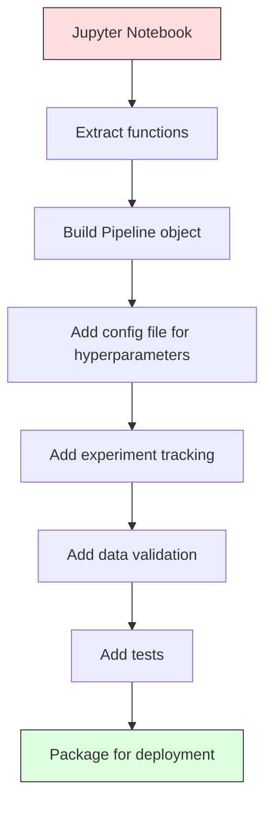

# ML Pipelines

> A model is not a product. A pipeline is. The pipeline is everything from raw data to deployed prediction, and every step must be reproducible.

**Type:** Build
**Language:** Python
**Prerequisites:** Phase 2, Lesson 12 (Hyperparameter Tuning)
**Time:** ~120 minutes

## Learning Objectives

- Build an ML pipeline from scratch that chains imputation, scaling, encoding, and model training into a single reproducible object
- Identify data leakage scenarios and explain how pipelines prevent them by fitting transformers only on training data
- Construct a ColumnTransformer that applies different preprocessing to numeric and categorical features
- Implement pipeline serialization and demonstrate that the same fitted pipeline produces identical results in training and production

## The Problem

You have a notebook that loads data, fills missing values with the median, scales features, trains a model, and prints accuracy. It works. You ship it.

A month later, someone retrains the model and gets different results. The median was computed on the full dataset including test data (data leakage). The scaling parameters were not saved, so inference uses different statistics. The feature engineering code was copy-pasted between training and serving, and the copies diverged. A categorical column gained a new value in production that the encoder has never seen.

These are not hypothetical. They are the most common reasons ML systems fail in production. Pipelines solve all of them by packaging every transformation step into a single, ordered, reproducible object.

## The Concept

### What a Pipeline Is

A pipeline is an ordered sequence of data transformations followed by a model. Each step takes the output of the previous step as input. The entire pipeline is fitted once on training data. At inference time, the same fitted pipeline transforms new data and produces predictions.


The pipeline guarantees:
- Transformations are fitted only on training data (no leakage)
- The same transformations are applied at inference time
- The entire object can be serialized and deployed as one artifact
- Cross-validation applies the pipeline per fold, preventing subtle leakage

### Data Leakage: The Silent Killer

Data leakage happens when information from the test set or future data contaminates training. Pipelines prevent the most common forms.

**Leaky (wrong):**
```python
X = df.drop("target", axis=1)
y = df["target"]

scaler = StandardScaler()
X_scaled = scaler.fit_transform(X)

X_train, X_test = X_scaled[:800], X_scaled[800:]
y_train, y_test = y[:800], y[800:]
```

The scaler saw test data. The mean and standard deviation include test samples. This inflates accuracy estimates.

**Correct:**
```python
X_train, X_test = X[:800], X[800:]

scaler = StandardScaler()
X_train_scaled = scaler.fit_transform(X_train)
X_test_scaled = scaler.transform(X_test)
```

With a pipeline, you do not need to think about this. The pipeline handles it automatically.

### sklearn Pipeline

sklearn's `Pipeline` chains transformers and an estimator. It exposes `.fit()`, `.predict()`, and `.score()` that apply all steps in order.

```python
from sklearn.pipeline import Pipeline
from sklearn.preprocessing import StandardScaler
from sklearn.linear_model import LogisticRegression

pipe = Pipeline([
    ("scaler", StandardScaler()),
    ("model", LogisticRegression()),
])

pipe.fit(X_train, y_train)
predictions = pipe.predict(X_test)
```

When you call `pipe.fit(X_train, y_train)`:
1. Scaler calls `fit_transform` on X_train
2. Model calls `fit` on the scaled X_train

When you call `pipe.predict(X_test)`:
1. Scaler calls `transform` (not fit_transform) on X_test
2. Model calls `predict` on the scaled X_test

The scaler never sees test data during fitting. This is the whole point.

### ColumnTransformer: Different Pipelines for Different Columns

Real datasets have numeric and categorical columns that need different preprocessing. `ColumnTransformer` handles this.

```python
from sklearn.compose import ColumnTransformer
from sklearn.preprocessing import StandardScaler, OneHotEncoder
from sklearn.impute import SimpleImputer

numeric_pipe = Pipeline([
    ("impute", SimpleImputer(strategy="median")),
    ("scale", StandardScaler()),
])

categorical_pipe = Pipeline([
    ("impute", SimpleImputer(strategy="most_frequent")),
    ("encode", OneHotEncoder(handle_unknown="ignore")),
])

preprocessor = ColumnTransformer([
    ("num", numeric_pipe, ["age", "income", "score"]),
    ("cat", categorical_pipe, ["city", "gender", "plan"]),
])

full_pipeline = Pipeline([
    ("preprocess", preprocessor),
    ("model", GradientBoostingClassifier()),
])
```

The `handle_unknown="ignore"` in OneHotEncoder is critical for production. When a new category appears (a city the model has never seen), it produces a zero vector instead of crashing.

### Experiment Tracking

A pipeline makes training reproducible, but you also need to track what happened across experiments: which hyperparameters were used, which dataset version, what the metrics were, which code was running.

**MLflow** is the most common open-source solution:

```python
import mlflow

with mlflow.start_run():
    mlflow.log_param("max_depth", 5)
    mlflow.log_param("n_estimators", 100)
    mlflow.log_param("learning_rate", 0.1)

    pipe.fit(X_train, y_train)
    accuracy = pipe.score(X_test, y_test)

    mlflow.log_metric("accuracy", accuracy)
    mlflow.sklearn.log_model(pipe, "model")
```

Every run is recorded with parameters, metrics, artifacts, and the full model. You can compare runs, reproduce any experiment, and deploy any model version.

**Weights & Biases (wandb)** provides the same functionality with a hosted dashboard:

```python
import wandb

wandb.init(project="my-pipeline")
wandb.config.update({"max_depth": 5, "n_estimators": 100})

pipe.fit(X_train, y_train)
accuracy = pipe.score(X_test, y_test)

wandb.log({"accuracy": accuracy})
```

### Model Versioning

After experiment tracking, you need to manage model versions. Which model is in production? Which is staging? Which was last week's?

MLflow's Model Registry provides:
- **Version tracking:** Every saved model gets a version number
- **Stage transitions:** "Staging", "Production", "Archived"
- **Approval workflow:** Models must be explicitly promoted to production
- **Rollback:** Switch back to a previous version instantly

### Data Versioning with DVC

Code is versioned with git. Data should be versioned too, but git cannot handle large files. DVC (Data Version Control) solves this.

```
dvc init
dvc add data/training.csv
git add data/training.csv.dvc data/.gitignore
git commit -m "Track training data"
dvc push
```

DVC stores the actual data in remote storage (S3, GCS, Azure) and keeps a small `.dvc` file in git that records the hash. When you checkout a git commit, `dvc checkout` restores the exact data that was used.

This means every git commit pins both the code and the data. Full reproducibility.

### Reproducible Experiments

A reproducible experiment requires four things:

1. **Fixed random seeds:** Set seeds for numpy, random, and the framework (torch, sklearn)
2. **Pinned dependencies:** requirements.txt or poetry.lock with exact versions
3. **Versioned data:** DVC or similar
4. **Config files:** All hyperparameters in a config, not hardcoded

```python
import numpy as np
import random

def set_seed(seed=42):
    random.seed(seed)
    np.random.seed(seed)
    try:
        import torch
        torch.manual_seed(seed)
        torch.cuda.manual_seed_all(seed)
        torch.backends.cudnn.deterministic = True
    except ImportError:
        pass
```

### From Notebook to Production Pipeline



The typical progression:

1. **Notebook exploration:** Quick experiments, visualizations, feature ideas
2. **Extract functions:** Move preprocessing, feature engineering, evaluation into modules
3. **Build Pipeline:** Chain transformations into a sklearn Pipeline or custom class
4. **Config management:** Move all hyperparameters into a YAML/JSON config
5. **Experiment tracking:** Add MLflow or wandb logging
6. **Data validation:** Check schema, distributions, and missing value patterns before training
7. **Tests:** Unit tests for transformers, integration tests for the full pipeline
8. **Deployment:** Serialize the pipeline, wrap in an API (FastAPI, Flask), containerize

### Common Pipeline Mistakes

| Mistake | Why it is bad | Fix |
|---------|-------------|-----|
| Fitting on full data before splitting | Data leakage | Use Pipeline with cross_val_score |
| Feature engineering outside pipeline | Different transforms at train vs serve | Put all transforms in the Pipeline |
| Not handling unknown categories | Production crash on new values | OneHotEncoder(handle_unknown="ignore") |
| Hardcoded column names | Breaks when schema changes | Use column name lists from config |
| No data validation | Silently wrong predictions on bad data | Add schema checks before prediction |
| Training/serving skew | Model sees different features in prod | One Pipeline object for both |

## Build It

The code in `code/pipeline.py` builds a complete ML pipeline from scratch:

### Step 1: Custom Transformer

```python
class CustomTransformer:
    def __init__(self):
        self.means = None
        self.stds = None

    def fit(self, X):
        self.means = np.mean(X, axis=0)
        self.stds = np.std(X, axis=0)
        self.stds[self.stds == 0] = 1.0
        return self

    def transform(self, X):
        return (X - self.means) / self.stds

    def fit_transform(self, X):
        return self.fit(X).transform(X)
```

### Step 2: Pipeline from Scratch

```python
class PipelineFromScratch:
    def __init__(self, steps):
        self.steps = steps

    def fit(self, X, y=None):
        X_current = X.copy()
        for name, step in self.steps[:-1]:
            X_current = step.fit_transform(X_current)
        name, model = self.steps[-1]
        model.fit(X_current, y)
        return self

    def predict(self, X):
        X_current = X.copy()
        for name, step in self.steps[:-1]:
            X_current = step.transform(X_current)
        name, model = self.steps[-1]
        return model.predict(X_current)
```

### Step 3: Cross-Validation with Pipeline

The code demonstrates how cross-validation with a pipeline prevents data leakage: the scaler is fit separately on each fold's training data.

### Step 4: Full Production Pipeline with sklearn

A complete pipeline with `ColumnTransformer`, multiple preprocessing paths, and a model, trained with proper cross-validation and experiment logging.

## Ship It

This lesson produces:
- `outputs/prompt-ml-pipeline.md` -- a skill for building and debugging ML pipelines
- `code/pipeline.py` -- a complete pipeline from scratch through sklearn

## Exercises

1. Build a pipeline that handles a dataset with 3 numeric columns and 2 categorical columns. Use `ColumnTransformer` to apply median imputation + scaling to numerics and most-frequent imputation + one-hot encoding to categoricals. Train with 5-fold cross-validation.

2. Deliberately introduce data leakage: fit the scaler on the full dataset before splitting. Compare the cross-validation score (leaky) to the pipeline cross-validation score (clean). How large is the difference?

3. Serialize your pipeline with `joblib.dump`. Load it in a separate script and run predictions. Verify the predictions are identical.

4. Add a custom transformer to the pipeline that creates polynomial features (degree 2) for the two most important numeric columns. Where should it go in the pipeline?

5. Set up MLflow tracking for the pipeline. Run 5 experiments with different hyperparameters. Use the MLflow UI (`mlflow ui`) to compare runs and pick the best model.

## Key Terms

| Term | What people say | What it actually means |
|------|----------------|----------------------|
| Pipeline | "Chain of transforms + model" | An ordered sequence of fitted transformers and a model, applied as one unit to prevent leakage |
| Data leakage | "Test info leaked into training" | Using information from outside the training set to build the model, inflating performance estimates |
| ColumnTransformer | "Different preprocessing per column" | Applies different pipelines to different subsets of columns, combining results |
| Experiment tracking | "Logging your runs" | Recording parameters, metrics, artifacts, and code versions for every training run |
| MLflow | "Track and deploy models" | Open-source platform for experiment tracking, model registry, and deployment |
| DVC | "Git for data" | Version control system for large data files, storing hashes in git and data in remote storage |
| Model registry | "Model version catalog" | A system that tracks model versions with stage labels (staging, production, archived) |
| Training/serving skew | "It worked in the notebook" | Differences between how data is processed during training versus inference, causing silent errors |
| Reproducibility | "Same code, same result" | The ability to get identical results from the same code, data, and configuration |

## Further Reading

- [scikit-learn Pipeline docs](https://scikit-learn.org/stable/modules/compose.html) -- the official pipeline reference
- [MLflow documentation](https://mlflow.org/docs/latest/index.html) -- experiment tracking and model registry
- [DVC documentation](https://dvc.org/doc) -- data versioning
- [Sculley et al., Hidden Technical Debt in Machine Learning Systems (2015)](https://papers.nips.cc/paper/2015/hash/86df7dcfd896fcaf2674f757a2463eba-Abstract.html) -- the seminal paper on ML systems complexity
- [Google ML Best Practices: Rules of ML](https://developers.google.com/machine-learning/guides/rules-of-ml) -- practical production ML advice
