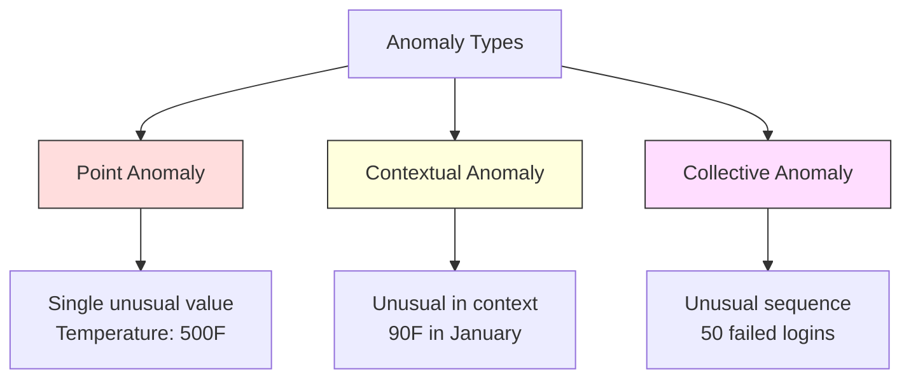
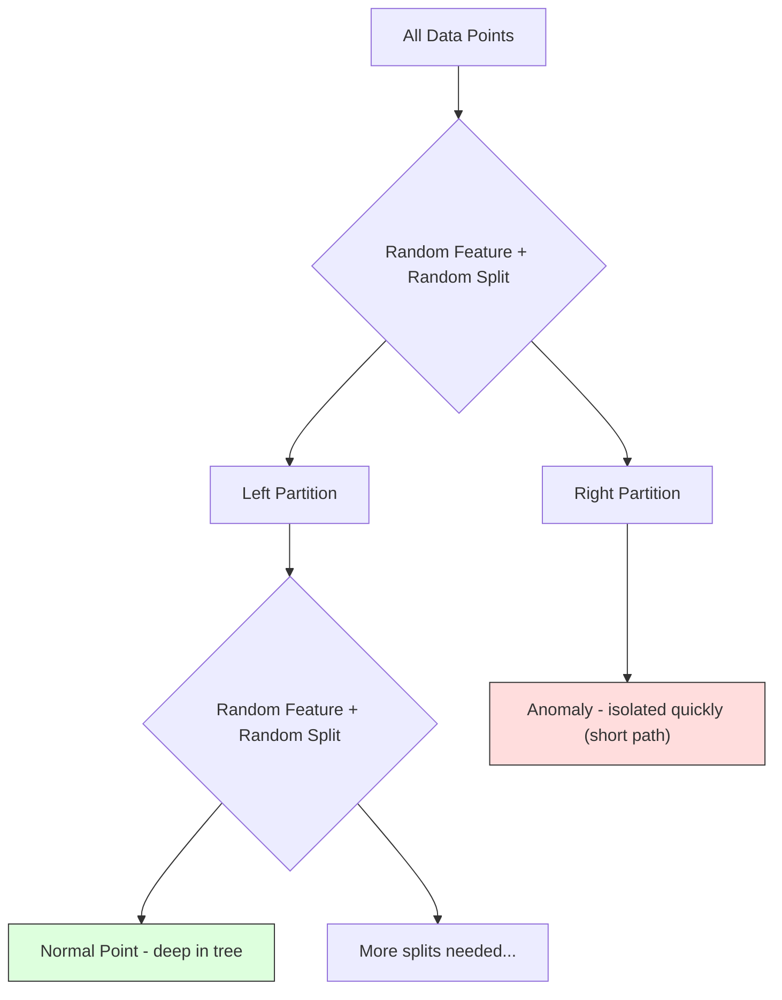
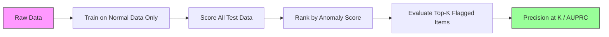

# Anomaly Detection

> Normal is easy to define. Abnormal is whatever doesn't fit.

**Type:** Build
**Language:** Python
**Prerequisites:** Phase 2, Lessons 01-09
**Time:** ~75 minutes

## Learning Objectives

- Implement Z-score, IQR, and Isolation Forest anomaly detection methods from scratch
- Distinguish between point, contextual, and collective anomalies and select the appropriate detection method for each
- Explain why anomaly detection is framed as modeling normal data rather than classifying anomalies
- Compare unsupervised anomaly detection with supervised classification and evaluate the tradeoff between novel anomaly coverage and precision

## The Problem

A credit card is used in New York at 2pm, then in Tokyo at 2:05pm. A factory sensor reads 150 degrees when the normal range is 80-120. A server sends 50,000 requests per second when the daily average is 200.

These are anomalies. Finding them matters. Fraud costs billions. Equipment failures cost downtime. Network intrusions cost data.

The challenge: you rarely have labeled examples of anomalies. Fraud makes up 0.1% of transactions. Equipment failures happen a few times per year. You cannot train a standard classifier because there is almost nothing in the "anomaly" class to learn from. Even if you have some labels, the anomalies you have seen are not the only types you will encounter. Tomorrow's fraud scheme looks different from today's.

Anomaly detection flips the problem. Instead of learning what is abnormal, learn what is normal. Anything that deviates from normal is suspicious. This works without labels, adapts to new types of anomalies, and scales to massive datasets.

## The Concept

### Types of Anomalies

Not all anomalies are the same:

- **Point anomalies.** A single data point that is unusual regardless of context. A temperature reading of 500 degrees. A transaction of $50,000 from an account that normally spends $50.
- **Contextual anomalies.** A data point that is unusual given its context. A temperature of 90 degrees is normal in summer, anomalous in winter. Same value, different context.
- **Collective anomalies.** A sequence of data points that is unusual as a group, even though each individual point might be normal. Five login failures is normal. Fifty in a row is a brute-force attack.

Most methods detect point anomalies. Contextual anomalies need time or location features. Collective anomalies need sequence-aware methods.



### The Unsupervised Framing

In standard classification, you have labels for both classes. In anomaly detection, you typically have one of three situations:

1. **Fully unsupervised.** No labels at all. You fit the detector on all data and hope anomalies are rare enough not to corrupt the "normal" model.
2. **Semi-supervised.** You have a clean dataset of normal data only. You fit on this clean set and score everything else. This is the strongest setup when possible.
3. **Weakly supervised.** You have a few labeled anomalies. Use them for evaluation, not training. Train unsupervised, then measure precision/recall on the labeled subset.

The key insight: anomaly detection is fundamentally different from classification. You are modeling the distribution of normal data, not the decision boundary between two classes.

### Supervised vs Unsupervised: The Tradeoff

If you do have labeled anomalies, should you use them for training (supervised classification) or for evaluation only (unsupervised detection)?

**Supervised (treat as classification):**
- Catches the exact types of anomalies you have seen before
- Higher precision on known anomaly types
- Misses novel anomaly types entirely
- Requires retraining when new anomaly types emerge
- Needs enough anomaly examples (often too few)

**Unsupervised (model normal, flag deviations):**
- Catches any deviation from normal, including novel types
- Does not require labeled anomalies
- Higher false positive rate (not everything unusual is bad)
- More robust to distribution shift

In practice, the best systems combine both: unsupervised detection for broad coverage, supervised models for known high-priority anomaly types, and human review for ambiguous cases.

### Z-Score Method

The simplest approach. Compute the mean and standard deviation of each feature. Flag any point more than k standard deviations from the mean.

```text
z_score = (x - mean) / std
anomaly if |z_score| > threshold
```

The default threshold is 3.0 (99.7% of normal data falls within 3 standard deviations for a Gaussian distribution).

**Strengths:** Simple. Fast. Interpretable ("this value is 4.5 standard deviations from normal").

**Weaknesses:** Assumes data is normally distributed. Sensitive to outliers in the training data (the outliers shift the mean and inflate the std, making them harder to detect). Fails on multimodal distributions.

**When it works well:** Single-feature monitoring where data is roughly bell-shaped. Server response times, manufacturing tolerances, sensor readings with stable baselines.

**When it fails:** Multi-cluster data (two office locations with different baseline temperatures), skewed data (transaction amounts where $1000 is rare but not anomalous), data with outliers in the training set.

### IQR Method

More robust than Z-score. Uses the interquartile range instead of mean and standard deviation.

```
Q1 = 25th percentile
Q3 = 75th percentile
IQR = Q3 - Q1
lower_bound = Q1 - factor * IQR
upper_bound = Q3 + factor * IQR
anomaly if x < lower_bound or x > upper_bound
```

The default factor is 1.5.

**Strengths:** Robust to outliers (percentiles are not affected by extreme values). Works on skewed distributions. No normality assumption.

**Weaknesses:** Univariate only (applies per feature independently). Cannot detect anomalies that are unusual only when features are considered together (a point might be normal in each feature individually but anomalous in the joint space).

**Practical note:** The 1.5 factor in IQR corresponds to the whiskers in a box plot. Points outside the whiskers are potential outliers. Using 3.0 instead of 1.5 makes the detector more conservative (fewer flags, fewer false positives). The right factor depends on your tolerance for false alarms.

### Isolation Forest

The key insight: anomalies are few and different. In a random partitioning of the data, anomalies are easier to isolate -- they need fewer random splits to be separated from the rest.



**How it works:**
1. Build many random trees (an isolation forest)
2. At each node, pick a random feature and a random split value between the feature's min and max
3. Keep splitting until every point is isolated (in its own leaf)
4. Anomalies have shorter average path lengths across all trees

**Why it works:** Normal points live in dense regions. Many random splits are needed to isolate one from its neighbors. Anomalies live in sparse regions. One or two random splits are enough to isolate them.

The anomaly score is based on the average path length across all trees, normalized by the expected path length of a random binary search tree:

```
score(x) = 2^(-average_path_length(x) / c(n))
```

Where `c(n)` is the expected path length for n samples. Score near 1 means anomaly. Score near 0.5 means normal. Score near 0 means very normal (deep in dense clusters).

**Strengths:** No distribution assumptions. Works in high dimensions. Scales well (sublinear in sample size because each tree uses a subsample). Handles mixed feature types.

**Weaknesses:** Struggles with anomalies in dense regions (masking effect). Random splitting is less effective when many features are irrelevant.

**Key hyperparameters:**
- `n_estimators`: Number of trees. 100 is usually enough. More trees give more stable scores but slower computation.
- `max_samples`: Number of samples per tree. 256 is the default in the original paper. Smaller values make individual trees less accurate but increase diversity. The subsampling is what makes Isolation Forest fast -- each tree sees a small fraction of the data.
- `contamination`: Expected fraction of anomalies. Used only for setting the threshold. Does not affect the scores themselves.

### Local Outlier Factor (LOF)

LOF compares the local density around a point to the density around its neighbors. A point in a sparse region surrounded by dense regions is anomalous.

**How it works:**
1. For each point, find its k nearest neighbors
2. Compute the local reachability density (how dense is the neighborhood)
3. Compare each point's density to its neighbors' densities
4. If a point has much lower density than its neighbors, it is an outlier

**LOF score:**
- LOF close to 1.0 means similar density as neighbors (normal)
- LOF greater than 1.0 means lower density than neighbors (potentially anomalous)
- LOF much greater than 1.0 (e.g., 2.0+) means significantly lower density (likely anomaly)

The "local" part is critical. Consider a dataset with two clusters: a dense cluster of 1000 points and a sparse cluster of 50 points. A point on the edge of the sparse cluster is not globally unusual -- it has 50 neighbors. But it is locally unusual if its immediate neighbors are denser than it is. LOF captures this nuance that global methods miss.

**Strengths:** Detects local anomalies (points that are unusual in their neighborhood, even if they are not globally unusual). Works on clusters of different densities.

**Weaknesses:** Slow on large datasets (O(n^2) for naive implementation). Sensitive to the choice of k. Does not work well in very high dimensions (curse of dimensionality affects distance calculations).

### Comparison

| Method | Assumptions | Speed | Handles High Dims | Detects Local Anomalies |
|--------|------------|-------|-------------------|------------------------|
| Z-score | Normal distribution | Very fast | Yes (per feature) | No |
| IQR | None (per feature) | Very fast | Yes (per feature) | No |
| Isolation Forest | None | Fast | Yes | Partially |
| LOF | Distance is meaningful | Slow | Poorly | Yes |

### Evaluation Challenges

Evaluating anomaly detectors is harder than evaluating classifiers:

- **Extreme class imbalance.** With 0.1% anomalies, predicting "normal" for everything gives 99.9% accuracy. Accuracy is useless.
- **AUROC is misleading.** With heavy imbalance, AUROC can look good even when the model misses most anomalies at practical thresholds.
- **Better metrics:** Precision@k (of the top k flagged items, how many are real anomalies), AUPRC (area under precision-recall curve), and recall at a fixed false positive rate.



### Anomaly Detection Pipeline

In practice, anomaly detection follows this workflow:

1. **Collect baseline data.** Ideally, a period where you know there are no (or very few) anomalies.
2. **Feature engineering.** Raw features plus derived features (rolling statistics, time features, ratios).
3. **Train the detector.** Fit on the baseline data. The model learns what "normal" looks like.
4. **Score new data.** Each new observation gets an anomaly score.
5. **Threshold selection.** Choose the score cutoff. This is a business decision: higher threshold means fewer false alarms but more missed anomalies.
6. **Alert and investigate.** Flagged points go to human review or automated response.
7. **Feedback collection.** Record whether flagged items were true anomalies or false alarms. Use this data to evaluate the detector and tune the threshold over time.

The pipeline is never "done." Data distributions shift, new anomaly types emerge, and thresholds need adjustment. Treat anomaly detection as a living system, not a one-time model.

## Build It

The code in `code/anomaly_detection.py` implements Z-score, IQR, and Isolation Forest from scratch.

### Z-Score Detector

```python
def zscore_detect(X, threshold=3.0):
    mean = X.mean(axis=0)
    std = X.std(axis=0)
    std[std == 0] = 1.0
    z = np.abs((X - mean) / std)
    return z.max(axis=1) > threshold
```

Simple and vectorized. Flags a point if any feature exceeds the threshold.

### IQR Detector

```python
def iqr_detect(X, factor=1.5):
    q1 = np.percentile(X, 25, axis=0)
    q3 = np.percentile(X, 75, axis=0)
    iqr = q3 - q1
    iqr[iqr == 0] = 1.0
    lower = q1 - factor * iqr
    upper = q3 + factor * iqr
    outside = (X < lower) | (X > upper)
    return outside.any(axis=1)
```

### Isolation Forest from Scratch

The from-scratch implementation builds isolation trees that randomly partition the feature space:

```python
class IsolationTree:
    def __init__(self, max_depth):
        self.max_depth = max_depth

    def fit(self, X, depth=0):
        n, p = X.shape
        if depth >= self.max_depth or n <= 1:
            self.is_leaf = True
            self.size = n
            return self
        self.is_leaf = False
        self.feature = np.random.randint(p)
        x_min = X[:, self.feature].min()
        x_max = X[:, self.feature].max()
        if x_min == x_max:
            self.is_leaf = True
            self.size = n
            return self
        self.threshold = np.random.uniform(x_min, x_max)
        left_mask = X[:, self.feature] < self.threshold
        self.left = IsolationTree(self.max_depth).fit(X[left_mask], depth + 1)
        self.right = IsolationTree(self.max_depth).fit(X[~left_mask], depth + 1)
        return self
```

The path length to isolate a point determines its anomaly score. Shorter paths mean more anomalous.

The `IsolationForest` class wraps multiple trees:

```python
class IsolationForest:
    def __init__(self, n_estimators=100, max_samples=256, seed=42):
        self.n_estimators = n_estimators
        self.max_samples = max_samples

    def fit(self, X):
        sample_size = min(self.max_samples, X.shape[0])
        max_depth = int(np.ceil(np.log2(sample_size)))
        for _ in range(self.n_estimators):
            idx = rng.choice(X.shape[0], size=sample_size, replace=False)
            tree = IsolationTree(max_depth=max_depth)
            tree.fit(X[idx])
            self.trees.append(tree)

    def anomaly_score(self, X):
        avg_path = average path length across all trees
        scores = 2.0 ** (-avg_path / c(max_samples))
        return scores
```

The normalization factor `c(n)` is the expected path length of an unsuccessful search in a binary search tree with n elements. It equals `2 * H(n-1) - 2*(n-1)/n` where `H` is the harmonic number. This normalization ensures scores are comparable across datasets of different sizes.

### Demo Scenarios

The code generates multiple test scenarios:

1. **Single cluster with outliers.** A 2D Gaussian cluster with anomalies injected far from the center. All methods should work here.
2. **Multimodal data.** Three clusters of different sizes and densities. Points between clusters are anomalous. Z-score struggles because the per-feature ranges are wide.
3. **High-dimensional data.** 50 features, but anomalies differ in only 5 of them. Tests whether methods can find anomalies in a subset of features.

Each demo compares all methods using precision, recall, F1, and Precision@k.

## Use It

With sklearn (using library implementations, not from-scratch):

```python
from sklearn.ensemble import IsolationForest
from sklearn.neighbors import LocalOutlierFactor

iso = IsolationForest(n_estimators=100, contamination=0.05, random_state=42)
iso.fit(X_train)
predictions = iso.predict(X_test)

lof = LocalOutlierFactor(n_neighbors=20, contamination=0.05, novelty=True)
lof.fit(X_train)
predictions = lof.predict(X_test)
```

Note `contamination` sets the expected fraction of anomalies. Setting it correctly matters -- too low misses anomalies, too high creates false alarms.

The code in `anomaly_detection.py` compares from-scratch implementations against sklearn on the same data.

### sklearn Contamination Parameter

The `contamination` parameter in sklearn determines the threshold for converting continuous anomaly scores into binary predictions. It does not change the underlying scores.

```python
iso_5 = IsolationForest(contamination=0.05)
iso_10 = IsolationForest(contamination=0.10)
```

Both produce the same anomaly scores. But `iso_5` flags the top 5% while `iso_10` flags the top 10%. If you do not know the true anomaly rate (you usually do not), set contamination to "auto" and work with the raw scores directly. Set your own threshold based on the cost tradeoff between false positives and false negatives.

### One-Class SVM

Another unsupervised anomaly detector worth knowing. One-Class SVM fits a boundary around normal data in a high-dimensional feature space (using the kernel trick).

```python
from sklearn.svm import OneClassSVM

oc_svm = OneClassSVM(kernel="rbf", gamma="auto", nu=0.05)
oc_svm.fit(X_train)
predictions = oc_svm.predict(X_test)
```

The `nu` parameter approximates the fraction of anomalies. One-Class SVM works well on small to medium datasets but does not scale to very large data (the kernel matrix grows quadratically).

### Autoencoder Approach (Preview)

Autoencoders are neural networks that learn to compress and reconstruct data. Train on normal data. At test time, anomalies have high reconstruction error because the network learned to reconstruct normal patterns only.

This is covered in Phase 3 (Deep Learning), but the principle is the same: model what is normal, flag what deviates.

### Ensemble Anomaly Detection

Just as ensemble methods improve classification (Lesson 11), combining multiple anomaly detectors improves detection. The simplest approach:

1. Run multiple detectors (Z-score, IQR, Isolation Forest, LOF)
2. Normalize each detector's scores to [0, 1]
3. Average the normalized scores
4. Flag points above the threshold on the average score

This reduces false positives because different methods have different failure modes. A point flagged by all four methods is almost certainly anomalous. A point flagged by only one might be a quirk of that method.

More sophisticated ensembles weight each detector by its estimated reliability (measured on a validation set with known anomalies, if available).

### Production Considerations

1. **Threshold drift.** As data distribution shifts, a fixed threshold becomes outdated. Monitor the distribution of anomaly scores and adjust periodically.
2. **Alert fatigue.** Too many false alarms and operators stop paying attention. Start with a high threshold (fewer, more reliable alerts) and lower it as trust builds.
3. **Ensemble approach.** In production, combine multiple detectors. Flag a point only if multiple methods agree it is anomalous. This reduces false positives significantly.
4. **Feature engineering.** Raw features are rarely enough. Add rolling statistics, ratios, time-since-last-event, and domain-specific features. A good feature set matters more than the choice of detector.
5. **Feedback loop.** When operators investigate flagged items and confirm or dismiss them, feed this back into the system. Accumulate labeled data over time to evaluate and improve the detector.

## Ship It

This lesson produces:
- `outputs/skill-anomaly-detector.md` -- a decision skill for choosing the right detector
- `code/anomaly_detection.py` -- Z-score, IQR, and Isolation Forest from scratch, with sklearn comparison

### Choosing a Threshold

The anomaly score is continuous. You need a threshold to make binary decisions. This is a business decision, not a technical one.

Consider two scenarios:
- **Fraud detection.** Missing fraud is expensive (chargebacks, customer trust). False alarms cost a human analyst 5 minutes to investigate. Set the threshold low to catch more fraud, accept more false alarms.
- **Equipment maintenance.** A false alarm means an unnecessary shutdown costing $50,000. A missed failure means a $500,000 repair. Set the threshold to balance these costs.

In both cases, the optimal threshold depends on the cost ratio between false positives and false negatives. Plot precision and recall at different thresholds, overlay the cost function, and pick the minimum-cost point.

### Scaling to Production

For real-time anomaly detection in production:

1. **Batch training, online scoring.** Train the model periodically (daily, weekly) on recent normal data. Score each new observation as it arrives.
2. **Feature computation must match.** If you trained with rolling statistics over 30 days, you need 30 days of history to compute features for a new observation. Buffer the required history.
3. **Score distribution monitoring.** Track the distribution of anomaly scores over time. If the median score drifts upward, either the data is changing or the model is stale.
4. **Explainability.** When you flag an anomaly, say why. Z-score: "Feature X is 4.2 standard deviations above normal." Isolation Forest: "This point was isolated in 3.1 splits on average (normal points take 8.5)."

## Exercises

1. **Threshold tuning.** Run the Z-score detector with thresholds from 1.0 to 5.0 in steps of 0.5. Plot precision and recall at each threshold. Where is the sweet spot for your data?

2. **Multivariate anomalies.** Create 2D data where each feature individually looks normal, but the combination is anomalous (e.g., points far from the main cluster diagonal). Show that Z-score per feature misses these but Isolation Forest catches them.

3. **LOF from scratch.** Implement Local Outlier Factor using k-nearest neighbors. Compare against sklearn's LocalOutlierFactor on the same data. Use k=10 and k=50 -- how does the choice of k affect results?

4. **Streaming anomaly detection.** Modify the Z-score detector to work in a streaming setting: update the running mean and variance as new points arrive (Welford's online algorithm). Compare to batch Z-score on the same data.

5. **Real-world evaluation.** Take a dataset with known anomalies (credit card fraud from Kaggle, for example). Evaluate all four methods using precision@100, precision@500, and AUPRC. Which method works best? Why?

## Key Terms

| Term | What people say | What it actually means |
|------|----------------|----------------------|
| Anomaly | "Outlier, unusual point" | A data point that deviates significantly from the expected pattern of normal data |
| Point anomaly | "A single weird value" | An individual observation that is unusual regardless of context |
| Contextual anomaly | "Normal value, wrong context" | An observation that is unusual given its context (time, location, etc.) but might be normal in another context |
| Isolation Forest | "Random splits to find outliers" | An ensemble of random trees that isolates anomalies with fewer splits than normal points |
| Local Outlier Factor | "Compare density to neighbors" | A method that flags points whose local density is much lower than their neighbors' density |
| Z-score | "Standard deviations from mean" | (x - mean) / std, measuring how far a point is from the center in units of standard deviation |
| IQR | "Interquartile range" | Q3 - Q1, measuring the spread of the middle 50% of data, used for robust outlier detection |
| Contamination | "Expected fraction of anomalies" | A hyperparameter telling the detector what proportion of the data it should flag as anomalous |
| Precision@k | "Of the top k flags, how many are real" | Precision computed on only the k most suspicious points, useful for imbalanced anomaly detection |
| AUPRC | "Area under precision-recall curve" | A metric that summarizes precision-recall performance across all thresholds, better than AUROC for imbalanced data |

## Further Reading

- [Liu et al., Isolation Forest (2008)](https://cs.nju.edu.cn/zhouzh/zhouzh.files/publication/icdm08b.pdf) -- the original Isolation Forest paper
- [Breunig et al., LOF: Identifying Density-Based Local Outliers (2000)](https://dl.acm.org/doi/10.1145/342009.335388) -- the original LOF paper
- [scikit-learn Outlier Detection docs](https://scikit-learn.org/stable/modules/outlier_detection.html) -- overview of all sklearn anomaly detectors
- [Chandola et al., Anomaly Detection: A Survey (2009)](https://dl.acm.org/doi/10.1145/1541880.1541882) -- comprehensive survey of anomaly detection methods
- [Goldstein and Uchida, A Comparative Evaluation of Unsupervised Anomaly Detection Algorithms (2016)](https://journals.plos.org/plosone/article?id=10.1371/journal.pone.0152173) -- empirical comparison of 10 methods on real datasets
