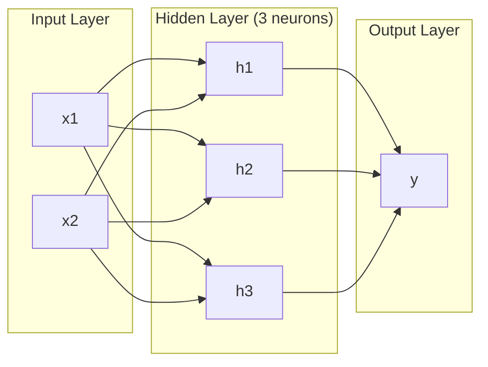
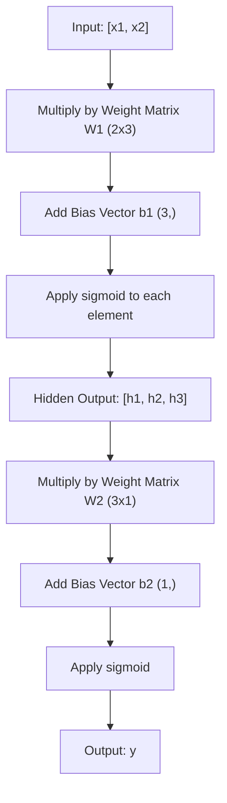
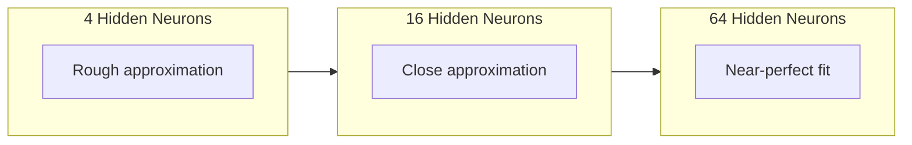

# Multi-Layer Networks and Forward Pass

> One neuron draws a line. Stack them, and you can draw anything.

**Type:** Build
**Languages:** Python
**Prerequisites:** Phase 01 (Math Foundations), Lesson 03.01 (The Perceptron)
**Time:** ~90 minutes

## Learning Objectives

- Build a multi-layer network from scratch with Layer and Network classes that perform a complete forward pass
- Trace matrix dimensions through each layer of a network and identify shape mismatches
- Explain how stacking nonlinear activations enables a network to learn curved decision boundaries
- Solve the XOR problem using a 2-2-1 architecture with hand-tuned sigmoid weights

## The Problem

A single neuron is a line drawer. That's it. One straight line through your data. Every real problem in AI -- image recognition, language understanding, playing Go -- requires curves. Stacking neurons into layers is how you get curves.

In 1969, Minsky and Papert proved this limitation was fatal: a single-layer network cannot learn XOR. Not "struggles to learn" -- mathematically cannot. The XOR truth table places [0,1] and [1,0] on one side, [0,0] and [1,1] on the other. No single line separates them.

This killed neural network funding for over a decade. The fix was obvious in hindsight: stop using one layer. Stack neurons into layers. Let the first layer carve the input space into new features, and let the second layer combine those features into decisions no single line could make.

That stack is the multi-layer network. It is the foundation of every deep learning model in production today. The forward pass -- data flowing from input through hidden layers to output -- is the first thing you need to build before anything else works.

## The Concept

### Layers: Input, Hidden, Output

A multi-layer network has three types of layers:

**Input layer** -- not really a layer. It holds your raw data. Two features means two input nodes. No computation happens here.

**Hidden layers** -- where the work happens. Each neuron takes every output from the previous layer, applies weights and a bias, then passes the result through an activation function. "Hidden" because you never see these values directly in the training data.

**Output layer** -- the final answer. For binary classification, one neuron with sigmoid. For multi-class, one neuron per class.



This is a 2-3-1 network. Two inputs, three hidden neurons, one output. Every connection carries a weight. Every neuron (except input) carries a bias.

Each layer produces a vector of numbers called a hidden state. For text, hidden states increase dimensionality -- encoding a word as 768 numbers to capture semantic meaning. For images, they reduce dimensionality -- compressing millions of pixels into a manageable representation. The hidden state is where the learning lives.

### Neurons and Activations

Each neuron does three things:

1. Multiply every input by its corresponding weight
2. Sum all the products and add a bias
3. Pass the sum through an activation function

For now, the activation is sigmoid:

```
sigmoid(z) = 1 / (1 + e^(-z))
```

Sigmoid squashes any number into the range (0, 1). Large positive inputs push toward 1. Large negative inputs push toward 0. Zero maps to 0.5. This smooth curve is what makes learning possible -- unlike the perceptron's hard step, sigmoid has a gradient everywhere.

### Forward Pass: How Data Flows

The forward pass pushes input data through the network, layer by layer, until it reaches the output. No learning happens during the forward pass. It is pure computation: multiply, add, activate, repeat.



At each layer, three operations happen in sequence:

```
z = W * input + b       (linear transformation)
a = sigmoid(z)           (activation)
```

The output of one layer becomes the input to the next. That is the entire forward pass.

### Matrix Dimensions

Tracking dimensions is the single most important debugging skill in deep learning. Here is the 2-3-1 network:

| Step | Operation | Dimensions | Result Shape |
|------|-----------|------------|-------------|
| Input | x | -- | (2,) |
| Hidden linear | W1 * x + b1 | W1: (3, 2), b1: (3,) | (3,) |
| Hidden activation | sigmoid(z1) | -- | (3,) |
| Output linear | W2 * h + b2 | W2: (1, 3), b2: (1,) | (1,) |
| Output activation | sigmoid(z2) | -- | (1,) |

The rule: weight matrix W at layer k has shape (neurons_in_layer_k, neurons_in_layer_k_minus_1). Rows match the current layer. Columns match the previous layer. If the shapes do not line up, you have a bug.

### Universal Approximation Theorem

In 1989, George Cybenko proved something remarkable: a neural network with a single hidden layer and enough neurons can approximate any continuous function to any desired accuracy.

This does not mean one hidden layer is always best. It means the architecture is theoretically capable. In practice, deeper networks (more layers, fewer neurons per layer) learn the same functions with far fewer total parameters than shallow-wide networks. That is why deep learning works.

The intuition: each neuron in the hidden layer learns one "bump" or feature. Enough bumps placed in the right locations can approximate any smooth curve. More neurons, more bumps, better approximation.



### Composability

Neural networks are composable. You can stack them, chain them, run them in parallel. A Whisper model uses an encoder network to process audio and a separate decoder network to generate text. Modern LLMs are decoder-only. BERT is encoder-only. T5 is encoder-decoder. The architecture choice defines what the model can do.

## Build It

Pure Python. No numpy. Every matrix operation written from scratch.

### Step 1: Sigmoid Activation

```python
import math

def sigmoid(x):
    x = max(-500.0, min(500.0, x))
    return 1.0 / (1.0 + math.exp(-x))
```

The clamp to [-500, 500] prevents overflow. `math.exp(500)` is large but finite. `math.exp(1000)` is infinity.

### Step 2: Layer Class

The most important operation in all of deep learning is matrix multiplication. Every layer, every attention head, every forward pass -- it's matmuls all the way down. A linear layer takes an input vector, multiplies it by a weight matrix, and adds a bias vector: y = Wx + b. That single equation is 90% of the compute in a neural network.

A layer holds a weight matrix and a bias vector. Its forward method takes an input vector and returns the activated output.

```python
class Layer:
    def __init__(self, n_inputs, n_neurons, weights=None, biases=None):
        if weights is not None:
            self.weights = weights
        else:
            import random
            self.weights = [
                [random.uniform(-1, 1) for _ in range(n_inputs)]
                for _ in range(n_neurons)
            ]
        if biases is not None:
            self.biases = biases
        else:
            self.biases = [0.0] * n_neurons

    def forward(self, inputs):
        self.last_input = inputs
        self.last_output = []
        for neuron_idx in range(len(self.weights)):
            z = sum(
                w * x for w, x in zip(self.weights[neuron_idx], inputs)
            )
            z += self.biases[neuron_idx]
            self.last_output.append(sigmoid(z))
        return self.last_output
```

The weight matrix has shape (n_neurons, n_inputs). Each row is one neuron's weights across all inputs. The forward method loops through neurons, computes the weighted sum plus bias, applies sigmoid, and collects the results.

### Step 3: Network Class

A network is a list of layers. The forward pass chains them: output of layer k feeds into layer k+1.

```python
class Network:
    def __init__(self, layers):
        self.layers = layers

    def forward(self, inputs):
        current = inputs
        for layer in self.layers:
            current = layer.forward(current)
        return current
```

That is the entire forward pass. Four lines of logic. Data goes in, flows through every layer, comes out the other side.

### Step 4: XOR with Hand-Tuned Weights

In Lesson 01, we solved XOR by combining OR, NAND, and AND perceptrons. Now do the same thing with our Layer and Network classes. The 2-2-1 architecture: two inputs, two hidden neurons, one output.

```python
hidden = Layer(
    n_inputs=2,
    n_neurons=2,
    weights=[[20.0, 20.0], [-20.0, -20.0]],
    biases=[-10.0, 30.0],
)

output = Layer(
    n_inputs=2,
    n_neurons=1,
    weights=[[20.0, 20.0]],
    biases=[-30.0],
)

xor_net = Network([hidden, output])

xor_data = [
    ([0, 0], 0),
    ([0, 1], 1),
    ([1, 0], 1),
    ([1, 1], 0),
]

for inputs, expected in xor_data:
    result = xor_net.forward(inputs)
    predicted = 1 if result[0] >= 0.5 else 0
    print(f"  {inputs} -> {result[0]:.6f} (rounded: {predicted}, expected: {expected})")
```

The large weights (20, -20) make sigmoid act like a step function. The first hidden neuron approximates OR. The second approximates NAND. The output neuron combines them into AND, which is XOR.

### Step 5: Circle Classification

A harder problem: classify 2D points as inside or outside a circle of radius 0.5 centered at the origin. This requires a curved decision boundary -- impossible for a single perceptron.

```python
import random
import math

random.seed(42)

data = []
for _ in range(200):
    x = random.uniform(-1, 1)
    y = random.uniform(-1, 1)
    label = 1 if (x * x + y * y) < 0.25 else 0
    data.append(([x, y], label))

circle_net = Network([
    Layer(n_inputs=2, n_neurons=8),
    Layer(n_inputs=8, n_neurons=1),
])
```

With random weights, the network will not classify well. But the forward pass still runs. This is the point -- the forward pass is just computation. Learning the right weights is backpropagation, coming in Lesson 03.

```python
correct = 0
for inputs, expected in data:
    result = circle_net.forward(inputs)
    predicted = 1 if result[0] >= 0.5 else 0
    if predicted == expected:
        correct += 1

print(f"Accuracy with random weights: {correct}/{len(data)} ({100*correct/len(data):.1f}%)")
```

Random weights give poor accuracy -- often worse than guessing the majority class. After training (Lesson 03), this same architecture with 8 hidden neurons will draw a curved boundary that separates inside from outside.

## Use It

PyTorch does everything above in four lines:

```python
import torch
import torch.nn as nn

model = nn.Sequential(
    nn.Linear(2, 8),
    nn.Sigmoid(),
    nn.Linear(8, 1),
    nn.Sigmoid(),
)

x = torch.tensor([[0.0, 0.0], [0.0, 1.0], [1.0, 0.0], [1.0, 1.0]])
output = model(x)
print(output)
```

`nn.Linear(2, 8)` is your Layer class: weight matrix of shape (8, 2), bias vector of shape (8,). `nn.Sigmoid()` is your sigmoid function applied element-wise. `nn.Sequential` is your Network class: chain layers in order.

The difference is speed and scale. PyTorch runs on GPUs, handles batches of millions of samples, and automatically computes gradients for backpropagation. But the forward pass logic is identical to what you just built from scratch.

## Ship It

This lesson produces a reusable prompt for designing network architectures:

- `outputs/prompt-network-architect.md`

Use it when you need to decide how many layers, how many neurons per layer, and which activation functions to use for a given problem.

## Exercises

1. Build a 2-4-2-1 network (two hidden layers) and run the forward pass on XOR data with random weights. Print the intermediate hidden layer outputs to see how the representation transforms at each layer.

2. Change the hidden layer size in the circle classifier from 8 to 2, then to 32. Run the forward pass with random weights each time. Does the number of hidden neurons change the output range or distribution? Why?

3. Implement a `count_parameters` method on the Network class that returns the total number of trainable weights and biases. Test it on a 784-256-128-10 network (the classic MNIST architecture). How many parameters does it have?

4. Build a forward pass for a 3-4-4-2 network. Feed it RGB color values (normalized to 0-1) and observe the two outputs. This is the architecture for a simple color classifier with two classes.

5. Replace sigmoid with a "leaky step" function: return 0.01 * z if z < 0, else 1.0. Run the forward pass on XOR with the same hand-tuned weights from Step 4. Does it still work? Why is the smooth sigmoid preferred over hard cutoffs?

## Key Terms

| Term | What people say | What it actually means |
|------|----------------|----------------------|
| Forward pass | "Running the model" | Pushing input through every layer -- multiply by weights, add bias, activate -- to produce an output |
| Hidden layer | "The middle part" | Any layer between input and output whose values are not directly observed in the data |
| Multi-layer network | "A deep neural network" | Layers of neurons stacked sequentially, where each layer's output feeds the next layer's input |
| Activation function | "The nonlinearity" | A function applied after the linear transformation that introduces curves into the decision boundary |
| Sigmoid | "The S-curve" | sigma(z) = 1/(1+e^(-z)), squashes any real number to (0,1), smooth and differentiable everywhere |
| Weight matrix | "The parameters" | A matrix W of shape (current_layer_neurons, previous_layer_neurons) containing learnable connection strengths |
| Bias vector | "The offset" | A vector added after the matrix multiply that lets neurons activate even when all inputs are zero |
| Universal approximation | "Neural nets can learn anything" | A single hidden layer with enough neurons can approximate any continuous function -- but "enough" can mean billions |
| Linear transformation | "The matrix multiply step" | z = W * x + b, the computation before activation, which maps inputs to a new space |
| Decision boundary | "Where the classifier switches" | The surface in input space where the network output crosses the classification threshold |

## Further Reading

- Michael Nielsen, "Neural Networks and Deep Learning", Chapter 1-2 (http://neuralnetworksanddeeplearning.com/) -- the clearest free explanation of forward passes and network structure, with interactive visualizations
- Cybenko, "Approximation by Superpositions of a Sigmoidal Function" (1989) -- the original universal approximation theorem paper, surprisingly readable
- 3Blue1Brown, "But what is a neural network?" (https://www.youtube.com/watch?v=aircAruvnKk) -- 20-minute visual walkthrough of layers, weights, and forward passes that builds the right mental model
- Goodfellow, Bengio, Courville, "Deep Learning", Chapter 6 (https://www.deeplearningbook.org/) -- the standard reference for multi-layer networks, free online
