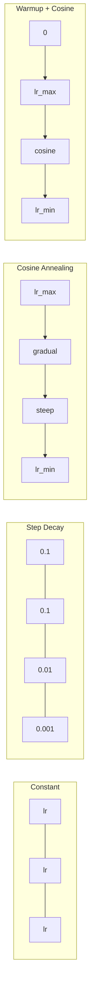
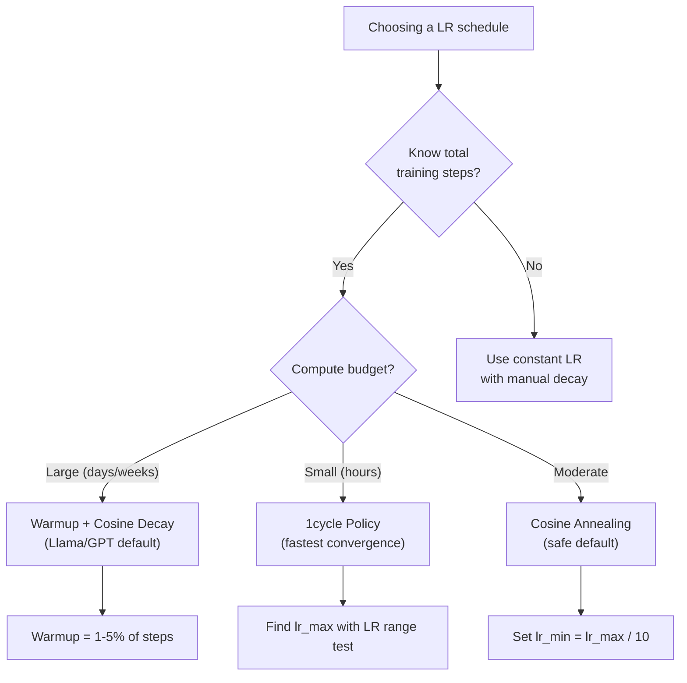
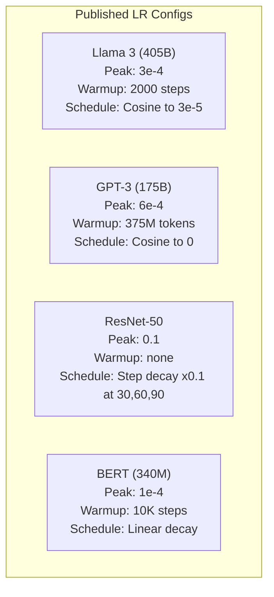

# Learning Rate Schedules and Warmup

> The learning rate is the single most important hyperparameter. Not the architecture. Not the dataset size. Not the activation function. The learning rate. If you tune nothing else, tune this.

**Type:** Build
**Languages:** Python
**Prerequisites:** Lesson 03.06 (Optimizers), Lesson 03.08 (Weight Initialization)
**Time:** ~90 minutes

## Learning Objectives

- Implement constant, step decay, cosine annealing, warmup + cosine, and 1cycle learning rate schedules from scratch
- Demonstrate the three failure modes of learning rate selection: divergence (too high), stalling (too low), and oscillation (no decay)
- Explain why warmup is necessary for Adam-based optimizers and how it stabilizes early training
- Compare convergence speed across all five schedules on the same task and select the appropriate one for a given training budget

## The Problem

Set the learning rate to 0.1. Training diverges -- loss jumps to infinity in 3 steps. Set it to 0.0001. Training crawls -- after 100 epochs, the model has barely moved from random. Set it to 0.01. Training works for 50 epochs, then the loss oscillates around a minimum it can never reach because the steps are too large.

The optimal learning rate is not a constant. It changes during training. Early on, you want large steps to cover ground quickly. Late in training, you want tiny steps to settle into a sharp minimum. The difference between a 90% accurate model and a 95% accurate model is often just the schedule.

Every major model published in the last three years uses a learning rate schedule. Llama 3 used peak lr=3e-4 with 2000 warmup steps and cosine decay to 3e-5. GPT-3 used lr=6e-4 with warmup over 375 million tokens. These are not arbitrary choices. They are the result of extensive hyperparameter sweeps that cost millions of dollars.

You need to understand schedules because the defaults will not work for your problem. When you fine-tune a pretrained model, the right schedule is different than training from scratch. When you increase batch size, the warmup period needs to change. When training breaks at step 10,000, you need to know whether it's a schedule problem or something else.

## The Concept

### Constant Learning Rate

The simplest approach. Pick a number, use it for every step.

```
lr(t) = lr_0
```

Rarely optimal. It's either too high for the end of training (oscillation around the minimum) or too low for the beginning (wasted compute on tiny steps). Works fine for small models and debugging. A terrible choice for anything that trains for more than an hour.

### Step Decay

The old-school approach from the ResNet era. Cut the learning rate by a factor (usually 10x) at fixed epochs.

```
lr(t) = lr_0 * gamma^(floor(epoch / step_size))
```

Where gamma = 0.1 and step_size = 30 means: lr drops by 10x every 30 epochs. ResNet-50 used this -- lr=0.1, drop by 10x at epochs 30, 60, and 90.

The problem: the optimal decay points depend on the dataset and architecture. Move to a different problem and you need to re-tune when to drop. The transitions are abrupt -- loss can spike when the rate suddenly changes.

### Cosine Annealing

Smooth decay from the maximum learning rate to a minimum, following a cosine curve:

```
lr(t) = lr_min + 0.5 * (lr_max - lr_min) * (1 + cos(pi * t / T))
```

Where t is the current step and T is the total number of steps.

At t=0, the cosine term is 1, so lr = lr_max. At t=T, the cosine term is -1, so lr = lr_min. The decay is gentle at first, accelerates in the middle, and becomes gentle again near the end.

This is the default for most modern training runs. No hyperparameters to tune beyond lr_max and lr_min. The cosine shape matches the empirical observation that most learning happens in the middle of training -- you want reasonable step sizes during that critical period.

### Warmup: Why You Start Small

Adam and other adaptive optimizers maintain running estimates of gradient mean and variance. At step 0, these estimates are initialized to zero. The first few gradient updates are based on garbage statistics. If your learning rate is large during this period, the model takes huge, poorly-directed steps.

Warmup fixes this. Start with a tiny learning rate (often lr_max / warmup_steps or even zero) and linearly ramp up to lr_max over the first N steps. By the time you reach the full learning rate, Adam's statistics have stabilized.

```
lr(t) = lr_max * (t / warmup_steps)     for t < warmup_steps
```

Typical warmup: 1-5% of total training steps. Llama 3 trained for ~1.8 trillion tokens and warmed up for 2000 steps. GPT-3 warmed up over 375 million tokens.

### Linear Warmup + Cosine Decay

The modern default. Ramp up linearly, then decay with cosine:

```
if t < warmup_steps:
    lr(t) = lr_max * (t / warmup_steps)
else:
    progress = (t - warmup_steps) / (total_steps - warmup_steps)
    lr(t) = lr_min + 0.5 * (lr_max - lr_min) * (1 + cos(pi * progress))
```

This is what Llama, GPT, PaLM, and most modern transformers use. The warmup prevents early instability. The cosine decay settles the model into a good minimum.

### 1cycle Policy

Leslie Smith's discovery (2018): ramp the learning rate up from a low value to a high value in the first half of training, then ramp it back down in the second half. Counterintuitive -- why would you *increase* the learning rate midway through?

The theory: a high learning rate acts as regularization by adding noise to the optimization trajectory. The model explores more of the loss landscape during the ramp-up phase, finding better basins. The ramp-down phase then refines within the best basin found.

```
Phase 1 (0 to T/2):    lr ramps from lr_max/25 to lr_max
Phase 2 (T/2 to T):    lr ramps from lr_max to lr_max/10000
```

1cycle often trains faster than cosine annealing for a fixed compute budget. The tradeoff: you must know the total number of steps in advance.

### Schedule Shapes



### Decision Flowchart



### Real Numbers from Published Models



## Build It

### Step 1: Schedule Functions

Each function takes the current step and returns the learning rate at that step.

```python
import math


def constant_schedule(step, lr=0.01, **kwargs):
    return lr


def step_decay_schedule(step, lr=0.1, step_size=100, gamma=0.1, **kwargs):
    return lr * (gamma ** (step // step_size))


def cosine_schedule(step, lr=0.01, total_steps=1000, lr_min=1e-5, **kwargs):
    if step >= total_steps:
        return lr_min
    return lr_min + 0.5 * (lr - lr_min) * (1 + math.cos(math.pi * step / total_steps))


def warmup_cosine_schedule(step, lr=0.01, total_steps=1000, warmup_steps=100, lr_min=1e-5, **kwargs):
    if total_steps <= warmup_steps:
        return lr * (step / max(warmup_steps, 1))
    if step < warmup_steps:
        return lr * step / warmup_steps
    progress = (step - warmup_steps) / (total_steps - warmup_steps)
    return lr_min + 0.5 * (lr - lr_min) * (1 + math.cos(math.pi * progress))


def one_cycle_schedule(step, lr=0.01, total_steps=1000, **kwargs):
    mid = max(total_steps // 2, 1)
    if step < mid:
        return (lr / 25) + (lr - lr / 25) * step / mid
    else:
        progress = (step - mid) / max(total_steps - mid, 1)
        return lr * (1 - progress) + (lr / 10000) * progress
```

### Step 2: Visualize All Schedules

Print a text-based plot showing how each schedule evolves over training.

```python
def visualize_schedule(name, schedule_fn, total_steps=500, **kwargs):
    steps = list(range(0, total_steps, total_steps // 20))
    if total_steps - 1 not in steps:
        steps.append(total_steps - 1)

    lrs = [schedule_fn(s, total_steps=total_steps, **kwargs) for s in steps]
    max_lr = max(lrs) if max(lrs) > 0 else 1.0

    print(f"\n{name}:")
    for s, lr_val in zip(steps, lrs):
        bar_len = int(lr_val / max_lr * 40)
        bar = "#" * bar_len
        print(f"  Step {s:4d}: lr={lr_val:.6f} {bar}")
```

### Step 3: Training Network

A simple two-layer network on the circle dataset, same as previous lessons, but now we vary the schedule.

```python
import random


def sigmoid(x):
    x = max(-500, min(500, x))
    return 1.0 / (1.0 + math.exp(-x))


def relu(x):
    return max(0.0, x)


def relu_deriv(x):
    return 1.0 if x > 0 else 0.0


def make_circle_data(n=200, seed=42):
    random.seed(seed)
    data = []
    for _ in range(n):
        x = random.uniform(-2, 2)
        y = random.uniform(-2, 2)
        label = 1.0 if x * x + y * y < 1.5 else 0.0
        data.append(([x, y], label))
    return data


def train_with_schedule(schedule_fn, schedule_name, data, epochs=300, base_lr=0.05, **kwargs):
    random.seed(0)
    hidden_size = 8
    total_steps = epochs * len(data)

    std = math.sqrt(2.0 / 2)
    w1 = [[random.gauss(0, std) for _ in range(2)] for _ in range(hidden_size)]
    b1 = [0.0] * hidden_size
    w2 = [random.gauss(0, std) for _ in range(hidden_size)]
    b2 = 0.0

    step = 0
    epoch_losses = []

    for epoch in range(epochs):
        total_loss = 0
        correct = 0

        for x, target in data:
            lr = schedule_fn(step, lr=base_lr, total_steps=total_steps, **kwargs)

            z1 = []
            h = []
            for i in range(hidden_size):
                z = w1[i][0] * x[0] + w1[i][1] * x[1] + b1[i]
                z1.append(z)
                h.append(relu(z))

            z2 = sum(w2[i] * h[i] for i in range(hidden_size)) + b2
            out = sigmoid(z2)

            error = out - target
            d_out = error * out * (1 - out)

            for i in range(hidden_size):
                d_h = d_out * w2[i] * relu_deriv(z1[i])
                w2[i] -= lr * d_out * h[i]
                for j in range(2):
                    w1[i][j] -= lr * d_h * x[j]
                b1[i] -= lr * d_h
            b2 -= lr * d_out

            total_loss += (out - target) ** 2
            if (out >= 0.5) == (target >= 0.5):
                correct += 1
            step += 1

        avg_loss = total_loss / len(data)
        accuracy = correct / len(data) * 100
        epoch_losses.append(avg_loss)

    return epoch_losses
```

### Step 4: Compare All Schedules

Train the same network with each schedule and compare final loss and convergence behavior.

```python
def compare_schedules(data):
    configs = [
        ("Constant", constant_schedule, {}),
        ("Step Decay", step_decay_schedule, {"step_size": 15000, "gamma": 0.1}),
        ("Cosine", cosine_schedule, {"lr_min": 1e-5}),
        ("Warmup+Cosine", warmup_cosine_schedule, {"warmup_steps": 3000, "lr_min": 1e-5}),
        ("1cycle", one_cycle_schedule, {}),
    ]

    print(f"\n{'Schedule':<20} {'Start Loss':>12} {'Mid Loss':>12} {'End Loss':>12} {'Best Loss':>12}")
    print("-" * 70)

    for name, schedule_fn, extra_kwargs in configs:
        losses = train_with_schedule(schedule_fn, name, data, epochs=300, base_lr=0.05, **extra_kwargs)
        mid_idx = len(losses) // 2
        best = min(losses)
        print(f"{name:<20} {losses[0]:>12.6f} {losses[mid_idx]:>12.6f} {losses[-1]:>12.6f} {best:>12.6f}")
```

### Step 5: LR Too High vs Too Low

Demonstrate the three failure modes: too high (divergence), too low (crawling), and just right.

```python
def lr_sensitivity(data):
    learning_rates = [1.0, 0.1, 0.01, 0.001, 0.0001]

    print("\nLR Sensitivity (constant schedule, 100 epochs):")
    print(f"  {'LR':>10} {'Start Loss':>12} {'End Loss':>12} {'Status':>15}")
    print("  " + "-" * 52)

    for lr in learning_rates:
        losses = train_with_schedule(constant_schedule, f"lr={lr}", data, epochs=100, base_lr=lr)
        start = losses[0]
        end = losses[-1]

        if end > start or math.isnan(end) or end > 1.0:
            status = "DIVERGED"
        elif end > start * 0.9:
            status = "BARELY MOVED"
        elif end < 0.15:
            status = "CONVERGED"
        else:
            status = "LEARNING"

        end_str = f"{end:.6f}" if not math.isnan(end) else "NaN"
        print(f"  {lr:>10.4f} {start:>12.6f} {end_str:>12} {status:>15}")
```

## Use It

PyTorch provides schedulers in `torch.optim.lr_scheduler`:

```python
import torch
import torch.optim as optim
from torch.optim.lr_scheduler import CosineAnnealingLR, OneCycleLR, StepLR

model = nn.Sequential(nn.Linear(10, 64), nn.ReLU(), nn.Linear(64, 1))
optimizer = optim.Adam(model.parameters(), lr=3e-4)

scheduler = CosineAnnealingLR(optimizer, T_max=1000, eta_min=1e-5)

for step in range(1000):
    loss = train_step(model, optimizer)
    scheduler.step()
```

For warmup + cosine, use a lambda scheduler or the `get_cosine_schedule_with_warmup` from HuggingFace:

```python
from transformers import get_cosine_schedule_with_warmup

scheduler = get_cosine_schedule_with_warmup(
    optimizer,
    num_warmup_steps=2000,
    num_training_steps=100000,
)
```

The HuggingFace function is what most Llama and GPT fine-tuning scripts use. When in doubt, use warmup + cosine with warmup = 3-5% of total steps. It works for almost everything.

## Ship It

This lesson produces:
- `outputs/prompt-lr-schedule-advisor.md` -- a prompt that recommends the right learning rate schedule and hyperparameters for your training setup

## Exercises

1. Implement exponential decay: lr(t) = lr_0 * gamma^t where gamma = 0.999. Compare to cosine annealing on the circle dataset.

2. Implement the learning rate range test (Leslie Smith): train for a few hundred steps while exponentially increasing the LR from 1e-7 to 1. Plot loss vs LR. The optimal max LR is just before the loss starts increasing.

3. Train with warmup + cosine but vary the warmup length: 0%, 1%, 5%, 10%, 20% of total steps. Find the sweet spot where training is most stable.

4. Implement cosine annealing with warm restarts (SGDR): reset the learning rate to lr_max every T steps and decay again. Compare to standard cosine on a longer training run.

5. Build a "schedule surgeon" that monitors training loss and automatically switches from warmup to cosine when the loss stabilizes, and reduces lr if the loss plateaus for too long.

## Key Terms

| Term | What people say | What it actually means |
|------|----------------|----------------------|
| Learning rate | "How fast the model learns" | The scalar that multiplies the gradient to determine the parameter update size |
| Schedule | "Change the LR over time" | A function that maps training step to learning rate, designed to optimize convergence |
| Warmup | "Start with a small LR" | Linearly ramping the LR from near-zero to the target value over the first N steps to stabilize optimizer statistics |
| Cosine annealing | "Smooth LR decay" | Decreasing the LR following a cosine curve from lr_max to lr_min over training |
| Step decay | "Drop LR at milestones" | Multiplying the LR by a factor (usually 0.1) at fixed epoch intervals |
| 1cycle policy | "Up then down" | Leslie Smith's method of ramping LR up then down in a single cycle for faster convergence |
| LR range test | "Find the best learning rate" | Training briefly while increasing LR to find the value where loss starts diverging |
| Cosine with warm restarts | "Reset and repeat" | Periodically resetting the LR to lr_max and decaying again (SGDR) |
| Eta min | "The floor for the LR" | The minimum learning rate that the schedule decays to |
| Peak learning rate | "The maximum LR" | The highest LR reached during training, typically after warmup |

## Further Reading

- Loshchilov & Hutter, "SGDR: Stochastic Gradient Descent with Warm Restarts" (2017) -- introduced cosine annealing and warm restarts
- Smith, "Super-Convergence: Very Fast Training of Neural Networks Using Large Learning Rates" (2018) -- the 1cycle policy paper
- Touvron et al., "Llama 2: Open Foundation and Fine-Tuned Chat Models" (2023) -- documents the warmup + cosine schedule used at scale
- Goyal et al., "Accurate, Large Minibatch SGD: Training ImageNet in 1 Hour" (2017) -- linear scaling rule and warmup for large batch training
