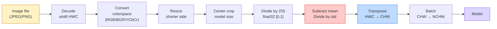
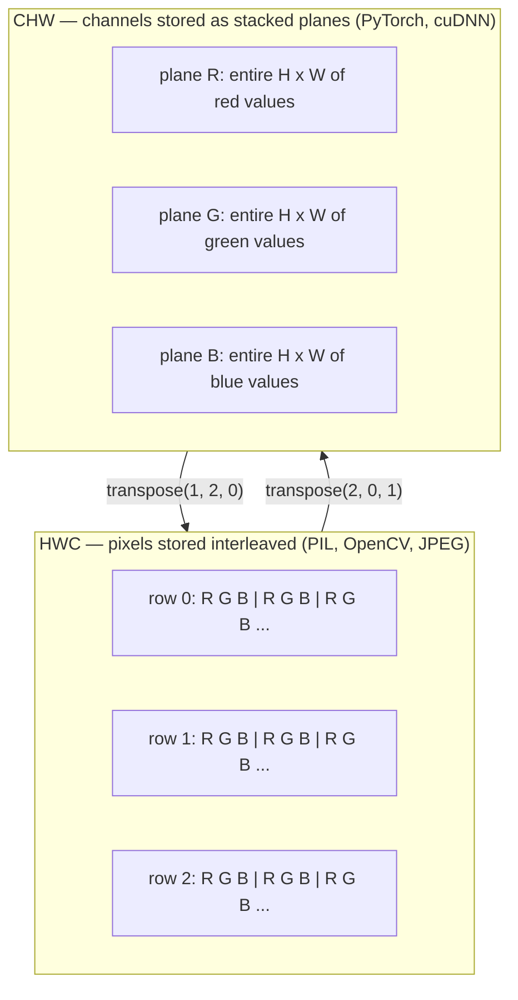

# Image Fundamentals — Pixels, Channels, Color Spaces

> An image is a tensor of light samples. Every vision model you will ever use starts from this one fact.

**Type:** Build
**Languages:** Python
**Prerequisites:** Phase 1 Lesson 12 (Tensor Operations), Phase 3 Lesson 11 (Intro to PyTorch)
**Time:** ~45 minutes

## Learning Objectives

- Explain how a continuous scene gets discretized into pixels and why sampling/quantization decisions set the ceiling on every downstream model
- Read, slice, and inspect images as NumPy arrays and switch fluently between HWC and CHW layouts
- Convert between RGB, grayscale, HSV, and YCbCr and justify why each color space exists
- Apply pixel-level preprocessing (normalize, standardize, resize, channel-first) exactly as torchvision expects it

## The Problem

Every paper you will read, every pretrained weight you will download, every vision API you will call assumes a specific encoding of the input. Pass a `uint8` image where the model wants `float32` and it will still run — and silently produce garbage. Feed BGR to a network trained on RGB and accuracy collapses by ten points. Hand a model channels-last input when it expects channels-first and the first conv layer treats height as a feature channel. None of this throws an error. It just ruins your metrics and you spend a week hunting for a bug that lives in how you loaded the file.

A convolution is not complicated once you know what it is sliding over. The hard part is that "an image" means different things to a camera, a JPEG decoder, PIL, OpenCV, torchvision, and a CUDA kernel. Each stack has its own axis order, byte range, and channel convention. A vision engineer who cannot keep these straight ships broken pipelines.

This lesson fixes the foundation so the rest of the phase can build on it. By the end you will know what a pixel is, why there are three numbers per pixel instead of one, what "normalize with ImageNet stats" actually does, and how to move between the two or three layouts that every other lesson in this phase will assume.

## The Concept

### The full preprocessing pipeline at a glance

Every production vision system is the same sequence of reversible transforms. Get one step wrong and the model sees a different input than it was trained on.



The two red and blue boxes are where 80% of silent failures live: missing standardization and wrong layout.

### A pixel is a sample, not a square

A camera sensor counts photons that land on a grid of tiny detectors. Each detector integrates light for a fraction of a second and emits a voltage proportional to how many photons hit it. The sensor then discretizes that voltage into an integer. One detector becomes one pixel.

```
Continuous scene                 Sensor grid                     Digital image
(infinite detail)                (H x W detectors)               (H x W integers)

    ~~~~~                        +--+--+--+--+--+                 210 198 180 155 120
   ~   ~   ~                     |  |  |  |  |  |                 205 195 178 152 118
  ~ light ~      ---->           +--+--+--+--+--+     ---->       200 190 175 150 115
   ~~~~~                         |  |  |  |  |  |                 195 185 170 148 112
                                 +--+--+--+--+--+                 188 180 165 145 108
```

Two choices happen at this step and they fix the ceiling on everything downstream:

- **Spatial sampling** decides how many detectors per degree of the scene. Too few, and edges become jagged (aliasing). Too many, and storage and compute explode.
- **Intensity quantization** decides how finely the voltage is bucketed. 8 bits gives 256 levels and is standard for display. 10, 12, 16 bits give smoother gradients and matter for medical imaging, HDR, and raw sensor pipelines.

A pixel is not a coloured square with area. It is a single measurement. When you resize or rotate, you are resampling that measurement grid.

### Why three channels

One detector counts photons across the whole visible spectrum — that is grayscale. To get colour, the sensor covers the grid with a mosaic of red, green, and blue filters. After demosaicing, every spatial location has three integers: the response of the red-filtered detector, green-filtered, and blue-filtered nearby. Those three integers are a pixel's RGB triplet.

```
One pixel in memory:

    (R, G, B) = (210, 140, 30)   <- reddish-orange

An H x W RGB image:

    shape (H, W, 3)     stored as   H rows of W pixels of 3 values
                                    each in [0, 255] for uint8
```

Three is not magic. Depth cameras add a Z channel. Satellites add infrared and ultraviolet bands. Medical scans often have one channel (X-ray, CT) or many (hyperspectral). The number of channels is the last axis; conv layers learn to mix across it.

### Two layout conventions: HWC and CHW

Same tensor, two orderings. Every library picks one.

```
HWC (height, width, channels)           CHW (channels, height, width)

   W ->                                    H ->
  +-----+-----+-----+                     +-----+-----+
H |R G B|R G B|R G B|                   C |R R R R R R|
| +-----+-----+-----+                   | +-----+-----+
v |R G B|R G B|R G B|                   v |G G G G G G|
  +-----+-----+-----+                     +-----+-----+
                                          |B B B B B B|
                                          +-----+-----+

   PIL, OpenCV, matplotlib,              PyTorch, most deep learning
   almost every image file on disk       frameworks, cuDNN kernels
```

CHW exists because convolution kernels slide across H and W. Keeping the channel axis first means each kernel sees a contiguous 2D plane per channel, which vectorizes cleanly. Disk formats keep HWC because that matches how scanlines come out of a sensor.

The one-line conversion you will type a thousand times:

```
img_chw = img_hwc.transpose(2, 0, 1)      # NumPy
img_chw = img_hwc.permute(2, 0, 1)        # PyTorch tensor
```

Memory layout, visualised:



### Byte ranges and dtype

Three conventions dominate:

| Convention | dtype | Range | Where you see it |
|------------|-------|-------|------------------|
| Raw | `uint8` | [0, 255] | Files on disk, PIL, OpenCV output |
| Normalized | `float32` | [0.0, 1.0] | After `img.astype('float32') / 255` |
| Standardized | `float32` | roughly [-2, +2] | After subtracting mean and dividing by std |

Convolutional networks were trained on standardized inputs. ImageNet stats `mean=[0.485, 0.456, 0.406]`, `std=[0.229, 0.224, 0.225]` are the arithmetic mean and standard deviation of the three channels over the full ImageNet training set, computed on [0, 1] normalized pixels. Feeding raw `uint8` into a model that expects standardized float is the single most common silent failure in applied vision.

### Color spaces and why they exist

RGB is the capture format but it is not always the most useful representation for a model.

```
 RGB               HSV                       YCbCr / YUV

 R red             H hue (angle 0-360)       Y luminance (brightness)
 G green           S saturation (0-1)        Cb chroma blue-yellow
 B blue            V value/brightness (0-1)  Cr chroma red-green

 Linear to         Separates color from      Separates brightness from
 sensor output     brightness. Useful for    color. JPEG and most video
                   color thresholding, UI    codecs compress the chroma
                   sliders, simple filters   channels harder because the
                                             human eye is less sensitive
                                             to chroma detail than to Y.
```

For most modern CNNs you feed RGB. You meet other spaces when:

- **HSV** — classical CV code, color-based segmentation, white-balancing.
- **YCbCr** — reading JPEG internals, video pipelines, super-resolution models that operate on Y only.
- **Grayscale** — OCR, document models, any case where color is nuisance variable rather than signal.

Grayscale from RGB is a weighted sum, not an average, because the human eye is more sensitive to green than to red or blue:

```
Y = 0.299 R + 0.587 G + 0.114 B       (ITU-R BT.601, the classic weights)
```

### Aspect ratio, resizing, and interpolation

Every model has a fixed input size (224x224 for most ImageNet classifiers, 384x384 or 512x512 for modern detectors). Your images rarely match. The three resize choices that matter:

- **Resize shorter side, then center crop** — the standard ImageNet recipe. Preserves aspect ratio, throws away a strip of edge pixels.
- **Resize and pad** — preserves aspect ratio and every pixel, adds black bars. Standard for detection and OCR.
- **Resize directly to target** — stretches the image. Cheap, distorts geometry, fine for many classification tasks.

The interpolation method decides how intermediate pixels are computed when the new grid does not align with the old one:

```
Nearest neighbour     fastest, blocky, only choice for masks/labels
Bilinear              fast, smooth, default for most image resizing
Bicubic               slower, sharper on upscaling
Lanczos               slowest, best quality, used for final display
```

Rule of thumb: bilinear for training, bicubic or lanczos for assets you will look at, nearest for anything containing integer class IDs.

## Build It

### Step 1: Load an image and inspect its shape

Use Pillow to load any JPEG or PNG, convert to NumPy, and print what you got. For a deterministic example that runs offline, synthesize one.

```python
import numpy as np
from PIL import Image

def synthetic_rgb(h=128, w=192, seed=0):
    rng = np.random.default_rng(seed)
    yy, xx = np.meshgrid(np.linspace(0, 1, h), np.linspace(0, 1, w), indexing="ij")
    r = (np.sin(xx * 6) * 0.5 + 0.5) * 255
    g = yy * 255
    b = (1 - yy) * xx * 255
    rgb = np.stack([r, g, b], axis=-1) + rng.normal(0, 6, (h, w, 3))
    return np.clip(rgb, 0, 255).astype(np.uint8)

arr = synthetic_rgb()
# Or load from disk:
# arr = np.asarray(Image.open("your_image.jpg").convert("RGB"))

print(f"type:   {type(arr).__name__}")
print(f"dtype:  {arr.dtype}")
print(f"shape:  {arr.shape}     # (H, W, C)")
print(f"min:    {arr.min()}")
print(f"max:    {arr.max()}")
print(f"pixel at (0, 0): {arr[0, 0]}")
```

Expected output: `shape: (H, W, 3)`, `dtype: uint8`, range `[0, 255]`. That is the canonical on-disk representation whether the bytes came from a camera, a JPEG decoder, or a synthetic generator.

### Step 2: Split channels and re-order layout

Pull out R, G, B separately, then convert from HWC to CHW for PyTorch.

```python
R = arr[:, :, 0]
G = arr[:, :, 1]
B = arr[:, :, 2]
print(f"R shape: {R.shape}, mean: {R.mean():.1f}")
print(f"G shape: {G.shape}, mean: {G.mean():.1f}")
print(f"B shape: {B.shape}, mean: {B.mean():.1f}")

arr_chw = arr.transpose(2, 0, 1)
print(f"\nHWC shape: {arr.shape}")
print(f"CHW shape: {arr_chw.shape}")
```

Three grayscale planes, one per channel. CHW just reorders the axes; no data copy is strictly required when the memory layout allows it.

### Step 3: Grayscale and HSV conversions

Weighted-sum grayscale, then a manual RGB-to-HSV.

```python
def rgb_to_grayscale(rgb):
    weights = np.array([0.299, 0.587, 0.114], dtype=np.float32)
    return (rgb.astype(np.float32) @ weights).astype(np.uint8)

def rgb_to_hsv(rgb):
    rgb_f = rgb.astype(np.float32) / 255.0
    r, g, b = rgb_f[..., 0], rgb_f[..., 1], rgb_f[..., 2]
    cmax = np.max(rgb_f, axis=-1)
    cmin = np.min(rgb_f, axis=-1)
    delta = cmax - cmin

    h = np.zeros_like(cmax)
    mask = delta > 0
    rmax = mask & (cmax == r)
    gmax = mask & (cmax == g)
    bmax = mask & (cmax == b)
    h[rmax] = ((g[rmax] - b[rmax]) / delta[rmax]) % 6
    h[gmax] = ((b[gmax] - r[gmax]) / delta[gmax]) + 2
    h[bmax] = ((r[bmax] - g[bmax]) / delta[bmax]) + 4
    h = h * 60.0

    s = np.where(cmax > 0, delta / cmax, 0)
    v = cmax
    return np.stack([h, s, v], axis=-1)

gray = rgb_to_grayscale(arr)
hsv = rgb_to_hsv(arr)
print(f"gray shape: {gray.shape}, range: [{gray.min()}, {gray.max()}]")
print(f"hsv   shape: {hsv.shape}")
print(f"hue range: [{hsv[..., 0].min():.1f}, {hsv[..., 0].max():.1f}] degrees")
print(f"sat range: [{hsv[..., 1].min():.2f}, {hsv[..., 1].max():.2f}]")
print(f"val range: [{hsv[..., 2].min():.2f}, {hsv[..., 2].max():.2f}]")
```

Hue comes out in degrees, saturation and value in [0, 1]. That matches the OpenCV `hsv_full` convention.

### Step 4: Normalize, standardize, and reverse it

Go from raw bytes to the exact tensor a pretrained ImageNet model expects, then back.

```python
mean = np.array([0.485, 0.456, 0.406], dtype=np.float32)
std = np.array([0.229, 0.224, 0.225], dtype=np.float32)

def preprocess_imagenet(rgb_uint8):
    x = rgb_uint8.astype(np.float32) / 255.0
    x = (x - mean) / std
    x = x.transpose(2, 0, 1)
    return x

def deprocess_imagenet(chw_float32):
    x = chw_float32.transpose(1, 2, 0)
    x = x * std + mean
    x = np.clip(x * 255.0, 0, 255).astype(np.uint8)
    return x

x = preprocess_imagenet(arr)
print(f"preprocessed shape: {x.shape}     # (C, H, W)")
print(f"preprocessed dtype: {x.dtype}")
print(f"preprocessed mean per channel:  {x.mean(axis=(1, 2)).round(3)}")
print(f"preprocessed std  per channel:  {x.std(axis=(1, 2)).round(3)}")

roundtrip = deprocess_imagenet(x)
max_diff = np.abs(roundtrip.astype(int) - arr.astype(int)).max()
print(f"roundtrip max pixel diff: {max_diff}    # should be 0 or 1")
```

Per-channel mean should be close to zero, std close to one. The preprocess/deprocess pair is exactly what every torchvision `transforms.Normalize` call is doing under the hood.

### Step 5: Resize with three interpolation methods

Compare nearest, bilinear, and bicubic on an upscale so the difference is visible.

```python
target = (arr.shape[0] * 3, arr.shape[1] * 3)

nearest = np.asarray(Image.fromarray(arr).resize(target[::-1], Image.NEAREST))
bilinear = np.asarray(Image.fromarray(arr).resize(target[::-1], Image.BILINEAR))
bicubic = np.asarray(Image.fromarray(arr).resize(target[::-1], Image.BICUBIC))

def local_roughness(x):
    gy = np.diff(x.astype(float), axis=0)
    gx = np.diff(x.astype(float), axis=1)
    return float(np.abs(gy).mean() + np.abs(gx).mean())

for name, out in [("nearest", nearest), ("bilinear", bilinear), ("bicubic", bicubic)]:
    print(f"{name:>8}  shape={out.shape}  roughness={local_roughness(out):6.2f}")
```

Nearest scores highest on roughness because it keeps hard edges. Bilinear is the smoothest. Bicubic sits in between, preserving perceived sharpness without the stair-step artifacts.

## Use It

`torchvision.transforms` bundles everything above into a single composable pipeline. The code below reproduces exactly what `preprocess_imagenet` does, plus resize and crop.

```python
import torch
from torchvision import transforms
from PIL import Image

img = Image.fromarray(synthetic_rgb(256, 256))

pipeline = transforms.Compose([
    transforms.Resize(256),
    transforms.CenterCrop(224),
    transforms.ToTensor(),
    transforms.Normalize(mean=[0.485, 0.456, 0.406], std=[0.229, 0.224, 0.225]),
])

x = pipeline(img)
print(f"tensor type:  {type(x).__name__}")
print(f"tensor dtype: {x.dtype}")
print(f"tensor shape: {tuple(x.shape)}      # (C, H, W)")
print(f"per-channel mean: {x.mean(dim=(1, 2)).tolist()}")
print(f"per-channel std:  {x.std(dim=(1, 2)).tolist()}")

batch = x.unsqueeze(0)
print(f"\nbatched shape: {tuple(batch.shape)}   # (N, C, H, W) — ready for a model")
```

Four steps, in this exact order: `Resize(256)` scales the shorter side to 256; `CenterCrop(224)` takes a 224x224 patch from the middle; `ToTensor()` divides by 255 and swaps HWC to CHW; `Normalize` subtracts the ImageNet mean and divides by std. Reversing that order silently changes what reaches the model.

## Ship It

This lesson produces:

- `outputs/prompt-vision-preprocessing-audit.md` — a prompt that turns any model card or dataset card into a checklist of the exact preprocessing invariants a team must honour.
- `outputs/skill-image-tensor-inspector.md` — a skill that, given any image-shaped tensor or array, reports dtype, layout, range, and whether it looks raw, normalized, or standardized.

## Exercises

1. **(Easy)** Load a JPEG with OpenCV (`cv2.imread`) and with Pillow. Print both shapes and the pixel at `(0, 0)`. Explain the channel-order difference, then write a one-line conversion that makes the OpenCV array identical to the Pillow one.
2. **(Medium)** Write `standardize(img, mean, std)` and its inverse that together pass a `roundtrip_max_diff <= 1` test on any uint8 image. Your functions must work on a single image in HWC and on a batch in NCHW with the same call.
3. **(Hard)** Take a 3-channel ImageNet-standardized tensor and run it through a 1x1 conv that learns a weighted mixture of RGB into a single grayscale channel. Initialize the weights to `[0.299, 0.587, 0.114]`, freeze them, and verify the output matches your manual `rgb_to_grayscale` to within floating-point error. What other classical color-space transforms can be written as 1x1 convolutions?

## Key Terms

| Term | What people say | What it actually means |
|------|----------------|----------------------|
| Pixel | "A coloured square" | One sample of light intensity at one grid location — three numbers for colour, one for grayscale |
| Channel | "The colour" | One of the parallel spatial grids stacked into an image tensor; last axis in HWC, first in CHW |
| HWC / CHW | "The shape" | Axis orderings for an image tensor; disk and PIL use HWC, PyTorch and cuDNN use CHW |
| Normalize | "Scale the image" | Divide by 255 so pixels live in [0, 1] — necessary but not sufficient |
| Standardize | "Zero-center" | Subtract mean and divide by std per channel so the input distribution matches what the model was trained on |
| Grayscale conversion | "Average the channels" | A weighted sum with coefficients 0.299/0.587/0.114 that matches human luminance perception |
| Interpolation | "How resize picks pixels" | The rule that decides output values when the new grid does not align with the old one — nearest for labels, bilinear for training, bicubic for display |
| Aspect ratio | "Width over height" | The ratio that distinguishes "resize and pad" from "resize and stretch" |

## Further Reading

- [Charles Poynton — A Guided Tour of Color Space](https://poynton.ca/PDFs/Guided_tour.pdf) — the clearest technical treatment of why there are so many color spaces and when each one matters
- [PyTorch Vision Transforms Docs](https://pytorch.org/vision/stable/transforms.html) — the full pipeline of transforms you will actually compose in production
- [How JPEG Works (Colt McAnlis)](https://www.youtube.com/watch?v=F1kYBnY6mwg) — a sharp visual tour of chroma subsampling, DCT, and why JPEG encodes YCbCr rather than RGB
- [ImageNet Preprocessing Conventions (torchvision models)](https://pytorch.org/vision/stable/models.html) — the source of truth for `mean=[0.485, 0.456, 0.406]` and why every model in the zoo expects it
