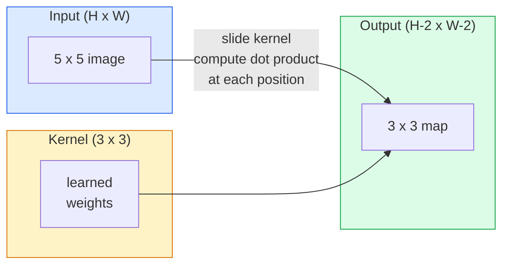
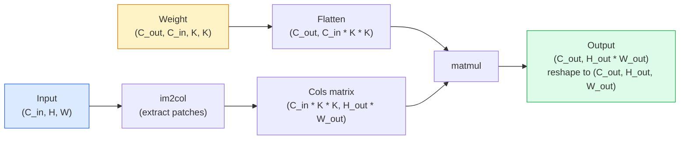

# Convolutions from Scratch

> A convolution is a tiny dense layer you slide across an image, sharing the same weights at every location.

**Type:** Build
**Languages:** Python
**Prerequisites:** Phase 3 (Deep Learning Core), Phase 4 Lesson 01 (Image Fundamentals)
**Time:** ~75 minutes

## Learning Objectives

- Implement 2D convolution from scratch using only NumPy, including the nested-loop version and a vectorised `im2col` version
- Compute output spatial size for any combination of input size, kernel size, padding, and stride, and justify the `(H - K + 2P) / S + 1` formula
- Hand-design kernels (edge, blur, sharpen, Sobel) and explain why each one produces the pattern of activations it does
- Stack convolutions into a feature extractor and connect the depth-of-the-stack to the size of the receptive field

## The Problem

A fully connected layer on a 224x224 RGB image would need 224 * 224 * 3 = 150,528 input weights per neuron. A single hidden layer with 1,000 units is already 150 million parameters — before you have learnt anything useful. Worse, that layer has no notion that a dog in the top-left and a dog in the bottom-right are the same pattern. It treats every pixel position as independent, which is exactly wrong for images: translating a cat by three pixels should not force the network to relearn the concept.

The two properties an image model needs are **translation equivariance** (the output shifts when the input shifts) and **parameter sharing** (the same feature detector runs everywhere). Dense layers give you neither. Convolution gives you both for free.

Convolution was not invented for deep learning. It is the same operation that powers JPEG compression, Gaussian blur in Photoshop, edge detection in industrial vision, and every audio filter ever shipped. The reason CNNs dominated ImageNet from 2012 to 2020 is that convolution is the correct prior for data where nearby values are related and the same pattern can appear anywhere.

## The Concept

### One kernel, sliding

A 2D convolution takes a small weight matrix called the kernel (or filter), slides it across the input, and at each location computes the sum of element-wise products. That sum becomes one output pixel.



A concrete 3x3 example on a 5x5 input (no padding, stride 1):

```
Input X (5 x 5):                Kernel W (3 x 3):

  1  2  0  1  2                   1  0 -1
  0  1  3  1  0                   2  0 -2
  2  1  0  2  1                   1  0 -1
  1  0  2  1  3
  2  1  1  0  1

The kernel slides across every valid 3 x 3 window. Output Y is 3 x 3:

 Y[0,0] = sum( W * X[0:3, 0:3] )
 Y[0,1] = sum( W * X[0:3, 1:4] )
 Y[0,2] = sum( W * X[0:3, 2:5] )
 Y[1,0] = sum( W * X[1:4, 0:3] )
 ... and so on
```

That one formula — **shared weights, locality, sliding window** — is the entire idea. Everything else is bookkeeping.

### Output size formula

Given input spatial size `H`, kernel size `K`, padding `P`, stride `S`:

```
H_out = floor( (H - K + 2P) / S ) + 1
```

Memorise this. You will compute it dozens of times per architecture.

| Scenario | H | K | P | S | H_out |
|----------|---|---|---|---|-------|
| Valid conv, no padding | 32 | 3 | 0 | 1 | 30 |
| Same conv (preserves size) | 32 | 3 | 1 | 1 | 32 |
| Downsample by 2 | 32 | 3 | 1 | 2 | 16 |
| Pool 2x2 | 32 | 2 | 0 | 2 | 16 |
| Large receptive field | 32 | 7 | 3 | 2 | 16 |

"Same padding" means pick P so that H_out == H when S == 1. For odd K, that is P = (K - 1) / 2. That is why 3x3 kernels dominate — they are the smallest odd kernel that still has a centre.

### Padding

Without padding, every convolution shrinks the feature map. Stack 20 of them and your 224x224 image becomes 184x184, which wastes compute on the border and complicates residual connections that need matching shapes.

```
Zero padding (P = 1) on a 5 x 5 input:

  0  0  0  0  0  0  0
  0  1  2  0  1  2  0
  0  0  1  3  1  0  0
  0  2  1  0  2  1  0       Now the kernel can centre on pixel
  0  1  0  2  1  3  0       (0, 0) and still have three rows and
  0  2  1  1  0  1  0       three columns of values to multiply.
  0  0  0  0  0  0  0
```

Modes you meet in practice: `zero` (most common), `reflect` (mirror the edge, avoids hard borders in generative models), `replicate` (copy the edge), `circular` (wrap around, used in toroidal problems).

### Stride

Stride is the step size of the slide. `stride=1` is the default. `stride=2` halves the spatial dimensions and is the classic way to downsample inside a CNN without a separate pooling layer — every modern architecture (ResNet, ConvNeXt, MobileNet) uses strided convs in place of max-pool somewhere.

```
Stride 1 on a 5 x 5 input, 3 x 3 kernel:

  starts: (0,0) (0,1) (0,2)        -> output row 0
          (1,0) (1,1) (1,2)        -> output row 1
          (2,0) (2,1) (2,2)        -> output row 2

  Output: 3 x 3

Stride 2 on the same input:

  starts: (0,0) (0,2)              -> output row 0
          (2,0) (2,2)              -> output row 1

  Output: 2 x 2
```

### Multiple input channels

Real images have three channels. A 3x3 convolution on an RGB input is actually a 3x3x3 volume: one 3x3 slice per input channel. At each spatial position, you multiply and sum across all three slices and add a bias.

```
Input:   (C_in,  H,  W)        3 x 5 x 5
Kernel:  (C_in,  K,  K)        3 x 3 x 3 (one kernel)
Output:  (1,     H', W')       2D map

For a layer that produces C_out output channels, you stack C_out kernels:

Weight:  (C_out, C_in, K, K)   e.g. 64 x 3 x 3 x 3
Output:  (C_out, H', W')       64 x 3 x 3

Parameter count: C_out * C_in * K * K + C_out   (the + C_out is biases)
```

That last line is the one you will calculate when planning a model. A 64-channel 3x3 conv on a 3-channel input has `64 * 3 * 3 * 3 + 64 = 1,792` parameters. Cheap.

### The im2col trick

Nested loops are easy to read but slow. GPUs want big matrix multiplies. The trick: flatten every receptive-field window of the input into one column of a big matrix, flatten the kernel into a row, and the whole convolution becomes a single matmul.



Every production conv implementation is some variant of this plus cache-tiling tricks (direct conv, Winograd, FFT conv for large kernels). Understand im2col and you understand the core.

### Receptive field

A single 3x3 conv looks at 9 input pixels. Stack two 3x3 convs and a neuron in the second layer looks at 5x5 input pixels. Three 3x3 convs give 7x7. In general:

```
RF after L stacked K x K convs (stride 1) = 1 + L * (K - 1)

With strides:   RF grows multiplicatively with stride along each layer.
```

The entire reason "3x3 all the way down" works (VGG, ResNet, ConvNeXt) is that two 3x3 convs see the same input area as one 5x5 conv but with fewer parameters and an extra non-linearity in between.

## Build It

### Step 1: Pad an array

Start with the smallest primitive: a function that pads with zeros around an H x W array.

```python
import numpy as np

def pad2d(x, p):
    if p == 0:
        return x
    h, w = x.shape[-2:]
    out = np.zeros(x.shape[:-2] + (h + 2 * p, w + 2 * p), dtype=x.dtype)
    out[..., p:p + h, p:p + w] = x
    return out

x = np.arange(9).reshape(3, 3)
print(x)
print()
print(pad2d(x, 1))
```

The trailing-axes trick `x.shape[:-2]` means the same function works on `(H, W)`, `(C, H, W)`, or `(N, C, H, W)` without modification.

### Step 2: 2D convolution with nested loops

The reference implementation — slow, but unambiguous. This is what `torch.nn.functional.conv2d` does in principle.

```python
def conv2d_naive(x, w, b=None, stride=1, padding=0):
    c_in, h, w_in = x.shape
    c_out, c_in_w, kh, kw = w.shape
    assert c_in == c_in_w

    x_pad = pad2d(x, padding)
    h_out = (h + 2 * padding - kh) // stride + 1
    w_out = (w_in + 2 * padding - kw) // stride + 1

    out = np.zeros((c_out, h_out, w_out), dtype=np.float32)
    for oc in range(c_out):
        for i in range(h_out):
            for j in range(w_out):
                hs = i * stride
                ws = j * stride
                patch = x_pad[:, hs:hs + kh, ws:ws + kw]
                out[oc, i, j] = np.sum(patch * w[oc])
        if b is not None:
            out[oc] += b[oc]
    return out
```

Four nested loops (output channel, row, column, plus the implicit sum over C_in, kh, kw). This is the ground truth you will check every faster implementation against.

### Step 3: Verify with a hand-designed kernel

Build a vertical Sobel kernel, apply it to a synthetic step image, and watch the vertical edge light up.

```python
def synthetic_step_image():
    img = np.zeros((1, 16, 16), dtype=np.float32)
    img[:, :, 8:] = 1.0
    return img

sobel_x = np.array([
    [[-1, 0, 1],
     [-2, 0, 2],
     [-1, 0, 1]]
], dtype=np.float32)[None]

x = synthetic_step_image()
y = conv2d_naive(x, sobel_x, padding=1)
print(y[0].round(1))
```

Expect large positive values on column 7 (left-to-right brightness increase) and zeros everywhere else. That single print is your sanity check that the math is right.

### Step 4: im2col

Convert every kernel-sized window in the input into a column of a matrix. For `C_in=3, K=3`, each column is 27 numbers.

```python
def im2col(x, kh, kw, stride=1, padding=0):
    c_in, h, w = x.shape
    x_pad = pad2d(x, padding)
    h_out = (h + 2 * padding - kh) // stride + 1
    w_out = (w + 2 * padding - kw) // stride + 1

    cols = np.zeros((c_in * kh * kw, h_out * w_out), dtype=x.dtype)
    col = 0
    for i in range(h_out):
        for j in range(w_out):
            hs = i * stride
            ws = j * stride
            patch = x_pad[:, hs:hs + kh, ws:ws + kw]
            cols[:, col] = patch.reshape(-1)
            col += 1
    return cols, h_out, w_out
```

It is still a Python loop, but now the heavy lifting will be a single vectorised matmul.

### Step 5: Fast conv via im2col + matmul

Replace the quadruple loop with one matrix multiplication.

```python
def conv2d_im2col(x, w, b=None, stride=1, padding=0):
    c_out, c_in, kh, kw = w.shape
    cols, h_out, w_out = im2col(x, kh, kw, stride, padding)
    w_flat = w.reshape(c_out, -1)
    out = w_flat @ cols
    if b is not None:
        out += b[:, None]
    return out.reshape(c_out, h_out, w_out)
```

Correctness check: run both implementations and compare.

```python
rng = np.random.default_rng(0)
x = rng.normal(0, 1, (3, 16, 16)).astype(np.float32)
w = rng.normal(0, 1, (8, 3, 3, 3)).astype(np.float32)
b = rng.normal(0, 1, (8,)).astype(np.float32)

y_naive = conv2d_naive(x, w, b, padding=1)
y_im2col = conv2d_im2col(x, w, b, padding=1)

print(f"max abs diff: {np.max(np.abs(y_naive - y_im2col)):.2e}")
```

`max abs diff` should be around `1e-5` — the difference is floating-point accumulation order, not a bug.

### Step 6: A bank of hand-designed kernels

Five filters that show what a single conv layer can express before any training.

```python
KERNELS = {
    "identity": np.array([[0, 0, 0], [0, 1, 0], [0, 0, 0]], dtype=np.float32),
    "blur_3x3": np.ones((3, 3), dtype=np.float32) / 9.0,
    "sharpen": np.array([[0, -1, 0], [-1, 5, -1], [0, -1, 0]], dtype=np.float32),
    "sobel_x": np.array([[-1, 0, 1], [-2, 0, 2], [-1, 0, 1]], dtype=np.float32),
    "sobel_y": np.array([[-1, -2, -1], [0, 0, 0], [1, 2, 1]], dtype=np.float32),
}

def apply_kernel(img2d, kernel):
    x = img2d[None].astype(np.float32)
    w = kernel[None, None]
    return conv2d_im2col(x, w, padding=1)[0]
```

Applied to any grayscale image, blur softens, sharpen crisps up edges, Sobel-x lights up vertical edges, Sobel-y lights up horizontal edges. These are exactly the patterns that the *first* trained conv layer in AlexNet and VGG ended up learning — because a good image model needs edge and blob detectors no matter what task comes later.

## Use It

PyTorch's `nn.Conv2d` wraps the same operation with autograd, CUDA kernels, and cuDNN optimisation. Shape semantics are identical.

```python
import torch
import torch.nn as nn

conv = nn.Conv2d(in_channels=3, out_channels=64, kernel_size=3, stride=1, padding=1)
print(conv)
print(f"weight shape: {tuple(conv.weight.shape)}   # (C_out, C_in, K, K)")
print(f"bias shape:   {tuple(conv.bias.shape)}")
print(f"param count:  {sum(p.numel() for p in conv.parameters())}")

x = torch.randn(8, 3, 224, 224)
y = conv(x)
print(f"\ninput  shape: {tuple(x.shape)}")
print(f"output shape: {tuple(y.shape)}")
```

Swap `padding=1` for `padding=0` and the output drops to 222x222. Swap `stride=1` for `stride=2` and it drops to 112x112. Same formula you memorised above.

## Ship It

This lesson produces:

- `outputs/prompt-cnn-architect.md` — a prompt that, given input size, parameter budget, and target receptive field, designs a stack of `Conv2d` layers with the right K/S/P at every step.
- `outputs/skill-conv-shape-calculator.md` — a skill that walks a network spec layer by layer and returns the output shape, receptive field, and parameter count for every block.

## Exercises

1. **(Easy)** Given a 128x128 grayscale input and a stack of `[Conv3x3(s=1,p=1), Conv3x3(s=2,p=1), Conv3x3(s=1,p=1), Conv3x3(s=2,p=1)]`, compute the output spatial size and the receptive field at each layer by hand. Verify with a PyTorch `nn.Sequential` of dummy convs.
2. **(Medium)** Extend `conv2d_naive` and `conv2d_im2col` to accept a `groups` argument. Show that `groups=C_in=C_out` reproduces a depthwise convolution and that its parameter count is `C * K * K` instead of `C * C * K * K`.
3. **(Hard)** Implement the backward pass of `conv2d_im2col` by hand: given the gradient of the output, compute the gradient of `x` and `w`. Verify against `torch.autograd.grad` on the same inputs and weights. The trick: the gradient of im2col is `col2im`, and it has to accumulate overlapping windows.

## Key Terms

| Term | What people say | What it actually means |
|------|----------------|----------------------|
| Convolution | "Sliding a filter" | A learnable dot product applied at every spatial location with shared weights; mathematically a cross-correlation, but everyone calls it convolution |
| Kernel / filter | "The feature detector" | A small weight tensor of shape (C_in, K, K) whose dot product with a window of input produces one output pixel |
| Stride | "How far you jump" | The step size between consecutive kernel placements; stride 2 halves each spatial dimension |
| Padding | "Zeros on the edges" | Extra values added around the input so the kernel can centre on border pixels; `same` padding keeps output size equal to input size |
| Receptive field | "How much the neuron sees" | The patch of original input that a given output activation depends on, growing with depth and stride |
| im2col | "The GEMM trick" | Rearranging every receptive window into columns so convolution becomes one big matrix multiply — the core of every fast conv kernel |
| Depthwise conv | "One kernel per channel" | A conv with `groups == C_in`, computing each output channel from only its matching input channel; the backbone of MobileNet and ConvNeXt |
| Translation equivariance | "Shift in, shift out" | Property that shifting the input by k pixels shifts the output by k pixels; comes for free with shared weights |

## Further Reading

- [A guide to convolution arithmetic for deep learning (Dumoulin & Visin, 2016)](https://arxiv.org/abs/1603.07285) — the definitive diagrams of padding/stride/dilation that every course quietly copies
- [CS231n: Convolutional Neural Networks for Visual Recognition](https://cs231n.github.io/convolutional-networks/) — the canonical lecture notes, including the original im2col explanation
- [The Annotated ConvNet (fast.ai)](https://nbviewer.org/github/fastai/fastbook/blob/master/13_convolutions.ipynb) — a notebook that walks from manual convolution to a trained digit classifier
- [Receptive Field Arithmetic for CNNs (Dang Ha The Hien)](https://distill.pub/2019/computing-receptive-fields/) — the paper-quality interactive explainer of receptive field calculations
