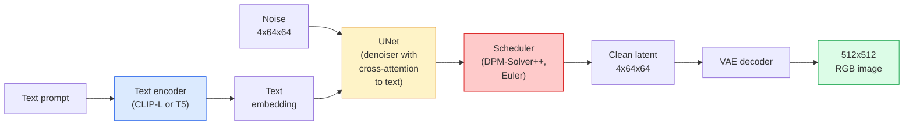

# Stable Diffusion — Architecture & Fine-Tuning

> Stable Diffusion is a DDPM that runs in the latent space of a pretrained VAE, conditioned on text via cross-attention, sampled with a fast deterministic ODE solver, and steered by classifier-free guidance.

**Type:** Learn + Use
**Languages:** Python
**Prerequisites:** Phase 4 Lesson 10 (Diffusion), Phase 7 Lesson 02 (Self-Attention)
**Time:** ~75 minutes

## Learning Objectives

- Trace the five pieces of a Stable Diffusion pipeline: VAE, text encoder, U-Net, scheduler, safety checker — and what each of them actually does
- Explain latent diffusion and why training in a 4x64x64 latent space (instead of a 3x512x512 image) reduces compute by 48x without quality loss
- Use `diffusers` to generate images, run image-to-image, inpainting, and ControlNet-guided generation
- Fine-tune Stable Diffusion with LoRA on a small custom dataset and load the LoRA adapter at inference

## The Problem

Training a DDPM directly on 512x512 RGB images is expensive. Every training step backprops through a U-Net that sees 3x512x512 = 786,432 input values, and sampling takes 50+ forward passes through that same U-Net. At the quality level of Stable Diffusion 1.5 (released 2022), pixel-space diffusion would need roughly 256 GPU-months of training and 10-30 seconds per image on a consumer GPU.

The trick that made open-weight text-to-image practical was **latent diffusion** (Rombach et al., CVPR 2022). Train a VAE that maps a 3x512x512 image to a 4x64x64 latent tensor and back, then do the diffusion in that latent space. Compute drops by `(3*512*512)/(4*64*64) = 48x`. Sampling drops from tens of seconds to under two seconds on the same GPU.

Almost every modern image-generation model — SDXL, SD3, FLUX, HunyuanDiT, Wan-Video — is a latent diffusion model with variations on the autoencoder, the denoiser (U-Net or DiT), and the text conditioning. Learn Stable Diffusion and you have learnt the template.

## The Concept

### The pipeline



- **VAE** — frozen autoencoder. Encoder turns image into latents (used for img2img and training). Decoder turns latents back into an image.
- **Text encoder** — CLIP text encoder (SD 1.x/2.x), CLIP-L + CLIP-G (SDXL), or T5-XXL (SD3/FLUX). Produces a sequence of token embeddings.
- **U-Net** — the denoiser. Has cross-attention layers that attend from latents to the text embedding at every resolution level.
- **Scheduler** — the sampling algorithm (DDIM, Euler, DPM-Solver++). Picks sigmas, blends predicted noise back into the latent.
- **Safety checker** — optional NSFW / illegal-content filter on the output image.

### Classifier-free guidance (CFG)

Plain text conditioning learns `epsilon_theta(x_t, t, c)` for every prompt `c`. CFG trains the same network with `c` dropped 10% of the time (replaced by an empty embedding), giving a single model that predicts both the conditional and the unconditional noise. At inference:

```
eps = eps_uncond + w * (eps_cond - eps_uncond)
```

`w` is the guidance scale. `w=0` is unconditional, `w=1` is plain conditional, `w>1` pushes the output toward being "more conditioned on the prompt" at the cost of diversity. SD default is `w=7.5`.

CFG is the reason text-to-image works at production quality. Without it, prompts bias the output weakly; with it, prompts dominate.

### Latent space geometry

The VAE's 4-channel latent is not just a compressed image. It is a manifold where arithmetic roughly corresponds to semantic edits (prompt engineering + interpolation both live here), and where the diffusion U-Net has been trained to spend its entire modelling budget. Decoding a random 4x64x64 latent does not produce a random-looking image — it produces garbage, because only a specific submanifold of latents decodes to valid images.

Two consequences:

1. **Img2img** = encode image to latent, add partial noise, run the denoiser, decode. Image structure survives because encoding is near-invertible; content changes based on the prompt.
2. **Inpainting** = same as img2img but the denoiser only updates masked regions; unmasked regions are kept at the encoded latent.

### The U-Net architecture

The SD U-Net is a big version of the TinyUNet from Lesson 10 with three additions:

- **Transformer blocks** at every spatial resolution, containing self-attention + cross-attention to the text embedding.
- **Time embedding** via MLP on sinusoidal encoding.
- **Skip connections** between encoder and decoder at matching resolutions.

Total parameters in SD 1.5: ~860M. SDXL: ~2.6B. FLUX: ~12B. The jump in params is mostly in attention layers.

### LoRA fine-tuning

Full fine-tuning of Stable Diffusion needs 20+ GB of VRAM and updates 860M parameters. LoRA (Low-Rank Adaptation) keeps the base model frozen and injects small rank-decomposition matrices into the attention layers. A LoRA adapter for SD is typically 10-50 MB, trains in 10-60 minutes on a single consumer GPU, and loads at inference time as a drop-in modification.

```
Original: W_q : (d_in, d_out)   frozen
LoRA:     W_q + alpha * (A @ B)   where A : (d_in, r), B : (r, d_out)

r is typically 4-32.
```

LoRA is how almost every community fine-tune is distributed. CivitAI and Hugging Face host millions of them.

### Schedulers you will see

- **DDIM** — deterministic, ~50 steps, simple.
- **Euler ancestral** — stochastic, 30-50 steps, slightly more creative samples.
- **DPM-Solver++ 2M Karras** — deterministic, 20-30 steps, production default.
- **LCM / TCD / Turbo** — consistency models and distilled variants; 1-4 steps at the cost of some quality.

Swapping schedulers is a one-line change in `diffusers` and sometimes fixes sample issues without any retraining.

## Build It

This lesson uses `diffusers` end-to-end rather than rebuilding Stable Diffusion from scratch. The pieces you would need to rebuild (VAE, text encoder, U-Net, scheduler) are topics of their own lessons; here the goal is fluency with the production API.

### Step 1: Text-to-image

```python
import torch
from diffusers import StableDiffusionPipeline

pipe = StableDiffusionPipeline.from_pretrained(
    "runwayml/stable-diffusion-v1-5",
    torch_dtype=torch.float16,
).to("cuda")

image = pipe(
    prompt="a dog riding a skateboard in tokyo, studio ghibli style",
    guidance_scale=7.5,
    num_inference_steps=25,
    generator=torch.Generator("cuda").manual_seed(42),
).images[0]
image.save("dog.png")
```

`float16` halves VRAM with no visible quality loss. `num_inference_steps=25` with the default DPM-Solver++ matches `num_inference_steps=50` with DDIM.

### Step 2: Swap the scheduler

```python
from diffusers import DPMSolverMultistepScheduler, EulerAncestralDiscreteScheduler

pipe.scheduler = DPMSolverMultistepScheduler.from_config(pipe.scheduler.config)
pipe.scheduler = EulerAncestralDiscreteScheduler.from_config(pipe.scheduler.config)
```

Scheduler state is decoupled from U-Net weights. You can train on DDPM and sample with any scheduler.

### Step 3: Image-to-image

```python
from diffusers import StableDiffusionImg2ImgPipeline
from PIL import Image

img2img = StableDiffusionImg2ImgPipeline.from_pretrained(
    "runwayml/stable-diffusion-v1-5",
    torch_dtype=torch.float16,
).to("cuda")

init_image = Image.open("dog.png").convert("RGB").resize((512, 512))
out = img2img(
    prompt="a dog riding a skateboard, oil painting",
    image=init_image,
    strength=0.6,
    guidance_scale=7.5,
).images[0]
```

`strength` is how much noise to add before denoising (0.0 = unchanged, 1.0 = full regeneration). 0.5-0.7 is the standard range for style transfer.

### Step 4: Inpainting

```python
from diffusers import StableDiffusionInpaintPipeline

inpaint = StableDiffusionInpaintPipeline.from_pretrained(
    "runwayml/stable-diffusion-inpainting",
    torch_dtype=torch.float16,
).to("cuda")

image = Image.open("dog.png").convert("RGB").resize((512, 512))
mask = Image.open("dog_mask.png").convert("L").resize((512, 512))

out = inpaint(
    prompt="a cat",
    image=image,
    mask_image=mask,
    guidance_scale=7.5,
).images[0]
```

White pixels in the mask are the area to regenerate. Black pixels are preserved.

### Step 5: LoRA loading

```python
pipe.load_lora_weights("sayakpaul/sd-lora-ghibli")
pipe.fuse_lora(lora_scale=0.8)

image = pipe(prompt="a village square in ghibli style").images[0]
```

`lora_scale` controls strength; 0.0 = no effect, 1.0 = full effect. `fuse_lora` bakes the adapter into the weights in place for speed, but prevents swapping. Call `pipe.unfuse_lora()` before loading a different adapter.

### Step 6: LoRA training (sketch)

Real LoRA training lives in `peft` or `diffusers.training`. The outline:

```python
# Pseudocode
for step, batch in enumerate(dataloader):
    images, prompts = batch
    latents = vae.encode(images).latent_dist.sample() * 0.18215

    t = torch.randint(0, num_train_timesteps, (batch_size,))
    noise = torch.randn_like(latents)
    noisy_latents = scheduler.add_noise(latents, noise, t)

    text_emb = text_encoder(tokenizer(prompts))

    pred_noise = unet(noisy_latents, t, text_emb)  # LoRA weights injected here

    loss = F.mse_loss(pred_noise, noise)
    loss.backward()
    optimizer.step()
```

Only the LoRA matrices receive gradient; the base U-Net, VAE, and text encoder are frozen. With a batch size of 1 and gradient checkpointing this fits in 8 GB of VRAM.

## Use It

In production, the decisions you actually make:

- **Model family**: SD 1.5 for open-source community fine-tunes, SDXL for higher fidelity, SD3 / FLUX for state of the art and strict licensing requirements.
- **Scheduler**: DPM-Solver++ 2M Karras for 20-30 steps, LCM-LoRA when latency is under 1s.
- **Precision**: `float16` on 4080/4090, `bfloat16` on A100 and newer, `int8` (via `bitsandbytes` or `compel`) when VRAM is tight.
- **Conditioning**: plain text works; for stronger control, add ControlNet (canny, depth, pose) on top of the base pipeline.

For batch generation, `AUTO1111` / `ComfyUI` are the community tools; for production APIs, `diffusers` + `accelerate` or `optimum-nvidia` with TensorRT compilation.

## Ship It

This lesson produces:

- `outputs/prompt-sd-pipeline-planner.md` — a prompt that picks SD 1.5 / SDXL / SD3 / FLUX plus scheduler and precision given a latency budget, fidelity target, and licensing constraint.
- `outputs/skill-lora-training-setup.md` — a skill that writes a full LoRA training config for a custom dataset including captions, rank, batch size, and learning rate.

## Exercises

1. **(Easy)** Generate the same prompt with `guidance_scale` in `[1, 3, 5, 7.5, 10, 15]`. Describe how the image changes. At what guidance value do artefacts appear?
2. **(Medium)** Take any real photograph, run it through `StableDiffusionImg2ImgPipeline` at `strength` in `[0.2, 0.4, 0.6, 0.8, 1.0]`. Which strength preserves composition while changing style? Why does 1.0 ignore the input entirely?
3. **(Hard)** Train a LoRA on 10-20 images of a single subject (a pet, a logo, a character) and generate novel scenes with that subject in them. Report the LoRA rank and training steps that produced the best identity preservation without overfitting to the input images.

## Key Terms

| Term | What people say | What it actually means |
|------|----------------|----------------------|
| Latent diffusion | "Diffuse in latents" | Run the entire DDPM in the VAE latent space (4x64x64) instead of pixel space (3x512x512); 48x compute saving |
| VAE scale factor | "0.18215" | Constant that rescales the VAE's raw latent to roughly unit variance; hardcoded in every SD pipeline |
| Classifier-free guidance | "CFG" | Mix conditional and unconditional noise predictions; the single most impactful inference knob |
| Scheduler | "Sampler" | The algorithm that turns noise + model predictions into a denoised latent trajectory |
| LoRA | "Low-rank adapter" | Small rank-decomposition matrices that fine-tune attention layers without touching base weights |
| Cross-attention | "Text-image attention" | Attention from latent tokens to text tokens; injects prompt information at every U-Net level |
| ControlNet | "Structure conditioning" | A separately-trained adapter that steers SD with an extra input (canny, depth, pose, segmentation) |
| DPM-Solver++ | "The default scheduler" | Second-order deterministic ODE solver; best quality at low step counts (20-30) in 2026 |

## Further Reading

- [High-Resolution Image Synthesis with Latent Diffusion (Rombach et al., 2022)](https://arxiv.org/abs/2112.10752) — the Stable Diffusion paper; includes every ablation that justifies the design
- [Classifier-Free Diffusion Guidance (Ho & Salimans, 2022)](https://arxiv.org/abs/2207.12598) — the CFG paper
- [LoRA: Low-Rank Adaptation of Large Language Models (Hu et al., 2021)](https://arxiv.org/abs/2106.09685) — LoRA was NLP-first; it transferred to SD with almost no changes
- [diffusers documentation](https://huggingface.co/docs/diffusers) — the reference for every SD / SDXL / SD3 / FLUX pipeline
