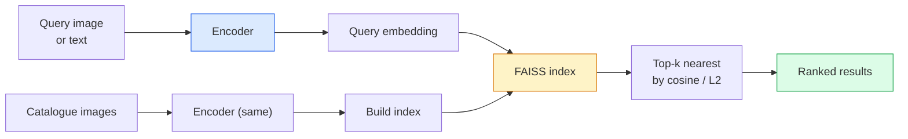

# Image Retrieval & Metric Learning

> A retrieval system ranks candidates by a distance in embedding space. Metric learning is the discipline of shaping that space so the distances mean what you want.

**Type:** Build
**Languages:** Python
**Prerequisites:** Phase 4 Lesson 14 (ViT), Phase 4 Lesson 18 (CLIP)
**Time:** ~45 minutes

## Learning Objectives

- Explain triplet, contrastive, and proxy-based metric learning losses and pick the right one for a given dataset
- Implement L2-normalisation and cosine similarity correctly and audit the difference between "same item" and "same class" retrieval
- Build a FAISS index, query it by text and by image, and report recall@K for a held-out query set
- Use DINOv2, CLIP, and SigLIP as off-the-shelf embedding backbones and know when each wins

## The Problem

Retrieval is everywhere in production vision: duplicate detection, reverse image search, visual search ("find similar products"), face re-identification, person re-ID for surveillance, instance-level matching for e-commerce. The product question is always the same: "given this query image, rank my catalogue."

Two design decisions shape the whole system. The embedding — what model produces the vectors. The index — how to find nearest neighbours at scale. Both are commodity in 2026 (DINOv2 for the embedding, FAISS for the index), which raises the bar: the hard part is defining *what counts as similar* for your application, then shaping the embedding space so the distances match.

That shaping is metric learning. It is a small but high-leverage discipline.

## The Concept

### Retrieval at a glance



### The four loss families

| Loss | Requires | Pros | Cons |
|------|----------|------|------|
| **Contrastive** | (anchor, positive) + negatives | Simple, works with any pair label | Slow to converge without many negatives |
| **Triplet** | (anchor, positive, negative) | Intuitive; direct margin control | Hard-triplet mining is expensive |
| **NT-Xent / InfoNCE** | Pairs + batch-mined negatives | Scales to large batches | Needs big batch or momentum queue |
| **Proxy-based (ProxyNCA)** | Class labels only | Fast, stable, no mining | Can overfit to proxies on small datasets |

For most production use cases, start with a pretrained backbone and only add a metric-learning fine-tune if the off-the-shelf embeddings underperform on your test set.

### Triplet loss formally

```
L = max(0, ||f(a) - f(p)||^2 - ||f(a) - f(n)||^2 + margin)
```

Pull anchor `a` close to positive `p`, push it away from negative `n`, with a `margin` that ensures a gap. The three-image structure generalises to any similarity ordering.

Mining matters: easy triplets (`n` already far from `a`) contribute zero loss; only hard triplets teach the network. Semi-hard mining (`n` further than `p` but within margin) is the 2016 FaceNet recipe and still dominates.

### Cosine similarity vs L2

Two metrics, two conventions:

- **Cosine**: angle between vectors. Requires L2-normalised embeddings.
- **L2**: Euclidean distance. Works on raw or normalised embeddings, but is usually paired with L2-normalised + squared L2.

For most modern nets the two are equivalent: `||a - b||^2 = 2 - 2 cos(a, b)` when `||a|| = ||b|| = 1`. Pick the convention that matches your embedding training; mixing them silently changes what "nearest" means.

### Recall@K

The standard retrieval metric:

```
recall@K = fraction of queries where at least one correct match is in the top K results
```

Report recall@1, @5, @10 side by side. A recall@10 above 0.95 with recall@1 below 0.5 means the embedding space has the right structure but the ranking is noisy — try longer fine-tunes or a re-ranking step.

For duplicate detection, precision@K matters more because every false positive is a user-visible mistake. For visual search, recall@K is the product signal.

### FAISS in one paragraph

Facebook AI Similarity Search. The de-facto library for nearest-neighbour search. Three index choices:

- `IndexFlatIP` / `IndexFlatL2` — brute force, exact, no training. Use up to ~1M vectors.
- `IndexIVFFlat` — partition into K cells, search only the closest few cells. Approximate, fast, needs training data.
- `IndexHNSW` — graph-based, fastest for many queries, large index size.

For 100k vectors you probably want `IndexFlatIP` on cosine similarity. For 10M you want `IndexIVFFlat`. For 100M+ combined with product quantisation (`IndexIVFPQ`).

### Instance-level vs category-level retrieval

Two very different problems with the same name:

- **Category-level** — "find cats in my catalogue." Class-conditional similarity; off-the-shelf CLIP / DINOv2 embeddings work well.
- **Instance-level** — "find *this exact product* in my catalogue." Needs fine-grained discrimination between visually similar objects of the same class; off-the-shelf embeddings under-perform; fine-tuning with metric learning matters.

Always ask which one you are solving before picking a model.

## Build It

### Step 1: Triplet loss

```python
import torch
import torch.nn.functional as F

def triplet_loss(anchor, positive, negative, margin=0.2):
    d_ap = F.pairwise_distance(anchor, positive, p=2)
    d_an = F.pairwise_distance(anchor, negative, p=2)
    return F.relu(d_ap - d_an + margin).mean()
```

One line. Works on L2-normalised or raw embeddings.

### Step 2: Semi-hard mining

Given a batch of embeddings and labels, find the hardest semi-hard negative for each anchor.

```python
def semi_hard_negatives(emb, labels, margin=0.2):
    dist = torch.cdist(emb, emb)
    same_class = labels[:, None] == labels[None, :]
    diff_class = ~same_class
    N = emb.size(0)

    positives = dist.clone()
    positives[~same_class] = float("-inf")
    positives.fill_diagonal_(float("-inf"))
    pos_idx = positives.argmax(dim=1)

    semi_hard = dist.clone()
    semi_hard[same_class] = float("inf")
    d_ap = dist[torch.arange(N), pos_idx].unsqueeze(1)
    semi_hard[dist <= d_ap] = float("inf")
    neg_idx = semi_hard.argmin(dim=1)

    fallback_mask = semi_hard[torch.arange(N), neg_idx] == float("inf")
    if fallback_mask.any():
        hardest = dist.clone()
        hardest[same_class] = float("inf")
        neg_idx = torch.where(fallback_mask, hardest.argmin(dim=1), neg_idx)
    return pos_idx, neg_idx
```

Each anchor gets the hardest positive in-class and a semi-hard negative that is further than the positive but within margin.

### Step 3: Recall@K

```python
def recall_at_k(query_emb, gallery_emb, query_labels, gallery_labels, k=1):
    sim = query_emb @ gallery_emb.T
    _, top_k = sim.topk(k, dim=-1)
    matches = (gallery_labels[top_k] == query_labels[:, None]).any(dim=-1)
    return matches.float().mean().item()
```

Top-k by inner product on L2-normalised embeddings equals top-k by cosine. Report the mean proportion of queries with at least one correct neighbour.

### Step 4: Putting it together

```python
import torch
import torch.nn as nn
from torch.optim import Adam

class Encoder(nn.Module):
    def __init__(self, in_dim=128, emb_dim=64):
        super().__init__()
        self.net = nn.Sequential(
            nn.Linear(in_dim, 128), nn.ReLU(),
            nn.Linear(128, emb_dim),
        )

    def forward(self, x):
        return F.normalize(self.net(x), dim=-1)

torch.manual_seed(0)
num_classes = 6
protos = F.normalize(torch.randn(num_classes, 128), dim=-1)

def sample_batch(bs=32):
    labels = torch.randint(0, num_classes, (bs,))
    x = protos[labels] + 0.15 * torch.randn(bs, 128)
    return x, labels

enc = Encoder()
opt = Adam(enc.parameters(), lr=3e-3)

for step in range(200):
    x, y = sample_batch(32)
    emb = enc(x)
    pos_idx, neg_idx = semi_hard_negatives(emb, y)
    loss = triplet_loss(emb, emb[pos_idx], emb[neg_idx])
    opt.zero_grad(); loss.backward(); opt.step()
```

After a few hundred steps the embedding clusters form one cluster per class.

## Use It

Production stacks in 2026:

- **DINOv2 + FAISS** — general-purpose visual retrieval. Works off-the-shelf.
- **CLIP + FAISS** — when queries are text.
- **Fine-tuned DINOv2 + FAISS** — instance-level retrieval, face re-ID, fashion, e-commerce.
- **Milvus / Weaviate / Qdrant** — managed vector DB wrappers around FAISS or HNSW.

For SOTA instance retrieval, the recipe is: DINOv2 backbone, add an embedding head, fine-tune with a triplet or InfoNCE loss on instance-labelled pairs, index in FAISS.

## Ship It

This lesson produces:

- `outputs/prompt-retrieval-loss-picker.md` — a prompt that picks triplet / InfoNCE / ProxyNCA for a given retrieval problem.
- `outputs/skill-recall-at-k-runner.md` — a skill that writes a clean evaluation harness for recall@K with train/val/gallery splits and proper data contract.

## Exercises

1. **(Easy)** Run the toy example above. Plot the embeddings with PCA before and after training to see the six clusters form.
2. **(Medium)** Add a ProxyNCA loss implementation: one learned "proxy" per class, standard cross-entropy on cosine similarity. Compare convergence speed vs triplet loss on the toy data.
3. **(Hard)** Take 1,000 ImageNet validation images, embed with DINOv2 via HuggingFace, build a FAISS flat index, and report recall@{1, 5, 10} against the same images as queries (should be 1.0) and against a held-out split with ImageNet labels as ground truth.

## Key Terms

| Term | What people say | What it actually means |
|------|----------------|----------------------|
| Metric learning | "Shape the space" | Training an encoder so distances in its output space reflect a target similarity |
| Triplet loss | "Pull and push" | L = max(0, d(a, p) - d(a, n) + margin); the canonical metric-learning loss |
| Semi-hard mining | "Useful negatives" | Negatives further from the anchor than the positive but within margin; empirically the most informative |
| Proxy-based loss | "Class prototypes" | One learned proxy per class; cross-entropy over similarity-to-proxies; no pair mining |
| Recall@K | "Top-K hit rate" | Fraction of queries with at least one correct result in the top K |
| Instance retrieval | "Find this exact thing" | Fine-grained matching; off-the-shelf features usually underperform |
| FAISS | "The NN library" | Facebook's nearest-neighbour library; supports exact and approximate indexes |
| HNSW | "Graph index" | Hierarchical navigable small world; fast approximate NN with small memory overhead |

## Further Reading

- [FaceNet: A Unified Embedding for Face Recognition (Schroff et al., 2015)](https://arxiv.org/abs/1503.03832) — the triplet loss / semi-hard mining paper
- [In Defense of the Triplet Loss for Person Re-Identification (Hermans et al., 2017)](https://arxiv.org/abs/1703.07737) — practical guide to triplet fine-tuning
- [FAISS documentation](https://github.com/facebookresearch/faiss/wiki) — every index, every trade-off
- [SMoT: Metric Learning Taxonomy (Kim et al., 2021)](https://arxiv.org/abs/2010.06927) — survey of modern losses and their connections
