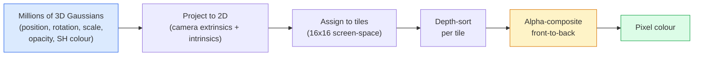

# 3D Gaussian Splatting from Scratch

> A scene is a cloud of millions of 3D Gaussians. Each one has a position, orientation, scale, opacity, and a colour that depends on viewing direction. Rasterise them, backprop through the rasterisation, done.

**Type:** Build
**Languages:** Python
**Prerequisites:** Phase 4 Lesson 13 (3D Vision & NeRF), Phase 1 Lesson 12 (Tensor Operations), Phase 4 Lesson 10 (Diffusion basics optional)
**Time:** ~90 minutes

## Learning Objectives

- Explain why 3D Gaussian Splatting replaced NeRF as the production default for photorealistic 3D reconstruction in 2026
- State the six per-Gaussian parameters (position, rotation quaternion, scale, opacity, spherical harmonics colour, optional feature) and how many floats each contributes
- Implement a 2D Gaussian splatting rasterizer from scratch using `alpha` compositing, then show how the 3D case projects to the same loop
- Use `nerfstudio`, `gsplat`, or `SuperSplat` to reconstruct a scene from 20-50 photos and export to the `KHR_gaussian_splatting` glTF extension or the OpenUSD 26.03 `UsdVolParticleField3DGaussianSplat` schema

## The Problem

A NeRF stores a scene as the weights of an MLP. Every rendered pixel is hundreds of MLP queries along a ray. Training takes hours, rendering takes seconds, and the weights cannot be edited — if you want to move a chair inside a scene, you have to retrain.

3D Gaussian Splatting (Kerbl, Kopanas, Leimkühler, Drettakis, SIGGRAPH 2023) replaced all of that. A scene is an explicit set of 3D Gaussians. Rendering is GPU rasterisation at 100+ fps. Training takes minutes. Editing is direct: translate a subset of Gaussians and you have moved the chair. By 2026 the Khronos Group has ratified a glTF extension for Gaussian splats, OpenUSD 26.03 ships a Gaussian splat schema, Zillow and Apartments.com render real estate with them, and most new research papers on 3D reconstruction are variants on the core 3DGS idea.

The mental model is simple, the math has enough moving parts that most introductions start at rasterisation and skip past the projections and spherical harmonics. This lesson builds the whole thing — a 2D version first, then the 3D extension.

## The Concept

### What a Gaussian carries

One 3D Gaussian is a parametric blob in space with these attributes:

```
position         mu         (3,)    centre in world coordinates
rotation         q          (4,)    unit quaternion encoding orientation
scale            s          (3,)    log-scales per axis (exponentiated at render time)
opacity          alpha      (1,)    post-sigmoid opacity [0, 1]
SH coefficients  c_lm       (3 * (L+1)^2,)   view-dependent colour
```

Rotation + scale build a 3x3 covariance: `Sigma = R S S^T R^T`. That is the shape of the Gaussian in 3D. Spherical harmonics let the colour change with viewing direction — specular highlights, subtle sheen, view-dependent glow — without storing per-view textures. With SH degree 3 you get 16 coefficients per colour channel, 48 floats per Gaussian for colour alone.

A scene typically has 1-5 million Gaussians. Each stores roughly 60 floats (3 + 4 + 3 + 1 + 48 + misc). That is 240 MB for a five-million-Gaussian scene — far smaller than the equivalent point cloud with per-point texture, and an order of magnitude smaller than a NeRF's MLP weights re-rendered at high resolution.

### Rasterisation, not ray marching



Five steps, all GPU-friendly. No MLP query per pixel. A single RTX 3080 Ti renders 6 million splats at 147 fps.

### The projection step

The 3D Gaussian at world position `mu` with 3D covariance `Sigma` projects to a 2D Gaussian at screen position `mu'` with 2D covariance `Sigma'`:

```
mu' = project(mu)
Sigma' = J W Sigma W^T J^T          (2 x 2)

W = viewing transform (rotation + translation of camera)
J = Jacobian of the perspective projection at mu'
```

The 2D Gaussian's footprint is an ellipse whose axes are the eigenvectors of `Sigma'`. Every pixel inside that ellipse receives the Gaussian's contribution, weighted by `exp(-0.5 * (p - mu')^T Sigma'^-1 (p - mu'))`.

### The alpha-compositing rule

For one pixel, the Gaussians that cover it are sorted back-to-front (or equivalently front-to-back with inverted formula). Colour is composited with the same equation as every semi-transparent rasteriser since the 1980s:

```
C_pixel = sum_i alpha_i * T_i * c_i

T_i = prod_{j < i} (1 - alpha_j)       transmittance up to i
alpha_i = opacity_i * exp(-0.5 * d^T Sigma'^-1 d)   local contribution
c_i = eval_SH(SH_i, view_direction)    view-dependent colour
```

This is **the same equation as NeRF's volumetric render**, just over an explicit sparse set of Gaussians instead of dense samples along a ray. That identity is why rendered quality matches NeRF — both are integrating the same radiance-field equation.

### Why this is differentiable

Every step — projection, tile assignment, alpha compositing, SH evaluation — is differentiable with respect to the Gaussian parameters. Given a ground-truth image, compute rendered pixel loss, backprop through the rasteriser, update all `(mu, q, s, alpha, c_lm)` by gradient descent. Over ~30,000 iterations the Gaussians find their right positions, scales, and colours.

### Densification and pruning

A fixed set of Gaussians cannot cover a complex scene. Training includes two adaptive mechanisms:

- **Clone** a Gaussian at its current position when its gradient magnitude is high but its scale is small — the reconstruction needs more detail here.
- **Split** a large-scale Gaussian into two smaller ones when its gradient is high — one big Gaussian is too smooth to fit the region.
- **Prune** Gaussians whose opacity drops below a threshold — they are not contributing.

Densification runs every N iterations. A scene typically grows from ~100k initial Gaussians (seeded from SfM points) to 1-5M at the end of training.

### Spherical harmonics in one paragraph

View-dependent colour is a function `c(direction)` on the unit sphere. Spherical harmonics are the sphere's Fourier basis. Truncate at degree `L` and you get `(L+1)^2` basis functions per channel. Evaluating the colour for a new view is a dot product between the learned SH coefficients and the basis evaluated at the viewing direction. Degree 0 = one coefficient = constant colour. Degree 3 = 16 coefficients = enough to capture Lambertian shading, specular, and mild reflection. SD Gaussian Splatting papers use degree 3 by default.

### The 2026 production stack

```
1. Capture         smartphone / DJI drone / handheld scanner
2. SfM / MVS       COLMAP or GLOMAP derives camera poses + sparse points
3. Train 3DGS      nerfstudio / gsplat / inria official / PostShot (~10-30 min on RTX 4090)
4. Edit            SuperSplat / SplatForge (clean floaters, segment)
5. Export          .ply -> glTF KHR_gaussian_splatting or .usd (OpenUSD 26.03)
6. View            Cesium / Unreal / Babylon.js / Three.js / Vision Pro
```

### 4D and generative variants

- **4D Gaussian Splatting** — Gaussians are functions of time; used for volumetric video (Superman 2026, A$AP Rocky's "Helicopter").
- **Generative splats** — text-to-splat models (Marble by World Labs) that hallucinate entire scenes.
- **3D Gaussian Unscented Transform** — NVIDIA NuRec's variant for autonomous driving simulation.

## Build It

### Step 1: A 2D Gaussian

We first build a 2D rasteriser. The 3D case reduces to it after projection.

```python
import torch
import torch.nn as nn
import torch.nn.functional as F


def eval_2d_gaussian(means, covs, points):
    """
    means:  (G, 2)      centres
    covs:   (G, 2, 2)   covariance matrices
    points: (H, W, 2)   pixel coordinates
    returns: (G, H, W)  density at every pixel for every Gaussian
    """
    G = means.size(0)
    H, W, _ = points.shape
    flat = points.view(-1, 2)
    inv = torch.linalg.inv(covs)
    diff = flat[None, :, :] - means[:, None, :]
    d = torch.einsum("gpi,gij,gpj->gp", diff, inv, diff)
    density = torch.exp(-0.5 * d)
    return density.view(G, H, W)
```

`einsum` does the quadratic form `diff^T Sigma^-1 diff` for every (Gaussian, pixel) pair.

### Step 2: 2D splatting rasteriser

Alpha-compositing front-to-back. Depth in 2D is meaningless, so we use a learned per-Gaussian scalar for order.

```python
def rasterise_2d(means, covs, colours, opacities, depths, image_size):
    """
    means:     (G, 2)
    covs:      (G, 2, 2)
    colours:   (G, 3)
    opacities: (G,)     in [0, 1]
    depths:    (G,)     per-Gaussian scalar used for ordering
    image_size: (H, W)
    returns:   (H, W, 3) rendered image
    """
    H, W = image_size
    yy, xx = torch.meshgrid(
        torch.arange(H, dtype=torch.float32, device=means.device),
        torch.arange(W, dtype=torch.float32, device=means.device),
        indexing="ij",
    )
    points = torch.stack([xx, yy], dim=-1)

    densities = eval_2d_gaussian(means, covs, points)
    alphas = opacities[:, None, None] * densities
    alphas = alphas.clamp(0.0, 0.99)

    order = torch.argsort(depths)
    alphas = alphas[order]
    colours_sorted = colours[order]

    T = torch.ones(H, W, device=means.device)
    out = torch.zeros(H, W, 3, device=means.device)
    for i in range(means.size(0)):
        a = alphas[i]
        out += (T * a)[..., None] * colours_sorted[i][None, None, :]
        T = T * (1.0 - a)
    return out
```

Not fast — a real implementation uses tile-based CUDA kernels — but exactly the right math and fully differentiable.

### Step 3: A trainable 2D splat scene

```python
class Splats2D(nn.Module):
    def __init__(self, num_splats=128, image_size=64, seed=0):
        super().__init__()
        g = torch.Generator().manual_seed(seed)
        H, W = image_size, image_size
        self.means = nn.Parameter(torch.rand(num_splats, 2, generator=g) * torch.tensor([W, H]))
        self.log_scale = nn.Parameter(torch.ones(num_splats, 2) * math.log(2.0))
        self.rot = nn.Parameter(torch.zeros(num_splats))  # single angle in 2D
        self.colour_logits = nn.Parameter(torch.randn(num_splats, 3, generator=g) * 0.5)
        self.opacity_logit = nn.Parameter(torch.zeros(num_splats))
        self.depth = nn.Parameter(torch.rand(num_splats, generator=g))

    def covs(self):
        s = torch.exp(self.log_scale)
        c, si = torch.cos(self.rot), torch.sin(self.rot)
        R = torch.stack([
            torch.stack([c, -si], dim=-1),
            torch.stack([si, c], dim=-1),
        ], dim=-2)
        S = torch.diag_embed(s ** 2)
        return R @ S @ R.transpose(-1, -2)

    def forward(self, image_size):
        covs = self.covs()
        colours = torch.sigmoid(self.colour_logits)
        opacities = torch.sigmoid(self.opacity_logit)
        return rasterise_2d(self.means, covs, colours, opacities, self.depth, image_size)
```

`log_scale`, `opacity_logit`, and `colour_logits` are all unconstrained parameters mapped through the right activation at render time. This is the standard pattern for every 3DGS implementation.

### Step 4: Fit 2D Gaussians to a target image

```python
import math
import numpy as np

def make_target(size=64):
    yy, xx = np.meshgrid(np.arange(size), np.arange(size), indexing="ij")
    img = np.zeros((size, size, 3), dtype=np.float32)
    # Red circle
    mask = (xx - 20) ** 2 + (yy - 20) ** 2 < 10 ** 2
    img[mask] = [1.0, 0.2, 0.2]
    # Blue square
    mask = (np.abs(xx - 45) < 8) & (np.abs(yy - 40) < 8)
    img[mask] = [0.2, 0.3, 1.0]
    return torch.from_numpy(img)


target = make_target(64)
model = Splats2D(num_splats=64, image_size=64)
opt = torch.optim.Adam(model.parameters(), lr=0.05)

for step in range(200):
    pred = model((64, 64))
    loss = F.mse_loss(pred, target)
    opt.zero_grad(); loss.backward(); opt.step()
    if step % 40 == 0:
        print(f"step {step:3d}  mse {loss.item():.4f}")
```

Over 200 steps the 64 Gaussians settle into the two shapes. That is the entire idea — gradient-descent on explicit geometric primitives.

### Step 5: From 2D to 3D

The 3D extension keeps the same loop. The additions:

1. Per-Gaussian rotation is a quaternion instead of a single angle.
2. Covariance is `R S S^T R^T` with `R` built from the quaternion and `S = diag(exp(log_scale))`.
3. Projection `(mu, Sigma) -> (mu', Sigma')` uses the camera extrinsics and the Jacobian of the perspective projection at `mu`.
4. Colour becomes a spherical-harmonics expansion; evaluate it at the viewing direction.
5. Depth-sort is from actual camera-space z instead of a learned scalar.

Every production implementation (`gsplat`, `inria/gaussian-splatting`, `nerfstudio`) does exactly this on the GPU with tile-based CUDA kernels.

### Step 6: Spherical harmonics evaluation

The SH basis up to degree 3 has 16 terms per channel. Evaluation:

```python
def eval_sh_degree_3(sh_coeffs, dirs):
    """
    sh_coeffs: (..., 16, 3)   last dim is RGB channels
    dirs:      (..., 3)       unit vectors
    returns:   (..., 3)
    """
    C0 = 0.282094791773878
    C1 = 0.488602511902920
    C2 = [1.092548430592079, 1.092548430592079,
          0.315391565252520, 1.092548430592079,
          0.546274215296039]
    x, y, z = dirs[..., 0], dirs[..., 1], dirs[..., 2]
    x2, y2, z2 = x * x, y * y, z * z
    xy, yz, xz = x * y, y * z, x * z

    result = C0 * sh_coeffs[..., 0, :]
    result = result - C1 * y[..., None] * sh_coeffs[..., 1, :]
    result = result + C1 * z[..., None] * sh_coeffs[..., 2, :]
    result = result - C1 * x[..., None] * sh_coeffs[..., 3, :]

    result = result + C2[0] * xy[..., None] * sh_coeffs[..., 4, :]
    result = result + C2[1] * yz[..., None] * sh_coeffs[..., 5, :]
    result = result + C2[2] * (2.0 * z2 - x2 - y2)[..., None] * sh_coeffs[..., 6, :]
    result = result + C2[3] * xz[..., None] * sh_coeffs[..., 7, :]
    result = result + C2[4] * (x2 - y2)[..., None] * sh_coeffs[..., 8, :]

    # degree 3 terms omitted here for brevity; full 16-coefficient version in the code file
    return result
```

Learned `sh_coeffs` store the "colour in every direction" for that Gaussian. At render time you evaluate against the current view direction and get a 3-vector RGB.

## Use It

For real 3DGS work, use `gsplat` (Meta) or `nerfstudio`:

```bash
pip install nerfstudio gsplat
ns-download-data example
ns-train splatfacto --data path/to/data
```

`splatfacto` is nerfstudio's 3DGS trainer. The run takes 10-30 minutes on an RTX 4090 for a typical scene.

Export options that matter in 2026:

- `.ply` — raw Gaussian cloud (portable, largest file).
- `.splat` — PlayCanvas / SuperSplat quantised format.
- glTF `KHR_gaussian_splatting` — Khronos standard, portable across viewers (Feb 2026 RC).
- OpenUSD `UsdVolParticleField3DGaussianSplat` — USD-native, for NVIDIA Omniverse and Vision Pro pipelines.

For 4D / dynamic scenes, `4DGS` and `Deformable-3DGS` extend the same machinery with time-varying means and opacities.

## Ship It

This lesson produces:

- `outputs/prompt-3dgs-capture-planner.md` — a prompt that plans a capture session (number of photos, camera path, lighting) for a given scene type.
- `outputs/skill-3dgs-export-router.md` — a skill that picks the right export format (`.ply` / `.splat` / glTF / USD) given the downstream viewer or engine.

## Exercises

1. **(Easy)** Run the 2D splat trainer above on a different synthetic image. Vary `num_splats` in `[16, 64, 256]` and plot MSE vs step for each. Identify the point of diminishing returns.
2. **(Medium)** Extend the 2D rasteriser to support per-Gaussian RGB colours that depend on a scalar "view angle" through a degree-2 harmonic. Train on a pair of target images and verify the model reconstructs both.
3. **(Hard)** Clone `nerfstudio` and train `splatfacto` on a 20-photo capture of any scene you have (desk, plant, face, room). Export to glTF `KHR_gaussian_splatting` and open it in a viewer (Three.js `GaussianSplats3D`, SuperSplat, Babylon.js V9). Report training time, number of Gaussians, and rendered fps.

## Key Terms

| Term | What people say | What it actually means |
|------|----------------|----------------------|
| 3DGS | "Gaussian splats" | Explicit scene representation as millions of 3D Gaussians with per-Gaussian position, rotation, scale, opacity, SH colour |
| Covariance | "Shape of the Gaussian" | `Sigma = R S S^T R^T`; orientation and anisotropic scale of one Gaussian |
| Alpha compositing | "Back-to-front blend" | Same equation as NeRF's volumetric render, now over an explicit sparse set |
| Densification | "Clone and split" | Adaptive addition of new Gaussians where reconstruction is under-fit |
| Pruning | "Delete low-opacity" | Remove Gaussians that have collapsed to near-zero opacity during training |
| Spherical harmonics | "View-dependent colour" | Fourier basis on the sphere; stores colour as a function of viewing direction |
| Splatfacto | "nerfstudio's 3DGS" | The easiest path to training 3DGS in 2026 |
| `KHR_gaussian_splatting` | "glTF standard" | Khronos 2026 extension that makes 3DGS portable across viewers and engines |

## Further Reading

- [3D Gaussian Splatting for Real-Time Radiance Field Rendering (Kerbl et al., SIGGRAPH 2023)](https://repo-sam.inria.fr/fungraph/3d-gaussian-splatting/) — the original paper
- [gsplat (Meta/nerfstudio)](https://github.com/nerfstudio-project/gsplat) — production-quality CUDA rasteriser
- [nerfstudio Splatfacto](https://docs.nerf.studio/nerfology/methods/splat.html) — reference training recipe
- [Khronos KHR_gaussian_splatting extension](https://github.com/KhronosGroup/glTF/blob/main/extensions/2.0/Khronos/KHR_gaussian_splatting/README.md) — the 2026 portable format
- [OpenUSD 26.03 release notes](https://openusd.org/release/) — `UsdVolParticleField3DGaussianSplat` schema
- [THE FUTURE 3D State of Gaussian Splatting 2026](https://www.thefuture3d.com/blog-0/2026/4/4/state-of-gaussian-splatting-2026) — industry overview
