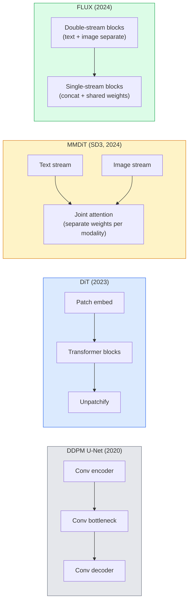

# Diffusion Transformers & Rectified Flow

> The U-Net is not the secret of diffusion. Replace it with a transformer, swap the noise schedule for a straight-line flow, and suddenly you have SD3, FLUX, and every 2026 text-to-image model.

**Type:** Learn + Build
**Languages:** Python
**Prerequisites:** Phase 4 Lesson 10 (Diffusion DDPM), Phase 4 Lesson 14 (ViT), Phase 7 Lesson 02 (Self-Attention)
**Time:** ~75 minutes

## Learning Objectives

- Trace the evolution from U-Net DDPM (Lesson 10) to Diffusion Transformer (DiT), MMDiT (SD3), and single+double-stream DiT (FLUX)
- Explain rectified flow: why a straight-line trajectory between noise and data lets models sample in 20 steps instead of 1000
- Implement a tiny DiT block and a rectified-flow training loop, both under 100 lines
- Distinguish model variants (SD3, FLUX.1-dev, FLUX.1-schnell, Z-Image, Qwen-Image) by architecture, parameter count, and licensing

## The Problem

Lesson 10 built a DDPM with a U-Net denoiser. That recipe dominated 2020-2023: U-Net + beta schedule + noise-prediction loss. It produced Stable Diffusion 1.5 and 2.1 and DALL-E 2.

Every 2026 state-of-the-art text-to-image model has moved past it. Stable Diffusion 3, FLUX, SD4, Z-Image, Qwen-Image, Hunyuan-Image — none use a U-Net. They use Diffusion Transformers (DiT). SD3 and FLUX also swap the DDPM noise schedule for rectified flow, which straightens the path from noise to data and enables 1-4 step inference with consistency or distilled variants.

The shift matters because it is the reason diffusion-based image generation became controllable, prompt-accurate (SD3/SD4 solved text rendering), and production-fast. Understanding DiT + rectified flow is understanding the 2026 generative-image stack.

## The Concept

### From U-Net to transformer



- **DiT** (Peebles & Xie, 2023) — replace the U-Net with a ViT-like transformer on latent patches. Conditioning via adaptive layer norm (AdaLN).
- **MMDiT** (SD3, Esser et al., 2024) — two streams with separate weights for text and image tokens that share a joint attention.
- **FLUX** (Black Forest Labs, 2024) — first N blocks double-stream like SD3, later blocks concatenate and share weights (single-stream) for efficiency at higher depth.
- **Z-Image** (2025) — an efficient single-stream DiT at 6B parameters that challenges "scale at all costs".

### Rectified flow in one paragraph

DDPM defines the forward process as a noisy SDE where `x_t` is increasingly corrupted. The learned reverse is a second SDE, solved by 1000 small steps.

Rectified flow defines a **straight-line** interpolation between clean data and pure noise:

```
x_t = (1 - t) * x_0 + t * epsilon,     t in [0, 1]
```

Train a network to predict the velocity `v_theta(x_t, t) = epsilon - x_0` — the forward direction along the straight-line path from clean data to noise (`dx_t/dt`). During sampling, you integrate this velocity backward to step from noise toward data. The resulting ODE is much closer to a straight line, so far fewer integration steps are needed to sample.

SD3 calls this **Rectified Flow Matching**. FLUX, Z-Image, and most 2026 models use the same objective. Typical inference: 20-30 Euler steps (deterministic) vs 50+ DDIM steps in the old DDPM regime. Distilled / turbo / schnell / LCM variants take it down to 1-4 steps.

### AdaLN conditioning

DiTs condition on timestep and class/text via **adaptive layer norm**: predict `scale` and `shift` from the conditioning vector and apply them after LayerNorm. Much cleaner than FiLM-style modulation in U-Nets and the default in every modern DiT.

```
cond -> MLP -> (scale, shift, gate)
norm(x) * (1 + scale) + shift, then residual add * gate
```

### Text encoders in SD3 and FLUX

- **SD3** uses three text encoders: two CLIP models + T5-XXL. Embeddings concatenated and fed to the image stream as text conditioning.
- **FLUX** uses one CLIP-L + T5-XXL.
- **Qwen-Image / Z-Image** variants use their own in-house text encoders aligned with their base LLMs.

The text encoder is a big part of why SD3/FLUX reason about prompts so much better than SD1.5. T5-XXL alone is 4.7B params.

### Classifier-free guidance still holds

Rectified flow changes the sampler, not the conditioning. Classifier-free guidance (drop text with 10% probability during training, mix conditional and unconditional predictions at inference) works identically with rectified flow. Most 2026 models use guidance scale 3.5-5 — lower than SD1.5's 7.5 because rectified-flow models follow prompts more tightly by default.

### Consistency, Turbo, Schnell, LCM

Four names for the same idea: distil a slow many-step model into a fast few-step model.

- **LCM (Latent Consistency Model)** — train a student that predicts the final `x_0` from any intermediate `x_t` in one step.
- **SDXL Turbo / FLUX schnell** — 1-4 step models trained with adversarial diffusion distillation.
- **SD Turbo** — OpenAI-style Consistency Models adapted to latent diffusion.

Production serving of any new model ships both a "full quality" checkpoint and a "turbo / schnell" variant. Schnell ("fast" in German, Black Forest Labs' convention) runs in 1-4 steps and fits real-time pipelines.

### Model landscape in 2026

| Model | Size | Architecture | License |
|-------|------|--------------|---------|
| Stable Diffusion 3 Medium | 2B | MMDiT | SAI Community |
| Stable Diffusion 3.5 Large | 8B | MMDiT | SAI Community |
| FLUX.1-dev | 12B | Double + Single Stream DiT | non-commercial |
| FLUX.1-schnell | 12B | same, distilled | Apache 2.0 |
| FLUX.2 | — | iterated FLUX.1 | mixed |
| Z-Image | 6B | S3-DiT (Scalable Single-Stream) | permissive |
| Qwen-Image | ~20B | DiT + Qwen text tower | Apache 2.0 |
| Hunyuan-Image-3.0 | ~80B | DiT | research |
| SD4 Turbo | 3B | DiT + distillation | SAI Commercial |

FLUX.1-schnell is the 2026 open-source default. Z-Image is the efficiency leader. FLUX.2 and SD4 are the current quality tips.

### Why this phase shift matters

DDPM + U-Net worked. DiT + rectified flow works **better, faster, and scales more cleanly**. The transition parallels the one from RNNs to transformers in NLP: both architectures solved the same problem, but transformers scaled and now dominate. Every 2026 paper on image, video, or 3D generation uses a DiT-shaped denoiser and usually a rectified flow objective. U-Net DDPM is now primarily pedagogical (Lesson 10).

## Build It

### Step 1: A DiT block with AdaLN

```python
import torch
import torch.nn as nn


class AdaLNZero(nn.Module):
    """
    Adaptive LayerNorm with a gate. Predicts (scale, shift, gate) from the conditioning.
    Init such that the whole block starts as identity ("zero init").
    """

    def __init__(self, dim, cond_dim):
        super().__init__()
        self.norm = nn.LayerNorm(dim, elementwise_affine=False)
        self.mlp = nn.Linear(cond_dim, dim * 3)
        nn.init.zeros_(self.mlp.weight)
        nn.init.zeros_(self.mlp.bias)

    def forward(self, x, cond):
        scale, shift, gate = self.mlp(cond).chunk(3, dim=-1)
        h = self.norm(x) * (1 + scale.unsqueeze(1)) + shift.unsqueeze(1)
        return h, gate.unsqueeze(1)


class DiTBlock(nn.Module):
    def __init__(self, dim=192, heads=3, mlp_ratio=4, cond_dim=192):
        super().__init__()
        self.adaln1 = AdaLNZero(dim, cond_dim)
        self.attn = nn.MultiheadAttention(dim, heads, batch_first=True)
        self.adaln2 = AdaLNZero(dim, cond_dim)
        self.mlp = nn.Sequential(
            nn.Linear(dim, dim * mlp_ratio),
            nn.GELU(),
            nn.Linear(dim * mlp_ratio, dim),
        )

    def forward(self, x, cond):
        h, gate1 = self.adaln1(x, cond)
        a, _ = self.attn(h, h, h, need_weights=False)
        x = x + gate1 * a
        h, gate2 = self.adaln2(x, cond)
        x = x + gate2 * self.mlp(h)
        return x
```

`AdaLNZero` starts as an identity mapping because its MLP weights are initialised to zero. Training nudges the block away from identity; this stabilises deep transformer diffusion models dramatically.

### Step 2: A tiny DiT

```python
def timestep_embedding(t, dim):
    import math
    half = dim // 2
    freqs = torch.exp(-math.log(10000) * torch.arange(half, device=t.device) / half)
    args = t[:, None].float() * freqs[None]
    return torch.cat([args.sin(), args.cos()], dim=-1)


class TinyDiT(nn.Module):
    def __init__(self, image_size=16, patch_size=2, in_channels=3, dim=96, depth=4, heads=3):
        super().__init__()
        self.patch_size = patch_size
        self.num_patches = (image_size // patch_size) ** 2
        self.patch = nn.Conv2d(in_channels, dim, kernel_size=patch_size, stride=patch_size)
        self.pos = nn.Parameter(torch.zeros(1, self.num_patches, dim))
        self.time_mlp = nn.Sequential(
            nn.Linear(dim, dim * 2),
            nn.SiLU(),
            nn.Linear(dim * 2, dim),
        )
        self.blocks = nn.ModuleList([DiTBlock(dim, heads, cond_dim=dim) for _ in range(depth)])
        self.norm_out = nn.LayerNorm(dim, elementwise_affine=False)
        self.head = nn.Linear(dim, patch_size * patch_size * in_channels)

    def forward(self, x, t):
        n = x.size(0)
        x = self.patch(x)
        x = x.flatten(2).transpose(1, 2) + self.pos
        t_emb = self.time_mlp(timestep_embedding(t, self.pos.size(-1)))
        for blk in self.blocks:
            x = blk(x, t_emb)
        x = self.norm_out(x)
        x = self.head(x)
        return self._unpatchify(x, n)

    def _unpatchify(self, x, n):
        p = self.patch_size
        h = w = int(self.num_patches ** 0.5)
        x = x.view(n, h, w, p, p, -1).permute(0, 5, 1, 3, 2, 4).reshape(n, -1, h * p, w * p)
        return x
```

### Step 3: Rectified flow training

```python
import torch.nn.functional as F

def rectified_flow_train_step(model, x0, optimizer, device):
    model.train()
    x0 = x0.to(device)
    n = x0.size(0)
    t = torch.rand(n, device=device)
    epsilon = torch.randn_like(x0)
    x_t = (1 - t[:, None, None, None]) * x0 + t[:, None, None, None] * epsilon

    target_velocity = epsilon - x0
    pred_velocity = model(x_t, t)

    loss = F.mse_loss(pred_velocity, target_velocity)
    optimizer.zero_grad()
    loss.backward()
    optimizer.step()
    return loss.item()
```

Compare with DDPM's noise-prediction loss (Lesson 10): same structure, different target. Instead of predicting the noise `epsilon`, we predict the **velocity** `epsilon - x_0`, which points from data to noise along the straight-line interpolation.

### Step 4: Euler sampler

Rectified flow is an ODE. Euler's method is the simplest and, for a well-trained rectified-flow model, nearly as accurate as higher-order solvers at 20+ steps.

```python
@torch.no_grad()
def rectified_flow_sample(model, shape, steps=20, device="cpu"):
    model.eval()
    x = torch.randn(shape, device=device)
    dt = 1.0 / steps
    t = torch.ones(shape[0], device=device)
    for _ in range(steps):
        v = model(x, t)
        x = x - dt * v
        t = t - dt
    return x
```

20 steps. On a trained model this produces samples comparable to 1000-step DDPM.

### Step 5: End-to-end smoke test

```python
import numpy as np

def synthetic_blobs(num=200, size=16, seed=0):
    rng = np.random.default_rng(seed)
    out = np.zeros((num, 3, size, size), dtype=np.float32)
    yy, xx = np.meshgrid(np.arange(size), np.arange(size), indexing="ij")
    for i in range(num):
        cx, cy = rng.uniform(4, size - 4, size=2)
        r = rng.uniform(2, 4)
        mask = (xx - cx) ** 2 + (yy - cy) ** 2 < r ** 2
        colour = rng.uniform(-1, 1, size=3)
        for c in range(3):
            out[i, c][mask] = colour[c]
    return torch.from_numpy(out)
```

Train a `TinyDiT` on this with rectified flow. After 500 steps, sampled outputs should look like faint blobs of colour.

## Use It

For real image generation with FLUX / SD3 / Z-Image, `diffusers` ships every one with a unified API:

```python
from diffusers import FluxPipeline, StableDiffusion3Pipeline
import torch

pipe = FluxPipeline.from_pretrained(
    "black-forest-labs/FLUX.1-schnell",
    torch_dtype=torch.bfloat16,
).to("cuda")

out = pipe(
    prompt="a golden retriever surfing a tsunami, hyperrealistic, studio lighting",
    guidance_scale=0.0,           # schnell was trained without CFG
    num_inference_steps=4,
    max_sequence_length=256,
).images[0]
out.save("surf.png")
```

Three lines. `FLUX.1-schnell` in four steps. Swap the model id for `black-forest-labs/FLUX.1-dev` for higher quality at 20-30 steps with CFG.

For SD3:

```python
pipe = StableDiffusion3Pipeline.from_pretrained(
    "stabilityai/stable-diffusion-3.5-large",
    torch_dtype=torch.bfloat16,
).to("cuda")
out = pipe(prompt, guidance_scale=3.5, num_inference_steps=28).images[0]
```

## Ship It

This lesson produces:

- `outputs/prompt-dit-model-picker.md` — picks between SD3, FLUX.1-dev, FLUX.1-schnell, Z-Image, SD4 Turbo given quality, latency, and license constraints.
- `outputs/skill-rectified-flow-trainer.md` — writes a complete training loop for rectified flow with AdaLN DiT and Euler sampling.

## Exercises

1. **(Easy)** Train the TinyDiT above on the synthetic blob dataset for 500 steps. Compare samples produced with 10, 20, and 50 Euler steps.
2. **(Medium)** Add text conditioning by concatenating a learned class embedding to the time embedding (10 blob "classes" by colour). Sample with class 0, 5, and 9 and verify colours match.
3. **(Hard)** Compute the Fréchet distance (FID proxy) between generated samples from rectified-flow and DDPM versions of the same-size network trained on the same data for the same number of steps. Report which converges faster.

## Key Terms

| Term | What people say | What it actually means |
|------|----------------|----------------------|
| DiT | "Diffusion transformer" | Transformer that replaces the U-Net as the diffusion denoiser; operates on patchified latents |
| AdaLN | "Adaptive layer norm" | Timestep/text conditioning via learned scale, shift, gate applied after LayerNorm; standard in every modern DiT |
| MMDiT | "Multi-modal DiT (SD3)" | Separate weight streams for text and image tokens that share a joint self-attention |
| Single-stream / double-stream | "FLUX trick" | First N blocks double-stream (separate weights per modality), later blocks single-stream (concat + shared weights) for efficiency |
| Rectified flow | "Straight-line noise-to-data" | Linear interpolation between data and noise; network predicts velocity; fewer ODE steps needed at inference |
| Velocity target | "epsilon - x_0" | The regression target in rectified flow; points from clean data to noise |
| CFG guidance | "classifier-free guidance" | Mix conditional and unconditional predictions; still used in rectified-flow models |
| Schnell / turbo / LCM | "1-4 step distillation" | Small-step variants distilled from full-quality models; production real-time |

## Further Reading

- [Scalable Diffusion Models with Transformers (Peebles & Xie, 2023)](https://arxiv.org/abs/2212.09748) — the DiT paper
- [Scaling Rectified Flow Transformers (Esser et al., SD3 paper)](https://arxiv.org/abs/2403.03206) — MMDiT and rectified-flow at scale
- [FLUX.1 model card and technical report (Black Forest Labs)](https://huggingface.co/black-forest-labs/FLUX.1-dev) — double + single-stream details
- [Z-Image: Efficient Image Generation Foundation Model (2025)](https://arxiv.org/html/2511.22699v1) — single-stream DiT at 6B
- [Elucidating the Design Space of Diffusion (Karras et al., 2022)](https://arxiv.org/abs/2206.00364) — the reference for every diffusion design trade-off
- [Latent Consistency Models (Luo et al., 2023)](https://arxiv.org/abs/2310.04378) — how LCM-LoRA gives you 4-step inference
