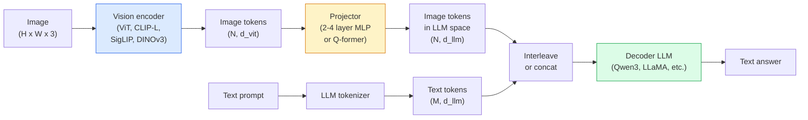

# Vision-Language Models — The ViT-MLP-LLM Pattern

> A vision encoder converts an image into tokens. An MLP projector maps those tokens into the LLM's embedding space. A language model does the rest. That pattern — ViT-MLP-LLM — is every production VLM in 2026.

**Type:** Learn + Use
**Languages:** Python
**Prerequisites:** Phase 4 Lesson 14 (ViT), Phase 4 Lesson 18 (CLIP), Phase 7 Lesson 02 (Self-Attention)
**Time:** ~75 minutes

## Learning Objectives

- State the ViT-MLP-LLM architecture and explain what each of the three components contributes
- Compare Qwen3-VL, InternVL3.5, LLaVA-Next, and GLM-4.6V on parameter count, context length, and benchmark performance
- Explain DeepStack: why multi-level ViT features tighten vision-language alignment better than a single last-layer feature
- Measure VLM hallucination in production with Cross-Modal Error Rate (CMER) and act on the signal

## The Problem

CLIP (Phase 4 Lesson 18) gives you a shared embedding space for images and text, which is enough for zero-shot classification and retrieval. It cannot answer "how many red cars are in this image?" because CLIP does not generate text — it only scores similarities.

Vision-Language Models (VLMs) — Qwen3-VL, InternVL3.5, LLaVA-Next, GLM-4.6V — bolt a CLIP-family image encoder to a full language model. The model sees an image plus a question and generates an answer. In 2026 open-source VLMs rival or beat GPT-5 and Gemini-2.5-Pro on multimodal benchmarks (MMMU, MMBench, DocVQA, ChartQA, MathVista, OSWorld).

The trio of pieces (ViT, projector, LLM) is the standard. The differences between models are in which ViT, which projector, which LLM, the training data, and the alignment recipe. Once you understand the pattern, swapping any component is mechanical.

## The Concept

### The ViT-MLP-LLM architecture



1. **Vision encoder** — a pretrained ViT (CLIP-L/14, SigLIP, DINOv3, or a fine-tuned variant). Produces patch tokens.
2. **Projector** — a small module (2-4 layer MLP, or a Q-former) that maps vision tokens into the LLM's embedding dimension. This is where most of the fine-tuning happens.
3. **LLM** — a decoder-only language model (Qwen3, Llama, Mistral, GLM, InternLM). Reads the vision + text tokens in sequence, generates text.

All three pieces are trainable in principle. In practice, the vision encoder and LLM stay mostly frozen while the projector trains — a few billion parameters of signal for cheap.

### DeepStack

Vanilla projection uses only the last ViT layer. DeepStack (Qwen3-VL) samples features from multiple ViT depths and stacks them. Deeper layers carry high-level semantics; shallower layers carry fine-grained spatial and textural information. Feeding both into the LLM closes the gap between "what does the image contain" (semantics) and "where exactly" (spatial grounding).

### Three training stages

Modern VLMs train in stages:

1. **Alignment** — freeze ViT and LLM. Train only the projector on image-caption pairs. Teaches the projector to map vision space into language space.
2. **Pre-training** — unfreeze everything. Train on large-scale interleaved image-text data (500M+ pairs). Builds the model's visual knowledge.
3. **Instruction tuning** — fine-tune on curated (image, question, answer) triples. Teaches conversational behaviour and task formats. This is what turns a "vision-aware LM" into a usable assistant.

Most LoRA fine-tunes target stage 3 with a small labelled dataset.

### Model family comparison (early 2026)

| Model | Params | Vision encoder | LLM | Context | Strengths |
|-------|--------|----------------|-----|---------|-----------|
| Qwen3-VL-235B-A22B (MoE) | 235B (22B active) | custom ViT + DeepStack | Qwen3 | 256K | General SOTA, GUI agent |
| Qwen3-VL-30B-A3B (MoE) | 30B (3B active) | custom ViT + DeepStack | Qwen3 | 256K | Smaller MoE alternative |
| Qwen3-VL-8B (dense) | 8B | custom ViT | Qwen3 | 128K | Production dense default |
| InternVL3.5-38B | 38B | InternViT-6B | Qwen3 + GPT-OSS | 128K | Strong MMBench / MMVet |
| InternVL3.5-241B-A28B | 241B (28B active) | InternViT-6B | Qwen3 | 128K | Competitive with GPT-4o |
| LLaVA-Next 72B | 72B | SigLIP | Llama-3 | 32K | Open, easy to fine-tune |
| GLM-4.6V | ~70B | custom | GLM | 64K | Open-source, strong OCR |
| MiniCPM-V-2.6 | 8B | SigLIP | MiniCPM | 32K | Edge-friendly |

### Visual agents

Qwen3-VL-235B reaches top global performance on OSWorld — a benchmark for **visual agents** that operate GUIs (desktop, mobile, web). The model sees a screenshot, understands the UI, and emits actions (click, type, scroll). Combined with tools, it closes the loop on common desktop tasks. This is what most 2026 "AI PC" demos run under the hood.

### Agentic capabilities + RoPE variants

VLMs need to know **when** a frame is in a video. Qwen3-VL evolved from T-RoPE (temporal rotary position embeddings) to **text-based time alignment** — explicit timestamp text tokens interleaved with video frames. The model sees "`<timestamp 00:32>` frame, prompt" and can reason about temporal relationships.

### The alignment problem

12% of image-text pairs in a crawled dataset contain descriptions not fully grounded in the image. A VLM trained on this silently learns to hallucinate — fabricate objects, misread numbers, invent relationships. In production this is the dominant failure mode.

Skywork.ai introduced the **Cross-Modal Error Rate (CMER)** to track it:

```
CMER = fraction of outputs where the text confidence is high but the image-text similarity (via a CLIP-family checker) is low
```

High CMER means the model is confidently saying things not grounded in the image. Monitoring CMER and treating it as a production KPI cut hallucination rate by ~35% in their deployment. The trick is not "fix the model" but "route high-CMER outputs to human review."

### Fine-tuning with LoRA / QLoRA

Full fine-tuning of a 70B VLM is out of reach for most teams. LoRA (rank 16-64) on attention + projector layers, or QLoRA with 4-bit base weights, fits on a single A100 / H100. Cost: 5,000-50,000 examples, $100-$5,000 in compute, 2-10 hours of training.

### Spatial reasoning is still weak

Current VLMs score 50-60% on spatial reasoning benchmarks (above-below, left-right, counting, distance). If your use case depends on "which object is on top of which," validate heavily — generic VLM performance is below human. Better-than-VLM alternatives for pure spatial tasks: a specialised keypoint / pose estimator, a depth model, or a detection model with box geometry post-processed.

## Build It

### Step 1: The projector

The part you will train most often. 2-4 layer MLP with GELU.

```python
import torch
import torch.nn as nn


class Projector(nn.Module):
    def __init__(self, vit_dim=768, llm_dim=4096, hidden=4096):
        super().__init__()
        self.net = nn.Sequential(
            nn.Linear(vit_dim, hidden),
            nn.GELU(),
            nn.Linear(hidden, llm_dim),
        )

    def forward(self, x):
        return self.net(x)
```

Input is a `(N_patches, d_vit)` token tensor. Output is `(N_patches, d_llm)`. The LLM treats every output row as just another token.

### Step 2: Assemble ViT-MLP-LLM end-to-end

Skeleton of the forward pass for a minimal VLM. Real code uses `transformers`; this is the conceptual layout.

```python
class MinimalVLM(nn.Module):
    def __init__(self, vit, projector, llm, image_token_id):
        super().__init__()
        self.vit = vit
        self.projector = projector
        self.llm = llm
        self.image_token_id = image_token_id  # placeholder token in text prompt

    def forward(self, image, input_ids, attention_mask):
        # 1. vision features
        vision_tokens = self.vit(image)                     # (B, N_patches, d_vit)
        vision_embeds = self.projector(vision_tokens)       # (B, N_patches, d_llm)

        # 2. text embeddings
        text_embeds = self.llm.get_input_embeddings()(input_ids)  # (B, M, d_llm)

        # 3. replace image placeholder tokens with vision embeds
        merged = self._merge(text_embeds, vision_embeds, input_ids)

        # 4. run LLM
        return self.llm(inputs_embeds=merged, attention_mask=attention_mask)

    def _merge(self, text_embeds, vision_embeds, input_ids):
        out = text_embeds.clone()
        expected = vision_embeds.size(1)
        for b in range(input_ids.size(0)):
            positions = (input_ids[b] == self.image_token_id).nonzero(as_tuple=True)[0]
            if len(positions) != expected:
                raise ValueError(
                    f"batch item {b} has {len(positions)} image tokens but vision_embeds has {expected} patches."
                    " Every sample in the batch must be pre-padded to the same number of image placeholder tokens.")
            out[b, positions] = vision_embeds[b]
        return out
```

The `<image>` placeholder token in the text gets replaced with real image embeddings — same pattern LLaVA, Qwen-VL, and InternVL use.

### Step 3: CMER computation

A lightweight runtime check.

```python
import torch.nn.functional as F


def cross_modal_error_rate(image_emb, text_emb, text_confidence, sim_threshold=0.25, conf_threshold=0.8):
    """
    image_emb, text_emb: embeddings of image and generated text (normalised internally)
    text_confidence:     mean per-token probability in [0, 1]
    Returns:             fraction of high-confidence outputs with low image-text alignment
    """
    image_emb = F.normalize(image_emb, dim=-1)
    text_emb = F.normalize(text_emb, dim=-1)
    sim = (image_emb * text_emb).sum(dim=-1)        # cosine similarity
    high_conf_low_sim = (text_confidence > conf_threshold) & (sim < sim_threshold)
    return high_conf_low_sim.float().mean().item()
```

Treat CMER as a production KPI. Monitor it per endpoint, per prompt type, per customer. Rising CMER indicates the model is starting to hallucinate on some input distribution.

### Step 4: Toy VLM classifier (runnable)

Demonstrate the projector trains. Fake "ViT features" go in; a tiny LLM-style token predicts a class.

```python
class ToyVLM(nn.Module):
    def __init__(self, vit_dim=32, llm_dim=64, num_classes=5):
        super().__init__()
        self.projector = Projector(vit_dim, llm_dim, hidden=64)
        self.head = nn.Linear(llm_dim, num_classes)

    def forward(self, vision_tokens):
        projected = self.projector(vision_tokens)
        pooled = projected.mean(dim=1)
        return self.head(pooled)
```

One can fit this on synthetic (feature, class) pairs in under 200 steps — enough to show the projector pattern works.

## Use It

Three ways production teams use VLMs in 2026:

- **Hosted API** — OpenAI Vision, Anthropic Claude Vision, Google Gemini Vision. Zero infra, vendor risk.
- **Open-source self-host** — Qwen3-VL or InternVL3.5 via `transformers` and `vllm`. Full control, higher up-front effort.
- **Fine-tune on domain** — load Qwen2.5-VL-7B or LLaVA-1.6-7B, LoRA on 5k-50k custom examples, serve with `vllm` or `TGI`.

```python
from transformers import AutoProcessor, AutoModelForVision2Seq
import torch
from PIL import Image

model_id = "Qwen/Qwen3-VL-8B-Instruct"
processor = AutoProcessor.from_pretrained(model_id)
model = AutoModelForVision2Seq.from_pretrained(model_id, torch_dtype=torch.bfloat16, device_map="auto")

messages = [{
    "role": "user",
    "content": [
        {"type": "image", "image": Image.open("plot.png")},
        {"type": "text", "text": "What does this chart show?"},
    ],
}]
inputs = processor.apply_chat_template(messages, add_generation_prompt=True, tokenize=True, return_dict=True, return_tensors="pt").to("cuda")
generated = model.generate(**inputs, max_new_tokens=256)
answer = processor.decode(generated[0][inputs["input_ids"].shape[1]:], skip_special_tokens=True)
```

`apply_chat_template` hides the `<image>` placeholder tokenisation; the model handles the merge internally.

## Ship It

This lesson produces:

- `outputs/prompt-vlm-selector.md` — picks Qwen3-VL / InternVL3.5 / LLaVA-Next / API given accuracy, latency, context length, and budget.
- `outputs/skill-cmer-monitor.md` — emits the code to instrument a production VLM endpoint with cross-modal error rate, per-endpoint dashboards, and alerting thresholds.

## Exercises

1. **(Easy)** Run three prompts ("what is this?", "count the objects", "describe the scene") through any open VLM on five images. Score each answer as correct / partially correct / hallucinated by hand. Compute a first-pass CMER-like rate.
2. **(Medium)** Fine-tune Qwen2.5-VL-3B or LLaVA-1.6-7B with LoRA (rank 16) on 500 images of a target domain with captions. Compare zero-shot vs fine-tuned MMBench-style accuracy.
3. **(Hard)** Replace the VLM's image encoder with DINOv3 instead of its default SigLIP/CLIP. Re-train only the projector (frozen LLM + frozen DINOv3). Measure whether dense-prediction tasks (counting, spatial reasoning) improve.

## Key Terms

| Term | What people say | What it actually means |
|------|----------------|----------------------|
| ViT-MLP-LLM | "The VLM pattern" | Vision encoder + projector + language model; every 2026 VLM |
| Projector | "The bridge" | 2-4 layer MLP (or Q-former) that maps vision tokens into LLM embedding space |
| DeepStack | "Qwen3-VL feature trick" | Multi-level ViT features stacked rather than last-layer only |
| Image token | "<image> placeholder" | Special token in the text stream replaced by projected vision embeddings |
| CMER | "Hallucination KPI" | Cross-Modal Error Rate; high when text confidence is high but image-text similarity is low |
| Visual agent | "VLM that clicks" | VLM operating GUIs (OSWorld, mobile, web) with tool calls |
| Q-former | "Fixed-count token bridge" | BLIP-2 style projector producing a fixed number of visual query tokens |
| Alignment / pre-training / instruction tuning | "Three stages" | Standard VLM training pipeline |

## Further Reading

- [Qwen3-VL Technical Report (arXiv 2511.21631)](https://arxiv.org/abs/2511.21631)
- [InternVL3.5 Advancing Open-Source Multimodal Models (arXiv 2508.18265)](https://arxiv.org/html/2508.18265v1)
- [LLaVA-Next series](https://llava-vl.github.io/blog/2024-05-10-llava-next-stronger-llms/)
- [BentoML: Best Open-Source VLMs 2026](https://www.bentoml.com/blog/multimodal-ai-a-guide-to-open-source-vision-language-models)
- [MMMU: Multi-discipline Multimodal Understanding benchmark](https://mmmu-benchmark.github.io/)
- [VLMs in manufacturing (Robotics Tomorrow, March 2026)](https://www.roboticstomorrow.com/story/2026/03/when-machines-learn-to-see-like-experts-the-rise-of-vision-language-models-in-manufacturing/26335/)
