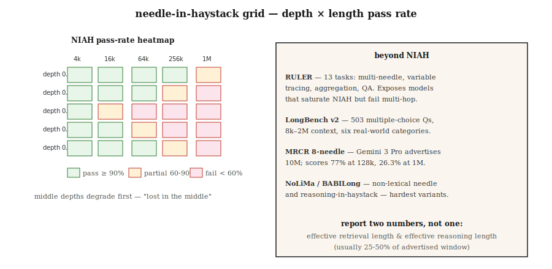

# Long-Context Evaluation — NIAH, RULER, LongBench, MRCR

> Gemini 3 Pro advertises 10M tokens of context. At 1M tokens, 8-needle MRCR drops to 26.3%. Advertised ≠ usable. Long-context evaluation tells you the actual capacity of the model you are shipping on.

**Type:** Learn
**Languages:** Python
**Prerequisites:** Phase 5 · 13 (Question Answering), Phase 5 · 23 (Chunking Strategies)
**Time:** ~60 minutes

## The Problem

You have a 200-page contract. The model claims a 1M-token context. You paste the contract in and ask: "What is the termination clause?" The model answers — but answers from the cover page because the termination clause sits at 120k tokens deep, past where the model actually attends.

This is the 2026 context-capacity gap. Spec sheets say 1M or 10M. Reality says 60-70% of that is usable, and "usable" depends on the task.

- **Retrieval (single needle in haystack):** near-perfect up to the advertised max on frontier models.
- **Multi-hop / aggregation:** degrades sharply past ~128k on most models.
- **Reasoning over dispersed facts:** the first task to fail.

Long-context evaluation measures these axes. This lesson names the benchmarks, what each actually measures, and how to build a custom needle test for your domain.

## The Concept



**Needle-in-a-Haystack (NIAH, 2023).** Place a fact ("the magic word is pineapple") at a controlled depth in a long context. Ask the model to retrieve it. Sweep depth × length. The original long-context benchmark. Frontier models now saturate this; it is a necessary but not sufficient baseline.

**RULER (Nvidia, 2024).** 13 task types across 4 categories: retrieval (single / multi-key / multi-value), multi-hop tracing (variable tracking), aggregation (common word frequency), QA. Configurable context length (4k to 128k+). Reveals models that saturate NIAH but fail on multi-hop. In the 2024 release, only half of 17 models claiming 32k+ context maintained quality at 32k.

**LongBench v2 (2024).** 503 multiple-choice questions, 8k-2M word contexts, six task categories: single-doc QA, multi-doc QA, long in-context learning, long dialogue, code repo, long structured data. The production benchmark for real-world long-context behavior.

**MRCR (Multi-Round Coreference Resolution).** Multi-turn coreference at scale. 8-needle, 24-needle, 100-needle variants. Exposes how many facts a model can juggle before attention degrades.

**NoLiMa.** "Non-lexical needle." The needle and the query share no literal overlap; retrieval requires one step of semantic reasoning. Harder than NIAH.

**HELMET.** Concatenates many documents, asks a question from any one. Tests selective attention.

**BABILong.** Embeds bAbI reasoning chains inside irrelevant haystacks. Tests reasoning-in-a-haystack, not just retrieval.

### What to actually report

- **Advertised context window.** The spec-sheet number.
- **Effective retrieval length.** NIAH pass at some threshold (e.g., 90%).
- **Effective reasoning length.** Multi-hop or aggregation pass at that threshold.
- **Degradation curve.** Accuracy vs context length, plotted per task type.

Two numbers for your spec sheet: retrieval-effective and reasoning-effective. Usually the reasoning-effective is 25-50% of the advertised window.

## Build It

### Step 1: a custom NIAH for your domain

See `code/main.py`. The skeleton:

```python
def build_haystack(filler_text, needle, depth_ratio, total_tokens):
    if not (0.0 <= depth_ratio <= 1.0):
        raise ValueError(f"depth_ratio must be in [0, 1], got {depth_ratio}")
    if total_tokens <= 0:
        raise ValueError(f"total_tokens must be positive, got {total_tokens}")

    filler_tokens = tokenize(filler_text)
    needle_tokens = tokenize(needle)
    if not filler_tokens:
        raise ValueError("filler_text produced no tokens")

    # Repeat filler until long enough to fill the haystack body.
    body_len = max(total_tokens - len(needle_tokens), 0)
    while len(filler_tokens) < body_len:
        filler_tokens = filler_tokens + filler_tokens
    filler_tokens = filler_tokens[:body_len]

    insert_at = min(int(body_len * depth_ratio), body_len)
    haystack = filler_tokens[:insert_at] + needle_tokens + filler_tokens[insert_at:]
    return " ".join(haystack)


def score_niah(model, haystack, question, expected):
    answer = model.complete(f"Context: {haystack}\nQ: {question}\nA:", max_tokens=50)
    return 1 if expected.lower() in answer.lower() else 0
```

Sweep `depth_ratio` ∈ {0, 0.25, 0.5, 0.75, 1.0} × `total_tokens` ∈ {1k, 4k, 16k, 64k}. Plot the heatmap. That is the NIAH card for your target model.

### Step 2: a multi-needle variant

```python
def build_multi_needle(filler, needles, total_tokens):
    depths = [0.1, 0.4, 0.7]
    chunks = [filler[:int(total_tokens * 0.1)]]
    for depth, needle in zip(depths, needles):
        chunks.append(needle)
        next_chunk = filler[int(total_tokens * depth): int(total_tokens * (depth + 0.3))]
        chunks.append(next_chunk)
    return " ".join(chunks)
```

Questions like "What are the three magic words?" require retrieving all three. Single-needle success does not predict multi-needle success.

### Step 3: multi-hop variable tracing (RULER-style)

```python
haystack = """X1 = 42. ... (filler) ... X2 = X1 + 10. ... (filler) ... X3 = X2 * 2."""
question = "What is X3?"
```

The answer requires chaining three assignments. Frontier models at 128k often drop to 50-70% accuracy here.

### Step 4: LongBench v2 on your stack

```python
from datasets import load_dataset
longbench = load_dataset("THUDM/LongBench-v2")

def eval_model_on_longbench(model, subset="single-doc-qa"):
    tasks = [x for x in longbench["test"] if x["task"] == subset]
    correct = 0
    for x in tasks:
        answer = model.complete(x["context"] + "\n\nQ: " + x["question"], max_tokens=20)
        if normalize(answer) == normalize(x["answer"]):
            correct += 1
    return correct / len(tasks)
```

Report per-category accuracy. Aggregate scores hide big task-level differences.

## Pitfalls

- **NIAH-only evaluation.** Passing NIAH at 1M tokens says nothing about multi-hop. Always run RULER or a custom multi-hop test.
- **Uniform depth sampling.** Many implementations only test depth=0.5. Test depth=0, 0.25, 0.5, 0.75, 1.0 — the "lost in the middle" effect is real.
- **Lexical overlap with filler.** If the needle shares keywords with the filler, retrieval becomes trivial. Use NoLiMa-style non-overlapping needles.
- **Ignoring latency.** 1M-token prompts take 30-120 seconds to prefill. Measure time-to-first-token alongside accuracy.
- **Vendor-self-reported numbers.** OpenAI, Google, Anthropic all publish their own scores. Always re-run independently on your use case.

## Use It

The 2026 stack:

| Situation | Benchmark |
|-----------|-----------|
| Quick sanity check | Custom NIAH at 3 depths × 3 lengths |
| Model selection for production | RULER (13 tasks) at your target length |
| Real-world QA quality | LongBench v2 single-doc-QA subset |
| Multi-hop reasoning | BABILong or custom variable-tracing |
| Conversational / dialogue | MRCR 8-needle at your target length |
| Model upgrade regression | Fixed in-house NIAH + RULER harness, run on every new model |

Rule of thumb for production: never trust a context window until you have NIAH + 1 reasoning task at your intended length.

## Ship It

Save as `outputs/skill-long-context-eval.md`:

```markdown
---
name: long-context-eval
description: Design a long-context evaluation battery for a given model and use case.
version: 1.0.0
phase: 5
lesson: 28
tags: [nlp, long-context, evaluation]
---

Given a target model, target context length, and use case, output:

1. Tests. NIAH depth × length grid; RULER multi-hop; custom domain task.
2. Sampling. Depths 0, 0.25, 0.5, 0.75, 1.0 at each length.
3. Metrics. Retrieval pass rate; reasoning pass rate; time-to-first-token; cost-per-query.
4. Cutoff. Effective retrieval length (90% pass) and effective reasoning length (70% pass). Report both.
5. Regression. Fixed harness, rerun on every model upgrade, surface deltas.

Refuse to trust a context window from the model card alone. Refuse NIAH-only evaluation for any multi-hop workload. Refuse vendor self-reported long-context scores as independent evidence.
```

## Exercises

1. **Easy.** Build a NIAH with 3 depths (0.25, 0.5, 0.75) × 3 lengths (1k, 4k, 16k). Run on any model. Plot pass rate as a 3×3 heatmap.
2. **Medium.** Add a 3-needle variant. Measure retrieval of all 3 at each length. Compare to single-needle pass rate at the same length.
3. **Hard.** Construct a variable-tracing task (X1 → X2 → X3, with 3 hops) embedded in 64k of filler. Measure accuracy across 3 frontier models. Report effective reasoning length per model.

## Key Terms

| Term | What people say | What it actually means |
|------|-----------------|-----------------------|
| NIAH | Needle in haystack | Plant a fact in filler, ask the model to retrieve it. |
| RULER | NIAH on steroids | 13 task types across retrieval / multi-hop / aggregation / QA. |
| Effective context | The real capacity | Length at which accuracy still holds above threshold. |
| Lost in the middle | Depth bias | Models under-attend to content in the middle of long inputs. |
| Multi-needle | Many facts at once | Multiple plants; tests attention juggling, not retrieval alone. |
| MRCR | Multi-round coref | 8, 24, or 100-needle coreference; exposes attention saturation. |
| NoLiMa | Non-lexical needle | Needle and query share no literal tokens; requires reasoning. |

## Further Reading

- [Kamradt (2023). Needle in a Haystack analysis](https://github.com/gkamradt/LLMTest_NeedleInAHaystack) — the original NIAH repo.
- [Hsieh et al. (2024). RULER: What's the Real Context Size of Your Long-Context LMs?](https://arxiv.org/abs/2404.06654) — the multi-task benchmark.
- [Bai et al. (2024). LongBench v2](https://arxiv.org/abs/2412.15204) — real-world long-context eval.
- [Modarressi et al. (2024). NoLiMa: Non-lexical needles](https://arxiv.org/abs/2404.06666) — harder needles.
- [Kuratov et al. (2024). BABILong](https://arxiv.org/abs/2406.10149) — reasoning-in-haystack.
- [Liu et al. (2024). Lost in the Middle: How Language Models Use Long Contexts](https://arxiv.org/abs/2307.03172) — the depth-bias paper.
