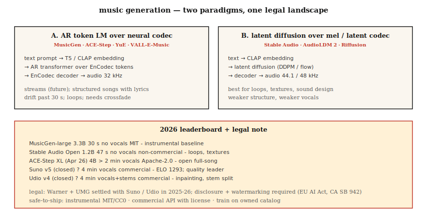

# Music Generation — MusicGen, Stable Audio, Suno, and the Licensing Earthquake

> 2026 music generation: Suno v5 and Udio v4 dominate commercial; MusicGen, Stable Audio Open, and ACE-Step lead open-source. The technical problem is mostly solved. The legal problem (Warner Music $500M settlement, UMG settlement) reshaped the field in 2025-2026.

**Type:** Build
**Languages:** Python
**Prerequisites:** Phase 6 · 02 (Spectrograms), Phase 4 · 10 (Diffusion Models)
**Time:** ~75 minutes

## The Problem

Text → a 30-second to 4-minute music clip, with lyrics, vocals, and structure. Three sub-problems:

1. **Instrumental generation.** Text like "lo-fi hip-hop drums with warm keys" → audio. MusicGen, Stable Audio, AudioLDM.
2. **Song generation (with vocals + lyrics).** "Country song about rainy Texas nights" → full song. Suno, Udio, YuE, ACE-Step.
3. **Conditional / controllable.** Extend an existing clip, regenerate a bridge, swap genre, stem-separate, or inpaint. Udio's inpainting + stem separation is the 2026 feature to match.

## The Concept



### Token LM over neural-codec tokens

Meta's **MusicGen** (2023, MIT) and many derivatives: condition on text/melody embeddings, autoregressively predict EnCodec tokens (32 kHz, 4 codebooks), decode with EnCodec. 300M - 3.3B params. Strong baseline; struggles past 30 seconds.

**ACE-Step** (open-source, 4B XL released April 2026) extends this for full-song lyric-conditioned generation. The open community's closest thing to Suno.

### Diffusion over mels or latents

**Stable Audio (2023)** and **Stable Audio Open (2024)**: latent diffusion on compressed audio. Excels at loops, sound design, ambient textures. Not great at structured full songs.

**AudioLDM / AudioLDM2**: text-to-audio via T2I-style latent diffusion, generalized to music, sound effects, speech.

### Hybrid (production) — Suno, Udio, Lyria

Closed weights. Likely AR codec LM + diffusion-based vocoder with specialized voice / drum / melody heads. Suno v5 (2026) is the ELO 1293 quality leader. Udio v4 adds inpainting + stem separation (bass, drums, vocals separate downloads).

### Evaluation

- **FAD (Fréchet Audio Distance).** Embedding-level distance between generated vs real audio distribution using VGGish or PANNs features. Lower is better. MusicGen small: 4.5 FAD on MusicCaps; SOTA ~3.0.
- **Musicality (subjective).** Human preference. Suno v5 ELO 1293 leads.
- **Text-audio alignment.** CLAP score between prompt and output.
- **Musicality artifacts.** Off-beat transitions, vocal-phrase drift, loss of structure past 30 s.

## 2026 model map

| Model | Params | Length | Vocals | License |
|-------|--------|--------|--------|---------|
| MusicGen-large | 3.3B | 30 s | no | MIT |
| Stable Audio Open | 1.2B | 47 s | no | Stability non-commercial |
| ACE-Step XL (Apr 2026) | 4B | &gt; 2 min | yes | Apache-2.0 |
| YuE | 7B | &gt; 2 min | yes, multilingual | Apache-2.0 |
| Suno v5 (closed) | ? | 4 min | yes, ELO 1293 | commercial |
| Udio v4 (closed) | ? | 4 min | yes + stems | commercial |
| Google Lyria 3 (closed) | ? | real-time | yes | commercial |
| MiniMax Music 2.5 | ? | 4 min | yes | commercial API |

## The legal landscape (2025-2026)

- **Warner Music vs Suno settlement.** $500M. WMG now has oversight of AI-likeness, music rights, and user-generated tracks on Suno. Similar UMG settlement on Udio.
- **EU AI Act** + **California SB 942**: AI-generated music must be disclosed.
- **Riffusion / MusicGen** under MIT have no compliance baggage but also no commercial vocals.

Safe-to-ship patterns:

1. Generate instrumental only (MusicGen, Stable Audio Open, MIT/CC0 outputs).
2. Use commercial APIs (Suno, Udio, ElevenLabs Music) with per-generation license.
3. Train on owned or licensed catalog (most enterprises end up here).
4. Tag generations with watermarks + metadata.

## Build It

### Step 1: generate with MusicGen

```python
from audiocraft.models import MusicGen
import torchaudio

model = MusicGen.get_pretrained("facebook/musicgen-small")
model.set_generation_params(duration=10)
wav = model.generate(["upbeat synthwave with driving drums, 128 BPM"])
torchaudio.save("out.wav", wav[0].cpu(), 32000)
```

Three sizes: `small` (300M, fast), `medium` (1.5B), `large` (3.3B). Small is enough for "does the idea land."

### Step 2: melody conditioning

```python
melody, sr = torchaudio.load("humming.wav")
wav = model.generate_with_chroma(
    ["jazz piano cover"],
    melody.squeeze(),
    sr,
)
```

MusicGen-melody takes a chromagram and preserves the tune while swapping timbre. Useful for "give me this melody as a string quartet."

### Step 3: FAD evaluation

```python
from frechet_audio_distance import FrechetAudioDistance
fad = FrechetAudioDistance()

fad.get_fad_score("generated_folder/", "reference_folder/")
```

Computes VGGish-embedding distance. Useful for genre-level regression tests; not a substitute for human listeners.

### Step 4: adding to the LLM-music workflow

Combine with the ideas from Lessons 7-8:

```python
prompt = "Write a 30-second jazz loop. Describe the drums, bass, and piano voicing."
description = llm.complete(prompt)
music = musicgen.generate([description], duration=30)
```

## Use It

| Goal | Stack |
|------|-------|
| Instrumental sound design | Stable Audio Open |
| Game / adaptive music | Google Lyria RealTime (closed) |
| Full songs with vocals (commercial) | Suno v5 or Udio v4 with explicit license |
| Full songs with vocals (open) | ACE-Step XL or YuE |
| Short ad jingle | MusicGen melody-conditioned on a hummed reference |
| Music-video background | MusicGen + Stable Video Diffusion |

## Pitfalls that still ship in 2026

- **Copyright-laundering prompts.** "Song in the style of Taylor Swift" — commercial Suno/Udio filter these now, open models do not. Add your own filter list.
- **Repetition / drift past 30 s.** AR models loop. Crossfade multiple generations, or use ACE-Step for structural coherence.
- **Tempo drift.** Models wander off the BPM. Use BPM tags in the prompt and post-filter with librosa's `beat_track`.
- **Vocal intelligibility.** Suno is excellent; open models are often mushy on words. If lyrics matter, use a commercial API or fine-tune.
- **Mono output.** Open models generate mono or fake-stereo. Upgrade with a proper stereo reconstruction (ezst, Cartesia's stereo diffusion).

## Ship It

Save as `outputs/skill-music-designer.md`. Pick model, license strategy, length / structure plan, and disclosure metadata for a music-gen deployment.

## Exercises

1. **Easy.** Run `code/main.py`. It produces a "generative" chord progression + drum pattern as ASCII symbols — a music-gen cartoon. Play it back via any MIDI renderer if you want.
2. **Medium.** Install `audiocraft`, generate 10-second clips across 4 genre prompts with MusicGen-small, measure FAD against a reference genre set.
3. **Hard.** Using ACE-Step (or MusicGen-melody), generate three variations of the same tune with different timbre prompts. Compute CLAP similarity to the prompt to verify alignment.

## Key Terms

| Term | What people say | What it actually means |
|------|-----------------|-----------------------|
| FAD | Audio FID | Fréchet distance between embedding distributions of real vs generated. |
| Chromagram | Melody as pitches | 12-dim per-frame vector; input to melody conditioning. |
| Stems | Instrument tracks | Separated bass / drums / vocals / melody as WAV. |
| Inpainting | Regen a section | Mask a time window; model regenerates just that. |
| CLAP | Text-audio CLIP | Contrastive audio-text embedding; eval text-audio alignment. |
| EnCodec | Music codec | Meta's neural codec used by MusicGen; 32 kHz, 4 codebooks. |

## Further Reading

- [Copet et al. (2023). MusicGen](https://arxiv.org/abs/2306.05284) — the open autoregressive benchmark.
- [Evans et al. (2024). Stable Audio Open](https://arxiv.org/abs/2407.14358) — the sound-design default.
- [ACE-Step](https://github.com/ace-step/ACE-Step) — open 4B full-song generator, April 2026.
- [Suno v5 platform docs](https://suno.com) — the commercial quality leader.
- [AudioLDM2](https://arxiv.org/abs/2308.05734) — latent diffusion for music + sound effects.
- [WMG-Suno settlement coverage](https://www.musicbusinessworldwide.com/suno-warner-music-settlement/) — Nov 2025 precedent.
