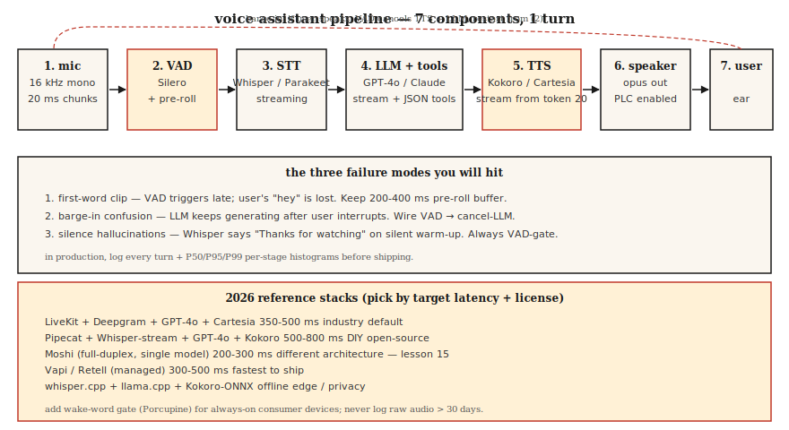

# Build a Voice Assistant Pipeline — The Phase 6 Capstone

> Everything from lessons 01-11, stitched together. Build a voice assistant that listens, reasons, and talks back. In 2026 that is a solved engineering problem, not a research problem — but the integration details decide whether it ships.

**Type:** Build
**Languages:** Python
**Prerequisites:** Phase 6 · 04, 05, 06, 07, 11; Phase 11 · 09 (Function Calling); Phase 14 · 01 (Agent Loop)
**Time:** ~120 minutes

## The Problem

Build an end-to-end assistant:

1. Captures mic input (16 kHz mono).
2. Detects start/end of user speech.
3. Transcribes streaming.
4. Passes transcript to an LLM that can call tools (timer, weather, calendar).
5. Streams LLM text to a TTS.
6. Plays audio back to the user.
7. Stops if the user interrupts mid-response.

Latency target: first TTS audio byte within 800 ms of the user finishing their utterance on a laptop CPU. Quality target: no missed words, no hallucinated subtitles on silence, no voice cloning leakage, no prompt injection success.

## The Concept



### The seven components

1. **Audio capture.** Mic → 16 kHz mono → 20 ms chunks. Usually `sounddevice` in Python or native AudioUnit/ALSA/WASAPI in production.
2. **VAD (Lesson 11).** Silero VAD @ threshold 0.5, min speech 250 ms, silence hang-over 500 ms. Signals "start" and "end."
3. **Streaming STT (Lesson 4-5).** Whisper-streaming, Parakeet-TDT, or Deepgram Nova-3 (API). Partial + final transcripts.
4. **LLM with tool calling.** GPT-4o / Claude 3.5 / Gemini 2.5 Flash. JSON schema for tools. Stream tokens.
5. **Streaming TTS (Lesson 7).** Kokoro-82M (fastest open) or Cartesia Sonic (commercial). Start TTS after 20 LLM tokens.
6. **Playback.** Speaker out; opus-encode for low-bandwidth networks.
7. **Interruption handler.** If VAD fires during TTS playback, stop playback, cancel LLM, restart STT.

### The three failure modes you will hit

1. **First-word clip.** VAD starts a beat too late. User's "hey" is missing. Start threshold at 0.3, not 0.5.
2. **Mid-response interrupt confusion.** LLM keeps generating after user interrupts; assistant talks over user. Wire VAD → cancel-LLM.
3. **Silence hallucination.** Whisper outputs "Thanks for watching" on the silent warm-up frames. Always VAD-gate.

### 2026 production reference stacks

| Stack | Latency | License | Notes |
|-------|---------|---------|-------|
| LiveKit + Deepgram + GPT-4o + Cartesia | 350-500 ms | commercial API | Industry default 2026 |
| Pipecat + Whisper-streaming + GPT-4o + Kokoro | 500-800 ms | mostly open | DIY-friendly |
| Moshi (full-duplex) | 200-300 ms | CC-BY 4.0 | Single-model; different architecture, lesson 15 |
| Vapi / Retell (managed) | 300-500 ms | commercial | Fastest to launch; limited customization |
| Whisper.cpp + llama.cpp + Kokoro-ONNX | offline | open | Privacy / edge |

## Build It

### Step 1: mic capture with chunking (pseudocode)

```python
import sounddevice as sd

def mic_stream(chunk_ms=20, sr=16000):
    q = queue.Queue()
    def cb(indata, frames, time, status):
        q.put(indata.copy().flatten())
    with sd.InputStream(channels=1, samplerate=sr, blocksize=int(sr * chunk_ms/1000), callback=cb):
        while True:
            yield q.get()
```

### Step 2: VAD-gated turn capture

```python
def capture_turn(stream, vad, pre_roll_ms=300, silence_ms=500):
    buf, pre, triggered = [], collections.deque(maxlen=pre_roll_ms // 20), False
    silent = 0
    for chunk in stream:
        pre.append(chunk)
        if vad(chunk):
            if not triggered:
                buf = list(pre)
                triggered = True
            buf.append(chunk)
            silent = 0
        elif triggered:
            silent += 20
            buf.append(chunk)
            if silent >= silence_ms:
                return b"".join(buf)
```

### Step 3: streaming STT → LLM → TTS

```python
async def turn(audio_bytes):
    transcript = await stt.transcribe(audio_bytes)
    async for token in llm.stream(transcript):
        async for audio in tts.stream(token):
            await speaker.play(audio)
```

### Step 4: tool calling inside the LLM loop

```python
tools = [
    {"name": "get_weather", "parameters": {"location": "string"}},
    {"name": "set_timer", "parameters": {"seconds": "int"}},
]

async for chunk in llm.stream(user_text, tools=tools):
    if chunk.type == "tool_call":
        result = dispatch(chunk.name, chunk.args)
        continue_streaming(result)
    if chunk.type == "text":
        await tts.stream(chunk.text)
```

### Step 5: interruption handling

```python
tts_task = asyncio.create_task(tts_loop())
while True:
    chunk = await mic.get()
    if vad(chunk):
        tts_task.cancel()
        await speaker.stop()
        await new_turn()
        break
```

## Use It

See `code/main.py` for a runnable simulation that wires all seven components with stub models, so you can see the pipeline shape even without hardware. For a real implementation, swap stubs with:

- `silero-vad` (`pip install silero-vad`)
- `deepgram-sdk` or `openai-whisper`
- `openai` (`gpt-4o`) or `anthropic`
- `kokoro` or `cartesia`
- `sounddevice` for I/O

## Pitfalls

- **Logging PII forever.** Full-turn audio is PII in most jurisdictions. 30-day retention, encrypted at rest.
- **No barge-in.** Users will interrupt. Your assistant must stop talking.
- **TTS that blocks.** Synchronous TTS blocks the event loop. Use async or a separate thread.
- **No tool-call error handling.** Tools fail. LLM must get back the error + retry once, then gracefully degrade.
- **Overzealous hallucination filters.** Over-filter and the assistant repeats "I can't help with that." Under-filter and it says anything. Calibrate on a held-out set.
- **No wake-word option.** Always-listening is a privacy liability. Add a wake-word gate (Porcupine or openWakeWord).

## Ship It

Save as `outputs/skill-voice-assistant-architect.md`. Given budget + scale + language + compliance constraints, produce a full stack spec.

## Exercises

1. **Easy.** Run `code/main.py`. It simulates one full turn end-to-end with stub modules and prints per-stage latency.
2. **Medium.** Replace the STT stub with a real Whisper model on a pre-recorded `.wav`. Measure WER and end-to-end latency.
3. **Hard.** Add tool calling: implement `get_weather` (any API) and `set_timer`. Route the LLM through the tools and verify that when the user says "set a 5 minute timer" the right function fires and the spoken reply confirms it.

## Key Terms

| Term | What people say | What it actually means |
|------|-----------------|-----------------------|
| Turn | A user + assistant round-trip | One VAD-bounded user speech + one LLM-TTS response. |
| Barge-in | Interruption | User speaks while assistant talks; assistant stops. |
| Wake word | "Hey assistant" | Short keyword detector; Porcupine, Snowboy, openWakeWord. |
| End-pointing | Turn ending | VAD + min-silence decision that user has finished. |
| Pre-roll | Pre-speech buffer | Keep 200-400 ms of audio before VAD fires to avoid first-word clip. |
| Tool call | Function invocation | LLM emits JSON; runtime dispatches; result feeds back in-loop. |

## Further Reading

- [LiveKit — voice agent quickstart](https://docs.livekit.io/agents/) — production-grade reference.
- [Pipecat — voice agent examples](https://github.com/pipecat-ai/pipecat) — DIY-friendly framework.
- [OpenAI Realtime API](https://platform.openai.com/docs/guides/realtime) — the managed voice-native path.
- [Kyutai Moshi](https://github.com/kyutai-labs/moshi) — full-duplex reference (Lesson 15).
- [Porcupine wake-word](https://picovoice.ai/products/porcupine/) — wake-word gating.
- [Anthropic — tool use guide](https://docs.anthropic.com/en/docs/build-with-claude/tool-use) — LLM function calling.
