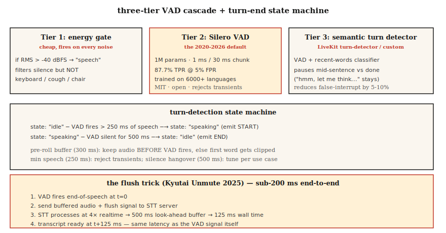

# Voice Activity Detection & Turn-Taking — Silero, Cobra, and the Flush Trick

> Every voice agent lives or dies on two decisions: is the user speaking now, and are they done? VAD answers the first. Turn-detection (VAD + silence-hangover + semantic endpoint model) answers the second. Get either wrong and your assistant either cuts users off or never shuts up.

**Type:** Build
**Languages:** Python
**Prerequisites:** Phase 6 · 11 (Real-Time Audio), Phase 6 · 12 (Voice Assistant)
**Time:** ~45 minutes

## The Problem

Three distinct decisions a voice agent makes on every 20 ms chunk:

1. **Is this frame speech?** — VAD. Binary, per-frame.
2. **Has the user started a new utterance?** — onset detection.
3. **Has the user finished?** — end-pointing (turn-end).

The naive answer (energy threshold) fails on any noise — traffic, keyboards, crowd babble. The 2026 answer: Silero VAD (open, deep-learned) + a turn-detection model (semantic endpointing) + a VAD-calibrated silence hangover.

## The Concept



### The three-tier VAD cascade

**Tier 1: energy gate.** Cheapest. Threshold RMS at -40 dBFS. Filters obvious silence but fires on any noise above the threshold.

**Tier 2: Silero VAD** (2020-2026, MIT). 1M parameters. Trained on 6000+ languages. Runs in ~1 ms per 30 ms chunk on a single CPU thread. 87.7% TPR at 5% FPR. The open-source default.

**Tier 3: semantic turn detector.** LiveKit's turn-detection model (2024-2026) or your own small classifier. Distinguishes "pause mid-sentence" from "done talking." Uses linguistic context (intonation + recent words), not just silence.

### Key parameters and their defaults

- **Threshold.** Silero outputs a probability; classify speech at &gt; 0.5 (default) or &gt; 0.3 (sensitive). Lower threshold = fewer first-word clips, more false positives.
- **Minimum speech duration.** Reject speech shorter than 250 ms — usually coughs or chair noise.
- **Silence hangover (end-pointing).** After VAD returns to 0, wait 500-800 ms before declaring end-of-turn. Too short → interrupt user. Too long → feels sluggish.
- **Pre-roll buffer.** Keep 300-500 ms of audio before VAD fires. Prevents "hey" being clipped.

### The flush trick (Kyutai 2025)

Streaming STT models have a look-ahead delay (500 ms for Kyutai STT-1B, 2.5 s for STT-2.6B). Normally you'd wait that long after end-of-speech for the transcript. Flush trick: when VAD fires end-of-speech, **send a flush signal to the STT** that forces immediate output. STT processes at ~4× realtime, so the 500 ms buffer finishes in ~125 ms.

End-to-end: 125 ms VAD + flush STT = conversational latency.

### 2026 VAD comparison

| VAD | TPR @ 5% FPR | Latency | License |
|-----|--------------|---------|---------|
| WebRTC VAD (Google, 2013) | 50.0% | 30 ms | BSD |
| Silero VAD (2020-2026) | 87.7% | ~1 ms | MIT |
| Cobra VAD (Picovoice) | 98.9% | ~1 ms | commercial |
| pyannote segmentation | 95% | ~10 ms | MIT-ish |

Silero is the right default. Cobra is the compliance / accuracy upgrade. Energy-only VAD has no place in 2026 production.

## Build It

### Step 1: the energy gate

```python
def energy_vad(chunk, threshold_dbfs=-40.0):
    rms = (sum(x * x for x in chunk) / len(chunk)) ** 0.5
    dbfs = 20.0 * math.log10(max(rms, 1e-10))
    return dbfs > threshold_dbfs
```

### Step 2: Silero VAD in Python

```python
from silero_vad import load_silero_vad, get_speech_timestamps

vad = load_silero_vad()
audio = torch.tensor(waveform_16k, dtype=torch.float32)
segments = get_speech_timestamps(
    audio, vad, sampling_rate=16000,
    threshold=0.5,
    min_speech_duration_ms=250,
    min_silence_duration_ms=500,
    speech_pad_ms=300,
)
for s in segments:
    print(f"{s['start']/16000:.2f}s - {s['end']/16000:.2f}s")
```

### Step 3: turn-end state machine

```python
class TurnDetector:
    def __init__(self, silence_hangover_ms=500, min_speech_ms=250):
        self.state = "idle"
        self.speech_ms = 0
        self.silence_ms = 0
        self.silence_hangover_ms = silence_hangover_ms
        self.min_speech_ms = min_speech_ms

    def update(self, is_speech, chunk_ms=20):
        if is_speech:
            self.speech_ms += chunk_ms
            self.silence_ms = 0
            if self.state == "idle" and self.speech_ms >= self.min_speech_ms:
                self.state = "speaking"
                return "START"
        else:
            self.silence_ms += chunk_ms
            if self.state == "speaking" and self.silence_ms >= self.silence_hangover_ms:
                self.state = "idle"
                self.speech_ms = 0
                return "END"
        return None
```

### Step 4: the flush trick skeleton

```python
def flush_on_end(stt_client, audio_buffer):
    stt_client.send_audio(audio_buffer)
    stt_client.send_flush()
    return stt_client.recv_transcript(timeout_ms=150)
```

STT (Kyutai, Deepgram, AssemblyAI) must support flush for this to work. Whisper streaming does not — it's block-based and always waits for chunks.

## Use It

| Situation | VAD choice |
|-----------|-----------|
| Open, fast, general | Silero VAD |
| Commercial call center | Cobra VAD |
| On-device (phone) | Silero VAD ONNX |
| Research / diarization | pyannote segmentation |
| Zero-dependency fallback | WebRTC VAD (legacy) |
| Need turn-ending quality | Silero + LiveKit turn-detector layered |

Rule of thumb: never ship energy-only VAD unless you really have no other option.

## Pitfalls

- **Fixed threshold.** Works in quiet, fails in noisy. Either calibrate on-device or switch to Silero.
- **Too-short silence hangover.** Agent interrupts mid-sentence. 500-800 ms is the sweet spot for conversational speech.
- **Too-long hangover.** Feels sluggish. A/B test with target users.
- **No pre-roll buffer.** First 200-300 ms of user audio lost. Always keep a rolling pre-roll.
- **Ignoring semantic endpointing.** "Hmm, let me think..." contains long pauses. Users hate being cut off mid-thought. Use LiveKit's turn-detector or similar.

## Ship It

Save as `outputs/skill-vad-tuner.md`. Pick VAD model, threshold, hangover, pre-roll, and turn-detection strategy for a workload.

## Exercises

1. **Easy.** Run `code/main.py`. It simulates a speech + silence + speech + coughs sequence and tests three VAD tiers.
2. **Medium.** Install `silero-vad`, process a 5-min recording, tune threshold to minimize both first-word clips and false triggers. Report precision/recall.
3. **Hard.** Build a mini turn-detector: Silero VAD + a 3-layer MLP on the last 10 words' embeddings (use sentence-transformers). Train on a hand-labeled turn-end dataset. Beat Silero-only by 10% F1.

## Key Terms

| Term | What people say | What it actually means |
|------|-----------------|-----------------------|
| VAD | Voice detector | Binary per-frame: is this speech? |
| Turn detection | End-pointing | VAD + silence-hangover + semantic endpoint. |
| Silence hangover | Wait-after-speech | Time to wait before declaring turn end; 500-800 ms. |
| Pre-roll | Pre-speech buffer | Keep 300-500 ms audio before VAD fires. |
| Flush trick | Kyutai hack | VAD → flush-STT → 125 ms instead of 500 ms delay. |
| Semantic endpoint | "Did they mean to stop?" | ML classifier that looks at words, not just silence. |
| TPR @ FPR 5% | ROC point | Standard VAD benchmark; 87.7% for Silero, 50% WebRTC. |

## Further Reading

- [Silero VAD](https://github.com/snakers4/silero-vad) — the reference open VAD.
- [Picovoice Cobra VAD](https://picovoice.ai/products/cobra/) — commercial accuracy leader.
- [Kyutai — Unmute + flush trick](https://kyutai.org/stt) — the sub-200 ms engineering trick.
- [LiveKit — turn detection](https://docs.livekit.io/agents/logic/turns/) — semantic endpointing in production.
- [WebRTC VAD](https://webrtc.googlesource.com/src/) — the legacy baseline.
- [pyannote segmentation](https://github.com/pyannote/pyannote-audio) — diarization-grade segmentation.
