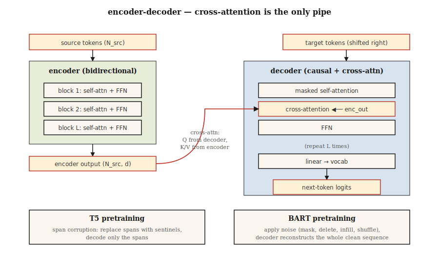

# T5, BART — Encoder-Decoder Models

> Encoders understand. Decoders generate. Put them back together and you get a model built for input → output tasks: translate, summarize, rewrite, transcribe.

**Type:** Learn
**Languages:** Python
**Prerequisites:** Phase 7 · 05 (Full Transformer), Phase 7 · 06 (BERT), Phase 7 · 07 (GPT)
**Time:** ~45 minutes

## The Problem

Decoder-only GPT and encoder-only BERT each strip down the 2017 architecture for a different goal. But many tasks are naturally input-output:

- Translation: English → French.
- Summarization: 5,000-token article → 200-token summary.
- Speech recognition: audio tokens → text tokens.
- Structured extraction: prose → JSON.

For these, encoder-decoder makes the cleanest fit. The encoder produces a dense representation of the source. The decoder generates the output, cross-attending to that representation at every step. Training is shift-by-one on the output side. Same loss as GPT, just conditioned on the encoder output.

Two papers defined the modern playbook:

1. **T5** (Raffel et al. 2019). "Text-to-Text Transfer Transformer." Every NLP task reframed as text-in, text-out. Single architecture, single vocabulary, single loss. Pretrained on masked span prediction (corrupt spans in the input, decode them in the output).
2. **BART** (Lewis et al. 2019). "Bidirectional and Auto-Regressive Transformer." Denoising autoencoder: corrupt input in multiple ways (shuffle, mask, delete, rotate), ask the decoder to reconstruct the original.

In 2026 the encoder-decoder format lives on where input structure matters:

- Whisper (speech → text).
- Google's translation stack.
- Some code-completion / repair models that have distinct context-and-edit structures.
- Flan-T5 and variants for structured reasoning tasks.

Decoder-only won the spotlight, but encoder-decoder never went away.

## The Concept



### The forward loop

```
source tokens ─▶ encoder ─▶ (N_src, d_model)  ──┐
                                                 │
target tokens ─▶ decoder block                   │
                 ├─▶ masked self-attention       │
                 ├─▶ cross-attention ◀───────────┘
                 └─▶ FFN
                ↓
              next-token logits
```

Crucially, the encoder runs once per input. The decoder runs autoregressively but cross-attends to the *same* encoder output at every step. Caching the encoder output is a free speedup for long inputs.

### T5 pretraining — span corruption

Pick random spans of the input (average length 3 tokens, 15% total). Replace each span with a unique sentinel: `<extra_id_0>`, `<extra_id_1>`, etc. The decoder outputs only the corrupted spans with their sentinel prefix:

```
source: The quick <extra_id_0> fox jumps <extra_id_1> dog
target: <extra_id_0> brown <extra_id_1> over the lazy
```

Cheaper signal than predicting the whole sequence. Competitive with MLM (BERT) and prefix-LM (UniLM) in the T5 paper's ablation.

### BART pretraining — multi-noise denoising

BART tries five noising functions:

1. Token masking.
2. Token deletion.
3. Text infilling (mask a span, decoder inserts the right length).
4. Sentence permutation.
5. Document rotation.

Combining text infilling + sentence permutation produced the best downstream numbers. The decoder always reconstructs the original. BART's output is the full sequence, not just the corrupted spans — so pretraining compute is higher than T5.

### Inference

Same autoregressive generation as GPT. Greedy / beam / top-p sampling apply. Beam search (width 4–5) is standard for translation and summarization because the output distribution is narrower than chat.

### When to pick each variant in 2026

| Task | Encoder-decoder? | Why |
|------|------------------|-----|
| Translation | Yes, usually | Clear source sequence; fixed output distribution; beam search works |
| Speech-to-text | Yes (Whisper) | Input modality differs from output; encoder shapes audio features |
| Chat / reasoning | No, decoder-only | No persistent "input" — the conversation is the sequence |
| Code completion | Usually no | Decoder-only with long context wins; code models like Qwen 2.5 Coder are decoder-only |
| Summarization | Either works | BART, PEGASUS beat earlier decoder-only baselines; modern decoder-only LLMs match them |
| Structured extraction | Either | T5 is clean because "text → text" absorbs any output format |

The trend since ~2022: decoder-only takes over tasks that encoder-decoder used to own because (a) instruction-tuned decoder-only LLMs generalize to anything via prompting, (b) one architecture scales easier than two, (c) RLHF assumes a decoder. Encoder-decoder holds on where input modality differs (speech, images) or where beam search quality matters.

## Build It

See `code/main.py`. We implement T5-style span corruption for a toy corpus — the most useful single piece of this lesson because it shows up in every encoder-decoder pretraining recipe since.

### Step 1: span corruption

```python
def corrupt_spans(tokens, mask_rate=0.15, mean_span=3.0, rng=None):
    """Pick spans summing to ~mask_rate of tokens. Return (corrupted_input, target)."""
    n = len(tokens)
    n_mask = max(1, int(n * mask_rate))
    n_spans = max(1, int(round(n_mask / mean_span)))
    ...
```

The target format is the T5 convention: `<sent0> span0 <sent1> span1 ...`. The corrupted input interleaves unchanged tokens with the sentinel tokens at span locations.

### Step 2: verify round-trip

Given the corrupted input and target, reconstruct the original sentence. If your corruption is reversible, the forward pass is well-defined. This is a sanity check — real training never does this, but the test is cheap and catches off-by-one bugs in your span bookkeeping.

### Step 3: BART noising

Five functions: `token_mask`, `token_delete`, `text_infill`, `sentence_permute`, `document_rotate`. Compose two of them and show the result.

## Use It

HuggingFace reference:

```python
from transformers import T5ForConditionalGeneration, T5Tokenizer
tok = T5Tokenizer.from_pretrained("google/flan-t5-base")
model = T5ForConditionalGeneration.from_pretrained("google/flan-t5-base")

inputs = tok("translate English to French: Attention is all you need.", return_tensors="pt")
out = model.generate(**inputs, max_new_tokens=32)
print(tok.decode(out[0], skip_special_tokens=True))
```

The T5 trick: the task name goes into the input text. Same model handles dozens of tasks because each task is text-in, text-out. In 2026 this pattern has been generalized by instruction-tuned decoder-only models, but T5 codified it first.

## Ship It

See `outputs/skill-seq2seq-picker.md`. The skill picks between encoder-decoder and decoder-only for a new task given input-output structure, latency, and quality targets.

## Exercises

1. **Easy.** Run `code/main.py`, apply span corruption to a 30-token sentence, verify that concatenating the non-sentinel source tokens with the decoded target spans reproduces the original.
2. **Medium.** Implement BART's `text_infill` noise: replace random spans with a single `<mask>` token, and the decoder must infer the correct span length plus contents. Show one example.
3. **Hard.** Fine-tune `flan-t5-small` on a tiny English → pig-Latin corpus (200 pairs). Measure BLEU on a held-out 50-pair set. Compare against fine-tuning `Llama-3.2-1B` on the same data with the same compute.

## Key Terms

| Term | What people say | What it actually means |
|------|-----------------|-----------------------|
| Encoder-decoder | "Seq2seq transformer" | Two stacks: bidirectional encoder for input, causal decoder with cross-attention for output. |
| Cross-attention | "Where source talks to target" | Decoder's Q × encoder's K/V. The only place encoder information enters the decoder. |
| Span corruption | "T5's pretraining trick" | Replace random spans with sentinel tokens; decoder outputs the spans. |
| Denoising objective | "BART's game" | Apply a noise function to the input, train the decoder to reconstruct the clean sequence. |
| Sentinel token | "The `<extra_id_N>` placeholder" | Special tokens that tag corrupted spans in the source and re-tag them in the target. |
| Flan | "Instruction-tuned T5" | T5 fine-tuned on >1,800 tasks; made encoder-decoder competitive at instruction-following. |
| Beam search | "Decoding strategy" | Keep top-k partial sequences at each step; standard for translation/summarization. |
| Teacher forcing | "Training-time input" | During training, feed the true previous output token to the decoder, not the sampled one. |

## Further Reading

- [Raffel et al. (2019). Exploring the Limits of Transfer Learning with a Unified Text-to-Text Transformer](https://arxiv.org/abs/1910.10683) — T5.
- [Lewis et al. (2019). BART: Denoising Sequence-to-Sequence Pre-training for Natural Language Generation, Translation, and Comprehension](https://arxiv.org/abs/1910.13461) — BART.
- [Chung et al. (2022). Scaling Instruction-Finetuned Language Models](https://arxiv.org/abs/2210.11416) — Flan-T5.
- [Radford et al. (2022). Robust Speech Recognition via Large-Scale Weak Supervision](https://arxiv.org/abs/2212.04356) — Whisper, the canonical 2026 encoder-decoder.
- [HuggingFace `modeling_t5.py`](https://github.com/huggingface/transformers/blob/main/src/transformers/models/t5/modeling_t5.py) — reference implementation.
