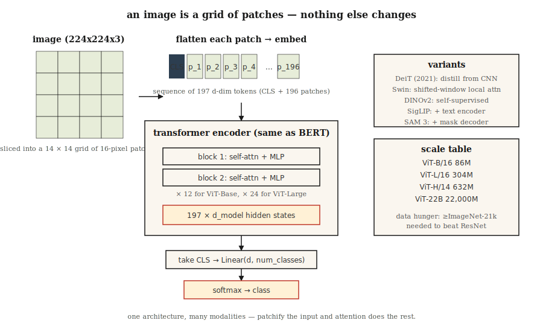

# Vision Transformers (ViT)

> An image is a grid of patches. A sentence is a grid of tokens. The same transformer eats both.

**Type:** Build
**Languages:** Python
**Prerequisites:** Phase 7 · 05 (Full Transformer), Phase 4 · 03 (CNNs), Phase 4 · 14 (Vision Transformers intro)
**Time:** ~45 minutes

## The Problem

Before 2020, computer vision meant convolutions. Every SOTA on ImageNet, COCO, and detection benchmarks used a CNN backbone. Transformers were for language.

Dosovitskiy et al. (2020) — "An Image is Worth 16x16 Words" — showed you can drop the convolutions entirely. Slice an image into fixed-size patches, linearly project each patch into an embedding, feed the sequence to a vanilla transformer encoder. At sufficient scale (ImageNet-21k pretraining or bigger), ViT matches or beats ResNet-based models.

ViT was the start of a broader pattern in 2026: one architecture, many modalities. Whisper tokenizes audio. ViT tokenizes images. Action tokens for robotics. Pixel tokens for video. The transformer doesn't care — feed it a sequence and it learns.

By 2026, ViT and its descendants (DeiT, Swin, DINOv2, ViT-22B, SAM 3) own most of vision. CNNs still win on edge devices and latency-sensitive tasks. Everything else has a ViT somewhere in the stack.

## The Concept



### Step 1 — patchify

Split a `H × W × C` image into an `N × (P·P·C)` sequence of flat patches. Typical setup: `224 × 224` image, `16 × 16` patches → 196 patches of 768 values each.

```
image (224, 224, 3) → 14 × 14 grid of 16x16x3 patches → 196 vectors of length 768
```

Patch size is the lever. Smaller patches = more tokens, better resolution, quadratic attention cost. Larger patches = coarser, cheaper.

### Step 2 — linear embedding

A single learned matrix projects each flat patch to `d_model`. Equivalent to a convolution of kernel size `P` and stride `P`. In PyTorch this is literally `nn.Conv2d(C, d_model, kernel_size=P, stride=P)` — a 2-line implementation.

### Step 3 — prepend `[CLS]` token, add positional embeddings

- Prepend a learnable `[CLS]` token. Its final hidden state is the image representation used for classification.
- Add learnable positional embeddings (ViT-original) or sinusoidal 2D (later variants).
- In 2024+ RoPE extended to 2D for position, sometimes without explicit embeddings.

### Step 4 — standard transformer encoder

Stack L blocks of `LayerNorm → Self-Attention → + → LayerNorm → MLP → +`. Identical to BERT. No vision-specific layers. This is the pedagogical punchline of the paper.

### Step 5 — head

For classification: take `[CLS]` hidden state → linear → softmax. For DINOv2 or SAM, discard `[CLS]`, use the patch embeddings directly.

### Variants that mattered

| Model | Year | Change |
|-------|------|--------|
| ViT | 2020 | The original. Fixed patch size, full global attention. |
| DeiT | 2021 | Distillation; trainable on ImageNet-1k only. |
| Swin | 2021 | Hierarchical with shifted windows. Fixed sub-quadratic cost. |
| DINOv2 | 2023 | Self-supervised (no labels). Best general vision features. |
| ViT-22B | 2023 | 22B params; scaling laws apply. |
| SigLIP | 2023 | ViT + language pair, sigmoid contrastive loss. |
| SAM 3 | 2025 | Segment anything; ViT-Large + promptable mask decoder. |

### Why it took a while

ViT needs *a lot* of data to match CNNs because it has none of the CNN inductive biases (translation invariance, locality). Without >100M labeled images or strong self-supervised pretraining, CNNs still win at matched compute. DeiT fixed this in 2021 with distillation tricks; DINOv2 fixed it permanently in 2023 with self-supervision.

## Build It

See `code/main.py`. Pure-stdlib patchify + linear embedding + sanity checks. No training — ViT at any realistic scale needs PyTorch and hours of GPU time.

### Step 1: fake image

A 24 × 24 RGB image as a list of rows of `(R, G, B)` tuples. We use 6×6 patches → 16 patches, 108-d embedding vector each.

### Step 2: patchify

```python
def patchify(image, P):
    H = len(image)
    W = len(image[0])
    patches = []
    for i in range(0, H, P):
        for j in range(0, W, P):
            patch = []
            for di in range(P):
                for dj in range(P):
                    patch.extend(image[i + di][j + dj])
            patches.append(patch)
    return patches
```

Raster order: row-major across the grid. Every ViT uses this ordering.

### Step 3: linear embed

Multiply each flat patch by a random `(patch_flat_size, d_model)` matrix. Verify output shape is `(N_patches + 1, d_model)` after prepending `[CLS]`.

### Step 4: count parameters for a realistic ViT

Print the param count for ViT-Base: 12 layers, 12 heads, d=768, patch=16. Compare to ResNet-50 (~25M). ViT-Base lands at ~86M. ViT-Large ~307M. ViT-Huge ~632M.

## Use It

```python
from transformers import ViTImageProcessor, ViTModel
import torch
from PIL import Image

processor = ViTImageProcessor.from_pretrained("google/vit-base-patch16-224-in21k")
model = ViTModel.from_pretrained("google/vit-base-patch16-224-in21k")

img = Image.open("cat.jpg")
inputs = processor(img, return_tensors="pt")
out = model(**inputs).last_hidden_state   # (1, 197, 768): [CLS] + 196 patches
cls_emb = out[:, 0]                       # image representation
```

**DINOv2 embeddings are the 2026 default for image features.** Freeze the backbone, train a tiny head. Works for classification, retrieval, detection, captioning. Meta's DINOv2 checkpoints outperform CLIP on every non-text vision task.

**Patch-size picking.** Small models use 16×16 (ViT-B/16). Dense prediction (segmentation) uses 8×8 or 14×14 (SAM, DINOv2). Very large models use 14×14.

## Ship It

See `outputs/skill-vit-configurator.md`. The skill picks a ViT variant and patch size for a new vision task given dataset size, resolution, and compute budget.

## Exercises

1. **Easy.** Run `code/main.py`. Verify the number of patches equals `(H/P) * (W/P)` and the flat patch dimension equals `P*P*C`.
2. **Medium.** Implement 2D sinusoidal positional embeddings — two independent sinusoidal codes for `row` and `col` of each patch, concatenated. Feed them into a tiny PyTorch ViT and compare accuracy vs learnable positional embeddings on CIFAR-10.
3. **Hard.** Build a 3-layer ViT (PyTorch), train on 1,000 MNIST images with 4×4 patches. Measure test accuracy. Now add DINOv2 pretraining on the same 1,000 images (simplified: just train the encoder to predict patch embeddings from masked patches). Does accuracy improve?

## Key Terms

| Term | What people say | What it actually means |
|------|-----------------|-----------------------|
| Patch | "The vision-transformer token" | Flat vector of pixel values for a `P × P × C` region of the image. |
| Patchify | "Chop + flatten" | Slice image into non-overlapping patches, flatten each to a vector. |
| `[CLS]` token | "The image summary" | Prepended learnable token; its final embedding is the image representation. |
| Inductive bias | "What the model assumes" | ViT has fewer priors than CNNs; needs more data to make up the gap. |
| DINOv2 | "Self-supervised ViT" | Trained without labels using image augmentation + momentum teacher. Best general image features in 2026. |
| SigLIP | "CLIP's successor" | ViT + text encoder trained with sigmoid contrastive loss; better than CLIP on matched compute. |
| Swin | "Windowed ViT" | Hierarchical ViT with local attention + shifted windows; sub-quadratic. |
| Register tokens | "2023 trick" | A few extra learnable tokens that soak up attention sinks; improves DINOv2 features. |

## Further Reading

- [Dosovitskiy et al. (2020). An Image is Worth 16x16 Words: Transformers for Image Recognition at Scale](https://arxiv.org/abs/2010.11929) — the ViT paper.
- [Touvron et al. (2021). Training data-efficient image transformers & distillation through attention](https://arxiv.org/abs/2012.12877) — DeiT.
- [Liu et al. (2021). Swin Transformer: Hierarchical Vision Transformer using Shifted Windows](https://arxiv.org/abs/2103.14030) — Swin.
- [Oquab et al. (2023). DINOv2: Learning Robust Visual Features without Supervision](https://arxiv.org/abs/2304.07193) — DINOv2.
- [Darcet et al. (2023). Vision Transformers Need Registers](https://arxiv.org/abs/2309.16588) — the register-token fix for DINOv2.
