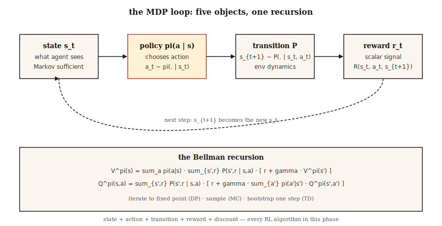

# MDPs, States, Actions & Rewards

> A Markov Decision Process is five things: states, actions, transitions, rewards, a discount. Everything in RL — Q-learning, PPO, DPO, GRPO — optimizes over this shape. Learn it once, read the rest of reinforcement learning for free.

**Type:** Learn
**Languages:** Python
**Prerequisites:** Phase 1 · 06 (Probability & Distributions), Phase 2 · 01 (ML Taxonomy)
**Time:** ~45 minutes

## The Problem

You are writing a chess bot. Or an inventory planner. Or a trading agent. Or the PPO loop that trains a reasoning model. Four different domains, one surprising fact: all four collapse to the same mathematical object.

Supervised learning gives you `(x, y)` pairs and asks you to fit a function. Reinforcement learning gives you no labels — only a stream of states, the actions you took, and a scalar reward. Did the move win the game? Did the restock decision save money? Did the trade make a profit? Did the token the LLM just produced lead to a higher reward from the judge?

You cannot learn from this stream until you formalize it. "What I saw," "what I did," "what happened next," "how good that was" — each has to become an object you can reason about. That formalization is a Markov Decision Process. Every RL algorithm in this phase, including the RLHF and GRPO loops at the end, optimizes over this shape.

## The Concept



**The five objects.**

- **States** `S`. Everything the agent needs to decide. In GridWorld, the cell. In chess, the board. In an LLM, the context window plus any memory.
- **Actions** `A`. The choices. Move up/down/left/right. Play a move. Emit a token.
- **Transitions** `P(s' | s, a)`. Given state `s` and action `a`, the distribution over next state. Deterministic in chess, stochastic in inventory, almost-deterministic in LLM decoding.
- **Rewards** `R(s, a, s')`. The scalar signal. Win = +1, loss = -1. Revenue minus cost. The log-likelihood ratio term in GRPO.
- **Discount** `γ ∈ [0, 1)`. How much future reward counts vs present. `γ = 0.99` buys a horizon of ~100 steps; `γ = 0.9` buys ~10.

**The Markov property** `P(s_{t+1} | s_t, a_t) = P(s_{t+1} | s_0, a_0, …, s_t, a_t)`. The future depends only on the present state. If it does not, the state representation is incomplete — not a failure of the method, a failure of the state.

**Policies and returns.** A policy `π(a | s)` maps states to action distributions. The return `G_t = r_t + γ r_{t+1} + γ² r_{t+2} + …` is the discounted sum of future rewards. The value `V^π(s) = E[G_t | s_t = s]` is the expected return starting from `s` under policy `π`. The Q-value `Q^π(s, a) = E[G_t | s_t = s, a_t = a]` is the expected return starting with a specific action. Every RL algorithm estimates one of these two, then improves `π` accordingly.

**The Bellman equations.** The fixed-point equations that everything in this phase uses:

`V^π(s) = Σ_a π(a|s) Σ_{s', r} P(s', r | s, a) [r + γ V^π(s')]`
`Q^π(s, a) = Σ_{s', r} P(s', r | s, a) [r + γ Σ_{a'} π(a'|s') Q^π(s', a')]`

These split expected return into "this step's reward" plus "discounted value of where you land." Recursive. Every algorithm in Phase 9 either iterates this equation to convergence (dynamic programming), samples from it (Monte Carlo), or bootstraps it one step (temporal difference).

## Build It

### Step 1: a tiny deterministic MDP

A 4×4 GridWorld. Agent starts top-left, terminal at bottom-right, reward of -1 per step, actions `{up, down, left, right}`. See `code/main.py`.

```python
GRID = 4
TERMINAL = (3, 3)
ACTIONS = {"up": (-1, 0), "down": (1, 0), "left": (0, -1), "right": (0, 1)}

def step(state, action):
    if state == TERMINAL:
        return state, 0.0, True
    dr, dc = ACTIONS[action]
    r, c = state
    nr = min(max(r + dr, 0), GRID - 1)
    nc = min(max(c + dc, 0), GRID - 1)
    return (nr, nc), -1.0, (nr, nc) == TERMINAL
```

Five lines. That is the entire environment. Deterministic transitions, constant step penalty, absorbing terminal state.

### Step 2: roll out a policy

A policy is a function from state to action distribution. The simplest: uniform random.

```python
def uniform_policy(state):
    return {a: 0.25 for a in ACTIONS}

def rollout(policy, max_steps=200):
    s, total, steps = (0, 0), 0.0, 0
    for _ in range(max_steps):
        a = sample(policy(s))
        s, r, done = step(s, a)
        total += r
        steps += 1
        if done:
            break
    return total, steps
```

Run the random policy 1000 times. Average return is around -60 to -80 for this 4×4 board. The optimal return is -6 (straight-line path down-right). Closing that gap is everything in Phase 9.

### Step 3: compute `V^π` exactly via the Bellman equation

For small MDPs the Bellman equation is a linear system. Enumerate states, apply the expectation, iterate until the values stop changing.

```python
def policy_evaluation(policy, gamma=0.99, tol=1e-6):
    V = {s: 0.0 for s in all_states()}
    while True:
        delta = 0.0
        for s in all_states():
            if s == TERMINAL:
                continue
            v = 0.0
            for a, pi_a in policy(s).items():
                s_next, r, _ = step(s, a)
                v += pi_a * (r + gamma * V[s_next])
            delta = max(delta, abs(v - V[s]))
            V[s] = v
        if delta < tol:
            return V
```

This is iterative policy evaluation. It is the first algorithm in Sutton & Barto and the theoretical foundation of every RL method that follows.

### Step 4: `γ` is a hyperparameter with physical meaning

Effective horizon is roughly `1 / (1 - γ)`. `γ = 0.9` → 10 steps. `γ = 0.99` → 100 steps. `γ = 0.999` → 1000 steps.

Too low and the agent acts myopically. Too high and credit assignment becomes noisy, because many early steps share responsibility for far-future reward. LLM RLHF typically uses `γ = 1` because episodes are short and bounded. Control tasks use `0.95–0.99`. Long-horizon strategy games use `0.999`.

## Pitfalls

- **Non-Markovian state.** If you need the last three observations to decide, the "state" is not just the current observation. Fix: stack frames (DQN on Atari stacks 4) or use a recurrent state (LSTM/GRU over observations).
- **Sparse rewards.** Win-only rewards make learning nearly impossible in large state spaces. Shape rewards (intermediate signal) or bootstrap with imitation (Phase 9 · 09).
- **Reward hacking.** Optimizing a proxy reward often produces pathological behavior. OpenAI's boat-racing agent spun in circles collecting powerups forever instead of finishing the race. Always define reward from the target outcome, not the proxy.
- **Discount mis-spec.** `γ = 1` on an infinite-horizon task makes every value infinite. Always cap with either a finite horizon or `γ < 1`.
- **Reward scale.** Rewards of {+100, -100} vs {+1, -1} give identical optimal policies but vastly different gradient magnitudes. Normalize to `[-1, 1]`-ish before plugging into PPO/DQN.

## Use It

The 2026 stack reduces every RL pipeline to an MDP before touching code:

| Situation | State | Action | Reward | γ |
|-----------|-------|--------|--------|---|
| Control (locomotion, manipulation) | Joint angles + velocities | Continuous torques | Task-specific shaped | 0.99 |
| Games (chess, Go, poker) | Board + history | Legal move | Win=+1 / loss=-1 | 1.0 (finite) |
| Inventory / pricing | Stock + demand | Order qty | Revenue - cost | 0.95 |
| RLHF for LLMs | Context tokens | Next token | Reward-model score at end | 1.0 (episode ~200 tokens) |
| GRPO for reasoning | Prompt + partial response | Next token | Verifier 0/1 at end | 1.0 |

Write the five tuples before writing any training loop. Most "RL does not work" bug reports trace back to an MDP formulation that was broken on paper.

## Ship It

Save as `outputs/skill-mdp-modeler.md`:

```markdown
---
name: mdp-modeler
description: Given a task description, produce a Markov Decision Process spec and flag formulation risks before training.
version: 1.0.0
phase: 9
lesson: 1
tags: [rl, mdp, modeling]
---

Given a task (control / game / recommendation / LLM fine-tuning), output:

1. State. Exact feature vector or tensor spec. Justify Markov property.
2. Action. Discrete set or continuous range. Dimensionality.
3. Transition. Deterministic, stochastic-with-known-model, or sample-only.
4. Reward. Function and source. Sparse vs shaped. Terminal vs per-step.
5. Discount. Value and horizon justification.

Refuse to ship any MDP where the state is non-Markovian without explicit mention of frame-stacking or recurrent state. Refuse any reward that was not defined in terms of the target outcome. Flag any `γ ≥ 1.0` on an infinite-horizon task. Flag any reward range >100x the typical step reward as a likely gradient-explosion source.
```

## Exercises

1. **Easy.** Implement the 4×4 GridWorld and random-policy rollout in `code/main.py`. Run 10,000 episodes. Report mean and std of return. Compare to the optimal return (-6).
2. **Medium.** Run `policy_evaluation` with `γ ∈ {0.5, 0.9, 0.99}` for the uniform-random policy. Print `V` as a 4×4 grid for each. Explain why the state values near the terminal grow faster with larger `γ`.
3. **Hard.** Turn the GridWorld stochastic: each action slips to an adjacent direction with probability `p = 0.1`. Re-evaluate the uniform policy. Does `V[start]` get better or worse? Why?

## Key Terms

| Term | What people say | What it actually means |
|------|-----------------|-----------------------|
| MDP | "Reinforcement learning setup" | Tuple `(S, A, P, R, γ)` satisfying the Markov property. |
| State | "What the agent sees" | Sufficient statistic for future dynamics under the chosen policy class. |
| Policy | "Agent's behavior" | Conditional distribution `π(a | s)` or deterministic map `s → a`. |
| Return | "Total reward" | Discounted sum `Σ γ^t r_t` from the current step. |
| Value | "How good a state is" | Expected return under `π` starting from `s`. |
| Q-value | "How good an action is" | Expected return under `π` starting from `s` with first action `a`. |
| Bellman equation | "Dynamic programming recursion" | Fixed-point decomposition of value / Q into one-step reward plus discounted successor value. |
| Discount `γ` | "Future vs present" | Geometric weight on far-future reward; effective horizon `~1/(1-γ)`. |

## Further Reading

- [Sutton & Barto (2018). Reinforcement Learning: An Introduction, 2nd ed.](http://incompleteideas.net/book/RLbook2020.pdf) — the textbook. Ch. 3 covers MDPs and Bellman equations; Ch. 1 motivates the reward hypothesis that underlies every subsequent lesson.
- [Bellman (1957). Dynamic Programming](https://press.princeton.edu/books/paperback/9780691146683/dynamic-programming) — the origin of the Bellman equation.
- [OpenAI Spinning Up — Part 1: Key Concepts](https://spinningup.openai.com/en/latest/spinningup/rl_intro.html) — concise MDP primer from a deep-RL angle.
- [Puterman (2005). Markov Decision Processes](https://onlinelibrary.wiley.com/doi/book/10.1002/9780470316887) — the operations-research reference on MDPs and exact solution methods.
- [Littman (1996). Algorithms for Sequential Decision Making (PhD thesis)](https://www.cs.rutgers.edu/~mlittman/papers/thesis-main.pdf) — the cleanest derivation of MDPs as a dynamic-programming specialization.
