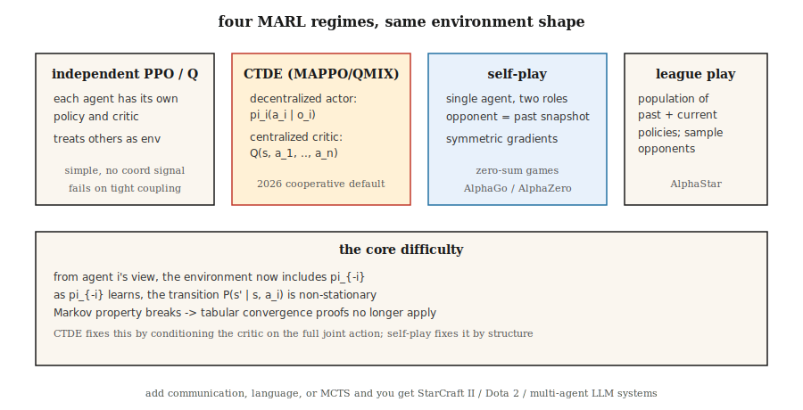

# Multi-Agent RL

> Single-agent RL assumes the environment is stationary. Put two learning agents in the same world and that assumption breaks: each agent is part of the other's environment, and both are changing. Multi-agent RL is the set of tricks to make learning converge when the Markov assumption no longer holds.

**Type:** Build
**Languages:** Python
**Prerequisites:** Phase 9 · 04 (Q-learning), Phase 9 · 06 (REINFORCE), Phase 9 · 07 (Actor-Critic)
**Time:** ~45 minutes

## The Problem

A robot learning to navigate a room is a single-agent RL problem. A soccer team is not. AlphaStar vs StarCraft opponents is not. A marketplace of bidding agents is not. Two cars negotiating a four-way stop is not. Many-on-many real-world problems are not.

In every multi-agent setting, from the perspective of any one agent, the other agents *are* part of the environment. As they learn and change their behavior, the environment becomes non-stationary. The Markov property — "next state depends only on current state and my action" — gets violated because the next state also depends on what the *other* agents chose, and their policies are moving targets.

This breaks tabular convergence proofs (Q-learning's guarantee assumes a stationary environment). It breaks naive deep RL too: agents chase each other in loops, never converge to a stable policy. You need multi-agent-specific techniques: centralized training / decentralized execution, counterfactual baselines, league play, self-play.

2026 applications: robot swarms, traffic routing, autonomous vehicle fleets, market simulators, multi-agent LLM systems (Phase 16), and any game with more than one intelligent player.

## The Concept



**Formalism: Markov Game.** A generalization of MDP: states `S`, a joint action `a = (a_1, …, a_n)`, transition `P(s' | s, a)`, and per-agent rewards `R_i(s, a, s')`. Each agent `i` maximizes its own return under its own policy `π_i`. If rewards are identical, it is **fully cooperative**. If zero-sum, it is **adversarial**. If mixed, it is **general-sum**.

**Core challenges:**

- **Non-stationarity.** `P(s' | s, a_i)` from agent `i`'s view depends on `π_{-i}`, which is changing.
- **Credit assignment.** With a shared reward, which agent caused it?
- **Exploration coordination.** Agents must explore complementary strategies, not redundantly explore the same state.
- **Scalability.** The joint action space grows exponentially in `n`.
- **Partial observability.** Each agent sees only its own observation; the global state is hidden.

**Four dominant regimes:**

**1. Independent Q-learning / independent PPO (IQL, IPPO).** Each agent learns its own Q or policy, treating others as part of the environment. Simple, sometimes it works (especially with experience replay acting as a smoothing agent-modeling trick). Theoretical convergence: none. In practice: fine for loosely-coupled tasks, bad for tightly-coupled ones.

**2. Centralized training, decentralized execution (CTDE).** Most common modern paradigm. Each agent has its own *policy* `π_i` that conditions on local observation `o_i` — standard decentralized execution at deployment. During *training*, a centralized critic `Q(s, a_1, …, a_n)` conditions on the full global state and joint action. Examples:
- **MADDPG** (Lowe et al. 2017): DDPG with a centralized critic per agent.
- **COMA** (Foerster et al. 2017): counterfactual baseline — ask "what would my reward have been if I'd taken action `a'` instead?" — isolates my contribution.
- **MAPPO** / **IPPO** with shared critic (Yu et al. 2022): PPO with a centralized value function. Dominant in 2026 for cooperative MARL.
- **QMIX** (Rashid et al. 2018): value decomposition — `Q_tot(s, a) = f(Q_1(s, a_1), …, Q_n(s, a_n))` with monotonic mixing.

**3. Self-play.** Two copies of the same agent play each other. The opponent's policy *is* my policy from a past snapshot. AlphaGo / AlphaZero / MuZero. OpenAI Five. Works best for zero-sum games; the training signal is symmetric.

**4. League play.** An extension of self-play to general-sum / adversarial environments: keep a population of past and current policies, sample an opponent from the league, train against them. Adds exploiters (specialize in beating the current best) and main exploiters (specialize in beating exploiters). AlphaStar (StarCraft II). Needed when the game admits "rock-paper-scissors" strategy cycles.

**Communication.** Allow agents to send learned messages `m_i` to each other. Works in cooperative settings. Foerster et al. (2016) showed that differentiable inter-agent communication can be trained end-to-end. Today's LLM-based multi-agent systems (Phase 16) essentially communicate in natural language.

## Build It

This lesson uses a 6×6 GridWorld with two cooperative agents. They start in opposite corners and must reach a shared goal. Shared reward: `-1` per step while either agent is still moving, `+10` when both arrive. See `code/main.py`.

### Step 1: the multi-agent env

```python
class CoopGridWorld:
    def __init__(self):
        self.size = 6
        self.goal = (5, 5)

    def reset(self):
        return ((0, 0), (5, 0))  # two agents

    def step(self, state, actions):
        a1, a2 = state
        new1 = move(a1, actions[0])
        new2 = move(a2, actions[1])
        done = (new1 == self.goal) and (new2 == self.goal)
        reward = 10.0 if done else -1.0
        return (new1, new2), reward, done
```

The *joint* action space is `|A|² = 16`. The global state is two positions.

### Step 2: independent Q-learning

Each agent runs its own Q-table keyed on joint state. At each step: both pick ε-greedy actions, collect joint transition, each updates its own Q with the shared reward.

```python
def independent_q(env, episodes, alpha, gamma, epsilon):
    Q1, Q2 = defaultdict(default_q), defaultdict(default_q)
    for _ in range(episodes):
        s = env.reset()
        while not done:
            a1 = epsilon_greedy(Q1, s, epsilon)
            a2 = epsilon_greedy(Q2, s, epsilon)
            s_next, r, done = env.step(s, (a1, a2))
            target1 = r + gamma * max(Q1[s_next].values())
            target2 = r + gamma * max(Q2[s_next].values())
            Q1[s][a1] += alpha * (target1 - Q1[s][a1])
            Q2[s][a2] += alpha * (target2 - Q2[s][a2])
            s = s_next
```

Works on this task because rewards are dense and aligned. Fails on tightly-coupled tasks (e.g., where one agent has to *wait* for the other).

### Step 3: centralized Q with decomposed-value update

Use one Q over joint actions `Q(s, a_1, a_2)`. Update from shared reward. Decentralize at execution by marginalizing: `π_i(s) = argmax_{a_i} max_{a_{-i}} Q(s, a_1, a_2)`. Trades exponential joint action space for a *correct* global view.

### Step 4: simple self-play (adversarial 2-agent)

Same agent, two roles. Train agent A against agent B; after `K` episodes, copy A's weights into B. Symmetric training, consistent progress. The AlphaZero recipe in miniature.

## Pitfalls

- **Non-stationary replay.** Experience replay with independent agents is worse than single-agent because old transitions were generated by now-obsolete opponents. Fix: relabel or weight by recency.
- **Credit assignment ambiguity.** Shared reward after a long episode; no clear way to say which agent contributed. Fix: counterfactual baselines (COMA), or reward shaping per agent.
- **Policy drift / chasing.** Each agent's best response changes with each other's update. Fix: centralized critic, slow learning rates, or freeze-one-at-a-time.
- **Reward hacking via coordination.** Agents find coordinated exploits the designer did not anticipate. Auction agents converge to bid zero. Fix: careful reward design, behavioral constraints.
- **Exploration redundancy.** Both agents explore the same state-action pairs. Fix: entropy bonuses per-agent, or role-conditioning.
- **League cycles.** Pure self-play can get stuck in a dominance cycle. Fix: league play with diverse opponents.
- **Sample explosion.** `n` agents × state space × joint actions. Approximate with function approximation; factored action spaces (one policy output head per agent).

## Use It

The 2026 MARL application map:

| Domain | Method | Notes |
|--------|--------|-------|
| Cooperative navigation / manipulation | MAPPO / QMIX | CTDE; shared critic + decentralized actors. |
| Two-player games (chess, Go, poker) | Self-play with MCTS (AlphaZero) | Zero-sum; symmetric training. |
| Complex multiplayer (Dota, StarCraft) | League play + imitation pretraining | OpenAI Five, AlphaStar. |
| Autonomous-vehicle fleets | CTDE MAPPO / PPO with attention | Partial obs; variable team sizes. |
| Auction markets | Game-theoretic equilibrium + RL | Mean-field RL when `n` → ∞. |
| LLM multi-agent systems (Phase 16) | Natural-language comm + role conditioning | RL loop at the agent-planning layer. |

In 2026, MARL's biggest growth area is LLM-based: swarms of language-model agents negotiating, debating, building software. The RL shows up as preference optimization on *trajectory-level* outputs, not token-level (Phase 16 · 03).

## Ship It

Save as `outputs/skill-marl-architect.md`:

```markdown
---
name: marl-architect
description: Pick the right multi-agent RL regime (IPPO, CTDE, self-play, league) for a given task.
version: 1.0.0
phase: 9
lesson: 10
tags: [rl, multi-agent, marl, self-play]
---

Given a task with `n` agents, output:

1. Regime classification. Cooperative / adversarial / general-sum. Justify.
2. Algorithm. IPPO / MAPPO / QMIX / self-play / league. Reason tied to coupling tightness and reward structure.
3. Information access. Centralized training (what global info goes to the critic)? Decentralized execution?
4. Credit assignment. Counterfactual baseline, value decomposition, or reward shaping.
5. Exploration plan. Per-agent entropy, population-based training, or league.

Refuse independent Q-learning on tightly-coupled cooperative tasks. Refuse to recommend self-play for general-sum with cycle risks. Flag any MARL pipeline without a fixed-opponent eval (cherry-picked self-play numbers are common).
```

## Exercises

1. **Easy.** Train independent Q-learning on the 2-agent cooperative GridWorld. How many episodes until mean return > 0? Plot the joint learning curve.
2. **Medium.** Add a "coordination" task: the goal is reached only when both agents step onto it on the same turn. Does independent Q still converge? What breaks?
3. **Hard.** Implement a centralized critic for MAPPO-style training and compare convergence speed to independent PPO on the coordination task.

## Key Terms

| Term | What people say | What it actually means |
|------|-----------------|-----------------------|
| Markov game | "Multi-agent MDP" | `(S, A_1, …, A_n, P, R_1, …, R_n)`; each agent has its own reward. |
| CTDE | "Centralized training, decentralized execution" | Joint critic at training time; each agent's policy uses only local obs. |
| IPPO | "Independent PPO" | Each agent runs PPO separately. Simple baseline; often underrated. |
| MAPPO | "Multi-agent PPO" | PPO with a centralized value function conditioned on global state. |
| QMIX | "Monotonic value decomposition" | `Q_tot = f_monotone(Q_1, …, Q_n)` allows decentralized argmax. |
| COMA | "Counterfactual multi-agent" | Advantage = my Q minus expected Q marginalizing over my action. |
| Self-play | "Agent vs past self" | Single agent, two roles; standard for zero-sum games. |
| League play | "Population training" | Cache past policies, sample opponents from the pool; handles strategy cycles. |

## Further Reading

- [Lowe et al. (2017). Multi-Agent Actor-Critic for Mixed Cooperative-Competitive Environments (MADDPG)](https://arxiv.org/abs/1706.02275) — CTDE with a centralized critic.
- [Foerster et al. (2017). Counterfactual Multi-Agent Policy Gradients (COMA)](https://arxiv.org/abs/1705.08926) — counterfactual baselines for credit assignment.
- [Rashid et al. (2018). QMIX: Monotonic Value Function Factorisation](https://arxiv.org/abs/1803.11485) — value decomposition with monotonicity.
- [Yu et al. (2022). The Surprising Effectiveness of PPO in Cooperative Multi-Agent Games (MAPPO)](https://arxiv.org/abs/2103.01955) — PPO is surprisingly strong for MARL.
- [Vinyals et al. (2019). Grandmaster level in StarCraft II using multi-agent reinforcement learning (AlphaStar)](https://www.nature.com/articles/s41586-019-1724-z) — league play at scale.
- [Silver et al. (2017). Mastering the game of Go without human knowledge (AlphaGo Zero)](https://www.nature.com/articles/nature24270) — pure self-play in zero-sum games.
- [Sutton & Barto (2018). Ch. 15 — Neuroscience & Ch. 17 — Frontiers](http://incompleteideas.net/book/RLbook2020.pdf) — includes the textbook's short treatment of multi-agent settings and the non-stationarity problem that CTDE is designed to solve.
- [Zhang, Yang & Başar (2021). Multi-Agent Reinforcement Learning: A Selective Overview](https://arxiv.org/abs/1911.10635) — survey covering cooperative, competitive, and mixed MARL with convergence results.
