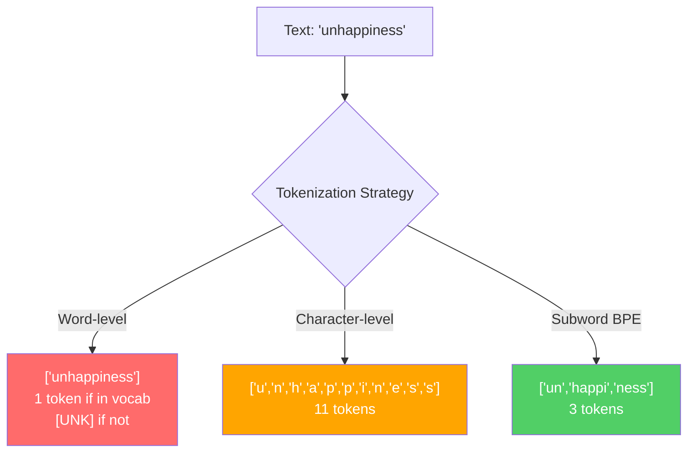
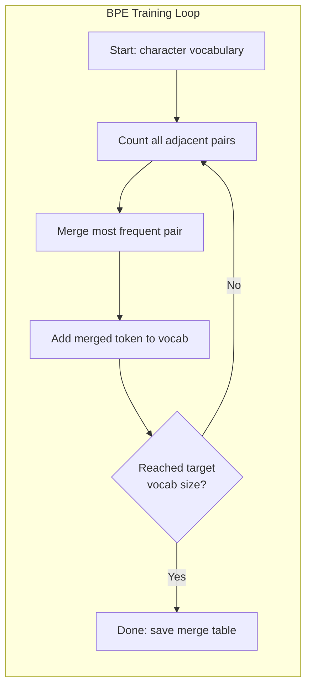
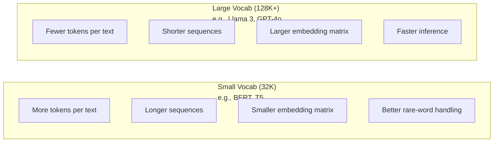

# Tokenizers: BPE, WordPiece, SentencePiece

> Your LLM does not read English. It reads integers. The tokenizer decides whether those integers carry meaning or waste it.

**Type:** Build
**Languages:** Python
**Prerequisites:** Phase 05 (NLP Foundations)
**Time:** ~90 minutes

## Learning Objectives

- Implement BPE, WordPiece, and Unigram tokenization algorithms from scratch and compare their merge strategies
- Explain how vocabulary size affects model efficiency: too small creates long sequences, too large wastes embedding parameters
- Analyze tokenization artifacts across languages and code, identifying where specific tokenizers break down
- Use the tiktoken and sentencepiece libraries to tokenize text and inspect the resulting token IDs

## The Problem

Your LLM does not read English. It does not read any language. It reads numbers.

The gap between "Hello, world!" and [15496, 11, 995, 0] is the tokenizer. Every word, every space, every punctuation mark must be converted into an integer before a model can process it. This conversion is not neutral. It bakes assumptions into the model that cannot be undone later.

Get this wrong and your model wastes capacity encoding common words with multiple tokens. "unfortunately" becomes four tokens instead of one. Your 128K context window just shrank by 75% for text heavy in multi-syllable words. Get it right and the same context window holds twice as much meaning. The difference between "this model handles code well" and "this model chokes on Python" often comes down to how the tokenizer was trained.

Every API call you make to GPT-4 or Claude is priced per token. Every token your model generates costs compute. The fewer tokens required to represent an output, the faster the end-to-end inference. Tokenization is not preprocessing. It is architecture.

## The Concept

### Three Approaches That Failed (and One That Won)

There are three obvious ways to convert text to numbers. Two of them do not work at scale.

**Word-level tokenization** splits on spaces and punctuation. "The cat sat" becomes ["The", "cat", "sat"]. Simple. But what about "tokenization"? Or "GPT-4o"? Or a German compound word like "Geschwindigkeitsbegrenzung"? Word-level requires a massive vocabulary to cover every word in every language. Miss a word and you get the dreaded `[UNK]` token -- the model's way of saying "I have no idea what this is." English alone has over a million word forms. Add code, URLs, scientific notation, and 100 other languages and you need an infinite vocabulary.

**Character-level tokenization** goes the other direction. "hello" becomes ["h", "e", "l", "l", "o"]. Vocabulary is tiny (a few hundred characters). No unknown tokens ever. But sequences become extremely long. A sentence that would be 10 word-level tokens becomes 50 character-level tokens. The model must learn that "t", "h", "e" together mean "the" -- burning attention capacity on something a human learns at age three.

**Subword tokenization** finds the sweet spot. Common words stay whole: "the" is one token. Rare words decompose into meaningful pieces: "unhappiness" becomes ["un", "happi", "ness"]. Vocabulary stays manageable (30K to 128K tokens). Sequences stay short. Unknown tokens essentially disappear because any word can be built from subword pieces.

Every modern LLM uses subword tokenization. GPT-2, GPT-4, BERT, Llama 3, Claude -- all of them. The question is which algorithm.



### BPE: Byte Pair Encoding

BPE is a greedy compression algorithm repurposed for tokenization. The idea is simple enough to fit on an index card.

Start with individual characters. Count every adjacent pair in the training corpus. Merge the most frequent pair into a new token. Repeat until you reach your target vocabulary size.

Here is BPE running on a tiny corpus with the words "lower", "lowest", and "newest":

```
Corpus (with word frequencies):
  "lower"  x5
  "lowest" x2
  "newest" x6

Step 0 -- Start with characters:
  l o w e r       (x5)
  l o w e s t     (x2)
  n e w e s t     (x6)

Step 1 -- Count adjacent pairs:
  (e,s): 8    (s,t): 8    (l,o): 7    (o,w): 7
  (w,e): 13   (e,r): 5    (n,e): 6    ...

Step 2 -- Merge most frequent pair (w,e) -> "we":
  l o we r        (x5)
  l o we s t      (x2)
  n e we s t      (x6)

Step 3 -- Recount and merge (e,s) -> "es":
  l o we r        (x5)
  l o we s t      (x2)    <- 'es' only forms from 'e'+'s', not 'we'+'s'
  n e we s t      (x6)    <- wait, the 'e' before 'we' and 's' after 'we'

Actually tracking this precisely:
  After "we" merge, remaining pairs:
  (l,o): 7   (o,we): 7   (we,r): 5   (we,s): 8
  (s,t): 8   (n,e): 6    (e,we): 6

Step 3 -- Merge (we,s) -> "wes" or (s,t) -> "st" (tied at 8, pick first):
  Merge (we,s) -> "wes":
  l o we r        (x5)
  l o wes t       (x2)
  n e wes t       (x6)

Step 4 -- Merge (wes,t) -> "west":
  l o we r        (x5)
  l o west        (x2)
  n e west        (x6)

...continue until target vocab size reached.
```

The merge table is the tokenizer. To encode new text, apply merges in the order they were learned. The training corpus determines which merges exist, and that choice permanently shapes what the model sees.



### Byte-Level BPE (GPT-2, GPT-3, GPT-4)

Standard BPE operates on Unicode characters. Byte-level BPE operates on raw bytes (0-255). This gives you a base vocabulary of exactly 256, handles any language or encoding, and never produces an unknown token.

GPT-2 introduced this approach. The base vocabulary covers every possible byte. BPE merges build on top of that. OpenAI's tiktoken library implements byte-level BPE with these vocabulary sizes:

- GPT-2: 50,257 tokens
- GPT-3.5/GPT-4: ~100,256 tokens (cl100k_base encoding)
- GPT-4o: 200,019 tokens (o200k_base encoding)

### WordPiece (BERT)

WordPiece looks similar to BPE but picks merges differently. Instead of raw frequency, it maximizes the likelihood of the training data:

```
BPE merge criterion:      count(A, B)
WordPiece merge criterion: count(AB) / (count(A) * count(B))
```

BPE asks: "Which pair appears most often?" WordPiece asks: "Which pair appears together more often than you would expect by chance?" This subtle difference produces different vocabularies. WordPiece favors merges where co-occurrence is surprising, not just frequent.

WordPiece also uses a "##" prefix for continuation subwords:

```
"unhappiness" -> ["un", "##happi", "##ness"]
"embedding"   -> ["em", "##bed", "##ding"]
```

The "##" prefix tells you this piece continues a previous token. BERT uses WordPiece with a vocabulary of 30,522 tokens. Every BERT variant -- DistilBERT, RoBERTa's tokenizer is actually BPE, but BERT itself is WordPiece.

### SentencePiece (Llama, T5)

SentencePiece treats the input as a raw stream of Unicode characters, including whitespace. No pre-tokenization step. No language-specific rules about word boundaries. This makes it genuinely language-agnostic -- it works on Chinese, Japanese, Thai, and other languages where spaces do not separate words.

SentencePiece supports two algorithms:
- **BPE mode**: same merge logic as standard BPE, applied to raw character sequences
- **Unigram mode**: starts with a large vocabulary and iteratively removes tokens that least affect the overall likelihood. The reverse of BPE -- prune instead of merge.

Llama 2 uses SentencePiece BPE with a vocabulary of 32,000 tokens. T5 uses SentencePiece Unigram with 32,000 tokens. Note: Llama 3 switched to a tiktoken-based byte-level BPE tokenizer with 128,256 tokens.

### Vocabulary Size Tradeoffs

This is a real engineering decision with measurable consequences.



Concrete numbers. For a 128K vocabulary with 4,096-dimensional embeddings, the embedding matrix alone is 128,000 x 4,096 = 524 million parameters. For a 32K vocabulary, it is 131 million parameters. That is a 400M parameter difference from the tokenizer choice alone.

But larger vocabularies compress text more aggressively. The same English paragraph that takes 100 tokens with a 32K vocabulary might take 70 tokens with a 128K vocabulary. That means 30% fewer forward passes during generation. For a model serving millions of requests, that is a direct reduction in compute cost.

The trend is clear: vocabulary sizes are growing. GPT-2 used 50,257. GPT-4 uses ~100K. Llama 3 uses 128K. GPT-4o uses 200K.

| Model | Vocab Size | Tokenizer Type | Avg Tokens per English Word |
|-------|-----------|----------------|---------------------------|
| BERT | 30,522 | WordPiece | ~1.4 |
| GPT-2 | 50,257 | Byte-level BPE | ~1.3 |
| Llama 2 | 32,000 | SentencePiece BPE | ~1.4 |
| GPT-4 | ~100,256 | Byte-level BPE | ~1.2 |
| Llama 3 | 128,256 | Byte-level BPE (tiktoken) | ~1.1 |
| GPT-4o | 200,019 | Byte-level BPE | ~1.0 |

### The Multilingual Tax

Tokenizers trained primarily on English are brutal to other languages. Korean text in GPT-2's tokenizer averages 2-3 tokens per word. Chinese can be worse. This means a Korean user effectively has a context window that is half the size of an English user's -- paying the same price for less information density.

This is why Llama 3 quadrupled its vocabulary from 32K to 128K. More tokens dedicated to non-English scripts means fairer compression across languages.

## Build It

### Step 1: Character-Level Tokenizer

Start at the foundation. A character-level tokenizer maps each character to its Unicode code point. No training needed. No unknown tokens. Just a direct mapping.

```python
class CharTokenizer:
    def encode(self, text):
        return [ord(c) for c in text]

    def decode(self, tokens):
        return "".join(chr(t) for t in tokens)
```

"hello" becomes [104, 101, 108, 108, 111]. Every character is its own token. This is the baseline we improve on.

### Step 2: BPE Tokenizer from Scratch

The real implementation. We train on raw bytes (like GPT-2), count pairs, merge the most frequent, and record every merge in order. The merge table is the tokenizer.

```python
from collections import Counter

class BPETokenizer:
    def __init__(self):
        self.merges = {}
        self.vocab = {}

    def _get_pairs(self, tokens):
        pairs = Counter()
        for i in range(len(tokens) - 1):
            pairs[(tokens[i], tokens[i + 1])] += 1
        return pairs

    def _merge_pair(self, tokens, pair, new_token):
        merged = []
        i = 0
        while i < len(tokens):
            if i < len(tokens) - 1 and tokens[i] == pair[0] and tokens[i + 1] == pair[1]:
                merged.append(new_token)
                i += 2
            else:
                merged.append(tokens[i])
                i += 1
        return merged

    def train(self, text, num_merges):
        tokens = list(text.encode("utf-8"))
        self.vocab = {i: bytes([i]) for i in range(256)}

        for i in range(num_merges):
            pairs = self._get_pairs(tokens)
            if not pairs:
                break
            best_pair = max(pairs, key=pairs.get)
            new_token = 256 + i
            tokens = self._merge_pair(tokens, best_pair, new_token)
            self.merges[best_pair] = new_token
            self.vocab[new_token] = self.vocab[best_pair[0]] + self.vocab[best_pair[1]]

        return self

    def encode(self, text):
        tokens = list(text.encode("utf-8"))
        for pair, new_token in self.merges.items():
            tokens = self._merge_pair(tokens, pair, new_token)
        return tokens

    def decode(self, tokens):
        byte_sequence = b"".join(self.vocab[t] for t in tokens)
        return byte_sequence.decode("utf-8", errors="replace")
```

The training loop is the core of BPE: count pairs, merge the winner, repeat. Each merge reduces the total token count. After `num_merges` rounds, the vocabulary grows from 256 (base bytes) to 256 + num_merges.

Encoding applies merges in the exact order they were learned. This matters. If merge 1 created "th" and merge 5 created "the", encoding must apply merge 1 first so that "the" can form from "th" + "e" in merge 5.

Decoding is the inverse: look up each token ID in the vocabulary, concatenate the bytes, decode to UTF-8.

### Step 3: Encode and Decode Roundtrip

```python
corpus = (
    "The cat sat on the mat. The cat ate the rat. "
    "The dog sat on the log. The dog ate the frog. "
    "Natural language processing is the study of how computers "
    "understand and generate human language. "
    "Tokenization is the first step in any NLP pipeline."
)

tokenizer = BPETokenizer()
tokenizer.train(corpus, num_merges=40)

test_sentences = [
    "The cat sat on the mat.",
    "Natural language processing",
    "tokenization pipeline",
    "unhappiness",
]

for sentence in test_sentences:
    encoded = tokenizer.encode(sentence)
    decoded = tokenizer.decode(encoded)
    raw_bytes = len(sentence.encode("utf-8"))
    ratio = len(encoded) / raw_bytes
    print(f"'{sentence}'")
    print(f"  Tokens: {len(encoded)} (from {raw_bytes} bytes) -- ratio: {ratio:.2f}")
    print(f"  Roundtrip: {'PASS' if decoded == sentence else 'FAIL'}")
```

The compression ratio tells you how effective the tokenizer is. A ratio of 0.50 means the tokenizer compressed the text to half as many tokens as raw bytes. Lower is better. On the training corpus, the ratio will be good. On out-of-distribution text like "unhappiness" (which does not appear in the corpus), the ratio will be worse -- the tokenizer falls back to character-level encoding for unseen patterns.

### Step 4: Compare with tiktoken

```python
import tiktoken

enc = tiktoken.get_encoding("cl100k_base")

texts = [
    "The cat sat on the mat.",
    "unhappiness",
    "Hello, world!",
    "def fibonacci(n): return n if n < 2 else fibonacci(n-1) + fibonacci(n-2)",
    "Geschwindigkeitsbegrenzung",
]

for text in texts:
    our_tokens = tokenizer.encode(text)
    tiktoken_tokens = enc.encode(text)
    tiktoken_pieces = [enc.decode([t]) for t in tiktoken_tokens]
    print(f"'{text}'")
    print(f"  Our BPE:   {len(our_tokens)} tokens")
    print(f"  tiktoken:  {len(tiktoken_tokens)} tokens -> {tiktoken_pieces}")
```

tiktoken uses the exact same algorithm but trained on hundreds of gigabytes of text with 100,000 merges. The algorithm is identical. The difference is the training data and the number of merges. Your tokenizer trained on a paragraph with 40 merges cannot compete with tiktoken's 100K merges on a massive corpus. But the mechanism is the same.

### Step 5: Vocabulary Analysis

```python
def analyze_vocabulary(tokenizer, test_texts):
    total_tokens = 0
    total_chars = 0
    token_usage = Counter()

    for text in test_texts:
        encoded = tokenizer.encode(text)
        total_tokens += len(encoded)
        total_chars += len(text)
        for t in encoded:
            token_usage[t] += 1

    print(f"Vocabulary size: {len(tokenizer.vocab)}")
    print(f"Total tokens across all texts: {total_tokens}")
    print(f"Total characters: {total_chars}")
    print(f"Avg tokens per character: {total_tokens / total_chars:.2f}")

    print(f"\nMost used tokens:")
    for token_id, count in token_usage.most_common(10):
        token_bytes = tokenizer.vocab[token_id]
        display = token_bytes.decode("utf-8", errors="replace")
        print(f"  Token {token_id:4d}: '{display}' (used {count} times)")

    unused = [t for t in tokenizer.vocab if t not in token_usage]
    print(f"\nUnused tokens: {len(unused)} out of {len(tokenizer.vocab)}")
```

This reveals the Zipf distribution in your vocabulary. A few tokens dominate (spaces, "the", "e"). Most tokens are rarely used. Production tokenizers optimize for this distribution -- common patterns get short token IDs, rare patterns get longer representations.

## Use It

Your scratch BPE works. Now see what production tools look like.

### tiktoken (OpenAI)

```python
import tiktoken

enc = tiktoken.get_encoding("cl100k_base")

text = "Tokenizers convert text to integers"
tokens = enc.encode(text)
print(f"Tokens: {tokens}")
print(f"Pieces: {[enc.decode([t]) for t in tokens]}")
print(f"Roundtrip: {enc.decode(tokens)}")
```

tiktoken is written in Rust with Python bindings. It encodes millions of tokens per second. Same BPE algorithm, industrial-strength implementation.

### Hugging Face tokenizers

```python
from tokenizers import Tokenizer
from tokenizers.models import BPE
from tokenizers.trainers import BpeTrainer
from tokenizers.pre_tokenizers import ByteLevel

tokenizer = Tokenizer(BPE())
tokenizer.pre_tokenizer = ByteLevel()

trainer = BpeTrainer(vocab_size=1000, special_tokens=["<pad>", "<eos>", "<unk>"])
tokenizer.train(["corpus.txt"], trainer)

output = tokenizer.encode("The cat sat on the mat.")
print(f"Tokens: {output.tokens}")
print(f"IDs: {output.ids}")
```

The Hugging Face tokenizers library is also Rust under the hood. It trains BPE on gigabyte-scale corpora in seconds. This is what you use when training your own model.

### Loading Llama's Tokenizer

```python
from transformers import AutoTokenizer

tokenizer = AutoTokenizer.from_pretrained("meta-llama/Llama-3.1-8B")

text = "Tokenizers are the unsung heroes of LLMs"
tokens = tokenizer.encode(text)
print(f"Token IDs: {tokens}")
print(f"Tokens: {tokenizer.convert_ids_to_tokens(tokens)}")
print(f"Vocab size: {tokenizer.vocab_size}")

multilingual = ["Hello world", "Hola mundo", "Bonjour le monde"]
for text in multilingual:
    ids = tokenizer.encode(text)
    print(f"'{text}' -> {len(ids)} tokens")
```

Llama 3's 128K vocabulary compresses non-English text significantly better than GPT-2's 50K vocabulary. You can verify this yourself -- encode the same sentence in multiple languages and count the tokens.

## Ship It

This lesson produces `outputs/prompt-tokenizer-analyzer.md` -- a reusable prompt that analyzes tokenization efficiency for any text and model combination. Feed it a text sample and it tells you which model's tokenizer handles it best.

## Exercises

1. Modify the BPE tokenizer to print the vocabulary at each merge step. Watch how "t" + "h" becomes "th", then "th" + "e" becomes "the". Track how common English words get assembled piece by piece.

2. Add special tokens (`<pad>`, `<eos>`, `<unk>`) to the BPE tokenizer. Assign them IDs 0, 1, 2 and shift all other tokens accordingly. Implement a pre-tokenization step that splits on whitespace before running BPE.

3. Implement the WordPiece merge criterion (likelihood ratio instead of frequency). Train both BPE and WordPiece on the same corpus with the same number of merges. Compare the resulting vocabularies -- which one produces more linguistically meaningful subwords?

4. Build a multilingual tokenizer efficiency benchmark. Take 10 sentences in English, Spanish, Chinese, Korean, and Arabic. Tokenize each with tiktoken (cl100k_base) and measure the average tokens per character. Quantify the "multilingual tax" for each language.

5. Train your BPE tokenizer on a larger corpus (download a Wikipedia article). Tune the number of merges to achieve a compression ratio within 10% of tiktoken on that same text. This forces you to understand the relationship between corpus size, merge count, and compression quality.

## Key Terms

| Term | What people say | What it actually means |
|------|----------------|----------------------|
| Token | "A word" | A unit in the model's vocabulary -- could be a character, subword, word, or multi-word chunk |
| BPE | "Some compression thing" | Byte Pair Encoding -- iteratively merge the most frequent adjacent pair of tokens until the target vocabulary size is reached |
| WordPiece | "BERT's tokenizer" | Like BPE but merges maximize the likelihood ratio count(AB)/(count(A)*count(B)) instead of raw frequency |
| SentencePiece | "A tokenizer library" | A language-agnostic tokenizer that operates on raw Unicode without pre-tokenization, supporting BPE and Unigram algorithms |
| Vocabulary size | "How many words it knows" | The total number of unique tokens: GPT-2 has 50,257, BERT has 30,522, Llama 3 has 128,256 |
| Fertility | "Not a tokenizer term" | Average number of tokens per word -- measures tokenizer efficiency across languages (1.0 is perfect, 3.0 means the model works three times harder) |
| Byte-level BPE | "GPT's tokenizer" | BPE operating on raw bytes (0-255) instead of Unicode characters, guaranteeing no unknown tokens for any input |
| Merge table | "The tokenizer file" | Ordered list of pair merges learned during training -- this IS the tokenizer, and order matters |
| Pre-tokenization | "Splitting on spaces" | Rules applied before subword tokenization: whitespace splitting, digit separation, punctuation handling |
| Compression ratio | "How efficient the tokenizer is" | Tokens produced divided by input bytes -- lower means better compression and faster inference |

## Further Reading

- [Sennrich et al., 2016 -- "Neural Machine Translation of Rare Words with Subword Units"](https://arxiv.org/abs/1508.07909) -- the paper that introduced BPE for NLP, turning a 1994 compression algorithm into the foundation of modern tokenization
- [Kudo & Richardson, 2018 -- "SentencePiece: A simple and language independent subword tokenizer"](https://arxiv.org/abs/1808.06226) -- language-agnostic tokenization that made multilingual models practical
- [OpenAI tiktoken repository](https://github.com/openai/tiktoken) -- production BPE implementation in Rust with Python bindings, used by GPT-3.5/4/4o
- [Hugging Face Tokenizers documentation](https://huggingface.co/docs/tokenizers) -- production-grade tokenizer training with Rust performance
