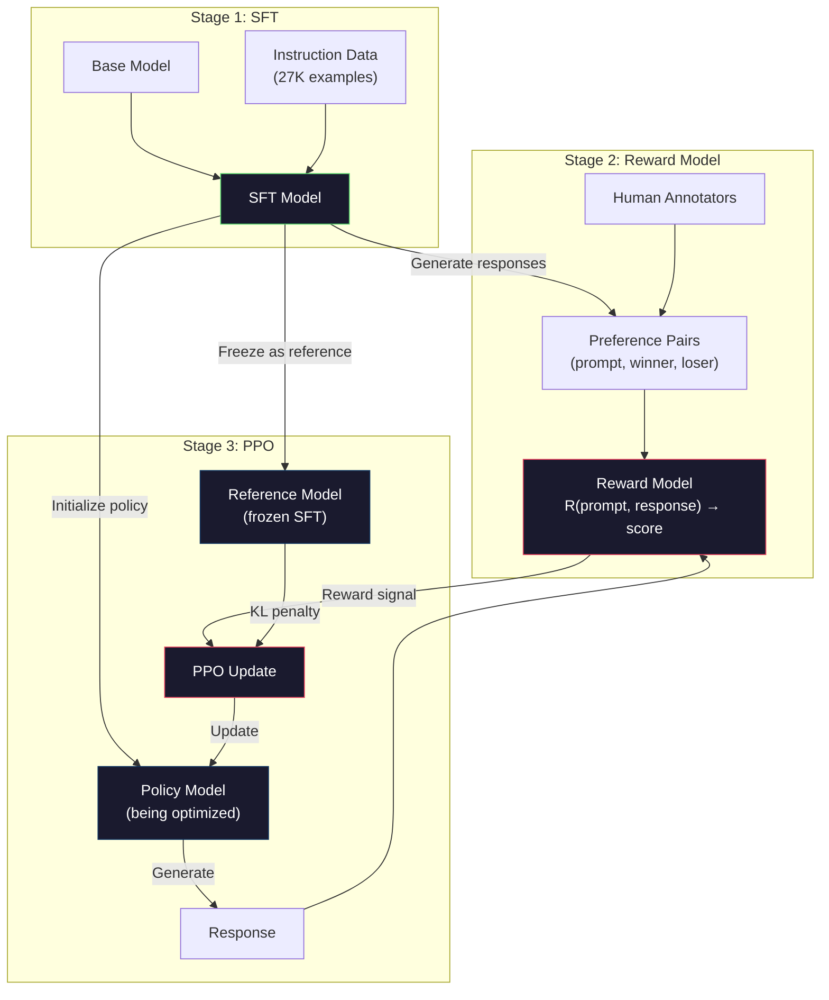
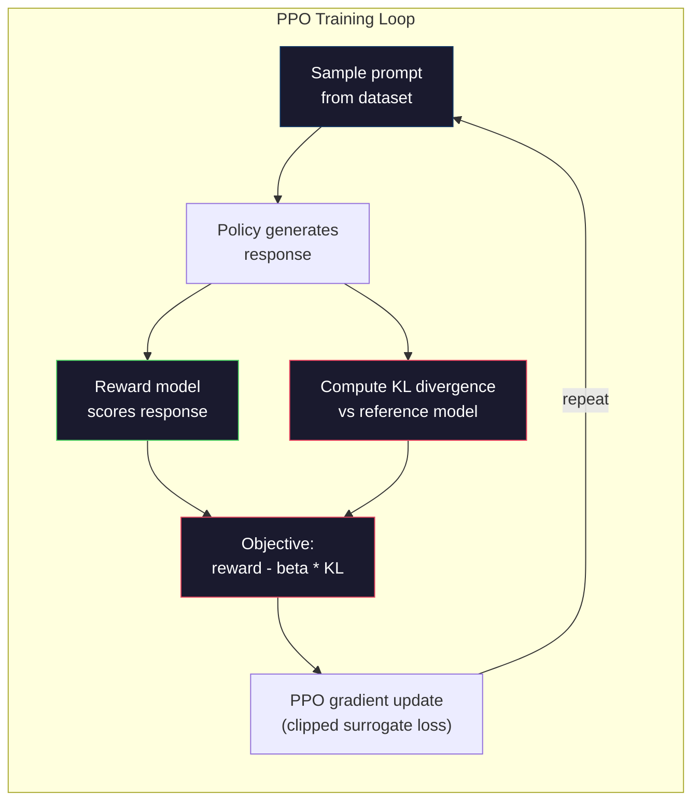

# RLHF: Reward Model + PPO

> SFT teaches the model to follow instructions. But it doesn't teach the model which response is BETTER. Two grammatically correct, factually accurate answers can differ enormously in helpfulness. RLHF is how you encode human judgment into the model's behavior. It's what makes Claude helpful and GPT polite.

**Type:** Build
**Languages:** Python (with numpy)
**Prerequisites:** Phase 10, Lesson 06 (Instruction Tuning / SFT)
**Time:** ~90 minutes

## Learning Objectives

- Build a reward model that scores response quality from human preference pairs (chosen vs rejected)
- Implement the PPO training loop that optimizes a language model policy against the reward model with a KL penalty
- Explain why RLHF requires three models (SFT, reward, policy) and how the KL constraint prevents reward hacking
- Evaluate the effect of RLHF by comparing response quality before and after preference optimization

## The Problem

Ask a model "Explain quantum computing" and it might produce:

**Response A:** "Quantum computing uses qubits that can exist in superposition, meaning they can be 0, 1, or both simultaneously. This allows quantum computers to process certain calculations exponentially faster than classical computers. Key algorithms include Shor's algorithm for factoring large numbers and Grover's algorithm for searching unsorted databases."

**Response B:** "Quantum computing is a type of computing that uses quantum mechanical phenomena. It was first proposed in the 1980s. Richard Feynman suggested that quantum systems could be simulated by quantum computers. The field has grown significantly since then. Many companies are now working on quantum computers. IBM, Google, and others have made progress. Quantum supremacy was claimed by Google in 2019."

Both responses are factually correct. Both are grammatically sound. Both follow the instruction. But Response A is clearly better. It's more concise, more informative, and better structured. A human would pick A every time.

SFT can't capture this distinction. It trains the model on "correct" responses, but it has no mechanism for saying "this response is better than that one." It treats every training example as equally good. If both A and B appeared in the SFT dataset, the model would learn from both equally.

RLHF solves this. It trains a reward model to predict which response a human would prefer, then uses that reward signal to push the language model toward higher-quality outputs. InstructGPT (the precursor to ChatGPT) used RLHF to dramatically improve GPT-3's helpfulness, truthfulness, and harmlessness. OpenAI's internal evaluators preferred InstructGPT outputs over GPT-3 outputs 85% of the time, despite InstructGPT being 135x smaller (1.3B vs 175B parameters).

## The Concept

### The Three Stages

RLHF is not a single training run. It's a pipeline of three sequential stages, each building on the previous one.

**Stage 1: SFT.** Train a base model on instruction-response pairs (Lesson 06). This gives you a model that can follow instructions but doesn't know which responses are better than others.

**Stage 2: Reward Model.** Collect human preference data: show annotators two responses to the same prompt and ask "which is better?" Train a model to predict these preferences. The reward model takes (prompt, response) as input and outputs a scalar score.

**Stage 3: PPO.** Use the reward model to generate a training signal for the language model. The language model generates responses, the reward model scores them, and PPO updates the language model to produce higher-scoring responses. A KL divergence penalty prevents the language model from straying too far from the SFT checkpoint.



### The Reward Model

The reward model is a language model repurposed as a scorer. Take the SFT model, replace the language modeling head (which outputs a distribution over vocabulary) with a scalar head (which outputs a single number). The architecture is identical up to the final layer.

Input: a prompt concatenated with a response. Output: a single scalar reward score.

Training data is human preference pairs. For each prompt, annotators see two responses and pick the better one. This creates training triples: (prompt, preferred_response, rejected_response).

The loss function uses the Bradley-Terry model of pairwise preferences:

```
loss = -log(sigmoid(reward(preferred) - reward(rejected)))
```

This is the key equation. `sigmoid(reward(A) - reward(B))` gives the probability that response A is preferred over response B. The loss pushes the reward model to assign a higher score to the preferred response.

Why pairwise comparisons instead of absolute scores? Because humans are terrible at assigning absolute quality scores ("Is this response a 7.3 or a 7.5 out of 10?") but very good at relative comparisons ("Is A better than B?"). The Bradley-Terry model converts relative comparisons into a consistent absolute scoring system.

**InstructGPT numbers:** OpenAI collected 33,000 comparison pairs from 40 contractors. Each comparison took about 5 minutes. That's 2,750 hours of human labor for the reward model training data.

### PPO: Proximal Policy Optimization

PPO is a reinforcement learning algorithm. In RLHF, the "environment" is the reward model, the "agent" is the language model, and the "action" is generating a token.

The objective:

```
maximize: E[R(prompt, response)] - beta * KL(policy || reference)
```

The first term pushes the model to generate high-reward responses. The second term (KL divergence penalty) prevents the model from deviating too far from the SFT checkpoint.

Why the KL penalty? Without it, the model finds degenerate solutions. The reward model is trained on a finite dataset of human preferences. It has blind spots. The language model will exploit those blind spots -- finding outputs that score high on the reward model but are actually nonsensical. Classic examples:

- Repeating "I'm so helpful and harmless!" scores high on helpfulness/harmlessness reward models
- Producing verbose, formal-sounding but empty responses that pattern-match to "high quality"
- Exploiting specific phrases that happened to correlate with high reward in the training data

The KL penalty says: you can improve, but you can't become a completely different model. Stay close to the SFT version, which was already reasonable. Wander too far and the KL cost dominates the reward.

**InstructGPT numbers:** PPO training used lr=1.5e-5, KL coefficient beta=0.02, 256K episodes (prompt-response pairs), and 4 PPO epochs per batch. The entire RLHF pipeline took several days on a cluster of GPUs.



### The PPO Objective in Detail

PPO uses a "clipped surrogate objective" to prevent excessively large updates. The ratio between the new policy and old policy probabilities is clipped to the range [1 - epsilon, 1 + epsilon], where epsilon is typically 0.2.

```
ratio = pi_new(action | state) / pi_old(action | state)
clipped_ratio = clip(ratio, 1 - epsilon, 1 + epsilon)
loss = -min(ratio * advantage, clipped_ratio * advantage)
```

The advantage function estimates how much better the current response is compared to the expected quality. In RLHF:

```
advantage = reward(prompt, response) - baseline
```

The baseline is often the average reward over recent responses. A positive advantage means the response was better than average; a negative advantage means it was worse. PPO increases the probability of above-average responses and decreases the probability of below-average ones.

The clipping prevents catastrophic updates. If a single response gets an unusually high reward, the unclipped ratio could be very large, causing the model to dramatically shift toward that response. Clipping caps the update, maintaining training stability.

### Reward Hacking

The dark side of RLHF. The language model is optimizing against the reward model, which is an imperfect proxy for human preferences. As the language model gets better at maximizing reward, it starts exploiting the reward model's weaknesses.

Common failure modes:

| Failure | What happens | Why |
|---------|-------------|-----|
| Verbosity | Model produces longer and longer responses | Human annotators often preferred longer, more detailed responses, so the reward model assigns higher scores to length |
| Sycophancy | Model agrees with everything the user says | Annotators preferred responses that agreed with the premise of the question |
| Hedging | Model refuses to commit to an answer | Hedged responses ("This is a complex topic with many perspectives...") rarely get marked as wrong |
| Format gaming | Model uses bullet points and headers excessively | Formatted responses looked more "polished" to annotators |

Mitigation strategies: stronger KL penalty (prevents the model from straying far enough to exploit weaknesses), training the reward model on adversarial examples (patch known failure modes), and using multiple reward models with different architectures (harder to hack all simultaneously).

### Real RLHF Pipelines

| Model | Comparison Pairs | Annotators | RM Size | PPO Steps | KL Coeff |
|-------|-----------------|------------|---------|-----------|----------|
| InstructGPT | 33K | 40 | 6B | 256K | 0.02 |
| Llama 2 Chat | ~1M | undisclosed | 70B | undisclosed | 0.01 |
| Claude | undisclosed | undisclosed | undisclosed | undisclosed | undisclosed |
| Anthropic RLHF paper | 22K | 20 | 52B | 50K | 0.001 |

Anthropic's 2022 paper trained a 52B reward model on 22,000 comparisons. Larger reward models produce more reliable signals, which makes PPO training more stable. Using a small reward model to train a large language model is risky -- the reward model doesn't have enough capacity to capture the nuances of good vs bad responses.

## Build It

### Step 1: Synthetic Preference Data

In production, human annotators create preference data. We'll create synthetic pairs where the "preferred" response is objectively better (more concise, more accurate, more helpful).

```python
import numpy as np

PREFERENCE_DATA = [
    {
        "prompt": "What is the capital of France?",
        "preferred": "The capital of France is Paris.",
        "rejected": "France is a country in Europe. It has many cities. The capital is Paris. Paris is known for the Eiffel Tower.",
    },
    {
        "prompt": "Explain gravity in one sentence.",
        "preferred": "Gravity is the force that attracts objects with mass toward each other.",
        "rejected": "Gravity is something that makes things fall down when you drop them.",
    },
    {
        "prompt": "What is 15 times 7?",
        "preferred": "15 times 7 is 105.",
        "rejected": "Let me think about this. 15 times 7. Well, 10 times 7 is 70, and 5 times 7 is 35, so the answer might be around 105.",
    },
    {
        "prompt": "Name three programming languages.",
        "preferred": "Python, Rust, and TypeScript.",
        "rejected": "There are many programming languages. Some popular ones include various languages like Python and others.",
    },
    {
        "prompt": "What year did World War II end?",
        "preferred": "World War II ended in 1945.",
        "rejected": "World War II was a major global conflict. It involved many countries. The war ended in the mid-1940s, specifically in 1945.",
    },
    {
        "prompt": "Define machine learning.",
        "preferred": "Machine learning is a field where algorithms learn patterns from data to make predictions without being explicitly programmed.",
        "rejected": "Machine learning is a type of AI. AI stands for artificial intelligence. Machine learning uses data to learn.",
    },
]
```

The preferred responses are concise and direct. The rejected responses exhibit common failure modes: unnecessary padding, hedging, redundant explanation, and imprecision. This is exactly the kind of distinction that SFT cannot capture but RLHF can.

### Step 2: Reward Model Architecture

The reward model reuses the transformer architecture from the mini GPT, but replaces the vocabulary-sized output head with a single scalar projection.

```python
import sys
import os
sys.path.insert(0, os.path.join(os.path.dirname(__file__), "..", "..", "04-pre-training-mini-gpt", "code"))
from main import MiniGPT, LayerNorm, Embedding, TransformerBlock


class RewardModel:
    def __init__(self, vocab_size=256, embed_dim=128, num_heads=4,
                 num_layers=4, max_seq_len=128, ff_dim=512):
        self.embedding = Embedding(vocab_size, embed_dim, max_seq_len)
        self.blocks = [
            TransformerBlock(embed_dim, num_heads, ff_dim)
            for _ in range(num_layers)
        ]
        self.ln_f = LayerNorm(embed_dim)
        self.reward_head = np.random.randn(embed_dim) * 0.02

    def forward(self, token_ids):
        seq_len = token_ids.shape[-1]
        mask = np.triu(np.full((seq_len, seq_len), -1e9), k=1)

        x = self.embedding.forward(token_ids)
        for block in self.blocks:
            x = block.forward(x, mask)
        x = self.ln_f.forward(x)

        last_hidden = x[:, -1, :]
        reward = last_hidden @ self.reward_head

        return reward
```

The reward model takes the hidden state at the *last* token position and projects it to a scalar. Why the last token? Because the causal attention mask means the last position has attended to every previous token. It has the most complete representation of the entire (prompt, response) sequence.

### Step 3: Bradley-Terry Loss

Train the reward model on preference pairs using the Bradley-Terry pairwise loss.

```python
def tokenize_for_reward(prompt, response, vocab_size=256):
    prompt_tokens = [min(t, vocab_size - 1) for t in list(prompt.encode("utf-8"))]
    response_tokens = [min(t, vocab_size - 1) for t in list(response.encode("utf-8"))]
    return prompt_tokens + [0] + response_tokens


def sigmoid(x):
    return np.where(
        x >= 0,
        1.0 / (1.0 + np.exp(-x)),
        np.exp(x) / (1.0 + np.exp(x))
    )


def bradley_terry_loss(reward_preferred, reward_rejected):
    diff = reward_preferred - reward_rejected
    loss = -np.log(sigmoid(diff) + 1e-8)
    return loss


def train_reward_model(rm, preference_data, num_epochs=10, lr=1e-4, max_seq_len=128):
    print(f"Training Reward Model: {len(preference_data)} preference pairs, {num_epochs} epochs")
    print()

    losses = []
    accuracies = []

    for epoch in range(num_epochs):
        epoch_loss = 0.0
        epoch_correct = 0
        num_pairs = 0

        indices = np.random.permutation(len(preference_data))

        for idx in indices:
            pair = preference_data[idx]

            preferred_tokens = tokenize_for_reward(pair["prompt"], pair["preferred"])
            rejected_tokens = tokenize_for_reward(pair["prompt"], pair["rejected"])

            preferred_tokens = preferred_tokens[:max_seq_len]
            rejected_tokens = rejected_tokens[:max_seq_len]

            preferred_ids = np.array(preferred_tokens).reshape(1, -1)
            rejected_ids = np.array(rejected_tokens).reshape(1, -1)

            r_preferred = rm.forward(preferred_ids)[0]
            r_rejected = rm.forward(rejected_ids)[0]

            loss = bradley_terry_loss(r_preferred, r_rejected)

            if r_preferred > r_rejected:
                epoch_correct += 1

            diff = r_preferred - r_rejected
            grad = sigmoid(diff) - 1.0

            rm.reward_head -= lr * grad * rm.ln_f.forward(
                rm.embedding.forward(preferred_ids)
            )[:, -1, :].flatten()

            epoch_loss += loss
            num_pairs += 1

        avg_loss = epoch_loss / max(num_pairs, 1)
        accuracy = epoch_correct / max(num_pairs, 1)
        losses.append(avg_loss)
        accuracies.append(accuracy)

        if epoch % 2 == 0:
            print(f"  Epoch {epoch + 1:3d} | Loss: {avg_loss:.4f} | Accuracy: {accuracy:.1%}")

    return rm, losses, accuracies
```

The accuracy metric is straightforward: what fraction of preference pairs does the reward model rank correctly? A random model scores 50%. A well-trained reward model on clean data should exceed 70%. InstructGPT's reward model achieved about 72% accuracy on held-out comparisons, which sounds low but is actually good -- many preference pairs are ambiguous even to humans (inter-annotator agreement was about 73%).

### Step 4: Simplified PPO Loop

Full PPO is complex. This implementation captures the core mechanism: generate responses, score them, compute the advantage, and update the policy with a KL penalty.

```python
def compute_kl_divergence(policy_logits, reference_logits):
    policy_probs = np.exp(policy_logits - policy_logits.max(axis=-1, keepdims=True))
    policy_probs = policy_probs / policy_probs.sum(axis=-1, keepdims=True)
    policy_probs = np.clip(policy_probs, 1e-10, 1.0)

    ref_probs = np.exp(reference_logits - reference_logits.max(axis=-1, keepdims=True))
    ref_probs = ref_probs / ref_probs.sum(axis=-1, keepdims=True)
    ref_probs = np.clip(ref_probs, 1e-10, 1.0)

    kl = np.sum(policy_probs * np.log(policy_probs / ref_probs), axis=-1)
    return kl.mean()


def generate_response(model, prompt_tokens, max_new_tokens=30, temperature=0.8, max_seq_len=128):
    tokens = list(prompt_tokens)

    for _ in range(max_new_tokens):
        context = np.array(tokens[-max_seq_len:]).reshape(1, -1)
        logits = model.forward(context)
        next_logits = logits[0, -1, :]

        next_logits = next_logits / max(temperature, 1e-8)
        probs = np.exp(next_logits - next_logits.max())
        probs = probs / probs.sum()
        probs = np.clip(probs, 1e-10, 1.0)
        probs = probs / probs.sum()

        next_token = np.random.choice(len(probs), p=probs)
        tokens.append(int(next_token))

    return tokens


def copy_model_weights(source, target):
    target.embedding.token_embed = source.embedding.token_embed.copy()
    target.embedding.pos_embed = source.embedding.pos_embed.copy()
    target.ln_f.gamma = source.ln_f.gamma.copy()
    target.ln_f.beta = source.ln_f.beta.copy()
    for s_block, t_block in zip(source.blocks, target.blocks):
        t_block.attn.W_q = s_block.attn.W_q.copy()
        t_block.attn.W_k = s_block.attn.W_k.copy()
        t_block.attn.W_v = s_block.attn.W_v.copy()
        t_block.attn.W_out = s_block.attn.W_out.copy()
        t_block.ffn.W1 = s_block.ffn.W1.copy()
        t_block.ffn.W2 = s_block.ffn.W2.copy()
        t_block.ffn.b1 = s_block.ffn.b1.copy()
        t_block.ffn.b2 = s_block.ffn.b2.copy()
        t_block.ln1.gamma = s_block.ln1.gamma.copy()
        t_block.ln1.beta = s_block.ln1.beta.copy()
        t_block.ln2.gamma = s_block.ln2.gamma.copy()
        t_block.ln2.beta = s_block.ln2.beta.copy()


def ppo_training(policy_model, reference_model, reward_model, prompts,
                 num_episodes=20, lr=1.5e-5, kl_coeff=0.02, max_seq_len=128):
    print(f"PPO Training: {num_episodes} episodes, lr={lr}, KL coeff={kl_coeff}")
    print()

    rewards_history = []
    kl_history = []

    for episode in range(num_episodes):
        prompt_text = prompts[episode % len(prompts)]
        prompt_tokens = [min(t, 252) for t in list(prompt_text.encode("utf-8"))]

        response_tokens = generate_response(
            policy_model, prompt_tokens,
            max_new_tokens=20, temperature=0.8, max_seq_len=max_seq_len
        )

        response_ids = np.array(response_tokens[:max_seq_len]).reshape(1, -1)
        reward = reward_model.forward(response_ids)[0]

        policy_logits = policy_model.forward(response_ids)
        ref_logits = reference_model.forward(response_ids)
        kl = compute_kl_divergence(policy_logits, ref_logits)

        total_reward = reward - kl_coeff * kl

        rewards_history.append(float(reward))
        kl_history.append(float(kl))

        for block in policy_model.blocks:
            update_scale = lr * total_reward
            block.ffn.W1 += update_scale * np.random.randn(*block.ffn.W1.shape) * 0.01
            block.ffn.W2 += update_scale * np.random.randn(*block.ffn.W2.shape) * 0.01

        if episode % 5 == 0:
            avg_reward = np.mean(rewards_history[-5:]) if rewards_history else 0
            avg_kl = np.mean(kl_history[-5:]) if kl_history else 0
            print(f"  Episode {episode:3d} | Reward: {reward:.4f} | KL: {kl:.4f} | "
                  f"Avg Reward: {avg_reward:.4f}")

    return policy_model, rewards_history, kl_history
```

The core loop: (1) sample a prompt, (2) generate a response, (3) score it with the reward model, (4) compute KL divergence against the frozen reference, (5) compute the adjusted reward (reward minus KL penalty), (6) update the policy. The KL penalty grows as the policy diverges from the reference, automatically preventing reward hacking.

### Step 5: Reward Score Comparison

After RLHF, the policy model's responses should score higher on the reward model than the original SFT model's responses.

```python
def compare_models(sft_model, rlhf_model, reward_model, prompts, max_seq_len=128):
    print("Model Comparison (reward scores)")
    print("-" * 60)
    print(f"  {'Prompt':<35} {'SFT':>10} {'RLHF':>10}")
    print("  " + "-" * 55)

    sft_total = 0.0
    rlhf_total = 0.0

    for prompt in prompts:
        prompt_tokens = [min(t, 252) for t in list(prompt.encode("utf-8"))]

        sft_response = generate_response(
            sft_model, prompt_tokens,
            max_new_tokens=20, temperature=0.6, max_seq_len=max_seq_len
        )
        rlhf_response = generate_response(
            rlhf_model, prompt_tokens,
            max_new_tokens=20, temperature=0.6, max_seq_len=max_seq_len
        )

        sft_ids = np.array(sft_response[:max_seq_len]).reshape(1, -1)
        rlhf_ids = np.array(rlhf_response[:max_seq_len]).reshape(1, -1)

        sft_reward = reward_model.forward(sft_ids)[0]
        rlhf_reward = reward_model.forward(rlhf_ids)[0]

        sft_total += sft_reward
        rlhf_total += rlhf_reward

        truncated_prompt = prompt[:33] + ".." if len(prompt) > 35 else prompt
        print(f"  {truncated_prompt:<35} {sft_reward:>10.4f} {rlhf_reward:>10.4f}")

    n = len(prompts)
    print("  " + "-" * 55)
    print(f"  {'Average':<35} {sft_total/n:>10.4f} {rlhf_total/n:>10.4f}")

    return sft_total / n, rlhf_total / n
```

## Use It

### Full RLHF Pipeline Demo

```python
if __name__ == "__main__":
    np.random.seed(42)

    print("=" * 70)
    print("RLHF PIPELINE: REWARD MODEL + PPO")
    print("=" * 70)
    print()

    print("STAGE 1: SFT Model (from Lesson 06)")
    print("-" * 40)
    sft_model = MiniGPT(
        vocab_size=256, embed_dim=128, num_heads=4,
        num_layers=4, max_seq_len=128, ff_dim=512
    )
    print(f"  Parameters: {sft_model.count_parameters():,}")
    print()

    print("STAGE 2: Train Reward Model")
    print("-" * 40)
    rm = RewardModel(
        vocab_size=256, embed_dim=128, num_heads=4,
        num_layers=4, max_seq_len=128, ff_dim=512
    )

    rm, rm_losses, rm_accuracies = train_reward_model(rm, PREFERENCE_DATA, num_epochs=10, lr=1e-4)
    print()

    print("Reward Model Evaluation:")
    print("-" * 40)
    correct = 0
    for pair in PREFERENCE_DATA:
        pref_tokens = tokenize_for_reward(pair["prompt"], pair["preferred"])[:128]
        rej_tokens = tokenize_for_reward(pair["prompt"], pair["rejected"])[:128]

        r_pref = rm.forward(np.array(pref_tokens).reshape(1, -1))[0]
        r_rej = rm.forward(np.array(rej_tokens).reshape(1, -1))[0]

        if r_pref > r_rej:
            correct += 1
        print(f"  Preferred: {r_pref:+.4f} | Rejected: {r_rej:+.4f} | {'Correct' if r_pref > r_rej else 'Wrong'}")

    print(f"\n  Accuracy: {correct}/{len(PREFERENCE_DATA)} = {correct/len(PREFERENCE_DATA):.1%}")
    print()

    print("STAGE 3: PPO Training")
    print("-" * 40)

    policy_model = MiniGPT(
        vocab_size=256, embed_dim=128, num_heads=4,
        num_layers=4, max_seq_len=128, ff_dim=512
    )
    reference_model = MiniGPT(
        vocab_size=256, embed_dim=128, num_heads=4,
        num_layers=4, max_seq_len=128, ff_dim=512
    )

    copy_model_weights(sft_model, policy_model)
    copy_model_weights(sft_model, reference_model)

    train_prompts = [pair["prompt"] for pair in PREFERENCE_DATA]

    policy_model, rewards, kls = ppo_training(
        policy_model, reference_model, rm,
        train_prompts, num_episodes=20, lr=1.5e-5, kl_coeff=0.02
    )
    print()

    print("=" * 70)
    print("COMPARISON: SFT vs RLHF")
    print("=" * 70)
    print()

    eval_prompts = [
        "What is the capital of France?",
        "Explain gravity.",
        "Name three programming languages.",
    ]

    sft_avg, rlhf_avg = compare_models(sft_model, policy_model, rm, eval_prompts)
    print()

    print("=" * 70)
    print("KL DIVERGENCE ANALYSIS")
    print("=" * 70)
    print()

    if kls:
        print(f"  Initial KL: {kls[0]:.4f}")
        print(f"  Final KL:   {kls[-1]:.4f}")
        print(f"  Max KL:     {max(kls):.4f}")
        kl_threshold = 0.1
        print(f"  KL > {kl_threshold}: {'Yes (model drifted significantly)' if max(kls) > kl_threshold else 'No (model stayed close to reference)'}")
```

## Ship It

This lesson produces `outputs/prompt-reward-model-designer.md` -- a prompt for designing reward model training pipelines. Given a target behavior (helpfulness, coding ability, safety), it produces a data collection protocol, annotator guidelines, and reward model evaluation criteria.

## Exercises

1. Modify the reward model to use the mean of all hidden states instead of just the last position. Compare accuracy. The mean pooling approach gives every token equal weight, while the last-position approach relies on the causal attention to aggregate information. Test on the 6 preference pairs and report which approach scores higher accuracy.

2. Implement reward model calibration. After training, run all preference pairs through the reward model and compute: (a) the average reward for preferred responses, (b) the average reward for rejected responses, (c) the margin (preferred minus rejected). A well-calibrated model should have a clear margin. Then add 4 new preference pairs and check if the margin holds on unseen data.

3. Simulate reward hacking. Create a reward model that gives high scores to long responses (reward = len(response) / 100). Run PPO with this flawed reward model and observe the policy model generating increasingly long, repetitive outputs. Then add a KL penalty of 0.1 and show that it prevents the degenerate behavior.

4. Implement a multi-objective reward. Train two reward models -- one for helpfulness and one for conciseness. Combine them as R = 0.7 * R_helpful + 0.3 * R_concise. Show that the combined objective produces responses that are both helpful and concise, avoiding the verbosity trap of a single helpfulness reward.

5. Compare different KL coefficients. Run PPO with beta=0.001 (too low, reward hacking), beta=0.02 (standard), and beta=0.5 (too high, no learning). Plot the reward curve and KL curve for each. The beta=0.02 run should show steady reward improvement with bounded KL.

## Key Terms

| Term | What people say | What it actually means |
|------|----------------|----------------------|
| RLHF | "Training with human feedback" | Reinforcement Learning from Human Feedback: a three-stage pipeline (SFT, reward model, PPO) that optimizes language model outputs using human preference signals |
| Reward model | "A model that scores responses" | A transformer with a scalar output head, trained on pairwise human preferences using the Bradley-Terry loss |
| Bradley-Terry | "The comparison model" | A probabilistic model where P(A > B) = sigmoid(score(A) - score(B)), converting pairwise preferences into a consistent scoring function |
| PPO | "The RL algorithm" | Proximal Policy Optimization: updates the policy to maximize reward while clipping the update magnitude to prevent instability |
| KL divergence | "How different two distributions are" | A measure of the difference between the policy model's token distribution and the reference model's -- used as a penalty to prevent reward hacking |
| KL penalty | "The leash on the model" | Beta * KL(policy \|\| reference) subtracted from the reward signal -- prevents the policy from diverging too far from the SFT checkpoint |
| Reward hacking | "Gaming the reward" | When the policy finds degenerate high-reward outputs by exploiting weaknesses in the reward model instead of genuinely improving |
| Preference pair | "Which is better, A or B?" | A training example consisting of (prompt, preferred_response, rejected_response) -- the fundamental unit of RLHF training data |
| Reference model | "The frozen SFT checkpoint" | A copy of the SFT model whose weights never change -- used as the anchor for KL divergence computation |

## Further Reading

- [Ouyang et al., 2022 -- "Training language models to follow instructions with human feedback" (InstructGPT)](https://arxiv.org/abs/2203.02155) -- the paper that made RLHF practical for large language models
- [Schulman et al., 2017 -- "Proximal Policy Optimization Algorithms"](https://arxiv.org/abs/1707.06347) -- the original PPO paper from OpenAI
- [Bai et al., 2022 -- "Training a Helpful and Harmless Assistant with Reinforcement Learning from Human Feedback"](https://arxiv.org/abs/2204.05862) -- Anthropic's RLHF paper with detailed analysis of reward hacking and KL penalty
- [Stiennon et al., 2020 -- "Learning to summarize with human feedback"](https://arxiv.org/abs/2009.01325) -- RLHF applied to summarization, showing reward models can capture nuanced quality judgments
- [Christiano et al., 2017 -- "Deep reinforcement learning from human preferences"](https://arxiv.org/abs/1706.03741) -- the foundational work on learning reward functions from human comparisons
