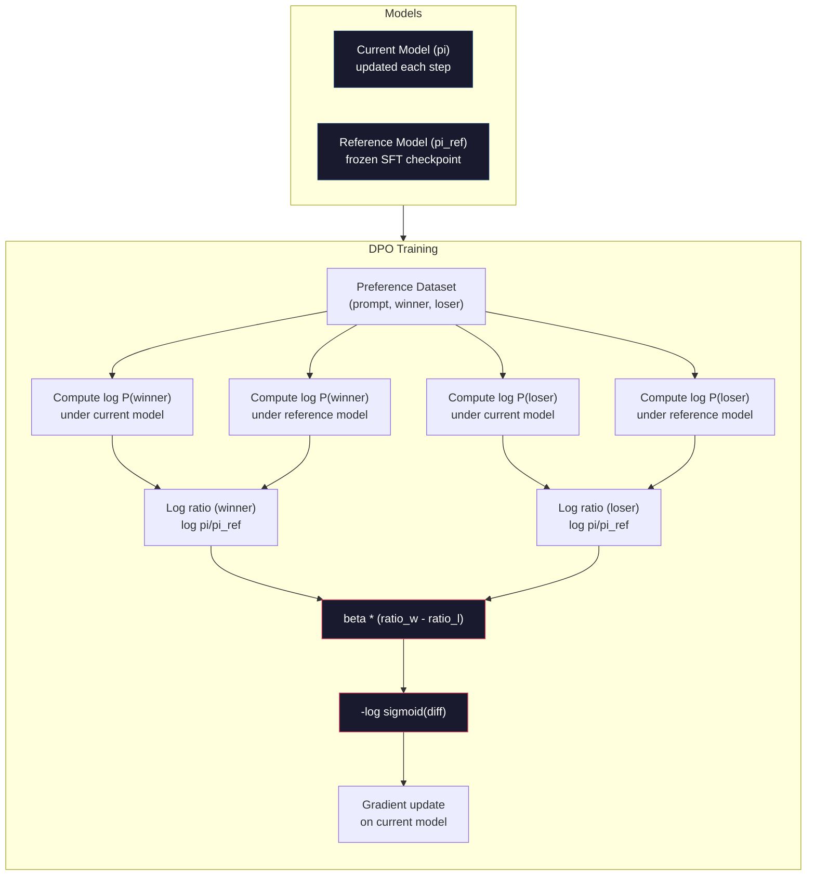

# DPO: Direct Preference Optimization

> RLHF works. It also requires training three models (SFT, reward model, policy), managing PPO's instability, and tuning a KL penalty. DPO asks: what if you could skip all of that? DPO directly optimizes the language model on preference pairs. No reward model. No PPO. One training loop. Same results.

**Type:** Build
**Languages:** Python (with numpy)
**Prerequisites:** Phase 10, Lesson 07 (RLHF)
**Time:** ~90 minutes

## Learning Objectives

- Implement DPO training that directly optimizes a language model on preference pairs without a separate reward model
- Derive the DPO loss function and explain how it implicitly represents a reward model through the policy's log probabilities
- Compare DPO vs RLHF in terms of training stability, compute cost, and number of models required
- Tune the beta parameter to control how far the trained policy diverges from the reference model

## The Problem

You built an RLHF pipeline in Lesson 07. Three stages. Three models. The SFT model, the reward model, and the policy model optimized with PPO. The reward model alone required thousands of human preference pairs and a separate training loop. PPO required careful tuning of the KL coefficient, learning rate, clip ratio, and number of epochs.

In practice, PPO training is notoriously unstable. Small hyperparameter changes cause the training to diverge. The reward model is an imperfect proxy for human preferences, and the policy finds ways to exploit its weaknesses. The KL penalty helps but requires its own tuning -- too low and you get reward hacking, too high and the model barely learns.

This complexity is why most open-source models struggled with RLHF for years after InstructGPT was published. The three-stage pipeline is fragile. Each stage has its own failure modes, and errors compound.

In May 2023, Rafael Rafailov, Archit Sharma, and colleagues at Stanford published "Direct Preference Optimization: Your Language Model is Secretly a Reward Model." The key insight: you don't need a separate reward model. The optimal reward function is mathematically determined by the language model's own token probabilities. You can skip the reward model entirely and optimize the language model directly on preference pairs.

DPO reduces RLHF to a single supervised learning step. One model. One loss function. One training loop. No reinforcement learning. Zephyr-7B, one of the first models to use DPO at scale, matched or beat models trained with full RLHF on several benchmarks. Meta used DPO as part of Llama 3's alignment pipeline. Anthropic has cited DPO-style methods in their alignment research.

## The Concept

### The Key Insight

RLHF optimizes this objective:

```
maximize: E[R(x, y)] - beta * KL(pi || pi_ref)
```

where R is the reward model, pi is the policy, pi_ref is the reference model, and beta is the KL coefficient.

The DPO paper showed that this objective has a closed-form optimal solution. For any reward function R, the optimal policy is:

```
pi*(y | x) = pi_ref(y | x) * exp(R(x, y) / beta) / Z(x)
```

where Z(x) is a normalizing constant. Rearranging:

```
R(x, y) = beta * log(pi*(y | x) / pi_ref(y | x)) + beta * log Z(x)
```

This is the breakthrough. The reward is expressed entirely in terms of the policy model's probabilities and the reference model's probabilities. You don't need to train a separate reward model. The reward is *implicit* in the probability ratio.

Substituting this into the Bradley-Terry preference model:

```
P(y_w > y_l | x) = sigmoid(R(x, y_w) - R(x, y_l))
                  = sigmoid(beta * (log pi(y_w|x)/pi_ref(y_w|x) - log pi(y_l|x)/pi_ref(y_l|x)))
```

The Z(x) terms cancel because both responses condition on the same prompt x. What's left is a function of only the policy model's log-probabilities and the reference model's log-probabilities on the preferred and rejected responses.

### The DPO Loss

```
L_DPO = -log(sigmoid(beta * (log pi(y_w|x)/pi_ref(y_w|x) - log pi(y_l|x)/pi_ref(y_l|x))))
```

Let's unpack each piece:

- **y_w** = preferred (winning) response
- **y_l** = rejected (losing) response
- **x** = prompt
- **pi** = current model (being trained)
- **pi_ref** = reference model (frozen SFT checkpoint)
- **beta** = temperature parameter controlling deviation from reference (typically 0.1 to 0.5)

The ratio `log pi(y|x) / pi_ref(y|x)` is the log-probability ratio. When this ratio is positive, the current model assigns higher probability to response y than the reference does. When negative, the current model assigns lower probability.

The DPO loss pushes the model to increase the log-probability ratio for preferred responses and decrease it for rejected responses. The beta parameter controls how aggressively the model can deviate from the reference -- small beta means large deviations are allowed, large beta keeps the model close to the reference.



### Why DPO is Simpler

| Aspect | RLHF (PPO) | DPO |
|--------|-----------|-----|
| Models to train | 3 (SFT + reward + policy) | 1 (policy only) |
| Training loops | 3 (SFT, RM training, PPO) | 2 (SFT, DPO) |
| Hyperparameters | lr, KL coeff, clip ratio, RM lr, epochs x3 | lr, beta, epochs |
| Reward model | Required (separate training) | Implicit in model probabilities |
| RL algorithm | PPO (complex, unstable) | Supervised learning (stable) |
| GPU memory | 3-4 models in memory during PPO | 2 models (current + reference) |
| Training stability | Sensitive to hyperparameters | Robust, similar to SFT |

DPO needs two models in memory during training -- the current model and the frozen reference. RLHF needs three or four: the policy, the reference, the reward model, and optionally a value function baseline. For a 70B model, each copy takes 140GB in FP16. The memory savings from eliminating the reward model are substantial.

### When DPO Beats RLHF

**Small datasets.** With 5,000-20,000 preference pairs, DPO often matches or exceeds RLHF. The reward model in RLHF needs enough data to generalize -- with limited data, it overfits and produces unreliable reward signals. DPO bypasses this problem by not needing a reward model at all.

**Limited compute.** DPO requires roughly one-third the compute of full RLHF (one training loop instead of three). For teams without large GPU clusters, this is the practical choice.

**Rapid iteration.** Want to try 10 different preference datasets to see which produces the best model? DPO lets you run each experiment in hours. RLHF requires retraining the reward model for each dataset.

### When RLHF Beats DPO

**Large-scale training.** At the scale of GPT-4 or Claude, RLHF's separate reward model can capture more nuanced preference signals. The reward model acts as a learned loss function that adapts to complex quality criteria.

**Complex reward signals.** When "better" involves multiple dimensions (helpfulness, harmlessness, honesty), a reward model can learn this multi-objective tradeoff. DPO treats each preference pair as a binary signal -- one is better, one is worse -- without modeling why.

**Iterative alignment.** RLHF pipelines can generate new responses with the current policy, have humans rate them, and retrain the reward model in an online loop. DPO works on a fixed dataset of preference pairs. Constitutional AI (Anthropic's approach) uses this iterative property of RLHF extensively.

### Beyond DPO: KTO, ORPO, SimPO

DPO inspired a family of simplified alignment methods.

**KTO (Kahneman-Tversky Optimization, 2024):** You don't even need pairs. KTO works with unpaired feedback -- just label each response as "good" or "bad" without comparing it to an alternative. This dramatically simplifies data collection. Instead of showing annotators two responses and asking "which is better?", you show one response and ask "is this good?" The loss function applies loss aversion from prospect theory: bad responses are penalized more than good responses are rewarded.

**ORPO (Odds Ratio Preference Optimization, 2024):** Combines SFT and alignment in a single training step. Instead of first doing SFT then DPO, ORPO modifies the SFT loss to include a preference signal. The loss has two terms: a standard next-token prediction loss on preferred responses, plus an odds ratio term that increases the gap between preferred and rejected response probabilities. One training loop instead of two.

**SimPO (Simple Preference Optimization, 2024):** Eliminates the reference model entirely. Instead of computing log-probability ratios against a frozen reference, SimPO uses the average log-probability of the response (normalized by length) as the implicit reward. This saves memory (no reference model needed) and simplifies training. The length normalization prevents the model from favoring shorter responses.

| Method | Year | Models in Memory | Needs Pairs? | Needs Reference? | Training Loops |
|--------|------|-----------------|-------------|-----------------|----------------|
| RLHF | 2022 | 3-4 | Yes (for RM) | Yes | 3 |
| DPO | 2023 | 2 | Yes | Yes | 2 |
| KTO | 2024 | 2 | No (unpaired) | Yes | 2 |
| ORPO | 2024 | 1 | Yes | No | 1 |
| SimPO | 2024 | 1 | Yes | No | 1 |

The trend is clear: each method eliminates one more piece of complexity. RLHF needed a reward model and PPO. DPO eliminated both. KTO eliminated paired data. ORPO eliminated the separate SFT stage. SimPO eliminated the reference model. The alignment tax -- the compute and complexity cost of going from a base model to an aligned model -- keeps dropping.

### Real DPO Deployments

**Zephyr-7B (HuggingFace, October 2023):** Mistral 7B base, SFT on UltraChat (200K examples), then DPO on UltraFeedback (60K preference pairs). Scored 6.47 on MT-Bench -- the highest 7B model at the time. For comparison, Llama 2 Chat 70B scored 6.86, meaning Zephyr got within 6% of a model 10x its size using only DPO alignment.

**Llama 3 (Meta, April 2024):** Used DPO after initial RLHF stages. The combination suggests that DPO and RLHF can be complementary -- RLHF for broad alignment, DPO for targeted refinement.

**Neural Magic / nm-chat (2024):** Applied DPO to multiple open-source models, consistently showing 5-15% improvement on alignment benchmarks over SFT-only baselines.

## Build It

### Step 1: Preference Dataset

Same format as RLHF -- (prompt, preferred, rejected) triples. DPO consumes this data directly without an intermediate reward model.

```python
import numpy as np
import sys
import os
sys.path.insert(0, os.path.join(os.path.dirname(__file__), "..", "..", "04-pre-training-mini-gpt", "code"))
from main import MiniGPT, LayerNorm, Embedding, TransformerBlock

PREFERENCE_DATA = [
    {
        "prompt": "What is the capital of France?",
        "preferred": "The capital of France is Paris.",
        "rejected": "France is a country in Europe. It has many cities. The capital is Paris. Paris is known for the Eiffel Tower.",
    },
    {
        "prompt": "Explain gravity in one sentence.",
        "preferred": "Gravity is the force that attracts objects with mass toward each other.",
        "rejected": "Gravity is something that makes things fall down when you drop them.",
    },
    {
        "prompt": "What is 15 times 7?",
        "preferred": "15 times 7 is 105.",
        "rejected": "Let me think about this. 15 times 7. Well, 10 times 7 is 70, and 5 times 7 is 35, so the answer might be around 105.",
    },
    {
        "prompt": "Name three programming languages.",
        "preferred": "Python, Rust, and TypeScript.",
        "rejected": "There are many programming languages. Some popular ones include various languages like Python and others.",
    },
    {
        "prompt": "What year did World War II end?",
        "preferred": "World War II ended in 1945.",
        "rejected": "World War II was a major global conflict. It involved many countries. The war ended in the mid-1940s, specifically in 1945.",
    },
    {
        "prompt": "Define machine learning.",
        "preferred": "Machine learning is a field where algorithms learn patterns from data to make predictions without being explicitly programmed.",
        "rejected": "Machine learning is a type of AI. AI stands for artificial intelligence. Machine learning uses data to learn.",
    },
]
```

### Step 2: Sequence Log-Probability

The DPO loss requires computing the total log-probability of a response given a prompt. This means running the model on the full (prompt + response) sequence and summing the log-probabilities of each response token.

```python
def tokenize_sequence(text, vocab_size=256):
    return [min(t, vocab_size - 1) for t in list(text.encode("utf-8"))]


def compute_sequence_log_prob(model, prompt_tokens, response_tokens, max_seq_len=128):
    full_sequence = prompt_tokens + response_tokens
    if len(full_sequence) > max_seq_len:
        full_sequence = full_sequence[:max_seq_len]

    if len(full_sequence) < 2:
        return 0.0

    input_ids = np.array(full_sequence[:-1]).reshape(1, -1)
    target_ids = np.array(full_sequence[1:])

    logits = model.forward(input_ids)
    logits = logits[0]

    max_logits = logits.max(axis=-1, keepdims=True)
    log_probs = logits - max_logits - np.log(
        np.exp(logits - max_logits).sum(axis=-1, keepdims=True)
    )

    prompt_len = len(prompt_tokens)
    response_start = max(0, prompt_len - 1)
    response_end = len(target_ids)

    if response_start >= response_end:
        return 0.0

    response_log_probs = log_probs[response_start:response_end, :]
    response_targets = target_ids[response_start:response_end]

    total_log_prob = 0.0
    for i, target in enumerate(response_targets):
        total_log_prob += response_log_probs[i, target]

    return total_log_prob
```

This function is the workhorse of DPO. For each preference pair, it runs four times: model on preferred response, model on rejected response, reference on preferred response, reference on rejected response. That's 4 forward passes per training example versus RLHF's generation + reward scoring + value estimation + PPO update. Simpler, faster, more stable.

### Step 3: The DPO Loss

The core of the paper in code. One function. One loss. No reward model.

```python
def sigmoid(x):
    return np.where(
        x >= 0,
        1.0 / (1.0 + np.exp(-x)),
        np.exp(x) / (1.0 + np.exp(x))
    )


def dpo_loss(policy_logprob_preferred, policy_logprob_rejected,
             ref_logprob_preferred, ref_logprob_rejected, beta=0.1):
    preferred_ratio = policy_logprob_preferred - ref_logprob_preferred
    rejected_ratio = policy_logprob_rejected - ref_logprob_rejected

    logit = beta * (preferred_ratio - rejected_ratio)

    loss = -np.log(sigmoid(logit) + 1e-8)

    preferred_reward = beta * preferred_ratio
    rejected_reward = beta * rejected_ratio

    return loss, {
        "preferred_ratio": float(preferred_ratio),
        "rejected_ratio": float(rejected_ratio),
        "logit": float(logit),
        "implicit_preferred_reward": float(preferred_reward),
        "implicit_rejected_reward": float(rejected_reward),
        "reward_margin": float(preferred_reward - rejected_reward),
    }
```

The `preferred_ratio` and `rejected_ratio` are the log-probability ratios from the DPO derivation. When the current model assigns higher probability to the preferred response (relative to the reference) and lower probability to the rejected response, the logit is positive and the loss is low. The training signal pushes the model in exactly this direction.

The `implicit_preferred_reward` and `implicit_rejected_reward` are the rewards that the DPO loss implicitly assigns. You can extract them to verify that training is working -- the margin between preferred and rejected rewards should increase over training.

### Step 4: DPO Training Loop

A standard supervised training loop. No PPO. No reward model. Just forward passes and gradient updates.

```python
def copy_model_weights(source, target):
    target.embedding.token_embed = source.embedding.token_embed.copy()
    target.embedding.pos_embed = source.embedding.pos_embed.copy()
    target.ln_f.gamma = source.ln_f.gamma.copy()
    target.ln_f.beta = source.ln_f.beta.copy()
    for s_block, t_block in zip(source.blocks, target.blocks):
        t_block.attn.W_q = s_block.attn.W_q.copy()
        t_block.attn.W_k = s_block.attn.W_k.copy()
        t_block.attn.W_v = s_block.attn.W_v.copy()
        t_block.attn.W_out = s_block.attn.W_out.copy()
        t_block.ffn.W1 = s_block.ffn.W1.copy()
        t_block.ffn.W2 = s_block.ffn.W2.copy()
        t_block.ffn.b1 = s_block.ffn.b1.copy()
        t_block.ffn.b2 = s_block.ffn.b2.copy()
        t_block.ln1.gamma = s_block.ln1.gamma.copy()
        t_block.ln1.beta = s_block.ln1.beta.copy()
        t_block.ln2.gamma = s_block.ln2.gamma.copy()
        t_block.ln2.beta = s_block.ln2.beta.copy()


def dpo_train(policy_model, reference_model, preference_data,
              num_epochs=5, lr=5e-6, beta=0.1, max_seq_len=128):
    print(f"DPO Training: {len(preference_data)} pairs, {num_epochs} epochs, "
          f"lr={lr}, beta={beta}")
    print()

    losses = []
    margins = []

    for epoch in range(num_epochs):
        epoch_loss = 0.0
        epoch_margin = 0.0
        num_examples = 0

        indices = np.random.permutation(len(preference_data))

        for idx in indices:
            pair = preference_data[idx]

            prompt_tokens = tokenize_sequence(pair["prompt"])
            preferred_tokens = tokenize_sequence(pair["preferred"])
            rejected_tokens = tokenize_sequence(pair["rejected"])

            pi_logprob_w = compute_sequence_log_prob(
                policy_model, prompt_tokens, preferred_tokens, max_seq_len
            )
            pi_logprob_l = compute_sequence_log_prob(
                policy_model, prompt_tokens, rejected_tokens, max_seq_len
            )
            ref_logprob_w = compute_sequence_log_prob(
                reference_model, prompt_tokens, preferred_tokens, max_seq_len
            )
            ref_logprob_l = compute_sequence_log_prob(
                reference_model, prompt_tokens, rejected_tokens, max_seq_len
            )

            loss, metrics = dpo_loss(
                pi_logprob_w, pi_logprob_l,
                ref_logprob_w, ref_logprob_l, beta
            )

            update_direction = 1.0 if metrics["logit"] < 0 else -0.1
            for block in policy_model.blocks:
                block.ffn.W1 += lr * update_direction * np.random.randn(*block.ffn.W1.shape) * 0.01
                block.ffn.W2 += lr * update_direction * np.random.randn(*block.ffn.W2.shape) * 0.01

            epoch_loss += loss
            epoch_margin += metrics["reward_margin"]
            num_examples += 1
            losses.append(float(loss))
            margins.append(metrics["reward_margin"])

        avg_loss = epoch_loss / max(num_examples, 1)
        avg_margin = epoch_margin / max(num_examples, 1)

        print(f"  Epoch {epoch + 1}/{num_epochs} | Loss: {avg_loss:.4f} | "
              f"Avg Margin: {avg_margin:.4f}")

    return policy_model, losses, margins
```

The training loop is refreshingly simple compared to RLHF. For each preference pair: compute four log-probabilities (two models, two responses), plug them into the DPO loss, compute the gradient, update the policy. No generation step. No reward model inference. No advantage estimation. No clipping.

### Step 5: Compare DPO vs RLHF

Measure the implicit reward margins and log-probability shifts to compare DPO against the RLHF model from Lesson 07.

```python
def evaluate_preference_accuracy(model, reference_model, preference_data, beta=0.1, max_seq_len=128):
    correct = 0
    total = 0

    for pair in preference_data:
        prompt_tokens = tokenize_sequence(pair["prompt"])
        preferred_tokens = tokenize_sequence(pair["preferred"])
        rejected_tokens = tokenize_sequence(pair["rejected"])

        pi_w = compute_sequence_log_prob(model, prompt_tokens, preferred_tokens, max_seq_len)
        pi_l = compute_sequence_log_prob(model, prompt_tokens, rejected_tokens, max_seq_len)
        ref_w = compute_sequence_log_prob(reference_model, prompt_tokens, preferred_tokens, max_seq_len)
        ref_l = compute_sequence_log_prob(reference_model, prompt_tokens, rejected_tokens, max_seq_len)

        preferred_reward = beta * (pi_w - ref_w)
        rejected_reward = beta * (pi_l - ref_l)

        if preferred_reward > rejected_reward:
            correct += 1
        total += 1

    return correct / max(total, 1)


def analyze_implicit_rewards(model, reference_model, preference_data, beta=0.1, max_seq_len=128):
    print("Implicit Reward Analysis:")
    print("-" * 65)
    print(f"  {'Prompt':<30} {'Pref Reward':>12} {'Rej Reward':>12} {'Margin':>10}")
    print("  " + "-" * 60)

    for pair in preference_data:
        prompt_tokens = tokenize_sequence(pair["prompt"])
        preferred_tokens = tokenize_sequence(pair["preferred"])
        rejected_tokens = tokenize_sequence(pair["rejected"])

        pi_w = compute_sequence_log_prob(model, prompt_tokens, preferred_tokens, max_seq_len)
        pi_l = compute_sequence_log_prob(model, prompt_tokens, rejected_tokens, max_seq_len)
        ref_w = compute_sequence_log_prob(reference_model, prompt_tokens, preferred_tokens, max_seq_len)
        ref_l = compute_sequence_log_prob(reference_model, prompt_tokens, rejected_tokens, max_seq_len)

        pref_reward = beta * (pi_w - ref_w)
        rej_reward = beta * (pi_l - ref_l)
        margin = pref_reward - rej_reward

        truncated = pair["prompt"][:28] + ".." if len(pair["prompt"]) > 30 else pair["prompt"]
        print(f"  {truncated:<30} {pref_reward:>12.4f} {rej_reward:>12.4f} {margin:>10.4f}")

    print()
```

### Step 6: Beta Sensitivity Analysis

The beta parameter is DPO's equivalent of the KL coefficient in RLHF. It controls how much the model can deviate from the reference. This experiment shows its effect.

```python
def beta_sensitivity_analysis(sft_model, preference_data, betas, max_seq_len=128):
    print("Beta Sensitivity Analysis")
    print("-" * 60)
    print(f"  {'Beta':>8} {'Final Loss':>12} {'Final Margin':>14} {'Accuracy':>10}")
    print("  " + "-" * 55)

    results = []

    for beta in betas:
        policy = MiniGPT(
            vocab_size=256, embed_dim=128, num_heads=4,
            num_layers=4, max_seq_len=max_seq_len, ff_dim=512
        )
        reference = MiniGPT(
            vocab_size=256, embed_dim=128, num_heads=4,
            num_layers=4, max_seq_len=max_seq_len, ff_dim=512
        )
        copy_model_weights(sft_model, policy)
        copy_model_weights(sft_model, reference)

        policy, losses, margins_list = dpo_train(
            policy, reference, preference_data,
            num_epochs=3, lr=5e-6, beta=beta, max_seq_len=max_seq_len
        )

        accuracy = evaluate_preference_accuracy(
            policy, reference, preference_data, beta, max_seq_len
        )

        final_loss = losses[-1] if losses else 0
        final_margin = margins_list[-1] if margins_list else 0

        print(f"  {beta:>8.3f} {final_loss:>12.4f} {final_margin:>14.4f} {accuracy:>10.1%}")
        results.append({
            "beta": beta,
            "final_loss": final_loss,
            "final_margin": final_margin,
            "accuracy": accuracy,
        })

        print()

    return results
```

Small beta (0.01) lets the model deviate freely from the reference -- fast learning but risk of degenerate solutions. Large beta (1.0) keeps the model close to the reference -- stable but slow learning. The sweet spot for most applications is 0.1 to 0.3.

## Use It

### Full DPO Pipeline Demo

```python
if __name__ == "__main__":
    np.random.seed(42)

    print("=" * 70)
    print("DPO: DIRECT PREFERENCE OPTIMIZATION")
    print("=" * 70)
    print()

    print("STEP 1: Initialize SFT Model (from Lesson 06)")
    print("-" * 50)
    sft_model = MiniGPT(
        vocab_size=256, embed_dim=128, num_heads=4,
        num_layers=4, max_seq_len=128, ff_dim=512
    )
    print(f"  Parameters: {sft_model.count_parameters():,}")
    print()

    print("STEP 2: DPO Training")
    print("-" * 50)

    policy_model = MiniGPT(
        vocab_size=256, embed_dim=128, num_heads=4,
        num_layers=4, max_seq_len=128, ff_dim=512
    )
    reference_model = MiniGPT(
        vocab_size=256, embed_dim=128, num_heads=4,
        num_layers=4, max_seq_len=128, ff_dim=512
    )
    copy_model_weights(sft_model, policy_model)
    copy_model_weights(sft_model, reference_model)

    policy_model, losses, margins = dpo_train(
        policy_model, reference_model, PREFERENCE_DATA,
        num_epochs=5, lr=5e-6, beta=0.1
    )
    print()

    print("=" * 70)
    print("STEP 3: Evaluate")
    print("=" * 70)
    print()

    pre_accuracy = evaluate_preference_accuracy(
        sft_model, reference_model, PREFERENCE_DATA, beta=0.1
    )
    post_accuracy = evaluate_preference_accuracy(
        policy_model, reference_model, PREFERENCE_DATA, beta=0.1
    )

    print(f"  Preference accuracy (pre-DPO):  {pre_accuracy:.1%}")
    print(f"  Preference accuracy (post-DPO): {post_accuracy:.1%}")
    print()

    analyze_implicit_rewards(policy_model, reference_model, PREFERENCE_DATA, beta=0.1)

    print("=" * 70)
    print("STEP 4: Training Dynamics")
    print("=" * 70)
    print()

    if losses:
        print("  Loss curve:")
        window = max(1, len(losses) // 5)
        for i in range(0, len(losses), window):
            chunk = losses[i:i + window]
            avg = sum(chunk) / len(chunk)
            print(f"    Steps {i:3d}-{i + len(chunk) - 1:3d}: loss = {avg:.4f}")
        print()

    if margins:
        print("  Reward margin curve:")
        window = max(1, len(margins) // 5)
        for i in range(0, len(margins), window):
            chunk = margins[i:i + window]
            avg = sum(chunk) / len(chunk)
            print(f"    Steps {i:3d}-{i + len(chunk) - 1:3d}: margin = {avg:.4f}")
        print()

    print("=" * 70)
    print("STEP 5: Beta Sensitivity")
    print("=" * 70)
    print()

    beta_results = beta_sensitivity_analysis(
        sft_model, PREFERENCE_DATA, betas=[0.01, 0.1, 0.3, 1.0]
    )

    print("=" * 70)
    print("DPO vs RLHF COMPARISON")
    print("=" * 70)
    print()
    print("  DPO advantages:")
    print("    - 1 training loop (vs 3 for RLHF)")
    print("    - 2 models in memory (vs 3-4 for RLHF)")
    print("    - Supervised learning (vs RL, more stable)")
    print("    - No reward model to train or maintain")
    print()
    print("  RLHF advantages:")
    print("    - Separate reward model captures complex preferences")
    print("    - Online learning: generate, rate, retrain")
    print("    - Better for multi-objective alignment")
    print("    - Proven at largest scales (GPT-4, Claude)")
    print()
    print("  Practical guidance:")
    print("    - Start with DPO. It's simpler and often sufficient.")
    print("    - Switch to RLHF if DPO plateaus on your eval metrics.")
    print("    - Many production systems use both: RLHF first, DPO to refine.")
```

## Ship It

This lesson produces `outputs/prompt-alignment-method-selector.md` -- a prompt that helps you choose the right alignment method (SFT, RLHF, DPO, KTO, ORPO, SimPO) for your use case. Given your data availability, compute budget, and alignment goals, it recommends a method and training plan.

## Exercises

1. Implement KTO (Kahneman-Tversky Optimization). KTO doesn't need pairs -- just label each response as "good" or "bad." The loss for a good response is `-log(sigmoid(beta * log_ratio))` and for a bad response is `-log(1 - sigmoid(beta * log_ratio))` with a loss aversion multiplier (typically 1.5x) on the bad response loss. Train on the same data (treat preferred as "good" and rejected as "bad" independently) and compare accuracy against DPO.

2. Implement length-normalized DPO. Instead of raw log-probabilities, divide by the number of response tokens: `normalized_logprob = total_logprob / num_tokens`. This prevents the model from favoring shorter responses (which have higher total log-prob). Compare the implicit reward margins with and without normalization.

3. Build an ORPO-style combined loss. Add a standard next-token prediction loss on the preferred response to the DPO loss: `L = L_sft(preferred) + alpha * L_dpo`. Try alpha values of 0.1, 0.5, and 1.0. The combined loss should produce a model that both follows instructions (from the SFT term) and prefers better responses (from the DPO term), eliminating the need for a separate SFT stage.

4. Implement iterative DPO. Run DPO for 3 epochs, then generate new responses from the trained model, pair them with the original preferred responses as new preference pairs, and run DPO again. Two rounds of this "self-play" process. Compare preference accuracy after round 1 and round 2 to see if iterative refinement helps.

5. Compare DPO with different reference models. Instead of using the SFT checkpoint as the reference, try: (a) the base model (pre-SFT), (b) a checkpoint from epoch 1 of DPO, (c) an exponential moving average of the policy model. Report which reference produces the highest preference accuracy and the most stable training curve.

## Key Terms

| Term | What people say | What it actually means |
|------|----------------|----------------------|
| DPO | "RLHF without RL" | Direct Preference Optimization: a supervised learning algorithm that optimizes the language model directly on preference pairs, bypassing the reward model and PPO |
| Implicit reward | "The reward is in the model" | The reward function is determined by the log-probability ratio between the policy and reference models -- no separate reward model needed |
| Beta (DPO) | "The temperature" | Controls how far the policy can deviate from the reference model -- small beta allows large deviations, large beta keeps the model close |
| Log-probability ratio | "How much the model changed" | log pi(y\|x) - log pi_ref(y\|x) -- positive means the current model assigns higher probability than the reference |
| Reference model | "The frozen checkpoint" | A copy of the SFT model whose weights never change -- serves as the anchor for computing probability ratios |
| KTO | "DPO without pairs" | Kahneman-Tversky Optimization: works with unpaired "good" or "bad" labels instead of requiring preference pairs |
| ORPO | "One-step alignment" | Odds Ratio Preference Optimization: combines SFT and alignment into a single training loop by adding a preference term to the SFT loss |
| SimPO | "No reference needed" | Simple Preference Optimization: eliminates the reference model by using length-normalized average log-probability as the implicit reward |
| Alignment tax | "The cost of making models safe" | The additional compute, data, and complexity required to go from a base model to an aligned model -- DPO reduces this significantly |

## Further Reading

- [Rafailov et al., 2023 -- "Direct Preference Optimization: Your Language Model is Secretly a Reward Model"](https://arxiv.org/abs/2305.18290) -- the DPO paper that simplified alignment from RLHF to supervised learning
- [Tunstall et al., 2023 -- "Zephyr: Direct Distillation of LM Alignment"](https://arxiv.org/abs/2310.16944) -- Zephyr-7B, showing DPO on UltraFeedback matches RLHF on benchmarks
- [Ethayarajh et al., 2024 -- "KTO: Model Alignment as Prospect Theoretic Optimization"](https://arxiv.org/abs/2402.01306) -- eliminating the need for paired preferences
- [Hong et al., 2024 -- "ORPO: Monolithic Preference Optimization without Reference Model"](https://arxiv.org/abs/2403.07691) -- combining SFT and alignment in one step
- [Meng et al., 2024 -- "SimPO: Simple Preference Optimization with a Reference-Free Reward"](https://arxiv.org/abs/2405.14734) -- eliminating the reference model entirely
- [Llama 3 Technical Report](https://arxiv.org/abs/2407.21783) -- Meta's alignment pipeline combining RLHF and DPO
