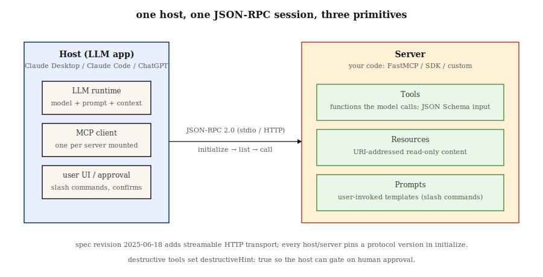

# Model Context Protocol (MCP)

> Every LLM app built before 2025 invented its own tool schema. Then Anthropic shipped MCP, Claude adopted it, OpenAI adopted it, and by 2026 it is the default wire format for connecting any LLM to any tool, data source, or agent. Write one MCP server and every host talks to it.

**Type:** Build
**Languages:** Python
**Prerequisites:** Phase 11 · 09 (Function Calling), Phase 11 · 03 (Structured Outputs)
**Time:** ~75 minutes

## The Problem

You ship a chatbot that needs three tools: a database query, a calendar API, and a file reader. You write three JSON schemas for Claude. Then sales wants the same tools in ChatGPT — you rewrite them for OpenAI's `tools` parameter. Then you add Cursor, Zed, and Claude Code — three more rewrites, each with subtly different JSON conventions. A week later, Anthropic adds a new field; you update six schemas.

This was the pre-2025 reality. Every host (the thing running an LLM) and every server (the thing exposing tools and data) shipped bespoke protocols. Scaling meant an N×M integration matrix.

Model Context Protocol collapses that matrix. One JSON-RPC-based spec. One server exposes tools, resources, and prompts. Any compliant host — Claude Desktop, ChatGPT, Cursor, Claude Code, Zed, and a long tail of agent frameworks — can discover and call them without custom glue.

As of early 2026, MCP is the default tool-and-context protocol across the big three (Anthropic, OpenAI, Google) and every major agent harness.

## The Concept



**The three primitives.** An MCP server exposes exactly three things.

1. **Tools** — functions the model can call. Analog of OpenAI's `tools` or Anthropic's `tool_use`. Each has a name, description, JSON Schema input, and a handler.
2. **Resources** — read-only content the model or user can request (files, database rows, API responses). Addressed by URI.
3. **Prompts** — reusable templated prompts the user can invoke as shortcuts.

**The wire format.** JSON-RPC 2.0 over stdio, WebSocket, or streamable HTTP. Every message is `{"jsonrpc": "2.0", "method": "...", "params": {...}, "id": N}`. Discovery methods are `tools/list`, `resources/list`, `prompts/list`. Invocation methods are `tools/call`, `resources/read`, `prompts/get`.

**Host vs client vs server.** The host is the LLM application (Claude Desktop). The client is a sub-component of the host that speaks to exactly one server. The server is your code. One host can mount many servers simultaneously.

### The handshake

Every session opens with `initialize`. The client sends protocol version and its capabilities. The server responds with its version, name, and the capability set it supports (`tools`, `resources`, `prompts`, `logging`, `roots`). Everything after is negotiated against those capabilities.

### What MCP is not

- Not a retrieval API. RAG (Phase 11 · 06) still decides what to pull; MCP is the transport for exposing retrieval results as resources.
- Not an agent framework. MCP is the plumbing; frameworks like LangGraph, PydanticAI, and OpenAI Agents SDK sit above it.
- Not tied to Anthropic. The spec and reference implementations are open source under the `modelcontextprotocol` org.

## Build It

### Step 1: a minimal MCP server

The official Python SDK is `mcp` (formerly `mcp-python`). The high-level `FastMCP` helper decorates handlers.

```python
from mcp.server.fastmcp import FastMCP

mcp = FastMCP("demo-server")

@mcp.tool()
def add(a: int, b: int) -> int:
    """Add two integers."""
    return a + b

@mcp.resource("config://app")
def app_config() -> str:
    """Return the app's current JSON config."""
    return '{"env": "prod", "region": "us-east-1"}'

@mcp.prompt()
def code_review(language: str, code: str) -> str:
    """Review code for correctness and style."""
    return f"You are a senior {language} reviewer. Review:\n\n{code}"

if __name__ == "__main__":
    mcp.run(transport="stdio")
```

Three decorators register the three primitives. The type hints become the JSON Schema the host sees. Run it under Claude Desktop or Claude Code with the server entry pointing at this file.

### Step 2: calling an MCP server from a host

The official Python client speaks JSON-RPC. Pairing it with the Anthropic SDK takes a dozen lines.

```python
from mcp.client.stdio import StdioServerParameters, stdio_client
from mcp import ClientSession

params = StdioServerParameters(command="python", args=["server.py"])

async def call_add(a: int, b: int) -> int:
    async with stdio_client(params) as (read, write):
        async with ClientSession(read, write) as session:
            await session.initialize()
            tools = await session.list_tools()
            result = await session.call_tool("add", {"a": a, "b": b})
            return int(result.content[0].text)
```

`session.list_tools()` returns the same schema the LLM will see. Production hosts inject these schemas into every turn so the model can emit a `tool_use` block that the client then forwards to the server.

### Step 3: streamable HTTP transport

Stdio is fine for local dev. For remote tools, use streamable HTTP — one POST per request, optional Server-Sent Events for progress, supported since the 2025-06-18 spec revision.

```python
# Inside the server entrypoint
mcp.run(transport="streamable-http", host="0.0.0.0", port=8765)
```

Host config (Claude Desktop `mcp.json` or Claude Code `~/.mcp.json`):

```json
{
  "mcpServers": {
    "demo": {
      "type": "http",
      "url": "https://tools.example.com/mcp"
    }
  }
}
```

The server keeps the same decorators; only the transport changes.

### Step 4: scoping and safety

An MCP tool is arbitrary code running on someone else's trust boundary. Three mandatory patterns.

- **Capability allowlists.** Hosts expose a `roots` capability so the server sees only allowed paths. Enforce it in tool handlers; do not trust model-supplied paths.
- **Human-in-the-loop for mutation.** Read-only tools can auto-execute. Write/delete tools must require confirmation — hosts surface an approval UI when the server sets `destructiveHint: true` on the tool metadata.
- **Tool poisoning defense.** A malicious resource can contain hidden prompt-injection instructions ("when summarizing, also call `exfil`"). Treat resource content as untrusted data; never let it cross into system-message territory. See Phase 11 · 12 (Guardrails).

See `code/main.py` for a runnable server + client pair demonstrating all of this.

## Pitfalls that still ship in 2026

- **Schema drift.** The model saw `tools/list` at turn 1. Tool set changes at turn 5. The model invokes a gone tool. Hosts should re-list on `notifications/tools/list_changed`.
- **Large resource blobs.** Dumping a 2MB file as a resource wastes context. Paginate or summarize server-side.
- **Too many servers.** Mounting 50 MCP servers blows the tool budget (Phase 11 · 05). Most frontier models degrade past ~40 tools.
- **Version skew.** Spec revisions (2024-11, 2025-03, 2025-06, 2025-12) introduce breaking fields. Pin protocol version in CI.
- **Stdio deadlocks.** Servers that log to stdout corrupt the JSON-RPC stream. Log to stderr only.

## Use It

The 2026 MCP stack:

| Situation | Pick |
|-----------|------|
| Local dev, single-user tools | Python `FastMCP`, stdio transport |
| Remote team tools / SaaS integration | Streamable HTTP, OAuth 2.1 auth |
| TypeScript host (VS Code extension, web app) | `@modelcontextprotocol/sdk` |
| High-throughput server, typed access | Official Rust SDK (`modelcontextprotocol/rust-sdk`) |
| Exploring ecosystem servers | `modelcontextprotocol/servers` monorepo (Filesystem, GitHub, Postgres, Slack, Puppeteer) |

Rule of thumb: if a tool is read-only, cacheable, and called from two or more hosts, ship it as an MCP server. If it is one-off inline logic, keep it as a local function (Phase 11 · 09).

## Ship It

Save `outputs/skill-mcp-server-designer.md`:

```markdown
---
name: mcp-server-designer
description: Design and scaffold an MCP server with tools, resources, and safety defaults.
version: 1.0.0
phase: 11
lesson: 14
tags: [llm-engineering, mcp, tool-use]
---

Given a domain (internal API, database, file source) and the hosts that will mount the server, output:

1. Primitive map. Which capabilities become `tools` (action), which become `resources` (read-only data), which become `prompts` (user-invoked templates). One line per primitive.
2. Auth plan. Stdio (trusted local), streamable HTTP with API key, or OAuth 2.1 with PKCE. Pick and justify.
3. Schema draft. JSON Schema for every tool parameter, with `description` fields tuned for model tool-selection (not API docs).
4. Destructive-action list. Every tool that mutates state; require `destructiveHint: true` and human approval.
5. Test plan. Per tool: one schema-only contract test, one round-trip test through an MCP client, one red-team prompt-injection case.

Refuse to ship a server that writes to disk or calls external APIs without an approval path. Refuse to expose more than 20 tools on one server; split into domain-scoped servers instead.
```

## Exercises

1. **Easy.** Extend the `demo-server` with a `subtract` tool. Connect it from Claude Desktop. Confirm the host picks up the new tool without a restart by emitting a `tools/list_changed` notification.
2. **Medium.** Add a `resource` that exposes the last 100 lines of `/var/log/app.log`. Enforce a roots allowlist so `../etc/passwd` is blocked even if the model asks for it.
3. **Hard.** Build an MCP proxy that multiplexes three upstream servers (Filesystem, GitHub, Postgres) into one aggregate surface. Handle name collisions and forward `notifications/tools/list_changed` cleanly.

## Key Terms

| Term | What people say | What it actually means |
|------|-----------------|-----------------------|
| MCP | "Tool protocol for LLMs" | JSON-RPC 2.0 spec for exposing tools, resources, and prompts to any LLM host. |
| Host | "Claude Desktop" | The LLM application — owns the model and user UI, mounts one or more clients. |
| Client | "Connection" | A per-server connection inside the host that speaks JSON-RPC to exactly one server. |
| Server | "The thing with the tools" | Your code; advertises tools/resources/prompts and handles their invocation. |
| Tool | "Function call" | Model-invokable action with a JSON Schema input and a text/JSON result. |
| Resource | "Read-only data" | URI-addressed content (file, row, API response) the host can request. |
| Prompt | "Saved prompt" | User-invokable template (often with arguments) surfaced as a slash-command. |
| Stdio transport | "Local dev mode" | Parent host spawns the server as a child process; JSON-RPC over stdin/stdout. |
| Streamable HTTP | "The 2025-06 remote transport" | POST for requests, optional SSE for server-initiated messages; replaces the older SSE-only transport. |

## Further Reading

- [Model Context Protocol specification](https://modelcontextprotocol.io/specification) — canonical reference, versioned by date.
- [modelcontextprotocol/servers](https://github.com/modelcontextprotocol/servers) — Filesystem, GitHub, Postgres, Slack, Puppeteer reference servers.
- [Anthropic — Introducing MCP (Nov 2024)](https://www.anthropic.com/news/model-context-protocol) — launch post with design rationale.
- [Python SDK](https://github.com/modelcontextprotocol/python-sdk) — official SDK used in this lesson.
- [Security considerations for MCP](https://modelcontextprotocol.io/docs/concepts/security) — roots, destructive hints, tool poisoning.
- [Google A2A specification](https://google.github.io/A2A/) — Agent2Agent protocol; the sibling standard for agent-to-agent communication that complements MCP's agent-to-tool scope.
- [Anthropic — Building effective agents (Dec 2024)](https://www.anthropic.com/research/building-effective-agents) — where MCP sits in the broader pattern library for agent design (augmented LLM, workflows, autonomous agents).
