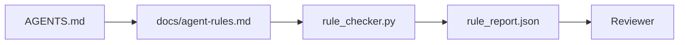

# Agent Instructions as Executable Constraints

> Instructions written as prose are wishes. Instructions written as constraints are tests. The workbench turns each rule into something an agent can check at runtime and a reviewer can verify after the fact.

**Type:** Build
**Languages:** Python (stdlib)
**Prerequisites:** Phase 14 · 32 (Minimal Workbench)
**Time:** ~50 minutes

## Learning Objectives

- Separate routing prose from operational rules.
- Express startup rules, forbidden actions, definition of done, uncertainty handling, and approval boundaries as machine-checkable constraints.
- Implement a rule checker that scores a run against the rule set.
- Make the rule set diff-friendly so review can see what changed.

## The Problem

A typical `AGENTS.md` reads like onboarding documentation. It tells the agent to "be careful" and "test thoroughly" and "ask if unsure." Three days later, the agent ships a change with no tests, writes to a forbidden directory, and never asks because it never knew where the line was.

Instructions are powerful when they are operational and weak when they are aspirational. The fix is to write rules the workbench can interpret and the reviewer can score.

## The Concept

Rules belong in `docs/agent-rules.md`, away from the short root router. Each rule has a name, a category, and a check.



### Five categories that cover most rules

| Category | Question the rule answers | Example |
|----------|---------------------------|---------|
| Startup | What must be true before work begins? | "state file exists and is fresh" |
| Forbidden | What must never happen? | "do not edit `scripts/release.sh`" |
| Definition of done | What proves the task is complete? | "pytest exits 0 and acceptance line passes" |
| Uncertainty | What does the agent do when unsure? | "open a question note instead of guessing" |
| Approval | What requires human approval? | "any new dependency, any prod write" |

A rule that does not fit one of these five usually wants to be two rules. Force the split.

### Rules are machine-readable

Each rule has a slug, a category, a one-line description, and a `check` field that names a function in `rule_checker.py`. Adding a rule means adding a check; the checker grows with the workbench.

### Rules are diff-friendly

Rules live one per heading in a single markdown file. Renames are visible in diffs. New rules sit at the top of their category. Stale rules get deleted, not commented out, because the workbench is the source of truth, not the chat log of how the team felt last quarter.

### Rules versus framework guardrails

Framework guardrails (OpenAI Agents SDK guardrails, LangGraph interrupts) enforce rules at the runtime level. The rule set in this lesson is the human-readable, reviewable contract that those guardrails implement. You need both: the runtime catches violations during a turn, the rule set proves the runtime is doing the right thing.

## Build It

`code/main.py` ships:

- `agent-rules.md` parser that loads rules into a dataclass.
- `rule_checker.py` style checker functions, one per `check` reference.
- A demo agent run that violates two rules and a check pass that catches them.

Run it:

```
python3 code/main.py
```

Output: parsed rule set, run trace, pass/fail per rule, and a `rule_report.json` saved next to the script.

## Production patterns in the wild

Three patterns separate a rule set that lasts a quarter from one that decays in a week.

**Severity tagging at write time.** Every rule carries `severity`: `block`, `warn`, or `info`. The checker reports all three; the runtime only refuses on `block`. Most teams overstate severity early then quietly weaken it under deadline pressure; tagging at write time forces the calibration up front. Pair with the verification gate (Phase 14 · 38), which signs any override of a `block` rule into a `overrides.jsonl` audit log.

**Rule expiry as a forcing function.** Every rule carries an `expires_at` date (default 90 days from authoring). The checker emits a warning when an unexpired rule has had zero violations for 60 consecutive days; the next quarterly review either justifies keeping it, weakens it to `info`, or deletes it. Cloudflare's production AI Code Review data (April 2026, 131,246 review runs across 5,169 repos in 30 days) showed that rule sets with explicit expiry stayed under 30 rules per repo; sets without grew to 80+ with most never firing.

**Markdown-as-source, JSON-as-cache.** `agent-rules.md` is the authored file; `agent-rules.lock.json` is a cache the checker reads in the hot path. The lock is regenerated by a pre-commit hook. Markdown diffs are reviewable; JSON parsing stays out of every turn. Same shape as `package.json` / `package-lock.json` and `Cargo.toml` / `Cargo.lock`.

## Use It

In production:

- Claude Code, Codex, Cursor read the rules at session start and quote them when refusing actions. The checker re-runs them in CI to catch silent drift.
- OpenAI Agents SDK guardrails register the same checks as input and output guardrails. The markdown is the docs surface; the SDK is the runtime surface.
- LangGraph interrupts fire when an in-flight node violates a rule. The interrupt handler reads the rule, asks the human, and resumes.

The rule set is portable across all three because it is just markdown plus function names.

## Ship It

`outputs/skill-rule-set-builder.md` interviews a project owner, classifies their existing prose instructions into the five categories, and emits a versioned `agent-rules.md` plus a checker stub.

## Exercises

1. Add a sixth category if your product genuinely needs it. Defend why it does not collapse into one of the five.
2. Extend the checker so a rule can carry a severity (`block`, `warn`, `info`) and the report aggregates accordingly.
3. Wire the checker into CI: fail the build if a block-severity rule fails on the latest agent run.
4. Add an "expiry" field per rule. After 90 days without a check fail, the rule is up for review.
5. Find a real `AGENTS.md` and rewrite it as five-category rules. How many of its lines were operational? How many were aspirational?

## Key Terms

| Term | What people say | What it actually means |
|------|----------------|------------------------|
| Operational rule | "A real instruction" | A rule the workbench can check at runtime |
| Aspirational rule | "Be careful" | A rule with no check; either delete or upgrade |
| Definition of done | "Acceptance" | An objective, file-backed proof the task is complete |
| Block severity | "Hard rule" | Violation halts the run; cannot be silenced without an operator |
| Rule expiry | "Stale rule sweep" | A rule with no fails in N days is up for retirement |

## Further Reading

- [OpenAI Agents SDK guardrails](https://platform.openai.com/docs/guides/agents-sdk/guardrails)
- [LangGraph interrupts](https://langchain-ai.github.io/langgraph/how-tos/human_in_the_loop/breakpoints/)
- [Anthropic, Building Effective Agents](https://www.anthropic.com/research/building-effective-agents)
- [Rick Hightower, Agent RuleZ: A Deterministic Policy Engine](https://medium.com/@richardhightower/agent-rulez-a-deterministic-policy-engine-for-ai-coding-agents-9489e0561edf) — block/warn/info severity in production
- [Cloudflare, Orchestrating AI Code Review at Scale](https://blog.cloudflare.com/ai-code-review/) — 131k review runs, rule composition lessons
- [microservices.io, GenAI development platform — part 1: guardrails](https://microservices.io/post/architecture/2026/03/09/genai-development-platform-part-1-development-guardrails.html) — defense in depth between rules and CI
- [Type-Checked Compliance: Deterministic Guardrails (arXiv 2604.01483)](https://arxiv.org/pdf/2604.01483) — Lean 4 as the upper bound on rule-as-check
- [logi-cmd/agent-guardrails](https://github.com/logi-cmd/agent-guardrails) — merge-gate implementation: scope, mutation testing, violation budgets
- Phase 14 · 32 — the minimal workbench this rule set drops into
- Phase 14 · 38 — the verification gate that consumes the rule report
- Phase 14 · 39 — the reviewer agent that scores rule compliance
