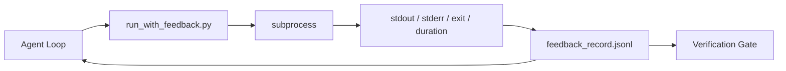

# Runtime Feedback Loops

> Agents that do not see real command output guess. A feedback runner captures stdout, stderr, exit code, and timing into a structured record the next turn can read. Then the agent reacts to facts instead of to its own prediction of facts.

**Type:** Build
**Languages:** Python (stdlib)
**Prerequisites:** Phase 14 · 32 (Minimal Workbench), Phase 14 · 35 (Init Script)
**Time:** ~50 minutes

## Learning Objectives

- Distinguish runtime feedback from observability telemetry.
- Build a feedback runner that wraps shell commands and persists structured records.
- Truncate large outputs deterministically so the loop stays within token budget.
- Refuse to advance the loop when feedback is missing.

## The Problem

The agent says "running tests now." The next message says "all tests pass." The reality is that no test ran. The agent imagined the output, or it ran the command and never read the result, or it read the result and silently truncated the failure line.

A feedback runner removes that gap. Every command goes through the runner. Every record carries the command, the captured stdout and stderr, the exit code, the wall-clock duration, and a one-line agent note. The agent reads the record at the next turn. The verification gate reads the records at the end of the task.

## The Concept



### What goes in a feedback record

| Field | Why it matters |
|-------|----------------|
| `command` | Exact argv, no shell expansion surprises |
| `stdout_tail` | Last N lines, deterministic truncation |
| `stderr_tail` | Last N lines, separate from stdout |
| `exit_code` | The unambiguous success signal |
| `duration_ms` | Surfaces slow probes and runaway processes |
| `started_at` | Timestamp for replay |
| `agent_note` | One line the agent writes about what it expected |

### Truncation is deterministic

A 50 MB log destroys the loop. The runner truncates head and tail with a `...truncated N lines...` marker, deterministic so the same output always produces the same record. No sampling; the parts the agent needs to see (final error, final summary) live at the tail.

### Feedback versus telemetry

Telemetry (Phase 14 · 23, OTel GenAI conventions) is for human operators reviewing runs across time. Feedback is for the next turn of this run. They share fields but they live in different files with different retention.

### Refuse to advance without feedback

If the runner errors before capturing exit, the record carries `exit_code: null` and `error: <reason>`. The agent loop must refuse to claim success on a `null` exit. No exit, no progress.

## Build It

`code/main.py` implements:

- `run_with_feedback(command, agent_note)` that wraps `subprocess.run`, captures stdout/stderr/exit/duration, truncates deterministically, appends to `feedback_record.jsonl`.
- A small loader that streams the JSONL into a Python list.
- A demo that runs three commands (success, failure, slow) and prints the last record per command.

Run it:

```
python3 code/main.py
```

Output: three feedback records appended to `feedback_record.jsonl`, the last one of each printed inline. Tail the file across re-runs to see the loop accumulate.

## Production patterns in the wild

Three patterns harden the runner enough to ship.

**Redact at write, not at read.** Any record that touches stdout or stderr can leak secrets. The runner ships a redaction pass before the JSONL append: strip lines matching `^Bearer `, `password=`, `api[_-]?key=`, `AKIA[0-9A-Z]{16}` (AWS), `xox[baprs]-` (Slack). Redaction at read time is a foot-gun; the file on disk is what an attacker reaches. Audit the redaction patterns quarterly against the production runtime's observed secret formats.

**Rotation policy, not a single file.** Cap `feedback_record.jsonl` at 1 MB per file; on overflow rotate to `.1`, `.2`, drop `.5`. The agent's loop only reads the current file, so the runtime cost is bounded. CI artifact storage gets the full rotated set. Without rotation the file becomes the bottleneck on every loader call.

**Parent-command id for retry chains.** Every record gets `command_id`; retries carry `parent_command_id` pointing at the previous attempt. The reviewer's "failed attempts" list (Phase 14 · 40) and the verification gate's audit both follow the chain. Without this link, retries look like independent successes and the audit hides the failure history.

## Use It

Production patterns:

- **Claude Code Bash tool.** The tool already captures stdout, stderr, exit, and duration. The runner in this lesson is the framework-agnostic equivalent for any agent product.
- **LangGraph nodes.** Wrap any shell node in the runner so the record persists outside graph state.
- **CI logs.** Pipe the JSONL into your CI artifact store; reviewers can replay any command without rerunning the session.

The runner is a thin wrapper that survives every framework migration because it owns the shape of the record.

## Ship It

`outputs/skill-feedback-runner.md` generates a project-specific `run_with_feedback.py` with the right truncation budget, a JSONL writer wired to the workbench, and a loader the agent reads at every turn.

## Exercises

1. Add a `cwd` field per record so the same command run from different directories is distinguishable.
2. Add a `redaction` step that strips lines matching `^Bearer ` or `password=`. Test on a fixture record.
3. Cap total `feedback_record.jsonl` size at 1 MB by rotating to `.1`, `.2` files. Defend the rotation policy.
4. Add a `parent_command_id` so retry chains are visible: which command produced the input that the next command consumed.
5. Pipe the JSONL into a tiny TUI that highlights the latest non-zero exit. Eight key features the TUI must show to be useful in a review.

## Key Terms

| Term | What people say | What it actually means |
|------|----------------|------------------------|
| Feedback record | "Run log" | Structured JSONL entry with command, output, exit, duration |
| Tail truncation | "Trim the log" | Deterministic head+tail capture so records fit in token budget |
| Refuse-on-null | "Block on missing data" | The loop must not advance when `exit_code` is null |
| Agent note | "Expectation tag" | The one-line prediction the agent writes before reading the result |
| Telemetry split | "Two log files" | Feedback for the next turn, telemetry for the operator |

## Further Reading

- [OpenTelemetry GenAI semantic conventions](https://opentelemetry.io/docs/specs/semconv/gen-ai/)
- [Anthropic, Effective harnesses for long-running agents](https://www.anthropic.com/engineering/effective-harnesses-for-long-running-agents)
- [Guardrails AI x MLflow — deterministic safety, PII, quality validators](https://guardrailsai.com/blog/guardrails-mlflow) — redaction patterns as regression tests
- [Aport.io, Best AI Agent Guardrails 2026: Pre-Action Authorization Compared](https://aport.io/blog/best-ai-agent-guardrails-2026-pre-action-authorization-compared/) — pre/post-tool capture
- [Andrii Furmanets, AI Agents in 2026: Practical Architecture for Tools, Memory, Evals, Guardrails](https://andriifurmanets.com/blogs/ai-agents-2026-practical-architecture-tools-memory-evals-guardrails) — observability surfaces
- Phase 14 · 23 — OTel GenAI conventions for the telemetry side
- Phase 14 · 24 — agent observability platforms (Langfuse, Phoenix, Opik)
- Phase 14 · 33 — the rule that demands feedback before declaring done
- Phase 14 · 38 — the verification gate that reads the JSONL
