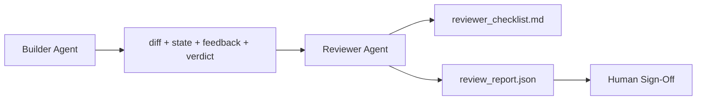

# Reviewer Agent: Separate Builder from Marker

> The agent that wrote the code cannot grade it. A reviewer is a second loop with a different system prompt, a different goal, and read-only access to everything the builder produced. The gap between builder and reviewer is where most reliability lives.

**Type:** Build
**Languages:** Python (stdlib)
**Prerequisites:** Phase 14 · 38 (Verification Gate)
**Time:** ~55 minutes

## Learning Objectives

- State why the same agent cannot reliably review its own work.
- Build a reviewer agent loop that consumes builder artifacts and emits a structured review report.
- Author a reviewer rubric that grades specific dimensions, not vibes.
- Wire the reviewer into the workbench so the human review step starts from a real artifact.

## The Problem

You ask the agent to fix a bug. It edits four files, runs the tests, and reports done. The verification gate (Phase 14 · 38) confirms acceptance ran and scope held. The gate says `passed: true`. You merge. Two days later you find that the fix solved the wrong half of the bug.

Acceptance is necessary, not sufficient. The reviewer asks the questions acceptance cannot ask: did this solve the right problem? Did it expand scope without flagging it? Did it document assumptions that should have been questioned? Did it leave the workbench in a state the next session can pick up?

## The Concept



### Reviewer rubric

Five dimensions, each scored 0 to 2.

| Dimension | Question |
|-----------|----------|
| Problem fit | Did the change solve the task as stated, not a nearby task? |
| Scope discipline | Were edits confined to the contract or was the contract grown deliberately? |
| Assumptions | Are all hidden assumptions written down somewhere reviewable? |
| Verification quality | Does the acceptance command actually prove the goal, or did it prove a weaker version? |
| Handoff readiness | Could the next session pick up cleanly from the current state? |

Total out of 10. A run below 7 is a soft fail; a run below 5 is a hard fail.

### The reviewer is a separate role, not a separate model

You can run the reviewer with the same model as the builder. The discipline is the role separation: different system prompt, different inputs, no write access to the diff. The change in posture is the change in signal.

### The reviewer cannot edit the diff

The reviewer reads the diff, the state, the feedback, the verdict. It writes a report. It does not patch the diff. If the report says "fix this," the next builder turn does the fix; the reviewer goes back to reviewing. Mixing roles defeats the gap.

### Reviewer rubric versus verification gate

The gate (Phase 14 · 38) checks deterministic facts: did acceptance run, did rules pass, did scope hold. The reviewer makes qualitative judgments: was this the right work, is it documented, is the handoff usable. Both are required.

## Build It

`code/main.py` implements:

- A `ReviewerInputs` dataclass bundling the artifacts the reviewer reads.
- A rubric scorer with one function per dimension. Each function is deterministic and stub-grade for the lesson; real implementations would call an LLM.
- A `review_report.json` writer with the five scores, the total, and a verdict (`pass`, `soft_fail`, `hard_fail`).
- Two demo cases: a clean change and a "right tests, wrong problem" change.

Run it:

```
python3 code/main.py
```

Output: two review reports written to disk and a console table of dimensional scores.

## Production patterns in the wild

The receipts: Cloudflare's April 2026 AI Code Review system ran 131,246 review runs across 48,095 merge requests in 5,169 repos in 30 days. Median review completed in 3 minutes 39 seconds. Up to seven specialist reviewers (security, performance, code quality, docs, release management, compliance, Engineering Codex) ran in parallel under a Review Coordinator that deduplicated findings and judged severity. Top-tier model reserved exclusively for the coordinator; specialists ran on cheaper tiers.

Four patterns make this work at scale.

**Specialist pool, not one big reviewer.** One reviewer with a 5-dimension rubric works for solo repos. Once the codebase has security-critical, performance-critical, and docs surfaces, split into specialists with smaller prompts. The coordinator does deduplication; the specialists never run the full rubric. Model-tier separation falls out: cheap specialists, expensive coordinator.

**Bias mitigation as design requirement, not optimization.** LLM judges show four reliable biases (Adnan Masood, April 2026): position bias (GPT-4 ~40% inconsistent on (A,B) vs (B,A) ordering), verbosity bias (~15% score inflation toward longer outputs), self-preference (judges prefer outputs from the same model family), authority (judges over-rate references to known authors). Mitigations: evaluate both orderings and only count consistent wins; use 1-4 scales that explicitly reward conciseness; rotate judges across model families; strip author names before scoring.

**Calibration set, not vibes.** A 10-20 task historical set with known correct verdicts. Run the reviewer over it on every prompt change. If agreement with the historical record falls below 80%, the rubric needs revision before the reviewer ships. This is what every team eventually rediscovers; better to start with it.

**Hybrid norm with the gate.** Verification gate (Phase 14 · 38) handles the deterministic checks (did acceptance run, did tests pass, did scope hold). Reviewer handles the semantic checks (was this the right work, are assumptions documented, is the handoff usable). Anthropic's 2026 guidance is explicit on this split: don't ask the reviewer to redo what the gate already proves.

## Use It

Production patterns:

- **Claude Code subagents.** A reviewer subagent runs after the builder closes a task. It posts a comment on the PR with the rubric scores.
- **OpenAI Agents SDK handoffs.** Builder hands off to Reviewer on task completion. Reviewer can hand back with a list of findings or up to a human.
- **Two-model pairing.** Builder runs on a faster cheaper model. Reviewer runs on a stronger model with smaller context, focused on judgment.

The reviewer is the second pair of eyes the workbench grows when humans cannot do every review themselves.

## Ship It

`outputs/skill-reviewer-agent.md` generates a project-specific reviewer rubric, a reviewer agent stub wired to the builder's artifacts, and an integration with the verification gate so human review starts from a written report instead of a blank page.

## Exercises

1. Add a sixth dimension specific to your product domain. Defend why it is not absorbed by the existing five.
2. Run the reviewer with two different system prompts (terse, verbose). Which produces a report a human is more likely to read?
3. Add a `confidence` field per dimension. Refuse to ship the report when confidence in the lowest dimension is below 0.6.
4. Build a calibration set: 10 historical task close-outs with known correct verdicts. Run the reviewer over them. Where does it disagree with the historical record?
5. Add a "request more evidence" affordance: the reviewer can ask the builder for a specific test run before scoring. What is the right back-off so this does not loop?

## Key Terms

| Term | What people say | What it actually means |
|------|----------------|------------------------|
| Reviewer rubric | "Checklist" | Five-dimension 0-2 scoring with a written question per dimension |
| Soft fail | "Needs revisions" | Total below 7; builder gets findings to address |
| Hard fail | "Reject" | Total below 5 or any dimension at 0; halt and surface to human |
| Role separation | "Different prompt" | Same model can be both roles; the discipline is inputs and posture |
| Confidence floor | "Don't ship low-signal reports" | Refuse to emit a verdict when the rubric is uncertain |

## Further Reading

- [OpenAI Agents SDK handoffs](https://platform.openai.com/docs/guides/agents-sdk/handoffs)
- [Anthropic Claude Code subagents](https://docs.anthropic.com/en/docs/agents-and-tools/claude-code/sub-agents)
- [Cloudflare, Orchestrating AI Code Review at Scale](https://blog.cloudflare.com/ai-code-review/) — 7-specialist + coordinator architecture, 131k runs / 30 days
- [Agent-as-a-Judge: Evaluating Agents with Agents (OpenReview / ICLR)](https://openreview.net/forum?id=DeVm3YUnpj) — DevAI benchmark, 366 hierarchical solution requirements
- [Adnan Masood, Rubric-Based Evaluations and LLM-as-a-Judge: Methodologies, Biases, Empirical Validation](https://medium.com/@adnanmasood/rubric-based-evals-llm-as-a-judge-methodologies-and-empirical-validation-in-domain-context-71936b989e80) — the 4 biases and mitigations
- [MLflow, LLM-as-a-Judge Evaluation](https://mlflow.org/llm-as-a-judge) — production tooling for separated builder/evaluator
- [LangChain, How to Calibrate LLM-as-a-Judge with Human Corrections](https://www.langchain.com/articles/llm-as-a-judge) — calibration-set workflow
- [Evidently AI, LLM-as-a-judge: a complete guide](https://www.evidentlyai.com/llm-guide/llm-as-a-judge)
- [Arize, LLM as a Judge — Primer and Pre-Built Evaluators](https://arize.com/llm-as-a-judge/)
- Phase 14 · 05 — Self-Refine and CRITIC (single-agent self-review baseline)
- Phase 14 · 30 — Eval-driven agent development (calibration set generator)
- Phase 14 · 38 — the verification gate the reviewer reads
- Phase 14 · 40 — the handoff packet the reviewer report feeds
