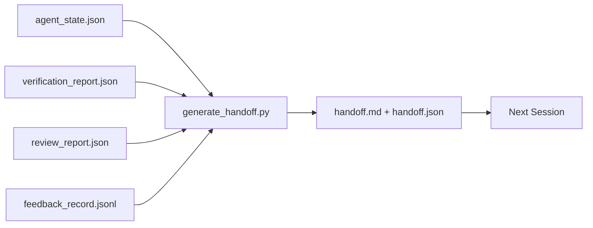

# Multi-Session Handoff

> The session is going to end. The work is not. The handoff packet is the artifact that turns "the agent worked for an hour" into "the next session is productive in the first minute." Build it on purpose, not as an afterthought.

**Type:** Build
**Languages:** Python (stdlib)
**Prerequisites:** Phase 14 · 34 (Repo Memory), Phase 14 · 38 (Verification), Phase 14 · 39 (Reviewer)
**Time:** ~50 minutes

## Learning Objectives

- Identify the seven fields every handoff packet needs.
- Generate a handoff from the workbench artifacts without hand-writing prose.
- Trim large feedback logs into a handoff-sized summary.
- Make the next session's first action deterministic.

## The Problem

The session ends. The agent says "great, we made progress." The next session opens. The next agent asks "where did we leave off?" The first agent's answer is gone. The next agent rediscovers, re-runs the same commands, re-asks the human the same questions, and burns thirty minutes recovering the last thirty seconds of the previous session.

The cost of a bad handoff is paid every session for the life of the task. The fix is a packet generated automatically at session end: what changed, why, what was tried, what failed, what is left, what to do first next time.

## The Concept



### Seven fields every handoff carries

| Field | Question it answers |
|-------|---------------------|
| `summary` | One paragraph of what was done |
| `changed_files` | The diff at a glance |
| `commands_run` | What was actually executed |
| `failed_attempts` | What was tried and why it did not work |
| `open_risks` | What could bite next session, with severity |
| `next_action` | The first concrete step next session takes |
| `verdict_pointer` | Path to the verification + review reports |

The `next_action` field is the load-bearing one. A handoff with everything except `next_action` is a status report, not a handoff.

### Handoffs are generated, not written

A hand-written handoff is a handoff that gets skipped on a hard day. The generator reads the workbench artifacts and emits the packet. The agent's job is to leave the workbench in a state the generator can summarize, not to write the summary.

### Two forms: human-readable and machine-readable

`handoff.md` is what the human reads. `handoff.json` is what the next agent loads. Both come from the same source artifacts. If they diverge, the JSON wins.

### Feedback log trimming

The full `feedback_record.jsonl` may be hundreds of entries. The handoff carries only the last K plus every entry with a non-zero exit. The next session loads the full log if it needs to, but the packet stays small.

## Build It

`code/main.py` implements:

- A loader that gathers state, verdict, review, and feedback into a single `WorkbenchSnapshot`.
- A `generate_handoff(snapshot) -> (markdown, payload)` function.
- A filter that picks the last K feedback entries plus all non-zero exits.
- A demo run that writes `handoff.md` and `handoff.json` next to the script.

Run it:

```
python3 code/main.py
```

Output: a printed handoff body, plus both files on disk.

## Production patterns in the wild

Codex CLI, Claude Code, and OpenCode each ship a different compaction story; the structured handoff packet sits on top of all three.

**Compaction strategies vary; the packet schema does not.** Codex CLI's POST /v1/responses/compact is a server-side opaque AES blob (fast path for OpenAI models); the fallback is a local "handoff summary" appended as a `_summary` user-role message. Claude Code runs five-stage progressive compaction at 95% of context. OpenCode does timestamp-based message hiding plus a 5-heading LLM summary. Three different mechanisms, same need: serialize what survives compression into a portable artifact. The packet is that artifact.

**Fresh-session handoff is not compaction.** Compaction extends a session; handoff closes one cleanly and starts the next. The Hermes Issue #20372 framing (April 2026) is right: when in-place compression starts degrading, the agent should write a compact handoff, end the session, and resume in fresh context. The packet is what makes that transition cheap. The mistake is to keep compressing until quality collapses; the fix is to budget for an early, clean handoff.

**One active handoff per branch and topic.** Multi-agent coordination breaks down on stale handoffs more than on bad model output. Always include `branch`, `last_known_good_commit`, and a `status` of `active | superseded | archived`. Stale handoffs are archived; only the active one drives the next session. This is the difference between handoff-as-notes and handoff-as-state.

**Wrap up before 50-75% context, not at the wall.** The hand-written-pattern playbook (CLAUDE.md + HANDOVER.md) reports best results when the session ends at 50-75% context budget instead of 95%. The packet generator runs cleanly before compression artifacts pollute the source state. Cheap to write while context is intact; expensive when the model is already losing its place.

## Use It

Production patterns:

- **Session-end hook.** The runtime fires the generator when the user closes the chat. The packet goes into `outputs/handoff/<session_id>/`.
- **PR template.** The generator's markdown is also a PR body. Reviewers read it without opening five other files.
- **Cross-agent handoff.** Build with one product (Claude Code), continue with another (Codex). The packet is the lingua franca.

The packet is small, regular, and cheap to produce. The cost saving compounds with every session.

## Ship It

`outputs/skill-handoff-generator.md` produces a generator tuned to a project's artifact paths, an end-of-session hook that runs it, and a `handoff.json` schema the next agent reads on startup.

## Exercises

1. Add an `assumptions_to_validate` field that surfaces every assumption the builder logged but the reviewer did not score above 1.
2. Trim the feedback summary differently for failing runs versus passing ones. Defend the asymmetry.
3. Include a "questions for the human" list. What is the threshold for a question to make it into the packet versus into a chat message?
4. Make the generator idempotent: running it twice produces the same packet. What needs to be stable for that to hold?
5. Add a "next session prereqs" section listing exactly the artifacts the next session must load before acting.

## Key Terms

| Term | What people say | What it actually means |
|------|----------------|------------------------|
| Handoff packet | "Session summary" | Generated artifact carrying the seven fields, both markdown and JSON |
| Next action | "What to do first" | The one concrete step that starts the next session |
| Feedback trim | "Log summary" | Last K records plus every non-zero exit |
| Status report | "What we did" | A document missing `next_action`; useful, but not a handoff |
| Verdict pointer | "Receipt" | Path to the verification + review reports for traceability |

## Further Reading

- [Anthropic, Effective harnesses for long-running agents](https://www.anthropic.com/engineering/effective-harnesses-for-long-running-agents)
- [OpenAI Agents SDK handoffs](https://platform.openai.com/docs/guides/agents-sdk/handoffs)
- [Codex Blog, Codex CLI Context Compaction: Architecture, Configuration, Managing Long Sessions](https://codex.danielvaughan.com/2026/03/31/codex-cli-context-compaction-architecture/) — POST /v1/responses/compact and local fallback
- [Justin3go, Shedding Heavy Memories: Context Compaction in Codex, Claude Code, OpenCode](https://justin3go.com/en/posts/2026/04/09-context-compaction-in-codex-claude-code-and-opencode) — three-vendor compaction comparison
- [JD Hodges, Claude Handoff Prompt: How to Keep Context Across Sessions (2026)](https://www.jdhodges.com/blog/ai-session-handoffs-keep-context-across-conversations/) — CLAUDE.md + HANDOVER.md, 50-75% context budget
- [Mervin Praison, Managing Handoffs in Multi-Agent Coding Sessions: Fresh Context Without Losing Continuity](https://mer.vin/2026/04/managing-handoffs-in-multi-agent-coding-sessions-fresh-context-without-losing-continuity/) — distributed-systems framing
- [Hermes Issue #20372 — automatic fresh-session handoff when compression becomes risky](https://github.com/NousResearch/hermes-agent/issues/20372)
- [Hermes Issue #499 — Context Compaction Quality Overhaul](https://github.com/NousResearch/hermes-agent/issues/499) — handoff-oriented prompts in Codex CLI
- [Microsoft Agent Framework, Compaction](https://learn.microsoft.com/en-us/agent-framework/agents/conversations/compaction)
- [OpenCode, Context Management and Compaction](https://deepwiki.com/sst/opencode/2.4-context-management-and-compaction)
- [LangChain, Context Engineering for Agents](https://www.langchain.com/blog/context-engineering-for-agents)
- Phase 14 · 34 — the state file the generator reads
- Phase 14 · 38 — the verification verdict the packet points at
- Phase 14 · 39 — the reviewer report bundled into the packet
