# Communication Protocols

> Agents that can't speak the same language aren't a team. They're strangers shouting into the void.

**Type:** Build
**Languages:** TypeScript
**Prerequisites:** Phase 14 (Agent Engineering), Lesson 16.01 (Why Multi-Agent)
**Time:** ~120 minutes

## Learning Objectives

- Implement MCP tool discovery and invocation so agents can use tools exposed by external servers
- Build an A2A agent card and task endpoint that allows one agent to delegate work to another over HTTP
- Compare MCP (tool access), A2A (agent-to-agent), ACP (enterprise audit), and ANP (decentralized trust) and explain which protocol solves which problem
- Wire multiple protocols together in a single system where agents discover tools via MCP and delegate tasks via A2A

## The Problem

You split your system into multiple agents. A researcher, a coder, a reviewer. They're great at their individual jobs. But now you need them to actually talk to each other.

Your first attempt is obvious: pass strings around. The researcher returns a blob of text, the coder parses it however it can. It works until the coder misinterprets a research summary, or two agents deadlock waiting for each other, or you need agents built by different teams to collaborate. Suddenly "just pass strings" falls apart.

This is the communication protocol problem. Without a shared contract for how agents exchange information, multi-agent systems are fragile, unauditable, and impossible to scale beyond a handful of agents you personally wrote.

The AI ecosystem has responded with four protocols, each solving a different slice of the problem:

- **MCP** for tool access
- **A2A** for agent-to-agent collaboration
- **ACP** for enterprise auditability
- **ANP** for decentralized identity and trust

This lesson goes deep. You will read real wire formats from each spec, build working implementations, and connect all four into a unified system.

## The Concept

### The Protocol Landscape

Think of these four protocols as layers, each addressing a different question:

```mermaid
block-beta
  columns 1
  block:ANP["ANP — How do agents trust strangers?\nDecentralized identity (DID), E2EE, meta-protocol"]
  end
  block:A2A["A2A — How do agents collaborate on goals?\nAgent Cards, task lifecycle, streaming, negotiation"]
  end
  block:ACP["ACP — How do agents talk in auditable systems?\nRuns, trajectory metadata, session continuity"]
  end
  block:MCP["MCP — How does an agent use a tool?\nTool discovery, execution, context sharing"]
  end

  style ANP fill:#f3e8ff,stroke:#7c3aed
  style A2A fill:#dbeafe,stroke:#2563eb
  style ACP fill:#fef3c7,stroke:#d97706
  style MCP fill:#d1fae5,stroke:#059669
```

They're not competitors. They solve different problems at different levels.

### MCP (Recap)

MCP is covered in depth in Phase 13. Quick recap: MCP standardizes how an LLM connects to external tools and data sources. It's a **client-server** protocol where the agent (client) discovers and calls tools exposed by a server.

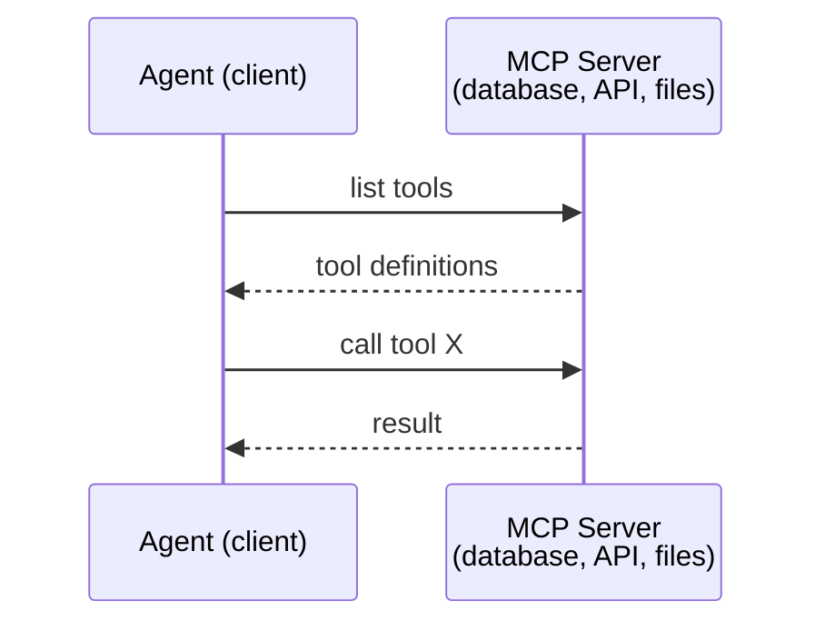

MCP is **agent-to-tool** communication. It doesn't help agents talk to each other.

### A2A (Agent2Agent Protocol)

**Created by:** Google (now under Linux Foundation as `lf.a2a.v1`)
**Spec version:** 1.0.0
**Problem:** How do autonomous agents collaborate, negotiate, and delegate tasks to each other?

A2A is the protocol for **peer-to-peer agent collaboration**. Where MCP connects an agent to tools, A2A connects an agent to other agents. Each agent publishes an **Agent Card** at a well-known URL, and other agents discover, negotiate with, and delegate tasks to it.

#### How A2A Works

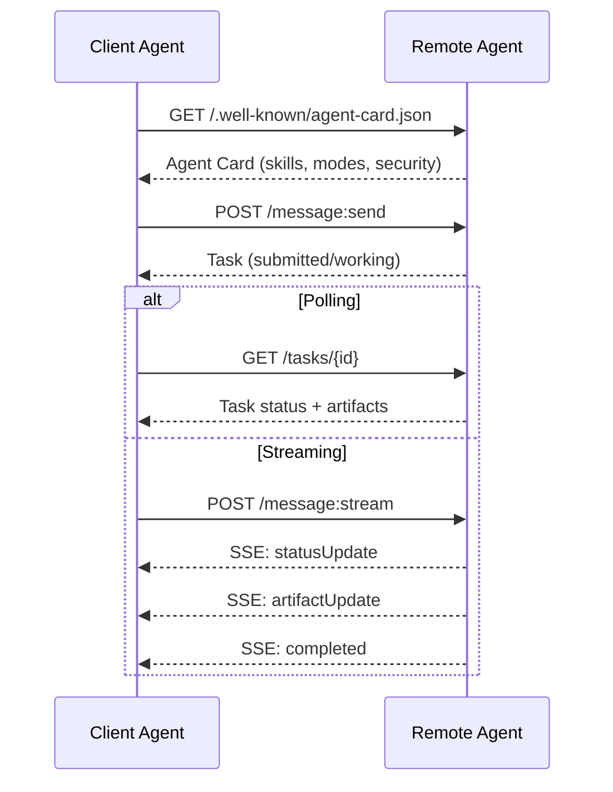

#### The Real Agent Card

This is what an A2A Agent Card actually looks like in the wild. Served at `GET /.well-known/agent-card.json`:

```json
{
  "name": "Research Agent",
  "description": "Searches documentation and summarizes findings",
  "version": "1.0.0",
  "supportedInterfaces": [
    {
      "url": "https://research-agent.example.com/a2a/v1",
      "protocolBinding": "JSONRPC",
      "protocolVersion": "1.0"
    },
    {
      "url": "https://research-agent.example.com/a2a/rest",
      "protocolBinding": "HTTP+JSON",
      "protocolVersion": "1.0"
    }
  ],
  "provider": {
    "organization": "Your Company",
    "url": "https://example.com"
  },
  "capabilities": {
    "streaming": true,
    "pushNotifications": false
  },
  "defaultInputModes": ["text/plain", "application/json"],
  "defaultOutputModes": ["text/plain", "application/json"],
  "skills": [
    {
      "id": "web-research",
      "name": "Web Research",
      "description": "Searches the web and synthesizes findings",
      "tags": ["research", "search", "summarization"],
      "examples": ["Research the latest changes in React 19"]
    },
    {
      "id": "doc-analysis",
      "name": "Documentation Analysis",
      "description": "Reads and analyzes technical documentation",
      "tags": ["docs", "analysis"],
      "inputModes": ["text/plain", "application/pdf"],
      "outputModes": ["application/json"]
    }
  ],
  "securitySchemes": {
    "bearer": {
      "httpAuthSecurityScheme": {
        "scheme": "Bearer",
        "bearerFormat": "JWT"
      }
    }
  },
  "security": [{ "bearer": [] }]
}
```

Key things to notice:
- **Skills** are what an agent can do. Each has an ID, tags, and supported input/output MIME types. This is how a client agent decides whether this remote agent can handle its request.
- **supportedInterfaces** lists multiple protocol bindings. A single agent can speak JSON-RPC, REST, and gRPC simultaneously.
- **Security** is built into the card. The client knows what auth it needs before making a single request.

#### Task Lifecycle

Tasks are the core unit of work in A2A. They move through defined states:

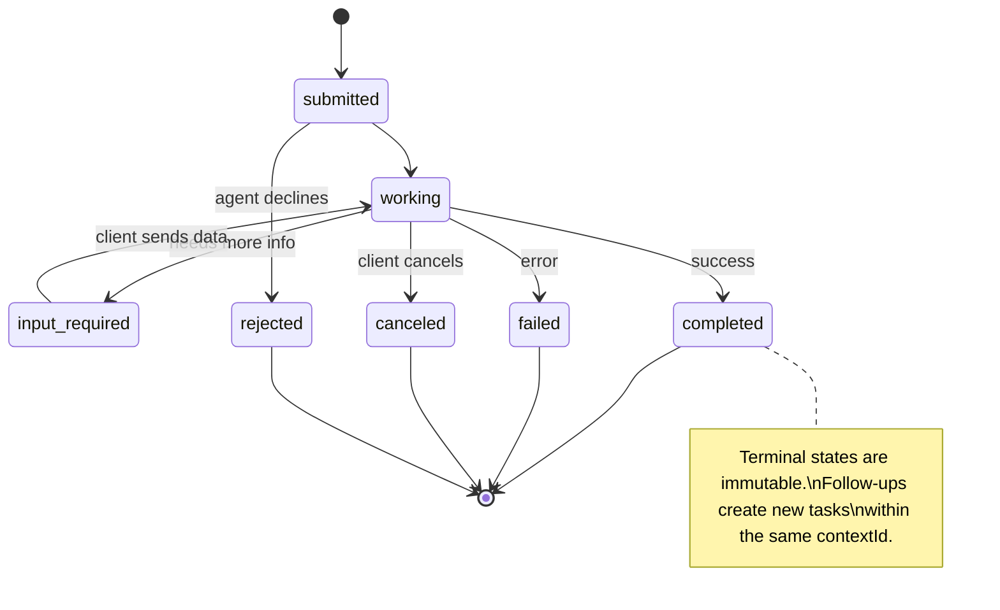

All 8 states (the spec also defines `UNSPECIFIED` as a sentinel, omitted here):

| State | Terminal? | Meaning |
|---|---|---|
| `TASK_STATE_SUBMITTED` | No | Acknowledged, not yet processing |
| `TASK_STATE_WORKING` | No | Actively being processed |
| `TASK_STATE_INPUT_REQUIRED` | No | Agent needs more info from client |
| `TASK_STATE_AUTH_REQUIRED` | No | Authentication needed |
| `TASK_STATE_COMPLETED` | Yes | Finished successfully |
| `TASK_STATE_FAILED` | Yes | Finished with error |
| `TASK_STATE_CANCELED` | Yes | Canceled before completion |
| `TASK_STATE_REJECTED` | Yes | Agent declined the task |

Once a task reaches a terminal state, it's immutable. No further messages. Follow-ups create a new task within the same `contextId`.

#### Wire Format

A2A uses JSON-RPC 2.0. Here's what a real message exchange looks like:

**Client sends a task:**
```json
{
  "jsonrpc": "2.0",
  "id": 1,
  "method": "SendMessage",
  "params": {
    "message": {
      "messageId": "msg-001",
      "role": "ROLE_USER",
      "parts": [{ "text": "Research React 19 compiler features" }]
    },
    "configuration": {
      "acceptedOutputModes": ["text/plain", "application/json"],
      "historyLength": 10
    }
  }
}
```

**Agent responds with a task:**
```json
{
  "jsonrpc": "2.0",
  "id": 1,
  "result": {
    "task": {
      "id": "task-abc-123",
      "contextId": "ctx-xyz-789",
      "status": {
        "state": "TASK_STATE_COMPLETED",
        "timestamp": "2026-03-27T10:30:00Z"
      },
      "artifacts": [
        {
          "artifactId": "art-001",
          "name": "research-results",
          "parts": [{
            "data": {
              "findings": [
                "React 19 compiler auto-memoizes components",
                "No more manual useMemo/useCallback needed",
                "Compiler runs at build time, not runtime"
              ]
            },
            "mediaType": "application/json"
          }]
        }
      ]
    }
  }
}
```

**Streaming via SSE:**
```text
POST /message:stream HTTP/1.1
Content-Type: application/json
A2A-Version: 1.0

data: {"task":{"id":"task-123","status":{"state":"TASK_STATE_WORKING"}}}

data: {"statusUpdate":{"taskId":"task-123","status":{"state":"TASK_STATE_WORKING","message":{"role":"ROLE_AGENT","parts":[{"text":"Searching documentation..."}]}}}}

data: {"artifactUpdate":{"taskId":"task-123","artifact":{"artifactId":"art-1","parts":[{"text":"partial findings..."}]},"append":true,"lastChunk":false}}

data: {"statusUpdate":{"taskId":"task-123","status":{"state":"TASK_STATE_COMPLETED"}}}
```

### ACP (Agent Communication Protocol)

**Created by:** IBM / BeeAI
**Spec version:** 0.2.0 (OpenAPI 3.1.1)
**Status:** Merging into A2A under the Linux Foundation
**Problem:** How do agents communicate with full auditability, session continuity, and trajectory tracking?

ACP is the **enterprise protocol**. Unlike what many summaries claim, ACP does **not** use JSON-LD. It's a straightforward REST/JSON API defined via OpenAPI. What makes it special is **TrajectoryMetadata**: every agent response can carry a detailed log of the reasoning steps and tool calls that produced it.

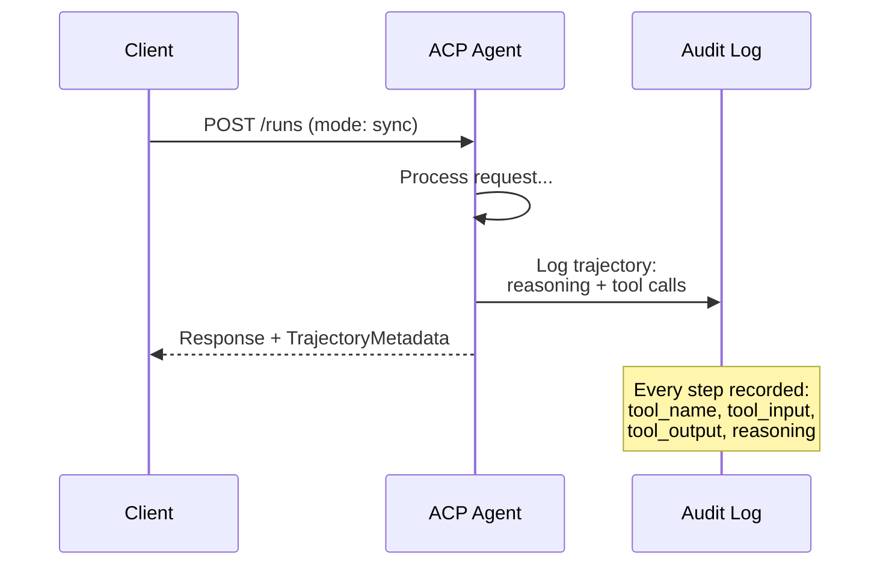

#### Agent Discovery in ACP

ACP defines four discovery methods:

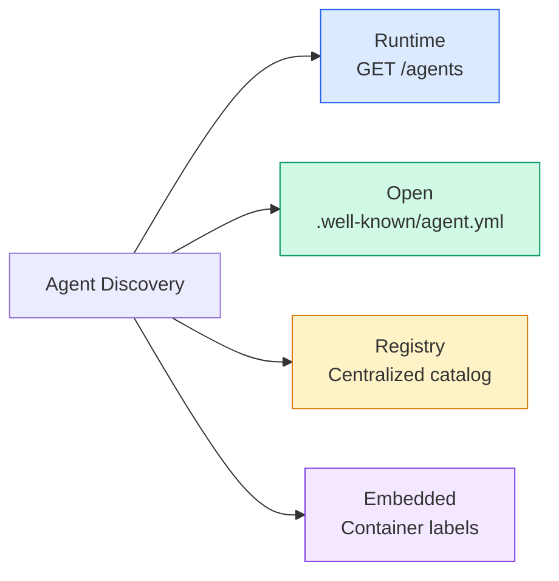

The **AgentManifest** is simpler than A2A's Agent Card:

```json
{
  "name": "summarizer",
  "description": "Summarizes documents with source citations",
  "input_content_types": ["text/plain", "application/pdf"],
  "output_content_types": ["text/plain", "application/json"],
  "metadata": {
    "tags": ["summarization", "RAG"],
    "framework": "BeeAI",
    "capabilities": [
      {
        "name": "Document Summarization",
        "description": "Condenses long documents into key points"
      }
    ],
    "recommended_models": ["llama3.3:70b-instruct-fp16"],
    "license": "Apache-2.0",
    "programming_language": "Python"
  }
}
```

#### Run Lifecycle

ACP uses "Runs" instead of "Tasks". A Run is an agent execution with three modes:

| Mode | Behavior |
|---|---|
| `sync` | Blocking. Response contains the complete result. |
| `async` | Returns 202 immediately. Poll `GET /runs/{id}` for status. |
| `stream` | SSE stream. Events fire as the agent works. |

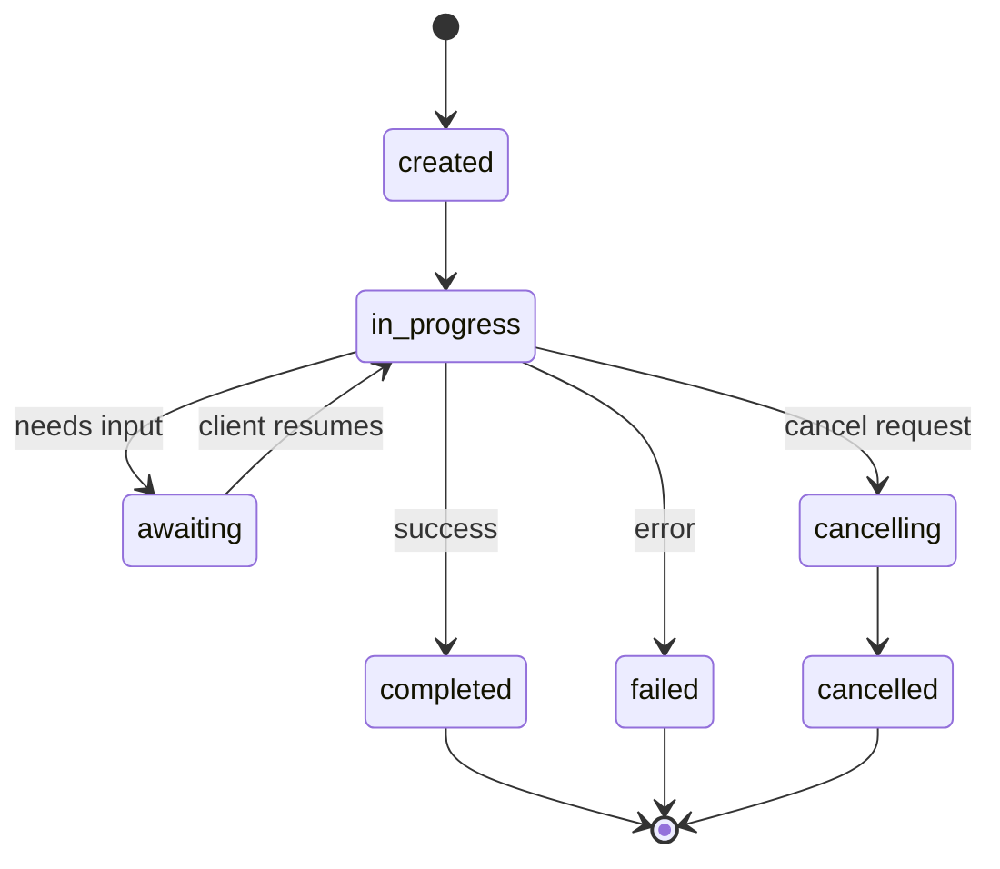

#### TrajectoryMetadata (The Audit Trail)

This is ACP's key differentiator. Every message part can include metadata showing exactly what the agent did:

```json
{
  "role": "agent/researcher",
  "parts": [
    {
      "content_type": "text/plain",
      "content": "The weather in San Francisco is 72F and sunny.",
      "metadata": {
        "kind": "trajectory",
        "message": "I need to check the weather for this location",
        "tool_name": "weather_api",
        "tool_input": { "location": "San Francisco, CA" },
        "tool_output": { "temperature": 72, "condition": "sunny" }
      }
    }
  ]
}
```

For regulated industries this is gold. Every answer comes with a provable chain of reasoning: which tools were called, what inputs were used, what outputs were received. No black box.

ACP also supports **CitationMetadata** for source attribution:

```json
{
  "kind": "citation",
  "start_index": 0,
  "end_index": 47,
  "url": "https://weather.gov/sf",
  "title": "NWS San Francisco Forecast"
}
```

### ANP (Agent Network Protocol)

**Created by:** Open-source community (founded by GaoWei Chang)
**Repo:** [github.com/agent-network-protocol/AgentNetworkProtocol](https://github.com/agent-network-protocol/AgentNetworkProtocol)
**Problem:** How do agents from different organizations trust each other without a central authority?

ANP is the **decentralized identity protocol**. It builds trust using W3C Decentralized Identifiers (DIDs) and end-to-end encryption. Unlike A2A where you discover agents through known endpoints, ANP lets agents prove their identity cryptographically.

ANP has three layers:

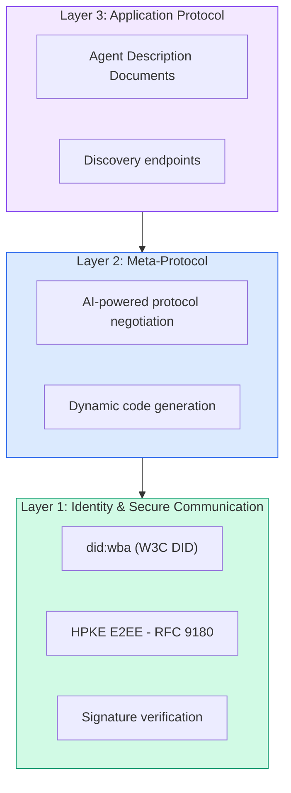

#### DID Documents (Real Structure)

ANP uses a custom DID method called `did:wba` (Web-Based Agent). The DID `did:wba:example.com:user:alice` resolves to `https://example.com/user/alice/did.json`:

```json
{
  "@context": [
    "https://www.w3.org/ns/did/v1",
    "https://w3id.org/security/suites/jws-2020/v1",
    "https://w3id.org/security/suites/secp256k1-2019/v1"
  ],
  "id": "did:wba:example.com:user:alice",
  "verificationMethod": [
    {
      "id": "did:wba:example.com:user:alice#key-1",
      "type": "EcdsaSecp256k1VerificationKey2019",
      "controller": "did:wba:example.com:user:alice",
      "publicKeyJwk": {
        "crv": "secp256k1",
        "x": "NtngWpJUr-rlNNbs0u-Aa8e16OwSJu6UiFf0Rdo1oJ4",
        "y": "qN1jKupJlFsPFc1UkWinqljv4YE0mq_Ickwnjgasvmo",
        "kty": "EC"
      }
    },
    {
      "id": "did:wba:example.com:user:alice#key-x25519-1",
      "type": "X25519KeyAgreementKey2019",
      "controller": "did:wba:example.com:user:alice",
      "publicKeyMultibase": "z9hFgmPVfmBZwRvFEyniQDBkz9LmV7gDEqytWyGZLmDXE"
    }
  ],
  "authentication": [
    "did:wba:example.com:user:alice#key-1"
  ],
  "keyAgreement": [
    "did:wba:example.com:user:alice#key-x25519-1"
  ],
  "humanAuthorization": [
    "did:wba:example.com:user:alice#key-1"
  ],
  "service": [
    {
      "id": "did:wba:example.com:user:alice#agent-description",
      "type": "AgentDescription",
      "serviceEndpoint": "https://example.com/agents/alice/ad.json"
    }
  ]
}
```

Key things to notice:
- **Key separation** is enforced. Signing keys (secp256k1) are separate from encryption keys (X25519).
- **`humanAuthorization`** is unique to ANP. These keys require explicit human approval (biometric, password, HSM) before use. High-risk operations like fund transfers go through this path.
- **`keyAgreement`** keys are used for HPKE end-to-end encryption (RFC 9180).
- The **service** section links to the Agent Description document.

#### How Trust Works in ANP

ANP does **not** use a web-of-trust or endorsement graph. Trust is bilateral and verified per-interaction:

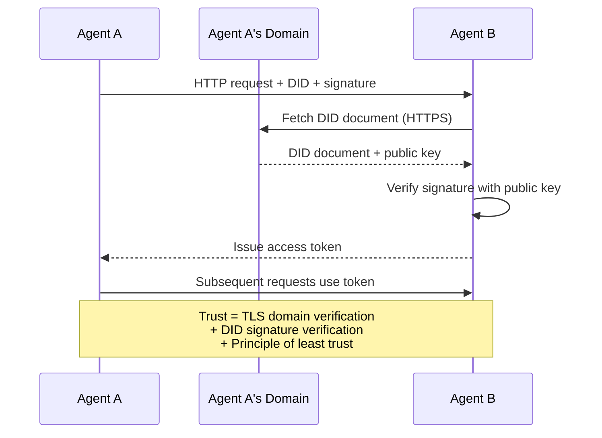

Trust comes from three sources:
1. **Domain-level TLS** verifies the DID document host
2. **DID cryptographic signatures** verify the agent's identity
3. **Principle of least trust** grants only minimum permissions

There's no gossip-based trust propagation or PageRank scoring. You verify each agent directly through its DID.

#### Meta-Protocol Negotiation

This is ANP's most novel feature. When two agents from different ecosystems meet, they don't need pre-agreed data formats. They negotiate in natural language:

```json
{
  "action": "protocolNegotiation",
  "sequenceId": 0,
  "candidateProtocols": "I can communicate using:\n1. JSON-RPC with hotel booking schema\n2. REST with OpenAPI 3.1 spec\n3. Natural language over HTTP",
  "modificationSummary": "Initial proposal",
  "status": "negotiating"
}
```

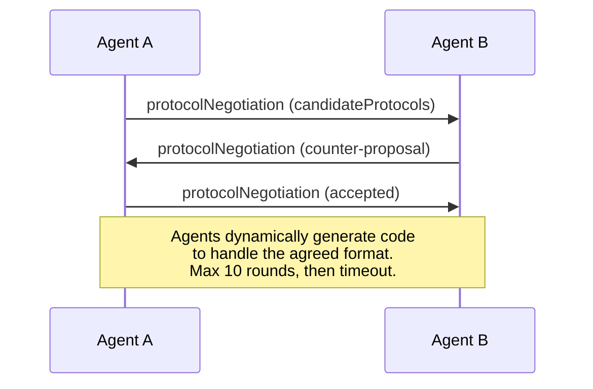

The agents go back and forth (max 10 rounds) until they agree on a format, then dynamically generate code to handle it. Status values: `negotiating`, `rejected`, `accepted`, `timeout`.

This means two agents that have never seen each other before can figure out how to communicate without anyone pre-defining a shared schema.

### Comparison (Corrected)

| | MCP | A2A | ACP | ANP |
|---|---|---|---|---|
| **Created by** | Anthropic | Google / Linux Foundation | IBM / BeeAI | Community |
| **Spec format** | JSON-RPC | JSON-RPC / REST / gRPC | OpenAPI 3.1 (REST) | JSON-RPC |
| **Primary use** | Agent to Tool | Agent to Agent | Agent to Agent | Agent to Agent |
| **Discovery** | Tool listing | `/.well-known/agent-card.json` | `GET /agents`, `/.well-known/agent.yml` | `/.well-known/agent-descriptions`, DID service endpoints |
| **Identity** | Implicit (local) | Security schemes (OAuth, mTLS) | Server-level | W3C DID (`did:wba`) with E2EE |
| **Audit trail** | N/A | Basic (task history) | TrajectoryMetadata (tool calls, reasoning) | Not formally specified |
| **State machine** | N/A | 9 task states | 7 run states | N/A |
| **Streaming** | N/A | SSE | SSE | Transport-agnostic |
| **Unique feature** | Tool schemas | Agent Cards + Skills | Trajectory audit trail | Meta-protocol negotiation |
| **Best for** | Tools & data | Dynamic collaboration | Regulated industries | Cross-org trust |
| **Status** | Stable | Stable (v1.0) | Merging into A2A | Active development |

### How They Work Together

These protocols are not mutually exclusive. A realistic enterprise system uses multiple:

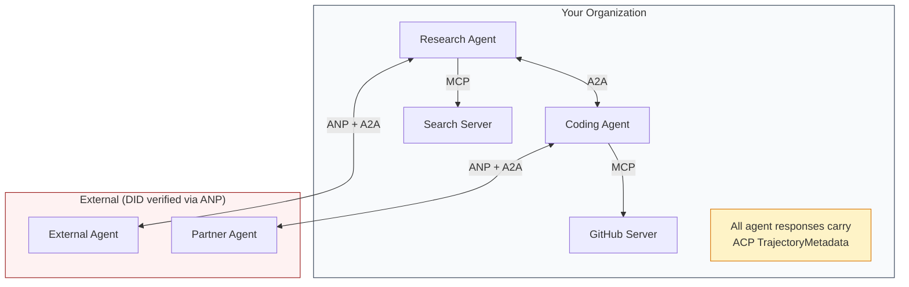

- **MCP** connects each agent to its tools
- **A2A** handles collaboration between agents (internal and external)
- **ACP** wraps responses in trajectory metadata for auditability
- **ANP** provides identity verification for agents you don't control

## Build It

### Step 1: Core Message Types

Every multi-agent system starts with a message format. We define types that map to what the real protocols use:

```typescript
import crypto from "node:crypto";

type MessageRole = "user" | "agent";

type MessagePart =
  | { kind: "text"; text: string }
  | { kind: "data"; data: unknown; mediaType: string }
  | { kind: "file"; name: string; url: string; mediaType: string };

type TrajectoryEntry = {
  reasoning: string;
  toolName?: string;
  toolInput?: unknown;
  toolOutput?: unknown;
  timestamp: number;
};

type AgentMessage = {
  id: string;
  role: MessageRole;
  parts: MessagePart[];
  trajectory?: TrajectoryEntry[];
  replyTo?: string;
  timestamp: number;
};

function createMessage(
  role: MessageRole,
  parts: MessagePart[],
  replyTo?: string
): AgentMessage {
  return {
    id: crypto.randomUUID(),
    role,
    parts,
    replyTo,
    timestamp: Date.now(),
  };
}

function textMessage(role: MessageRole, text: string): AgentMessage {
  return createMessage(role, [{ kind: "text", text }]);
}
```

Notice: `MessagePart` is multimodal (text, structured data, files) just like the real A2A and ACP specs. `TrajectoryEntry` captures the reasoning chain, matching ACP's TrajectoryMetadata.

### Step 2: A2A Agent Card and Registry

Build agent discovery that matches the real A2A spec:

```typescript
type Skill = {
  id: string;
  name: string;
  description: string;
  tags: string[];
  inputModes: string[];
  outputModes: string[];
};

type AgentCard = {
  name: string;
  description: string;
  version: string;
  url: string;
  capabilities: {
    streaming: boolean;
    pushNotifications: boolean;
  };
  defaultInputModes: string[];
  defaultOutputModes: string[];
  skills: Skill[];
};

class AgentRegistry {
  private cards: Map<string, AgentCard> = new Map();

  register(card: AgentCard) {
    this.cards.set(card.name, card);
  }

  discoverBySkillTag(tag: string): AgentCard[] {
    return [...this.cards.values()].filter((card) =>
      card.skills.some((skill) => skill.tags.includes(tag))
    );
  }

  discoverByInputMode(mimeType: string): AgentCard[] {
    return [...this.cards.values()].filter(
      (card) =>
        card.defaultInputModes.includes(mimeType) ||
        card.skills.some((skill) => skill.inputModes.includes(mimeType))
    );
  }

  resolve(name: string): AgentCard | undefined {
    return this.cards.get(name);
  }

  listAll(): AgentCard[] {
    return [...this.cards.values()];
  }
}
```

This is substantially richer than a simple name-to-capability map. You can discover agents by skill tags, by input MIME types, or by name, just like the real A2A spec supports.

### Step 3: A2A Task Lifecycle

Build the full task state machine:

```typescript
type TaskState =
  | "submitted"
  | "working"
  | "input-required"
  | "auth-required"
  | "completed"
  | "failed"
  | "canceled"
  | "rejected";

const TERMINAL_STATES: TaskState[] = [
  "completed",
  "failed",
  "canceled",
  "rejected",
];

type TaskStatus = {
  state: TaskState;
  message?: AgentMessage;
  timestamp: number;
};

type Artifact = {
  id: string;
  name: string;
  parts: MessagePart[];
};

type Task = {
  id: string;
  contextId: string;
  status: TaskStatus;
  artifacts: Artifact[];
  history: AgentMessage[];
};

type TaskEvent =
  | { kind: "statusUpdate"; taskId: string; status: TaskStatus }
  | {
      kind: "artifactUpdate";
      taskId: string;
      artifact: Artifact;
      append: boolean;
      lastChunk: boolean;
    };

type TaskHandler = (
  task: Task,
  message: AgentMessage
) => AsyncGenerator<TaskEvent>;

class TaskManager {
  private tasks: Map<string, Task> = new Map();
  private handlers: Map<string, TaskHandler> = new Map();
  private listeners: Map<string, ((event: TaskEvent) => void)[]> = new Map();

  registerHandler(agentName: string, handler: TaskHandler) {
    this.handlers.set(agentName, handler);
  }

  subscribe(taskId: string, listener: (event: TaskEvent) => void) {
    const existing = this.listeners.get(taskId) ?? [];
    existing.push(listener);
    this.listeners.set(taskId, existing);
  }

  async sendMessage(
    agentName: string,
    message: AgentMessage,
    contextId?: string
  ): Promise<Task> {
    const handler = this.handlers.get(agentName);
    if (!handler) {
      const task = this.createTask(contextId);
      task.status = {
        state: "rejected",
        timestamp: Date.now(),
        message: textMessage("agent", `No handler for ${agentName}`),
      };
      return task;
    }

    const task = this.createTask(contextId);
    task.history.push(message);
    task.status = { state: "submitted", timestamp: Date.now() };

    this.processTask(task, handler, message).catch((err) => {
      task.status = {
        state: "failed",
        timestamp: Date.now(),
        message: textMessage("agent", String(err)),
      };
    });
    return task;
  }

  getTask(taskId: string): Task | undefined {
    return this.tasks.get(taskId);
  }

  cancelTask(taskId: string): boolean {
    const task = this.tasks.get(taskId);
    if (!task || TERMINAL_STATES.includes(task.status.state)) return false;
    task.status = { state: "canceled", timestamp: Date.now() };
    this.emit(taskId, {
      kind: "statusUpdate",
      taskId,
      status: task.status,
    });
    return true;
  }

  private createTask(contextId?: string): Task {
    const task: Task = {
      id: crypto.randomUUID(),
      contextId: contextId ?? crypto.randomUUID(),
      status: { state: "submitted", timestamp: Date.now() },
      artifacts: [],
      history: [],
    };
    this.tasks.set(task.id, task);
    return task;
  }

  private async processTask(
    task: Task,
    handler: TaskHandler,
    message: AgentMessage
  ) {
    task.status = { state: "working", timestamp: Date.now() };
    this.emit(task.id, {
      kind: "statusUpdate",
      taskId: task.id,
      status: task.status,
    });

    try {
      for await (const event of handler(task, message)) {
        if (TERMINAL_STATES.includes(task.status.state)) break;

        if (event.kind === "statusUpdate") {
          task.status = event.status;
        }
        if (event.kind === "artifactUpdate") {
          const existing = task.artifacts.find(
            (a) => a.id === event.artifact.id
          );
          if (existing && event.append) {
            existing.parts.push(...event.artifact.parts);
          } else {
            task.artifacts.push(event.artifact);
          }
        }
        this.emit(task.id, event);
      }
    } catch (err) {
      task.status = {
        state: "failed",
        timestamp: Date.now(),
        message: textMessage("agent", String(err)),
      };
      this.emit(task.id, {
        kind: "statusUpdate",
        taskId: task.id,
        status: task.status,
      });
    }
  }

  private emit(taskId: string, event: TaskEvent) {
    for (const listener of this.listeners.get(taskId) ?? []) {
      listener(event);
    }
  }
}
```

This implements the real A2A task lifecycle: submitted, working, input-required, terminal states. Handlers are async generators that yield events (status updates and artifact chunks) matching the SSE streaming model.

### Step 4: ACP-Style Audit Trail

Wrap communication with trajectory tracking:

```typescript
type AuditEntry = {
  runId: string;
  agentName: string;
  input: AgentMessage[];
  output: AgentMessage[];
  trajectory: TrajectoryEntry[];
  status: "created" | "in-progress" | "completed" | "failed" | "awaiting";
  startedAt: number;
  completedAt?: number;
  sessionId?: string;
};

class AuditableRunner {
  private log: AuditEntry[] = [];
  private handlers: Map<
    string,
    (input: AgentMessage[]) => Promise<{
      output: AgentMessage[];
      trajectory: TrajectoryEntry[];
    }>
  > = new Map();

  registerAgent(
    name: string,
    handler: (input: AgentMessage[]) => Promise<{
      output: AgentMessage[];
      trajectory: TrajectoryEntry[];
    }>
  ) {
    this.handlers.set(name, handler);
  }

  async run(
    agentName: string,
    input: AgentMessage[],
    sessionId?: string
  ): Promise<AuditEntry> {
    const entry: AuditEntry = {
      runId: crypto.randomUUID(),
      agentName,
      input: structuredClone(input),
      output: [],
      trajectory: [],
      status: "created",
      startedAt: Date.now(),
      sessionId,
    };
    this.log.push(entry);

    const handler = this.handlers.get(agentName);
    if (!handler) {
      entry.status = "failed";
      return entry;
    }

    entry.status = "in-progress";
    try {
      const result = await handler(input);
      entry.output = structuredClone(result.output);
      entry.trajectory = structuredClone(result.trajectory);
      entry.status = "completed";
      entry.completedAt = Date.now();
    } catch (err) {
      entry.status = "failed";
      entry.trajectory.push({
        reasoning: `Error: ${String(err)}`,
        timestamp: Date.now(),
      });
      entry.completedAt = Date.now();
    }
    return entry;
  }

  getFullAuditLog(): AuditEntry[] {
    return structuredClone(this.log);
  }

  getAuditLogForAgent(agentName: string): AuditEntry[] {
    return structuredClone(
      this.log.filter((e) => e.agentName === agentName)
    );
  }

  getAuditLogForSession(sessionId: string): AuditEntry[] {
    return structuredClone(
      this.log.filter((e) => e.sessionId === sessionId)
    );
  }

  getTrajectoryForRun(runId: string): TrajectoryEntry[] {
    const entry = this.log.find((e) => e.runId === runId);
    return entry ? structuredClone(entry.trajectory) : [];
  }
}
```

Every agent execution produces a full audit entry: what went in, what came out, and the complete trajectory of tool calls and reasoning steps in between. You can query by agent, by session, or by individual run.

### Step 5: ANP-Style Identity Verification

Build DID-based identity and verification:

```typescript
type VerificationMethod = {
  id: string;
  type: string;
  controller: string;
  publicKeyDer: string;
};

type DIDDocument = {
  id: string;
  verificationMethod: VerificationMethod[];
  authentication: string[];
  keyAgreement: string[];
  humanAuthorization: string[];
  service: { id: string; type: string; serviceEndpoint: string }[];
};

type AgentIdentity = {
  did: string;
  document: DIDDocument;
  privateKey: crypto.KeyObject;
  publicKey: crypto.KeyObject;
};

class IdentityRegistry {
  private documents: Map<string, DIDDocument> = new Map();

  publish(doc: DIDDocument) {
    this.documents.set(doc.id, doc);
  }

  resolve(did: string): DIDDocument | undefined {
    return this.documents.get(did);
  }

  verify(did: string, signature: string, payload: string): boolean {
    const doc = this.documents.get(did);
    if (!doc) return false;

    const authKeyIds = doc.authentication;
    const authKeys = doc.verificationMethod.filter((vm) =>
      authKeyIds.includes(vm.id)
    );

    for (const key of authKeys) {
      const publicKey = crypto.createPublicKey({
        key: Buffer.from(key.publicKeyDer, "base64"),
        format: "der",
        type: "spki",
      });
      const isValid = crypto.verify(
        null,
        Buffer.from(payload),
        publicKey,
        Buffer.from(signature, "hex")
      );
      if (isValid) return true;
    }
    return false;
  }

  requiresHumanAuth(did: string, operationKeyId: string): boolean {
    const doc = this.documents.get(did);
    if (!doc) return false;
    return doc.humanAuthorization.includes(operationKeyId);
  }
}

function createIdentity(domain: string, agentName: string): AgentIdentity {
  const did = `did:wba:${domain}:agent:${agentName}`;
  const { publicKey, privateKey } = crypto.generateKeyPairSync("ed25519");

  const publicKeyDer = publicKey
    .export({ format: "der", type: "spki" })
    .toString("base64");

  const keyId = `${did}#key-1`;
  const encKeyId = `${did}#key-x25519-1`;

  const document: DIDDocument = {
    id: did,
    verificationMethod: [
      {
        id: keyId,
        type: "Ed25519VerificationKey2020",
        controller: did,
        publicKeyDer,
      },
      {
        id: encKeyId,
        type: "X25519KeyAgreementKey2019",
        controller: did,
        publicKeyDer,
      },
    ],
    authentication: [keyId],
    keyAgreement: [encKeyId],
    humanAuthorization: [],
    service: [
      {
        id: `${did}#agent-description`,
        type: "AgentDescription",
        serviceEndpoint: `https://${domain}/agents/${agentName}/ad.json`,
      },
    ],
  };

  return { did, document, privateKey, publicKey };
}

function signPayload(identity: AgentIdentity, payload: string): string {
  return crypto
    .sign(null, Buffer.from(payload), identity.privateKey)
    .toString("hex");
}
```

This mirrors the real ANP identity model: agents have DID documents with separate authentication, key agreement, and human authorization keys. The `IdentityRegistry` simulates DID resolution (in production this would be HTTP fetches to the agent's domain).

### Step 6: Protocol Gateway

Connect all four protocols into a unified system:

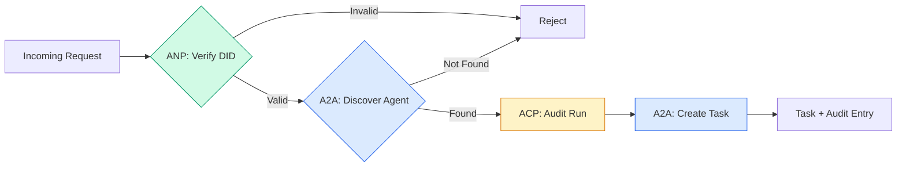

```typescript
class ProtocolGateway {
  private registry: AgentRegistry;
  private taskManager: TaskManager;
  private auditRunner: AuditableRunner;
  private identityRegistry: IdentityRegistry;

  constructor(
    registry: AgentRegistry,
    taskManager: TaskManager,
    auditRunner: AuditableRunner,
    identityRegistry: IdentityRegistry
  ) {
    this.registry = registry;
    this.taskManager = taskManager;
    this.auditRunner = auditRunner;
    this.identityRegistry = identityRegistry;
  }

  async delegateTask(
    fromDid: string,
    signature: string,
    targetAgent: string,
    message: AgentMessage,
    sessionId?: string
  ): Promise<{ task: Task; audit: AuditEntry } | { error: string }> {
    if (!this.identityRegistry.verify(fromDid, signature, message.id)) {
      return { error: "Identity verification failed" };
    }

    const card = this.registry.resolve(targetAgent);
    if (!card) {
      return { error: `Agent ${targetAgent} not found in registry` };
    }

    const audit = await this.auditRunner.run(
      targetAgent,
      [message],
      sessionId
    );
    const task = await this.taskManager.sendMessage(targetAgent, message);

    return { task, audit };
  }

  discoverAndDelegate(
    fromDid: string,
    signature: string,
    skillTag: string,
    message: AgentMessage
  ): Promise<{ task: Task; audit: AuditEntry } | { error: string }> {
    const candidates = this.registry.discoverBySkillTag(skillTag);
    if (candidates.length === 0) {
      return Promise.resolve({
        error: `No agents found with skill tag: ${skillTag}`,
      });
    }
    return this.delegateTask(
      fromDid,
      signature,
      candidates[0].name,
      message
    );
  }
}
```

The gateway does four things in one call:
1. **ANP**: Verifies the caller's identity via DID signature
2. **A2A**: Discovers the target agent and checks capabilities
3. **ACP**: Wraps the execution in an audit trail with trajectory
4. **A2A**: Creates a task with full lifecycle tracking

### Step 7: Wire It All Together

```typescript
async function protocolDemo() {
  const registry = new AgentRegistry();
  registry.register({
    name: "researcher",
    description: "Searches and summarizes findings",
    version: "1.0.0",
    url: "https://researcher.local/a2a/v1",
    capabilities: { streaming: true, pushNotifications: false },
    defaultInputModes: ["text/plain"],
    defaultOutputModes: ["text/plain", "application/json"],
    skills: [
      {
        id: "web-research",
        name: "Web Research",
        description: "Searches the web",
        tags: ["research", "search", "summarization"],
        inputModes: ["text/plain"],
        outputModes: ["application/json"],
      },
    ],
  });
  registry.register({
    name: "coder",
    description: "Writes code from specs",
    version: "1.0.0",
    url: "https://coder.local/a2a/v1",
    capabilities: { streaming: false, pushNotifications: false },
    defaultInputModes: ["text/plain", "application/json"],
    defaultOutputModes: ["text/plain"],
    skills: [
      {
        id: "code-gen",
        name: "Code Generation",
        description: "Generates code",
        tags: ["coding", "generation"],
        inputModes: ["text/plain", "application/json"],
        outputModes: ["text/plain"],
      },
    ],
  });

  const taskManager = new TaskManager();
  const auditRunner = new AuditableRunner();

  const researchTrajectory: TrajectoryEntry[] = [];

  taskManager.registerHandler(
    "researcher",
    async function* (task, message) {
      yield {
        kind: "statusUpdate" as const,
        taskId: task.id,
        status: { state: "working" as const, timestamp: Date.now() },
      };

      researchTrajectory.push({
        reasoning: "Searching for React 19 documentation",
        toolName: "web_search",
        toolInput: { query: "React 19 compiler features" },
        toolOutput: {
          results: ["react.dev/blog/react-19", "github.com/react/react"],
        },
        timestamp: Date.now(),
      });

      researchTrajectory.push({
        reasoning: "Extracting key findings from search results",
        toolName: "doc_analysis",
        toolInput: { url: "react.dev/blog/react-19" },
        toolOutput: {
          summary:
            "React 19 compiler auto-memoizes, no manual useMemo needed",
        },
        timestamp: Date.now(),
      });

      yield {
        kind: "artifactUpdate" as const,
        taskId: task.id,
        artifact: {
          id: crypto.randomUUID(),
          name: "research-results",
          parts: [
            {
              kind: "data" as const,
              data: {
                findings: [
                  "React 19 compiler auto-memoizes components",
                  "No more manual useMemo/useCallback needed",
                  "Compiler runs at build time, not runtime",
                ],
                sources: ["react.dev/blog/react-19"],
              },
              mediaType: "application/json",
            },
          ],
        },
        append: false,
        lastChunk: true,
      };

      yield {
        kind: "statusUpdate" as const,
        taskId: task.id,
        status: { state: "completed" as const, timestamp: Date.now() },
      };
    }
  );

  auditRunner.registerAgent("researcher", async () => ({
    output: [
      textMessage("agent", "React 19 compiler auto-memoizes components"),
    ],
    trajectory: researchTrajectory,
  }));

  const identityRegistry = new IdentityRegistry();

  const coderIdentity = createIdentity("coder.local", "coder");
  const researcherIdentity = createIdentity("researcher.local", "researcher");

  identityRegistry.publish(coderIdentity.document);
  identityRegistry.publish(researcherIdentity.document);

  const gateway = new ProtocolGateway(
    registry,
    taskManager,
    auditRunner,
    identityRegistry
  );

  console.log("=== Protocol Demo ===\n");

  console.log("1. Agent Discovery (A2A)");
  const researchAgents = registry.discoverBySkillTag("research");
  console.log(
    `   Found ${researchAgents.length} agent(s):`,
    researchAgents.map((a) => a.name)
  );

  console.log("\n2. Identity Verification (ANP)");
  const message = textMessage("user", "Research React 19 compiler features");
  const signature = signPayload(coderIdentity, message.id);
  const verified = identityRegistry.verify(
    coderIdentity.did,
    signature,
    message.id
  );
  console.log(`   Coder DID: ${coderIdentity.did}`);
  console.log(`   Signature verified: ${verified}`);

  console.log("\n3. Task Delegation (A2A + ACP + ANP)");
  const result = await gateway.delegateTask(
    coderIdentity.did,
    signature,
    "researcher",
    message,
    "session-001"
  );

  if ("error" in result) {
    console.log(`   Error: ${result.error}`);
    return;
  }

  console.log(`   Task ID: ${result.task.id}`);
  console.log(`   Task state: ${result.task.status.state}`);
  console.log(`   Artifacts: ${result.task.artifacts.length}`);

  console.log("\n4. Audit Trail (ACP)");
  console.log(`   Run ID: ${result.audit.runId}`);
  console.log(`   Status: ${result.audit.status}`);
  console.log(`   Trajectory steps: ${result.audit.trajectory.length}`);
  for (const step of result.audit.trajectory) {
    console.log(`     - ${step.reasoning}`);
    if (step.toolName) {
      console.log(`       Tool: ${step.toolName}`);
    }
  }

  console.log("\n5. Full Audit Log");
  const fullLog = auditRunner.getFullAuditLog();
  console.log(`   Total runs: ${fullLog.length}`);
  for (const entry of fullLog) {
    const duration = entry.completedAt
      ? `${entry.completedAt - entry.startedAt}ms`
      : "in-progress";
    console.log(`   ${entry.agentName}: ${entry.status} (${duration})`);
  }
}

protocolDemo().catch((err) => {
  console.error("Protocol demo failed:", err);
  process.exitCode = 1;
});
```

## What Goes Wrong

Protocols solve the happy path. Here's what breaks in production:

**Schema drift.** Agent A publishes an Agent Card advertising `application/json` output. But the JSON schema changes between versions. Agent B parses the old format and gets garbage. Fix: version your skills and output schemas. The A2A spec supports `version` on Agent Cards for this reason.

**State machine violations.** An agent handler yields a `completed` event, then tries to yield more artifacts. The task is immutable. Your code silently drops the updates or throws. Fix: check terminal state before yielding. The `TaskManager` above enforces this with the `break` after terminal states.

**Trust resolution failures.** Agent A tries to verify Agent B's DID, but Agent B's domain is down. The DID document can't be fetched. Do you fail open (accept unverified agents) or fail closed (reject everything)? ANP recommends fail closed with the principle of least trust.

**Trajectory bloat.** ACP trajectory logging is powerful but expensive. A complex agent that makes 200 tool calls per run produces massive audit entries. Fix: log trajectory at configurable verbosity levels. Record tool names and IO for compliance, skip reasoning steps for non-regulated workloads.

**Discovery thundering herd.** 50 agents all query `GET /agents` simultaneously on startup. Fix: cache Agent Cards with TTL, stagger discovery intervals, or use push-based registration instead of polling.

## Use It

### Real Implementations

**A2A** is the most mature. Google's [official spec](https://github.com/google/A2A) is open-source under the Linux Foundation. SDKs for Python and TypeScript. If your agents need dynamic discovery and collaboration, start here.

**ACP** is merging into A2A. IBM's [BeeAI project](https://github.com/i-am-bee/acp) created ACP as a REST-first alternative, but the trajectory metadata concept is being absorbed into the A2A ecosystem. Use ACP patterns (trajectory logging, run lifecycle) even if you use A2A as the transport.

**ANP** is the most experimental. The [community repo](https://github.com/agent-network-protocol/AgentNetworkProtocol) has a Python SDK (AgentConnect). The meta-protocol negotiation concept is genuinely novel. Worth watching for cross-organizational agent deployments.

**MCP** is already covered in Phase 13. If you want agents to use tools, MCP is the standard.

### Picking the Right Protocol

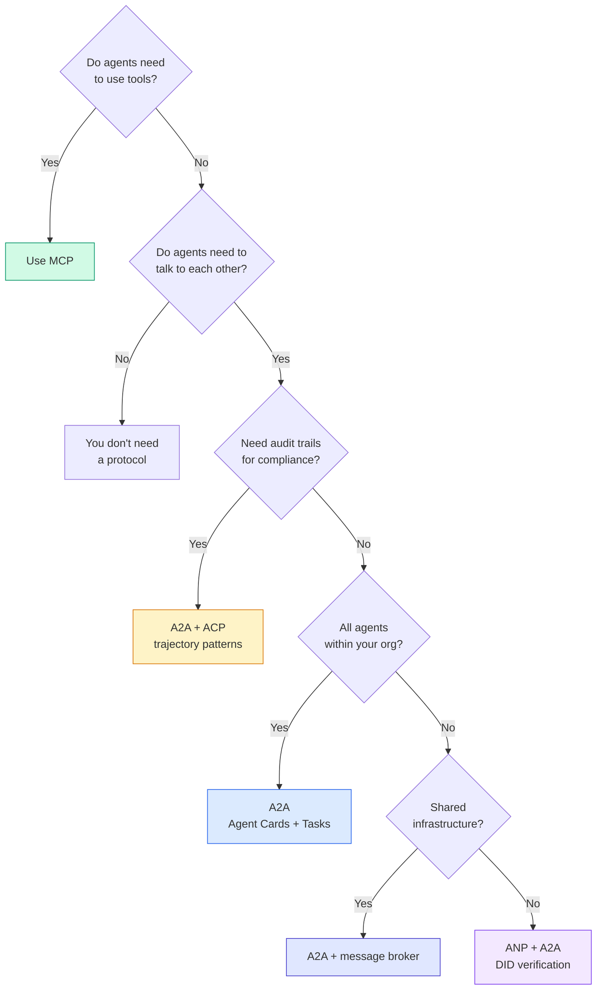

## Ship It

This lesson produces:
- `code/main.ts` -- complete implementation of all four protocol patterns
- `outputs/prompt-protocol-selector.md` -- a prompt that helps you choose protocols for your system

## Exercises

1. **Multi-hop task delegation.** Extend the `TaskManager` so an agent handler can delegate subtasks to other agents. The researcher receives a task, delegates "search" and "summarize" subtasks to two specialist agents, waits for both to complete, then merges the results into its own artifacts.

2. **Streaming audit trail.** Modify the `AuditableRunner` to support streaming mode. Instead of waiting for the full result, yield `AuditEntry` updates in real-time as trajectory entries are added. Use an async generator that produces audit snapshots.

3. **DID rotation.** Add key rotation to the `IdentityRegistry`. An agent should be able to publish a new DID document with updated keys while maintaining a `previousDid` reference. Verifiers should accept signatures from both the current and previous key during a grace period.

4. **Protocol negotiation.** Implement ANP's meta-protocol concept. Two agents exchange `protocolNegotiation` messages with candidate formats (e.g., "I can speak JSON-RPC" vs "I prefer REST"). After max 3 rounds, they agree on a format or timeout. The agreed format determines which `TaskManager` or `AuditableRunner` they use.

5. **Rate-limited discovery.** Add a `RateLimitedRegistry` wrapper that caches Agent Card lookups with a configurable TTL and limits discovery queries per agent per second. Simulate a thundering herd of 100 agents discovering each other on startup and measure the difference.

## Key Terms

| Term | What people say | What it actually means |
|------|----------------|----------------------|
| MCP | "The protocol for AI tools" | A client-server protocol for agents to discover and use tools. Agent-to-tool, not agent-to-agent. |
| A2A | "Google's agent protocol" | A peer-to-peer protocol for agent collaboration under the Linux Foundation. Discovery via Agent Cards, 9-state task lifecycle, streaming via SSE. Supports JSON-RPC, REST, and gRPC bindings. |
| ACP | "Enterprise agent messaging" | IBM/BeeAI's REST API for agent runs with TrajectoryMetadata: every response carries the full chain of reasoning and tool calls. Merging into A2A. |
| ANP | "Decentralized agent identity" | A community protocol using `did:wba` (DID) for cryptographic identity, HPKE for E2EE, and AI-powered meta-protocol negotiation for agents that have never seen each other. |
| Agent Card | "An agent's business card" | A JSON document at `/.well-known/agent-card.json` describing skills, supported MIME types, security schemes, and protocol bindings. |
| DID | "Decentralized ID" | W3C standard for cryptographically verifiable identities hosted on the agent's own domain. ANP uses `did:wba` method. |
| TrajectoryMetadata | "The audit receipt" | ACP's mechanism for attaching reasoning steps, tool calls, and their inputs/outputs to every agent response. |
| Meta-protocol | "Agents negotiating how to talk" | ANP's approach where agents use natural language to dynamically agree on data formats, then generate code to handle them. |
| Task | "A unit of work" | A2A's stateful object tracking work from submission through completion. Immutable once terminal. |

## Further Reading

- [Google A2A specification](https://github.com/google/A2A) -- official spec and SDKs (v1.0.0, Linux Foundation)
- [IBM/BeeAI ACP specification](https://github.com/i-am-bee/acp) -- OpenAPI 3.1 spec for agent runs and trajectory metadata
- [Agent Network Protocol](https://github.com/agent-network-protocol/AgentNetworkProtocol) -- DID-based identity, E2EE, meta-protocol negotiation
- [Model Context Protocol docs](https://modelcontextprotocol.io/) -- Anthropic's MCP specification (covered in Phase 13)
- [W3C Decentralized Identifiers](https://www.w3.org/TR/did-core/) -- the identity standard underpinning ANP
- [RFC 9180 (HPKE)](https://www.rfc-editor.org/rfc/rfc9180) -- the encryption scheme ANP uses for E2EE
- [FIPA Agent Communication Language](http://www.fipa.org/specs/fipa00061/SC00061G.html) -- the academic precursor to modern agent protocols
