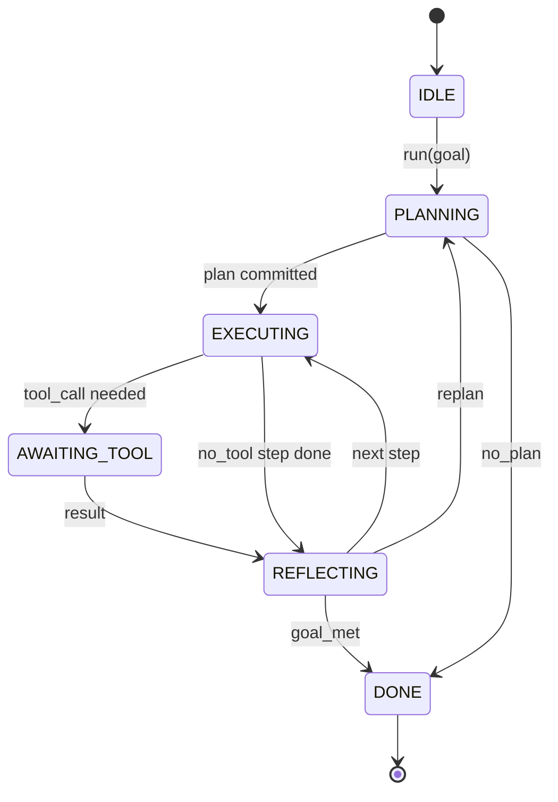

# Agent Harness Loop Contract

> The harness is the agent. The model is a coprocessor. This lesson freezes the loop contract you can wire any model into.

**Type:** Build
**Languages:** Python
**Prerequisites:** Phase 13 lessons 01-07, Phase 14 lesson 01
**Time:** ~90 minutes

## Learning Objectives
- Specify an agent harness loop as a deterministic state machine with explicit transitions.
- Implement ten lifecycle hook topics that operators wire policy, telemetry, and guardrails into.
- Define two pull points where the loop yields control back to the caller and resumes on a fresh input.
- Enforce per-session budgets (turns, tool calls, wall-clock) without leaking partial state on exceeding.
- Emit a typed stream of eleven event types so downstream UIs and tracers can subscribe without inspecting the loop directly.

## The frame

A coding agent that runs unattended for forty turns is not a chat loop. It is a state machine whose nodes the operator can intercept and whose edges the operator can audit. Once you write the contract down, swapping models, tools, or policies stops being a refactor. It becomes a registration call.

This lesson builds that contract. We name six states, ten hook topics, two pull points, eleven event types, and a budget envelope. Everything else in the harness (tool registry, JSON-RPC transport, dispatcher, planner) plugs into this shape.

## The states

The loop has six states. Five are active. One is terminal.



`IDLE` is the only legal entry point. `DONE` is the only legal exit. `AWAITING_TOOL` is the only state that yields a pull point. Every other transition is internal.

The state machine is deterministic. Given the same event log, the harness re-enters the same state. That property is what lets you replay sessions for debugging without re-calling the model.

## The hook topics

Hooks are the operator's seam into the loop. The harness fires ten topics. Each topic accepts any number of subscribers. Subscribers fire in registration order. A subscriber may mutate the payload, raise to abort the turn, or return a sentinel to skip the next step.

```text
before_plan         after_plan
before_tool_call    after_tool_call
before_step         after_step
on_error
on_pause
on_budget_exceeded
on_complete
```

The shape mirrors what Claude Code, Cursor, and OpenCode all converged on by mid-2025. The names are functional, not branded. A hook that blocks `rm -rf` lives in `before_tool_call`. A hook that ships an OpenTelemetry span lives in `after_step`. A hook that resumes on a paused session lives in `on_pause`.

## The pull points

The loop yields control twice. First on `AWAITING_TOOL` when it cannot make progress without a tool result. Second on `on_pause` when the budget is exhausted or a hook explicitly requests human review.

A pull point is not an exception. It is a return. The caller inspects the harness state, fetches whatever the harness asked for, and calls `resume(payload)`. The harness picks up where it stopped. This is the same shape as a Python generator. The transport over the pull point is your choice. In a TUI it is keypress. Over MCP it is `tools/call`. Over a queue it is a job poll.

## The event stream

The loop appends events to a typed stream at specific points in the contract. The stream is append-only and subscribers can replay from any offset. The eleven implemented event types are:

- `session.start` — emitted once when `run(goal)` is called
- `plan.draft` — emitted when the planner returns a draft plan
- `plan.commit` — emitted after the draft is committed as the active plan
- `step.start` — emitted at the start of each executing step
- `step.end` — emitted at the end of each executing step
- `tool.call` — emitted when a tool-requiring step yields control to the caller
- `tool.result` — emitted on resume with a tool result
- `tool.error` — emitted on resume with an error or when a hook aborts the call
- `budget.warn` — emitted when a budget limit is reached
- `session.pause` — emitted when the loop yields on a pause (budget or hook)
- `session.complete` — emitted once when the loop reaches `DONE`

The events do not duplicate hook payloads. Hooks are imperative (mutate, abort). Events are observational (record, ship). Treat them as orthogonal.

## The budget envelope

A session carries three limits. Turn count, tool call count, wall-clock seconds. Each turn increments turns by one. Each tool call increments tool calls by one. Wall-clock is checked on every state transition. When any limit is reached, the loop fires `on_budget_exceeded`, emits `budget.warn`, then transitions to `IDLE` with a budget-exceeded reason on the next pull point.

The budget is not a kill switch. It is a yield. The caller decides whether to extend the budget and resume, or to close the session.

## What this lesson does not do

It does not call a model. It does not register real tools. It does not implement a transport. Those are the next four lessons. This lesson nails the contract so the next four can plug into it without rewriting.

The deterministic planner in `main.py` is a stand-in. It returns a hardcoded plan of three steps, two of which require a tool result. The point is the loop, not the plan.

## How to read the code

`HarnessLoop` is the main class. It holds state, fires hooks, emits events. `Budget` tracks limits. `Event` is the typed envelope on the stream. `HookRegistry` is the dispatch table. `_transition` is the only function that changes state, so the state machine invariants live in one place.

Read `main.py` top to bottom. Then read `code/tests/test_loop.py`. The tests pin every transition and every hook firing order.

## Going further

The hardest part of building a harness in production is not the state machine. It is making the contract enforceable. The contract has to survive a hot reload of the planner. It has to survive a tool that returns malformed JSON. It has to survive a hook that raises in `before_tool_call` two-thirds of the way through a forty-turn session. The tests in this lesson exercise those failure modes. Run them. Break them. Add cases.

The next lesson adds the tool registry. After that, the JSON-RPC transport. After that, the dispatcher. By lesson twenty-four, the loop in this file will be running a real plan against real tools with real budgets enforced.
