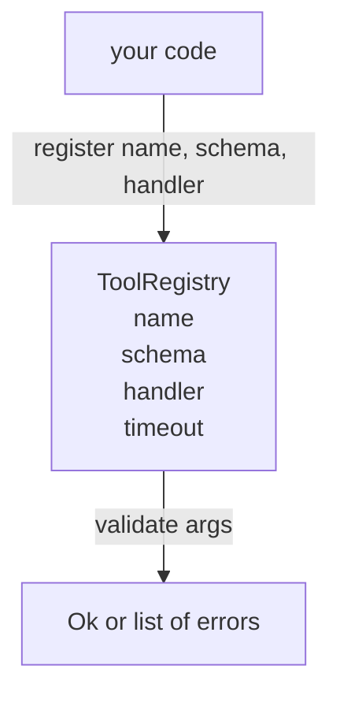

# Tool Registry with Schema Validation

> A tool the agent cannot validate is a tool the agent cannot call. Build the registry and the schema checker before you build the tools.

**Type:** Build
**Languages:** Python
**Prerequisites:** Phase 13 lessons 01-07, Phase 14 lesson 01
**Time:** ~90 minutes

## Learning Objectives
- Hold a typed registry of tool name → schema → handler that the dispatcher can ask once and trust afterwards.
- Implement a JSON Schema 2020-12 subset that covers the keywords ninety percent of tool calls actually use.
- Return precise, json-pointer-shaped error paths so the model can self-correct in one round trip.
- Reject re-registration without explicit override, since silent overwrites are how production tool catalogs drift.
- Keep the validator pure (no I/O, no time, no globals) so it can be re-run on a replay log.

## Why the registry comes before the tool

A coding agent in 2026 has more registered tools than the model can fit in a single context window. A non-trivial harness will register two hundred tools and surface ten to forty at any given turn. The registry is the source of truth for "what tools exist," "what shape do their arguments take," and "what handler do I call." Once those three answers are pinned, the rest of the harness can stop guessing.

The mistake we are avoiding is shipping handlers without schemas, or shipping schemas without validation. Both are common. Both turn the next layer (the dispatcher in lesson twenty-three) into a guessing game where the only failure mode is a stack trace from the handler.

## What a tool record looks like

```text
ToolRecord
  name        : str          (unique, lowercase alphanumeric and underscore segments separated by dots, e.g., snake_case.segment.case)
  description : str          (one line, shown to the model)
  schema      : dict         (JSON Schema 2020-12 subset)
  handler     : Callable     (async or sync, returns Any)
  idempotent  : bool         (dispatcher uses this for retry decisions)
  timeout_ms  : int          (override per-tool dispatcher default)
```

The schema is the only field the validator touches. The handler is opaque to it. We separate them on purpose. The schema is data. The handler is code. Mixing them tempts you to put validation logic inside the handler, which is the bug we are stopping.

## The JSON Schema 2020-12 subset

The full 2020-12 spec is a paper. We need eight keywords.

```text
type           string / number / integer / boolean / object / array / null
properties     map of property name -> schema
required       list of property names
enum           list of allowed primitive values
minLength      integer, applies to strings
maxLength      integer, applies to strings
pattern        ECMA-262-compatible regex, applies to strings
items          schema applied to every array element
```

That is enough to cover what a tool API actually needs. The keywords we are not adding (oneOf, anyOf, allOf, $ref, conditionals) are valid in production schemas but turn the validator into a tree walker with cycles. We are building a registry, not a JSON Schema engine.

## Json pointer error paths

When validation fails, the validator returns a list of errors. Each error carries a json-pointer path into the input. A pointer is a slash-prefixed sequence of property names and array indices.

```text
{"a": {"b": [1, 2, "x"]}}
                    ^
                    /a/b/2
```

The model reads error paths better than it reads sentences. If a schema requires `args.user.email` and the model passed an integer, the error should be `/user/email` with `expected_type: string`. The model fixes that in the next call without a round of natural language.

## Registration and override

`register(name, schema, handler, **opts)` rejects re-registration by default. The caller has to pass `override=True` to replace. This is operational hygiene. Two parts of the codebase silently registering the same tool name is the kind of bug that takes a week to find in production.

The registry exposes three read methods. `get(name)` returns the record or raises. `validate(name, args)` returns an `Ok` or a list of errors. `names()` returns the tool names in registration order.

## What the validator is and is not

It is a single pass over the schema tree, recursive. It is pure. It does not call handlers. It does not coerce types (a string `"42"` does not pass a number schema). It does not silently truncate.

It is not a security boundary. A malicious handler can still misbehave after validation passes. The dispatcher in lesson twenty-three adds timeout and sandbox layers. The registry adds shape.

## Shape



## How to read the code

`code/main.py` defines `ToolRegistry`, `ToolRecord`, `ValidationError`, and the eight validator functions. The validator dispatches on `schema["type"]` (or treats a schema with `enum` as untyped enum check). Each type validator returns either an empty list or a list of `ValidationError`. The top-level walker concatenates errors and prepends path segments as it descends.

`code/tests/test_registry.py` covers registration, override, validation success, validation failure with paths, and every keyword in the subset.

## Going further

The two extensions you will want once this lesson lands are `$ref` resolution against a local definitions block, and `additionalProperties: false` for strict shape. Both are small. Both are common to add as the tool catalog grows past fifty tools. We left them out of the lesson to keep the file under one read.

The next lesson (twenty-two) builds the JSON-RPC stdio transport that surfaces this registry to a model client. The lesson after (twenty-three) wraps both behind a dispatcher with timeouts and retries.
