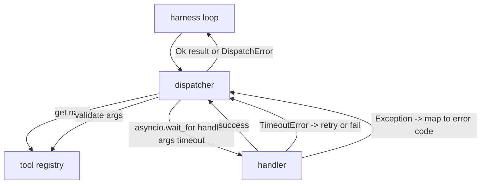
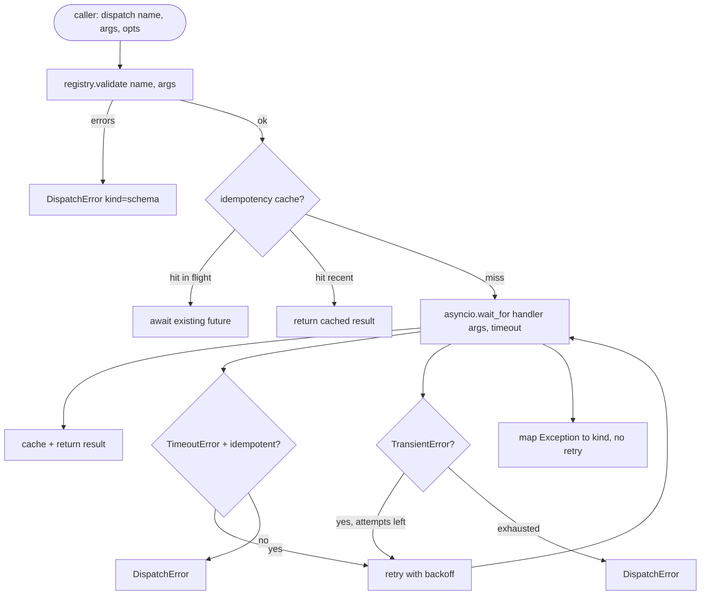

# Function Call Dispatcher

> The dispatcher is where the harness pays for every promise the schema made. Timeouts, retries, dedupe, error mapping. All on one seam.

**Type:** Build
**Languages:** Python
**Prerequisites:** Phase 13 lessons 01-07, Phase 14 lesson 01
**Time:** ~90 minutes

## Learning Objectives
- Wrap a tool handler in a per-call timeout that returns a typed error instead of hanging the loop.
- Apply exponential backoff retry with jitter and a maximum attempt count.
- Deduplicate retries on an idempotency key so a retry that races with a slow original does not run twice.
- Map handler exceptions and transport faults onto a single error envelope the harness loop already understands.
- Bound parallel dispatch with a concurrency limit so a fan-out of forty tool calls does not exhaust the event loop.

## Where the dispatcher sits

Between the harness loop (lesson twenty) and the tool registry (lesson twenty-one). The transport (lesson twenty-two) feeds the loop. The loop hands a tool call to the dispatcher. The dispatcher calls the registry, runs the handler, and returns either a result or a JSON-RPC-shaped error envelope.



The dispatcher is the only layer that knows about timers, retries, and idempotency. The loop does not. The registry does not. The handler does not. That isolation is the point.

## Timeouts

Each tool has a default timeout. The registry record carries `timeout_ms`. The dispatcher overrides it from a per-call override when the harness passes one. We use `asyncio.wait_for`. On timeout, the handler task is cancelled and the dispatcher returns `DispatchError(kind="timeout")`.

A timeout is not a retryable error by default for non-idempotent tools. A `db.write` that timed out may or may not have committed. Retrying duplicates the write. The dispatcher honors the `idempotent` flag from the registry record. Idempotent tools retry. Non-idempotent tools do not.

## Retries with exponential backoff

The retry policy is three attempts maximum. Backoff is exponential with jitter.

```text
attempt 1  -> delay 0
attempt 2  -> delay 0.1s * (1 + random[0..0.5])
attempt 3  -> delay 0.4s * (1 + random[0..0.5])
```

Only `timeout` and `transient` errors retry. A `schema` error, a `not_found`, or an `internal` error does not retry. Schema errors are deterministic. Retrying does not change the outcome and burns the budget.

The retry loop respects the budget from the harness. If the caller's budget has zero remaining tool calls, the dispatcher fails fast on the first attempt and returns `kind="budget_exceeded"`.

## Idempotency key dedupe

A retry that fires while the original is still in flight is a real production bug. The first call hangs at four point nine seconds (just under the timeout). The retry fires at five seconds. Now two requests race against the same backend. If the tool is `payments.charge`, you charged twice.

The dispatcher accepts an optional `idempotency_key`. If the same key is in flight when a call arrives, the dispatcher waits on the in-flight future and returns its result. The cache holds keys for sixty seconds after completion to absorb late retries.

The key is the caller's responsibility. The harness derives it from the planner: `f"{step_id}:{tool_name}:{hash(args)}"`. The dispatcher does not invent keys, because deriving a key from arguments alone makes two semantically-different calls look the same.

## Error envelope

A failed dispatch returns a single shape.

```text
DispatchError
  kind        : "timeout" | "transient" | "schema" | "not_found" | "internal" | "budget_exceeded"
  message     : str
  attempts    : int
  jsonrpc_code: int   (one of -32601, -32602, -32603)
```

The harness loop maps `kind` to the next state. `schema` and `not_found` go to `on_error` and trigger a replan. `timeout` and `transient` go to `on_error` and may or may not replan depending on attempts. `budget_exceeded` triggers `on_budget_exceeded`.

## Concurrency limit on fan-out

`gather(*calls)` runs all coroutines simultaneously. With forty tool calls, that is forty open sockets or forty subprocess pipes. Most backends do not like forty parallel connections from one client.

The dispatcher wraps `gather` in a semaphore. Default concurrency limit is eight. Each call acquires the semaphore before dispatching and releases on completion. The caller sees `gather`-shaped output but the actual scheduling is bounded.

## Flow for one call



## How to read the code

`code/main.py` defines `Dispatcher`, `DispatchError`, and `TransientError`. The dispatcher takes a registry on construction. The async `dispatch(name, args, ...)` is the only entry point. Per-attempt timeouts are applied inline inside `_run_with_retries` using `asyncio.wait_for`. `gather_bounded(calls)` runs many dispatches with the concurrency limit.

`code/tests/test_dispatcher.py` covers timeout firing, retry on transient, no-retry on schema error, idempotency dedupe (two concurrent calls with the same key collapse to one handler invocation), and concurrency limiting (the semaphore in action).

The tests use `asyncio.sleep(0)` and deterministic `Counter`-based handlers, so they finish in milliseconds and do not depend on wall-clock timing.

## Going further

Two extensions production dispatchers add. First, structured logging at every transition (which the loop's event stream already gives you, but the dispatcher should also emit `dispatch.attempt` and `dispatch.retry` events). Second, circuit breakers: after N failures in a window, a tool gets a cool-down period where dispatches return immediately with `kind="circuit_open"` instead of attempting the handler. Both fit on top of this dispatcher without changing the contract.

Lesson twenty-four glues the dispatcher to a plan-and-execute agent so you see all four pieces in motion.
