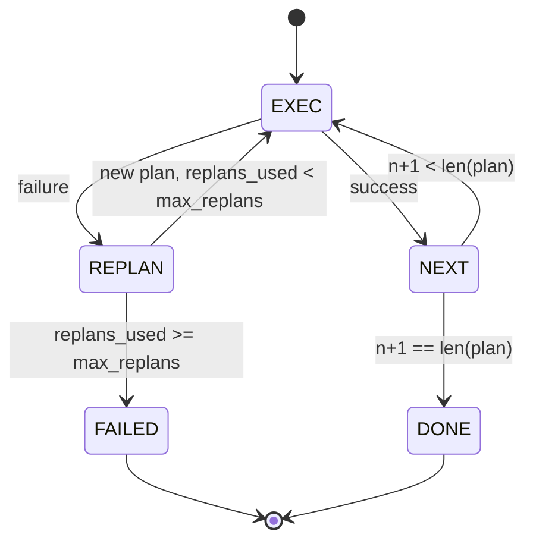

# Plan-Execute Control Flow

> A plan that cannot survive a failure is a script. A script that can replan is an agent. Build the replanner first.

**Type:** Build
**Languages:** Python
**Prerequisites:** Phase 13 lessons 01-07, Phase 14 lesson 01
**Time:** ~90 minutes

## Learning Objectives
- Represent a plan as an ordered list of typed steps so the executor can reason about progress and outcome.
- Execute steps sequentially with a controlled failure handoff back to the planner.
- Replan from the current cursor with the prior error in the context so the next plan is informed.
- Emit a plan diff on each revision so a downstream tracer or UI can show why the plan changed.
- Enforce two budgets: a hard step ceiling and a hard replan ceiling.

## Plan and execute, not chain-of-thought

A chain-of-thought agent emits tokens and lets the loop guess where the tool call ends. A plan-and-execute agent emits a structured plan first, then executes each step deterministically. The plan is data the harness can introspect. The execution is the harness running that data through a dispatcher.

Two pieces. A planner that produces a plan. An executor that runs the plan. The interesting work is what happens when the executor hits a failure. Three options:

```text
1. Abort         (return failed, surface the error)
2. Skip          (mark step failed, continue with the rest)
3. Replan        (hand the error to the planner, get a new plan from the cursor)
```

Replan is the one that turns a script into an agent.

## The Step shape

```text
Step
  id              : int           (monotonic within a plan revision)
  tool_name       : str
  args            : dict
  expected_outcome: str           (planner's stated success condition)
  result          : Any | None
  error           : str | None
```

`expected_outcome` is a short sentence the planner emits alongside the step. It is not enforced by the executor. It is for two things: the replanner reads it when revising the plan; the event stream emits it so a tracer can show "this step was supposed to do X."

## The planner shape

```python
def planner(goal: str, history: list[Step], last_error: str | None) -> list[Step]:
    ...
```

A pure function. `goal` is the user goal. `history` is the steps already executed (with results and errors filled in). `last_error` is None on the first call and the most recent failure message on every subsequent call. The planner returns the next plan starting from the cursor.

The planner does not know about the executor. It does not know about retries. It does not know about timeouts. It produces a plan. That is all.

## The executor

The executor is a small state machine. Each step runs through the dispatcher. The outcome is one of three things: success, failure-replannable, failure-fatal. Replannable failures hand back to the planner. Fatal failures (budget exceeded, replan ceiling hit) return a `FAILED` session result.



## Plan diffs on revision

When the planner returns a new plan after a failure, the executor emits a `plan.diff` event with three fields.

```text
removed: list of step ids that were in the old plan and are not in the new
added  : list of step ids in the new plan that were not in the old
revised: list of step ids whose tool_name or args changed
```

A tracer or UI can render this as a strikethrough on the removed steps and a highlight on the added ones. The point is not the diff format. The point is that revision is a visible event, not a silent rewrite.

## Two budgets, both hard

`max_steps` caps total step executions across the whole session, including replans. Default is twelve. A linear five-step plan that replans twice and adds three steps each time hits sixteen executions and would exceed the budget. The executor will refuse the replan and return FAILED.

`max_replans` caps the number of times the planner is called after the first plan. Default is five. This is the more important limit. A planner that returns the same broken plan five times in a row would otherwise loop until the step budget catches it. Capping replans makes the failure faster and the reason clearer.

## The deterministic planner in this lesson

We do not call a model in this lesson. The lesson ships a deterministic planner that picks a plan based on `last_error`.

```text
last_error is None    -> emit a four-step plan
last_error matches X  -> emit a three-step plan that routes around X
last_error matches Y  -> emit a two-step plan that gives up gracefully
otherwise             -> return [] (signals nothing to replan)
```

This is enough to test the executor's behavior on every transition path: success, replan-once, replan-twice, replan-exhaustion, and step-budget exhaustion.

## Result shape

```text
SessionResult
  status      : "completed" | "failed"
  reason      : str     ("goal_met" | "step_budget" | "replan_budget" | "no_plan")
  history     : list[Step]
  revisions   : list[PlanDiff]
  events      : list[Event]
```

The harness loop from lesson twenty can read this directly. The dispatcher from lesson twenty-three is what executes each step. The registry from lesson twenty-one validates each step's args. The transport from lesson twenty-two would surface this whole flow over JSON-RPC to a model client.

## How to read the code

`code/main.py` defines `PlanExecuteAgent`, `Step`, `PlanDiff`, `SessionResult`, and the deterministic planner. The executor is a single `run(goal)` method that returns a `SessionResult`. The plan diff is computed by comparing step ids and `(tool_name, args)` tuples.

`code/tests/test_agent.py` covers a linear success, a mid-plan failure that replans once, replan exhaustion that returns `failed:replan_budget`, step-budget exhaustion, and the plan-diff event format.

## Going further

Two extensions you will want once you wire this to a real model. First, partial-plan caching: when a plan succeeds for the first three of six steps and then fails, you do not want to re-run the first three. The executor already keeps history; the planner just needs to read it. Second, parallel branches: the current executor is strictly sequential. A planner that emits an independent branch (`gather_step` instead of `next_step`) can run two tool calls concurrently through the dispatcher.

Both add real complexity. Both are easier to add once the linear executor is pinned. That is what this lesson does.
