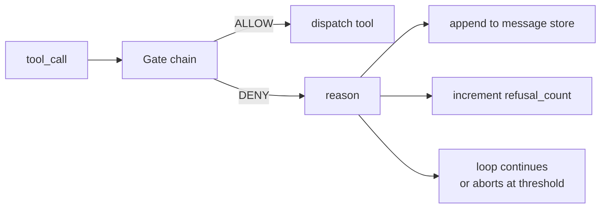
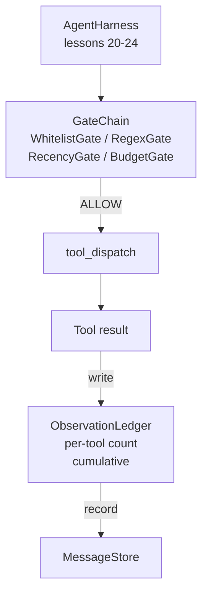

# Capstone Lesson 25: Verification Gates and the Observation Budget

> An agent harness without a verification layer is a wish in a trenchcoat. This lesson builds the deterministic gate chain that decides whether a tool call is allowed to fire, how much of its output the agent is allowed to see, and when the loop has to stop because the agent has read too much. The chain is a function of small, named gates plus an observation ledger that tracks every token the model has been shown.

**Type:** Build
**Languages:** Python (stdlib)
**Prerequisites:** Phase 19 · 20-24 (Track A1: agent loop, tool registry, message store, prompt builder, model router), Phase 14 · 33 (instructions as constraints), Phase 14 · 36 (scope contracts), Phase 14 · 38 (verification gates)
**Time:** ~90 minutes

## Learning Objectives

- Build a `VerificationGate` protocol with a deterministic `evaluate(call)` method.
- Compose budget, recency, whitelist, and regex gates into a chain with short-circuit semantics.
- Track every observation through an `ObservationLedger` keyed by tool and turn.
- Refuse a tool call when the cumulative observation budget would be exceeded.
- Surface a structured `GateDecision` record that downstream observability can ingest.

## The Problem

When an agent harness lets the model call tools freely, three classes of bug appear within the first hour of real use.

The first is unbounded observation. A grep across a 200K-line repo dumps half a million tokens of output into the next turn. The model sees one match per kilobyte and the rest of the context is wasted. The token bill is large and the agent is now worse, not better, at the task.

The second is stale recency. A long-running task accumulates fifty tool calls. The model rereads the first read_file from turn three as if it were live state. Edits made on turn forty-seven never show up because the prompt builder serialized the earliest observations first.

The third is privilege creep. A research task starts by calling `web_search`, then somehow ends up running `shell` because the model invented a tool name and the harness defaulted to permissive. By the time anyone reads the trace, a junk file is sitting in /tmp and a curl ran against a private API.

A verification gate is the harness component that says no. It is not a model. It is not a judge. It is a deterministic function of `(call, history, ledger)` that returns either ALLOW or DENY with a reason. The reason is logged. The model is told. The loop continues or aborts.

## The Concept



A gate is anything with an `evaluate(call, ctx) -> GateDecision` method. The chain is an ordered list. Evaluation short-circuits on the first deny. Order matters: cheap structural gates run before expensive token-counting gates.

This lesson ships four gates:

- `WhitelistGate`. Allowed tool names are an explicit set. Anything outside is denied. This is the cheapest gate and runs first.
- `RegexGate`. Tool arguments are matched against a regex. Useful for refusing shell calls with `rm -rf` in them, or HTTP calls to internal IPs. Pure on the call payload.
- `RecencyGate`. The model only sees observations from the last N turns. Older observations are masked. The gate refuses a tool call whose result would extend an observation window that has already aged out.
- `BudgetGate`. The cumulative tokens the model has read across the session has a ceiling. When the ledger says the ceiling is reached, every further tool call is denied.

The observation ledger is the bookkeeping. Every successful tool call writes one row: tool name, turn, tokens emitted, cumulative. The ledger answers two questions: how much has the model seen total, and how much has it seen of tool X. The budget gate reads the first. A per-tool budget gate, which you will write as an exercise, reads the second.

## Architecture



The harness asks the chain. The chain either nods or refuses. If it nods, the tool runs, the ledger ticks, and the result is appended to the message store. If it refuses, the model is handed the refusal as a system message and the loop decides whether to retry or abort.

## What you will build

The implementation is a single `main.py` plus tests.

1. `Observation` and `ToolCall` dataclasses define the wire shapes.
2. `ObservationLedger` records `(turn, tool, tokens)` rows and answers `cumulative()` and `per_tool(name)`.
3. `GateDecision` carries `(allow, reason, gate_name)`.
4. `VerificationGate` is the protocol. Each gate implements `evaluate(call, ctx)`.
5. `GateChain` wraps an ordered list. It calls each gate, returns the first deny, or returns allow if every gate passes.
6. The demo runs a tiny synthetic agent loop. Three turns. The third turn trips the budget gate and the loop reports a clean refusal with a non-zero refusal count.

The token counter is intentionally a stupid `len(text) // 4` heuristic. The point of this lesson is the gate plumbing, not the tokenizer. Drop in a real tokenizer in production.

## Why the chain order matters

A deny is cheaper than an allow. `WhitelistGate` runs in O(1) hash lookup. `RegexGate` runs in O(pattern * argv). `RecencyGate` reads a small slice of the message store. `BudgetGate` reads the entire ledger. You order them by ascending cost so a denied call short-circuits before doing the expensive work.

You also order them by blast radius. Whitelist is the strongest claim: this tool is not in the contract. The regex gate is next: this argument is not in the contract. Recency comes after: the harness still cares but the call is structurally legal. Budget is last because, by definition, it only fires when everything else passed.

## How this composes with the rest of Track A

The previous lessons gave you the loop, the tool registry, the message store, the prompt builder, and the model router. This lesson adds the layer between the model and the tools. Lesson 26 ships the sandbox that the dispatcher hands the tool call to once the gate chain says ALLOW. Lesson 27 ships the eval harness that records refusal counts as a quality signal. Lesson 28 wires the gate decisions into OpenTelemetry spans. Lesson 29 stitches the lot into a working coding agent.

## Running it

```bash
cd phases/19-capstone-projects/25-verification-gates-observation-budget
python3 code/main.py
python3 -m pytest code/tests/ -v
```

The demo prints a turn-by-turn trace including every gate decision and exits zero. The tests cover the ledger, each gate in isolation, the chain short-circuit, and the synthetic loop end-to-end.
