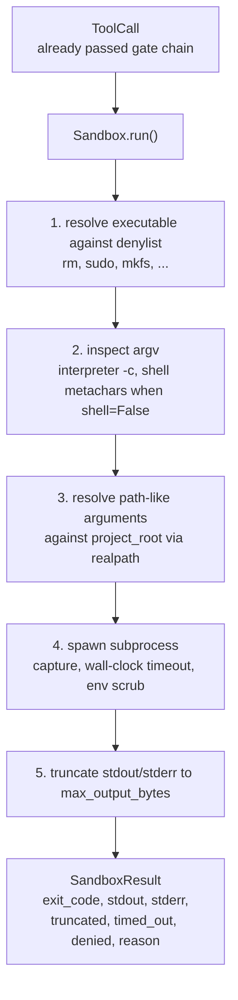
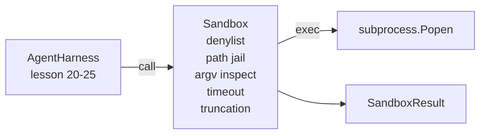

# Capstone Lesson 26: Sandbox Runner with Denylist and Path Jail

> The verification gate decides whether a tool call should run. The sandbox decides what happens when it does. This lesson ships a subprocess runner that refuses dangerous executables, refuses dangerous argv shapes, jails every file path to a project root, truncates oversized output, and kills runaway processes on a wall-clock timeout. It is the second of two layers that sit between the model and the operating system.

**Type:** Build
**Languages:** Python (stdlib)
**Prerequisites:** Phase 19 · 25 (verification gates and observation budget), Phase 14 · 33 (instructions as constraints), Phase 14 · 38 (verification gates)
**Time:** ~90 minutes

## Learning Objectives

- Build a `Sandbox` class wrapping `subprocess.run` with timeout, capture, and truncation.
- Refuse a command by name against a denylist and by structure against an argv inspector.
- Refuse any path argument that resolves outside a declared project root.
- Refuse shell metacharacters when shell mode is off.
- Return a structured `SandboxResult` that downstream observability and the eval harness can ingest.

## The Problem

A coding agent that can shell out can install backdoors, exfiltrate keys, brick a developer laptop, and rack up a cloud bill in a single turn. The least costly defense is to not give it shell. The second least costly is a sandbox that says no to a precise list of patterns.

Three classes of failure recur in agent traces.

The first is dangerous executables. A model under pressure to fix a path issue will try `sudo`, `chmod -R 777`, `rm -rf`, `mkfs`, `dd`. None of these belong in an agent run. The denylist catches them by name and by alias.

The second is argv tricks. A model that has been told no shell will pipe an attack through an interpreter: `python3 -c "import os; os.system('rm -rf /')"`, `bash -c '...'`, `node -e '...'`, `perl -e '...'`. The sandbox needs to know that any interpreter run with a `-c`-like flag is just a shell call with extra steps.

The third is path escape. The model is told to read `./src/main.py` and instead reads `../../etc/passwd`. The sandbox jails every path argument by resolving it through `os.path.realpath` and asserting the prefix.

The sandbox is not a security boundary in the operating system sense. A determined attacker with code execution can still break out. The sandbox is a development-time guardrail: it makes the common failure modes loud and stops the agent from doing damage out of sheer ineptitude.

## The Concept



The sandbox has four refusal axes: name, argv, path, structure. Each axis is a pure function of the call, no subprocess yet. The subprocess only spawns after every axis has passed.

The `SandboxResult` exit codes are the conventional ones: 0 success, non-zero failure, plus three sentinel codes for denied (-100), timed_out (-101), and truncated (the exit code is the real one, with a flag set). Downstream lessons read this structured result rather than parsing stderr.

## Architecture



The denylist is a frozenset of executable basenames. Aliases (`/bin/rm`, `/usr/bin/rm`) all resolve to the same basename. The argv inspector knows the interpreter shape: any argv where argv[0] is an interpreter and any later arg starts with `-c` or `-e` is denied. Shell metacharacters (`;`, `|`, `&`, `>`, `<`, backticks, `$()`) cause refusal when the call did not explicitly request a shell.

The path jail is the most subtle piece. The sandbox accepts a `project_root` at construction. Any argument that looks like a path (contains `/` or matches an existing file) is normalized through `os.path.realpath`, then checked against the realpath of the project root. If the resolved target is not under the root, refusal. Symlink escape attempts (a symlink in the project root that points outside) are blocked by checking realpath, not the literal path.

## What you will build

The implementation is `main.py` plus a tests dir.

1. `SandboxResult` dataclass: exit_code, stdout, stderr, truncated, timed_out, denied, reason, duration_ms.
2. `SandboxConfig` dataclass: project_root, max_output_bytes, timeout_seconds, denylist, interpreter_block.
3. `Sandbox` class: `run(argv, *, shell=False, cwd=None)` returns a `SandboxResult`.
4. Internal refusal helpers: `_check_executable_denylist`, `_check_argv_interpreter`, `_check_shell_metachars`, `_check_path_jail`.
5. Output truncation with a clear `truncated` flag and a marker line in the captured stream.
6. Demo at the bottom: a sequence of legitimate and adversarial calls. Each is shown with its result.

The sandbox uses `subprocess.run` with `shell=False` by default and `capture_output=True`. The wall-clock timeout uses the `timeout` argument; on `TimeoutExpired`, the sandbox kills the process group and synthesizes a SandboxResult.

## Why this is not a real sandbox

The lesson sandbox does not use namespaces, cgroups, seccomp, gVisor, Firecracker, or any kernel-level isolation. Anything the subprocess can do, the sandbox can do. The protection is structural: the agent is denied the most common dangerous invocations, and the loud refusal goes into observability instead of silently running.

For production agents you layer on top: run inside an unprivileged Docker container, run inside a microVM, drop capabilities, mount the project root read-only and a scratch dir read-write, set ulimit on memory and CPU, scrub the environment to a known-safe whitelist. Lesson 29 does some of this. Operating-system isolation is out of scope for this lesson.

## Running it

```bash
cd phases/19-capstone-projects/26-sandbox-runner-denylist
python3 code/main.py
python3 -m pytest code/tests/ -v
```

The demo creates a temp directory, drops a clean file into it, then runs a battery of calls. Legal calls succeed. Denied calls return SandboxResult with `denied=True` and a reason. Timeouts return `timed_out=True`. Truncation sets `truncated=True`. The demo prints a JSON table of outcomes and exits zero.

## How this composes with the rest of Track A

Lesson 25 produced the gate chain. Lesson 26 is the executor that runs after a gate ALLOW. Lesson 27's eval harness compares the sandbox results against the expected exit-code per task. Lesson 28 emits a `gen_ai.tool.execution` span around each `Sandbox.run` invocation. Lesson 29's end-to-end demo wires a real coding agent through both layers.
