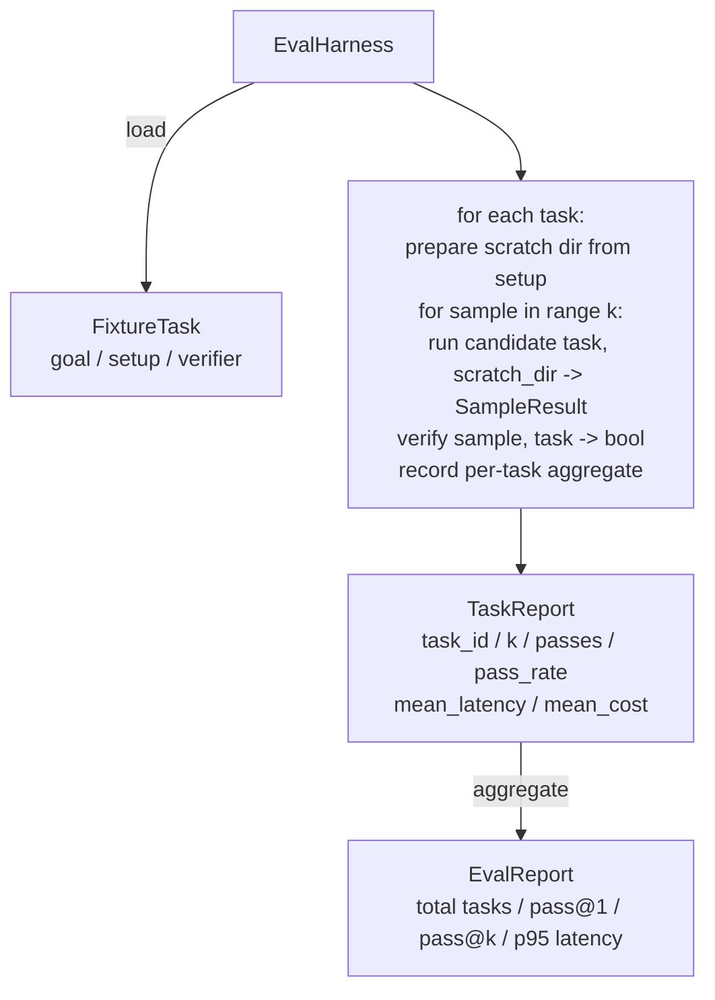

# Capstone Lesson 27: Eval Harness with Fixture Tasks

> A coding agent is only as good as the suite of tasks you measure it against. This lesson builds an evaluation harness that takes a folder of fixture tasks, runs each through a candidate agent, scores pass or fail through a deterministic verifier, and aggregates the results into pass@1, pass@k, mean latency, and mean cost. The harness is the source of truth that lets you tell a regression from a refactor.

**Type:** Build
**Languages:** Python (stdlib)
**Prerequisites:** Phase 19 · 25 (verification gates), Phase 19 · 26 (sandbox runner), Phase 14 · 30 (eval-driven agent development), Phase 14 · 19 (SWE-bench and GAIA benchmarks)
**Time:** ~90 minutes

## Learning Objectives

- Define a fixture task as a triple of goal, setup, and verifier.
- Score multiple sample runs per task and compute pass@1 and pass@k.
- Aggregate latency and cost into mean and 95th-percentile metrics.
- Wire deterministic verifiers (file diff, exit code, regex match) into reusable functions.
- Emit a structured JSON report a regression-tracking script can ingest.

## The Problem

Three failure modes plague agent benchmarks built without an eval harness.

The first is unverified pass. The agent says it fixed the bug, the human glances at the diff, the suite is marked green, and three weeks later the regression test surfaces the same bug. The agent had reasoned plausibly without actually fixing anything.

The second is undetected regression. A change to the prompt template makes the agent 4% better on the loud task and 14% worse on the quiet one. Without a goldset and a per-task score, the regression rides into main and surfaces only when a customer complains.

The third is per-task drift. The eval was run on Monday with 100 tasks and on Friday with 95 of them, because somebody renamed five fixtures. The pass rate looks like a 5% improvement. It isn't.

The harness is the program that turns these failures into facts. It runs every fixture, every time, in a reproducible order, against a verifier that returns true or false on a deterministic check.

## The Concept

```mermaid
flowchart LR
  F1[fixtures/task_001/<br/>task.json + expected/] --> Harness
  F2[fixtures/task_002/<br/>...] --> Harness
  Harness[Harness<br/>for each task:<br/>setup / run agent k samples /<br/>verify each sample /<br/>record latency, cost]
  Harness --> Report[EvalReport<br/>pass@1 / pass@k<br/>mean ms / p95 ms<br/>mean cost]
```

A `FixtureTask` is a small JSON file plus an optional `expected/` directory. The JSON declares an `id`, a `goal` (the prompt fed to the agent), a `setup` block (files to drop into the scratch dir), and a `verifier` block. The verifier block names a function in the harness's verifier registry and supplies its arguments.

Three verifier shapes cover the majority of useful tasks.

The first is `file_equals`. After the agent runs, compare a named file against an expected content. This catches "fix this bug in this exact way" tasks.

The second is `regex_match`. The named file's contents are matched against a regex. This catches "the function must exist and return X" tasks where there are many acceptable solutions.

The third is `shell_exit_zero`. The harness runs a shell command (through the sandbox from lesson 26) and passes the task only if the command exits zero. This catches "the tests must pass" tasks.

The harness runs each task `k` times. Pass@k is `1 - (1 - p)^k` where p is the empirical pass rate; the harness also reports raw counts so you can spot variance. Latency is wall-clock per sample. Cost is whatever the agent self-reports (token count, USD, or both); the harness sums it across samples and presents the per-task and aggregate numbers.

## Architecture



The candidate is a callable: `Callable[[FixtureTask, str], SampleResult]`. The harness creates the scratch directory via `tempfile.mkdtemp()` and passes its path as a plain string. The harness does not care how the candidate works. The candidate could be a deterministic patch applier (useful for harness self-tests), a real LLM agent, a fuzzer. The contract is the SampleResult.

## What you will build

`main.py` ships:

1. `FixtureTask` dataclass.
2. `SampleResult` dataclass: success_self_reported, latency_ms, cost_units, edits.
3. `TaskReport`, `EvalReport` dataclasses with `to_dict()`.
4. `VerifierRegistry` mapping verifier name to function. Built-in verifiers: file_equals, regex_match, shell_exit_zero.
5. `EvalHarness` class. Runs a directory of tasks against a candidate. Returns EvalReport.
6. Five fixture tasks bundled in `tasks/`:
   - off-by-one in `fizzbuzz`
   - missing return in `factorial`
   - typo in error message
   - empty function body
   - off-by-one in linked-list traversal
7. A deterministic reference candidate (`apply_known_fixes`) the harness uses to demonstrate a clean pass@1 of 1.0.
8. Demo prints the EvalReport JSON and exits zero.

The fixture tasks are bundled as JSON files in `tasks/` plus paired source files in `tasks/<id>/buggy/` and `tasks/<id>/expected/`. The harness copies buggy into a scratch dir, hands it to the candidate, and verifies against expected.

## Why pass@k and not just pass@1

Real LLM agents are stochastic. A pass@1 of 0.6 looks like a failure. A pass@5 of 0.95 says the agent gets the right answer most of the time but is choosing wrong on early samples. The fix is sampling and ranking, not always more training. Pass@k makes that visible.

Pass@k is reported alongside pass@1 because pass@k papers over a real failure: if the model gets the right answer once in twenty tries you do not have a useful agent. The harness shows both.

## How this composes with the rest of Track A

Lesson 25 produced the gate chain. Lesson 26 produced the sandbox. The harness uses the sandbox for any `shell_exit_zero` verifier. Lesson 28 wraps each harness run in an OTel trace. Lesson 29 runs the end-to-end demo against one of the bundled fixtures and asserts pass@1 = 1.0 for the reference candidate.

## Running it

```bash
cd phases/19-capstone-projects/27-eval-harness-fixture-tasks
python3 code/main.py
python3 -m pytest code/tests/ -v
```

The demo prints the EvalReport in JSON, including pass@1, pass@5, mean latency, and per-task breakdown. The exit code is zero. The tests cover the verifier functions, the pass@k math, fixture loading, and the harness end-to-end against the bundled reference candidate.
