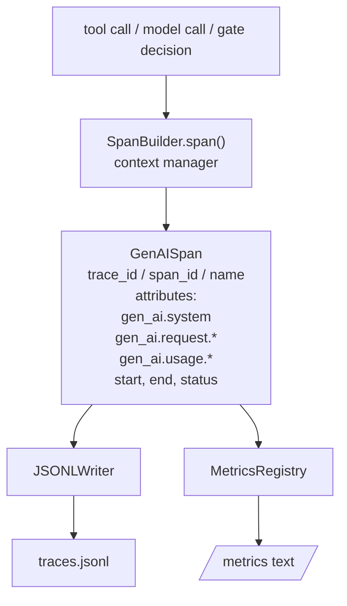
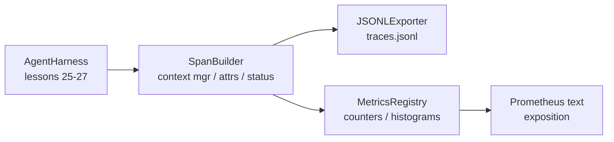

# Capstone Lesson 28: Observability with OTel GenAI Spans and Prometheus Metrics

> An agent harness without observability is a black box that costs money. This lesson hand-rolls a span builder that emits records compliant with the OpenTelemetry GenAI semantic conventions, writes them to a JSON-Lines file one span per line, and exposes counters and histograms in Prometheus text format. The whole thing is stdlib Python and runs offline.

**Type:** Build
**Languages:** Python (stdlib)
**Prerequisites:** Phase 19 · 25 (verification gates), Phase 19 · 26 (sandbox), Phase 19 · 27 (eval harness), Phase 13 · 20 (OpenTelemetry GenAI), Phase 14 · 23 (OTel GenAI conventions)
**Time:** ~90 minutes

## Learning Objectives

- Build a span data class shaped to the OpenTelemetry GenAI semantic conventions.
- Implement a JSONL exporter that writes one self-contained span per line.
- Build counters and histograms with labels and Prometheus text-format exposition.
- Wrap any callable in a span context manager that records duration, status, and exceptions.
- Verify that the emitted spans roundtrip through `json.loads` and match the spec shape.

## The Problem

A coding agent in production produces three classes of artifact every turn: a model call, a tool execution, and a verification gate decision. None of these are useful without structured telemetry.

The first failure mode is the missing trace. Something went wrong on Tuesday but the only record is a 500-line chat log. There is no record of which tool ran, how long it took, how many tokens went into the prompt, or whether the gate refused anything. The agent author has to guess.

The second failure mode is the unparseable trace. The harness wrote spans but used its own ad-hoc field names. Nothing in Grafana, Honeycomb, Jaeger, or the local CLI can read them. Whatever tooling exists in the team's stack is wasted because the spans are non-standard.

The third failure mode is the unaggregated metric. You can see one slow tool call in the trace, but you cannot answer "what is the p95 latency of read_file calls over the last hour?" because there are no metrics, only traces.

The OpenTelemetry GenAI semantic conventions exist exactly for this. They define a small set of standard attributes that span emitters across LLM frameworks share. If your harness writes those attributes, every OTel-compatible backend can read them.

## The Concept



Every operation in the harness produces a span. A span has a trace id (the whole agent invocation), a span id (this one operation), a name (e.g. `gen_ai.chat`, `gen_ai.tool.execution`), attributes that follow the GenAI conventions, a start and end time, and a status.

The GenAI conventions standardise these attribute keys: `gen_ai.system` (which provider, e.g. `anthropic`, `openai`), `gen_ai.request.model` (the model id), `gen_ai.request.max_tokens`, `gen_ai.usage.input_tokens`, `gen_ai.usage.output_tokens`, `gen_ai.response.model`, `gen_ai.response.id`, `gen_ai.operation.name`, plus tool-specific keys `gen_ai.tool.name` and `gen_ai.tool.call.id`.

The exporter writes JSONL. One JSON object per line. This is the simplest possible format that downstream tooling can stream, grep, and import. A real OTel exporter would speak OTLP gRPC; the lesson's JSONL exporter is the offline equivalent and exits zero on every workstation.

Metrics live next to traces. A counter increments on each tool call: `tools_called_total{tool="read_file"}`. A histogram records the observed latency: `tool_latency_ms{tool="read_file"}`. Both serialise into Prometheus text exposition format, which is the de-facto standard for pull-based metrics.

## Architecture



The span builder is a small class with a `span(name, attrs)` method that returns a context manager. The context manager records start time on enter, records end time on exit, attaches an exception if one was raised, and pushes the finalised span to the exporter.

The metrics registry is two dicts. Counters are `{(name, frozen_labels): int}`. Histograms keep raw samples in a list and serialise to Prometheus histogram buckets at exposition time.

## What you will build

`main.py` ships:

1. `GenAISpan` dataclass: trace_id, span_id, parent_span_id, name, attributes, start_unix_nano, end_unix_nano, status, status_message, events.
2. `SpanBuilder` class with `span(name, attrs, parent=None)` context manager.
3. `JSONLExporter` class with `export(span)` that appends one line.
4. `Counter` and `Histogram` classes plus `MetricsRegistry`.
5. `prometheus_exposition(registry)` that produces text-format output.
6. `wrap_tool_call(name)` decorator that emits a span and updates metrics.
7. Demo: synthesises a complete agent invocation (gen_ai.chat span around tool spans), writes traces.jsonl, prints the Prometheus exposition, exits zero.

The span id and trace id are 16-byte hex strings, generated from `os.urandom`. That matches OTel's W3C trace context. The exporter never throws; IO errors are surfaced but the harness keeps running.

The histogram has a fixed bucket set (the OTel default for latency in milliseconds: 5, 10, 25, 50, 100, 250, 500, 1000, 2500, 5000, 10000, +Inf). Samples are stored as a list; exposition computes per-bucket counts on demand.

## Why hand-rolled instead of opentelemetry-sdk

The OTel Python SDK is a real dependency. It is also several thousand lines of code, multiple processes for the OTLP exporter, and a runtime cost that swamps a lesson budget. The hand-rolled version teaches the wire format. In production you wire the same attributes into the real SDK and get the OTLP exporter, batching, and resource detection for free.

The conventions are stable. The wire format the lesson emits will keep parsing in 2030 because OTel never breaks GenAI attribute names; they only add new ones.

## How this composes with the rest of Track A

Lesson 25 produced the gate chain. Lesson 26 produced the sandbox. Lesson 27 produced the eval harness. Lesson 28 makes all three observable. Lesson 29 wraps every step of the end-to-end demo in spans and prints the Prometheus text at the end.

## Running it

```bash
cd phases/19-capstone-projects/28-observability-otel-traces
python3 code/main.py
python3 -m pytest code/tests/ -v
```

The demo emits a `traces.jsonl` in the lesson's working dir (cleaned up at the end), then prints a sample of three spans, then prints the Prometheus exposition for the counters and histograms. The tests verify that spans serialise round-trip, that the canonical GenAI attributes are present, that counters increment correctly, and that the histogram exposition contains the expected bucket counts.
