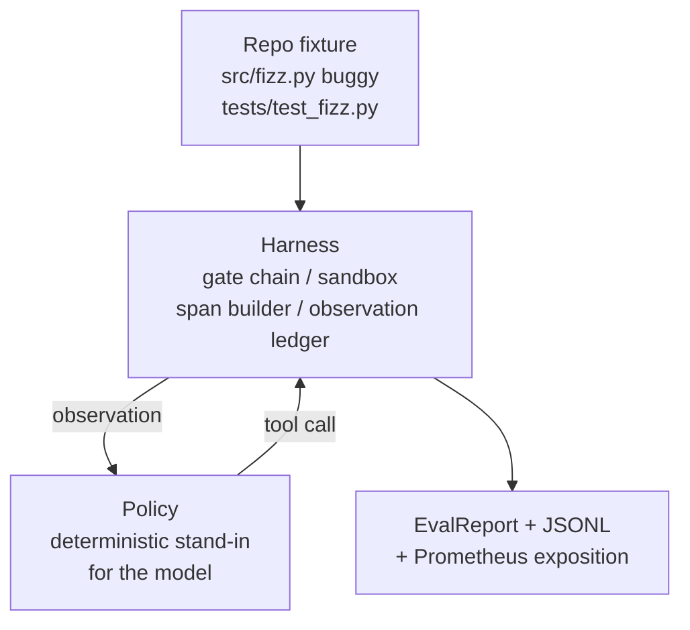
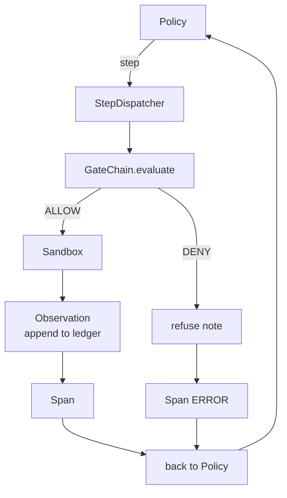

# Capstone Lesson 29: End-to-End Coding Agent on the Harness

> Track A's payoff. This lesson stitches the gate chain, the sandbox, the eval harness, and the OTel spans into one working coding agent that fixes a real (small, fixture-scale) bug in a multi-file Python project. The agent is a deterministic policy, not an LLM; the substitution makes the lesson reproducible and shows that the harness was the interesting part all along. The contract is identical: a real model plugs in at the policy seam.

**Type:** Build
**Languages:** Python (stdlib)
**Prerequisites:** Phase 19 · 25 (verification gates), Phase 19 · 26 (sandbox), Phase 19 · 27 (eval harness), Phase 19 · 28 (observability), Phase 14 · 38 (verification gates), Phase 14 · 41 (workbench for real repos), Phase 14 · 42 (agent workbench capstone)
**Time:** ~90 minutes

## Learning Objectives

- Compose the gate chain, sandbox, eval harness, and span builder into a single agent loop.
- Implement a deterministic policy that uses read_file, run_tests, and write_file to fix a fixture bug.
- Enforce a global step budget plus an observation token budget across an end-to-end run.
- Emit complete OTel GenAI traces and Prometheus metrics for the full run.
- Verify the agent solves the fixture in fewer than 12 steps with zero gate trips on legal tools.

## The Problem

Most agent demos work in isolation: a sandbox by itself, an eval harness by itself, a span emitter by itself. They look fine. Compose them and the seams show.

The gate chain says ALLOW but the sandbox refuses for a reason the chain did not anticipate. The eval harness records a pass but the OTel spans say the gate refused a tool the agent claims it used. The Prometheus counter is incremented twice when it should be incremented once. The observation budget is exceeded but the agent kept going because the budget was tracked in the chain and the sandbox didn't know.

This lesson is the integration test for the whole track. The agent has to do four things in order: read the project, run the tests, identify the bug from the test failure, write the fix, rerun the tests, and stop. Every operation goes through the gate chain. Every tool execution goes through the sandbox. Every step is wrapped in a span. The eval harness scores the whole thing at the end.

## The Concept



The agent's policy is a state machine. Five states.

`SURVEY`: the agent reads the project listing. The next state is RUN_TESTS.

`RUN_TESTS`: the agent runs the test command. If the tests pass, the state machine halts with success. Otherwise the next state is INSPECT.

`INSPECT`: the agent reads the failing source file. The next state is FIX.

`FIX`: the agent writes the corrected file. The next state is VERIFY.

`VERIFY`: the agent runs the test command again. If the tests pass, halt success. Otherwise halt with failure.

Each state corresponds to a tool call. Each tool call passes through the gate chain. If a tool call is denied, the agent reports the refusal in the trace and halts.

The fixture bug is an off-by-one in `fizz.py`. The deterministic policy detects the bug from the test failure message via a regex and emits the corrected file. Replacing the policy with an LLM does not change the harness contract.

## Architecture



The lesson is self-contained. Each prior-lesson primitive is reimplemented at minimal scale in `main.py` (gate, sandbox, ledger, span) so the lesson runs without importing siblings. The names match lessons 25-28 exactly so the conceptual mapping is unambiguous.

## What you will build

`main.py` ships:

1. The minimal harness primitives, copied with the same names as lessons 25-28: `GateChain`, `Sandbox`, `ObservationLedger`, `SpanBuilder`, `MetricsRegistry`.
2. `CodingAgentPolicy` class: state machine with five states.
3. `Repo` helper: prepares a scratch dir with the bundled buggy fixture.
4. `AgentRun` class: drives the policy, dispatches through the harness, returns an `AgentRunReport`.
5. A bundled fixture (`fixture_repo/`) with src/fizz.py, tests/test_fizz.py, and an expected/ tree for the eval harness.
6. Demo: runs the policy end-to-end, prints the step-by-step trace, asserts pass, prints metrics.

The bundled fixture is the same shape as lesson 27's task structure: a buggy file and a tests file. The test failure message contains enough information for the deterministic policy to identify the fix. A real LLM would do the same job, slower and with broader recall, but it would not change the harness's expectations.

## Why the policy is not an LLM

A real LLM requires an API key, a network call, and unverifiable stochasticity. The harness is the part the lesson cares about. Subbing in a deterministic policy lets the lesson run on any developer laptop with zero external dependencies and lets the test suite assert exact-step counts.

The lesson's policy is a strict subset of what an LLM agent does. The policy reads the repo, sees the failing test, identifies the line, and emits a fix. An LLM goes through the same loop with the same harness contract; the bookkeeping is identical.

## What the demo asserts

The end-to-end demo asserts five things at exit time, and the test suite reasserts them programmatically.

The policy solved the fixture in fewer than 12 steps.

The observation budget was never exceeded.

Zero gate denials fired on legal tools. (The agent never invented a denied tool name.)

Every step has a corresponding span in the traces.jsonl.

The Prometheus exposition contains a `tools_called_total{tool="read_file"}` entry and a `tool_latency_ms` histogram.

## How this composes with the rest of Track A

This lesson is the integration. Lesson 25 wrote the gate chain. Lesson 26 wrote the sandbox. Lesson 27 wrote the eval harness. Lesson 28 wrote the observability. Lesson 29 proves they work as a system. A real agent harness extends from here: swap the deterministic policy for a model, swap the bundled fixture for a real-repo task, swap the JSONL exporter for OTLP.

## Running it

```bash
cd phases/19-capstone-projects/29-end-to-end-coding-task-demo
python3 code/main.py
python3 -m pytest code/tests/ -v
```

The demo prints a per-step trace, the final eval report, and the Prometheus exposition. Exit code is zero. The tests cover the policy state transitions, the gate refusals on synthetic tool calls, the end-to-end run on the bundled fixture, and the step-budget invariants.
