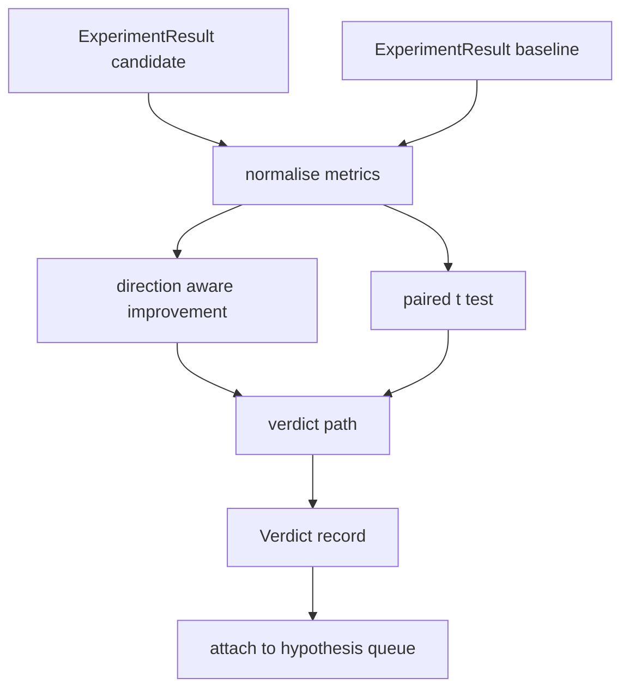

# Result Evaluator

> The runner produced numbers. The evaluator decides whether those numbers are an improvement, a regression, or noise. Build the verdict path that turns metrics into a one line conclusion.

**Type:** Build
**Languages:** Python
**Prerequisites:** Phase 19 Track A lessons 20-29
**Time:** ~90 minutes

## Learning Objectives
- Compare a candidate run against a baseline using direction aware improvement and a fixed threshold.
- Run a paired t test from scratch over per seed metrics and read the resulting p value.
- Normalise log scaled metrics so a downstream report can blend them with linear metrics.
- Emit a per hypothesis verdict that the orchestrator can attach to the queue from lesson fifty.
- Keep every step pure so the same inputs always produce the same verdict.

## Why a paired test

A single number from the runner does not say whether the change is real. The same configuration with a different seed gives a different perplexity. The change might be noise. The right comparison is paired: the same seeds with the same data, ran once with the candidate and once with the baseline. Each seed contributes a difference. The mean of those differences is the effect. The standard error of those differences is the noise floor.

The lesson implements the test from scratch. There is no `scipy.stats`. The math is small enough to read in one screen.

```text
diffs    = [a_i - b_i for i in seeds]
mean     = sum(diffs) / n
variance = sum((d - mean) ** 2 for d in diffs) / (n - 1)
t_stat   = mean / sqrt(variance / n)
df       = n - 1
p_value  = two_sided_p(t_stat, df)
```

The two sided p value uses a regularised incomplete beta function. The lesson ships a small implementation that uses the Lentz continued fraction. The whole thing is sixty lines of stdlib math.

## Direction aware improvement

Some metrics improve when they go up (accuracy, throughput). Others improve when they go down (loss, perplexity, wall time). The evaluator carries a `direction` field on each metric.

```text
if direction == "higher_is_better":
    improvement = (candidate - baseline) / abs(baseline)
elif direction == "lower_is_better":
    improvement = (baseline - candidate) / abs(baseline)
```

Improvement is signed. A negative improvement on a higher is better metric means the candidate is worse. The verdict path reads the sign and the magnitude together.

A flat threshold (`improvement_threshold=0.02`, two percent) decides whether the change is large enough to call. Below that the verdict is "noise" regardless of the p value; the loop is not interested in changes the user could not measure.

## Architecture



The evaluator runs three independent computations and joins them in the verdict path. Each computation is a pure function with no shared state.

## Log normalisation

Perplexity is exponential in loss. A 0.1 drop in loss is a much larger drop in perplexity. Comparing perplexity directly across two configurations is fine, but blending it with linear metrics in a single report requires normalisation.

The lesson normalises any metric whose `scale` field is `"log"` by taking the natural log before computing the improvement. The threshold is then applied in log space. A perplexity drop from 32 to 28 is `log(28) - log(32) = -0.133` on a lower is better metric, which is well above the two percent threshold.

```text
if scale == "log":
    a = log(candidate)
    b = log(baseline)
else:
    a = candidate
    b = baseline
```

Metrics with `scale="linear"` (default) skip the transform. The same code path handles both.

## Per seed paired test

The runner from lesson fifty-two emits one final metrics blob per run. For the paired test the evaluator needs one blob per seed for the candidate and one per seed for the baseline. The orchestrator runs the same experiment under both configurations across a list of seeds and hands the evaluator two lists of `ExperimentResult` records.

The evaluator pairs them by seed (the seed lives in `result.metrics["seed"]`) and walks the requested metric. If the seeds do not match across the two lists, the evaluator raises a `PairingError`. The orchestrator should re run.

## The Verdict shape

```text
Verdict
  hypothesis_id          : int
  metric                 : str
  direction              : "higher_is_better" | "lower_is_better"
  scale                  : "linear" | "log"
  candidate_mean         : float
  baseline_mean          : float
  improvement            : float       (signed, fraction; see direction rules)
  p_value                : float | None  (None if n < 2)
  significance_threshold : float
  improvement_threshold  : float
  verdict                : "improved" | "regressed" | "noise" | "failed"
  rationale              : str
```

The verdict path is a small decision table:

```text
1. If any candidate result has terminal != "ok": verdict = "failed"
2. else if |improvement| < improvement_threshold:  verdict = "noise"
3. else if p_value is None or p_value > significance: verdict = "noise"
4. else if improvement > 0:                          verdict = "improved"
5. else:                                             verdict = "regressed"
```

Rationale is a one line human readable sentence the orchestrator can log against the hypothesis id.

## How to read the code

`code/main.py` defines `MetricSpec`, `Verdict`, `Evaluator`, the t statistic and incomplete beta helpers, and a deterministic demo. The t test is implemented in pure stdlib math; numpy is used only to read the metrics list and compute means and variances.

`code/tests/test_evaluator.py` covers the improved path, the regressed path, the noise path (small improvement), the noise path (low n), the failed terminal path, the log normalised path, the t test against a known reference value, and the pairing error.

## Where this slots in

Lesson fifty produced the hypothesis queue. Lesson fifty-one filtered out anything the literature settled. Lesson fifty-two ran the experiment under candidate and baseline configurations across seeds. Lesson fifty-three reads those runs and writes the verdict. The orchestrator stitches the four together:

```text
for hypothesis in queue:
    literature = retrieval.search(hypothesis.text)
    if literature_settles(hypothesis, literature):
        attach(hypothesis, verdict="settled")
        continue
    candidates = runner.run_all(specs_for(hypothesis))
    baselines  = runner.run_all(baseline_specs_for(hypothesis))
    metric_spec = MetricSpec("perplexity", direction=LOWER, scale=LOG)
    verdict = evaluator.evaluate(hypothesis.id, metric_spec, candidates, baselines)
    attach(hypothesis, verdict)
```

That orchestrator is not in this lesson; the four lessons compose into it without any glue beyond the dataclasses each one defines.
